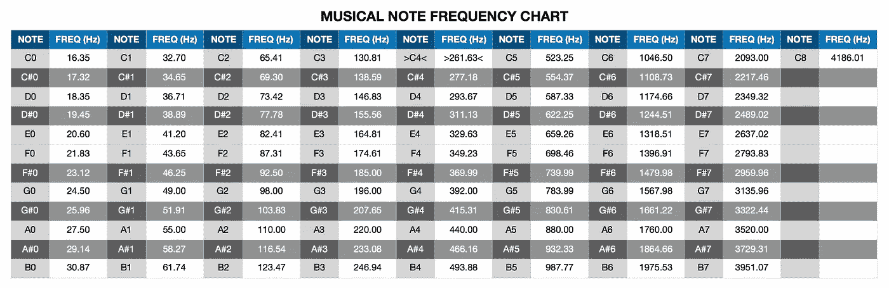
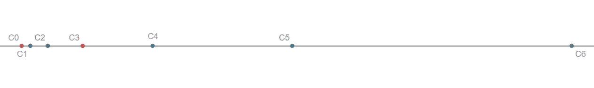
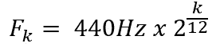
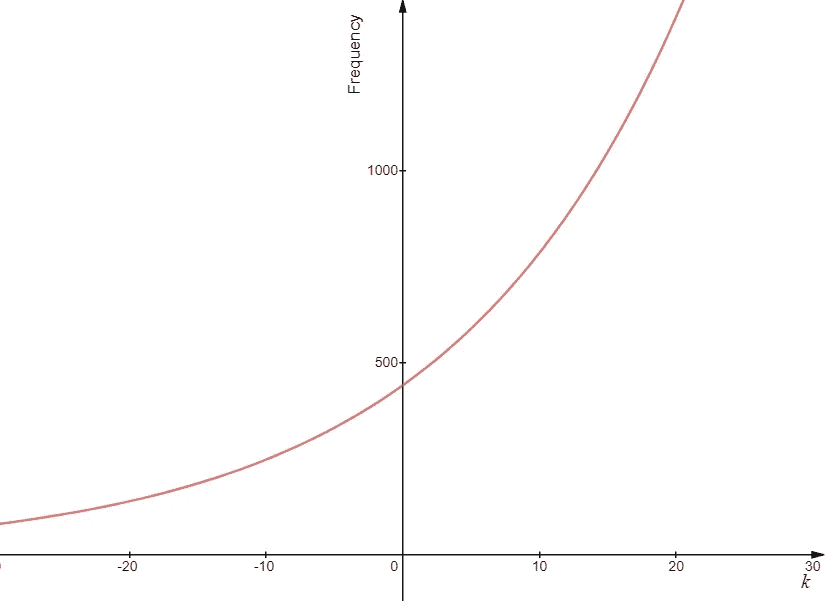
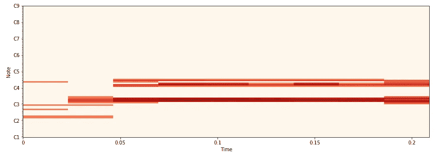

# 具有深度学习的自动化吉他转录

> 原文：<https://towardsdatascience.com/audio-to-guitar-tab-with-deep-learning-d76e12717f81?source=collection_archive---------5----------------------->

## 使用卷积神经网络加速学习音乐。


Photo by [Jacek Dylag](https://unsplash.com/@dylu?utm_source=medium&utm_medium=referral) on [Unsplash](https://unsplash.com?utm_source=medium&utm_medium=referral)

这篇文章概述了使用 Python、TensorFlow 和 Keras 从音频文件中自动转录吉他的实现，并详细介绍了执行的表层方法。为了进行训练，使用了[吉他集](https://zenodo.org/record/1422265#.XQvsmohKi01)数据集，因为它有大量带有相应标签的孤立吉他录音。请注意，这个项目的大部分方向是由 NEMISIG 2019 的一张研究海报提供的，在这里[找到](http://nemisig2019.nemisig.org/images/kimSlides.pdf)。

## 背景

如果你熟悉[卷积神经网络](/a-comprehensive-guide-to-convolutional-neural-networks-the-eli5-way-3bd2b1164a53)(CNN)，那么你可能听说过它们在用于计算机视觉的图像处理和分析方面的潜力。我们希望利用 CNN 的这一功能来输出吉他标签；因此，首先需要使用常数 Q 变换将输入音频文件转换成声谱图图像。

## 为什么是常数 Q 变换？

为了理解使用常数 Q 变换而不是傅立叶变换来选择频率和创建输入图像的好处，我们必须研究音符是如何定义的:



[Source](https://www.soundonsound.com/forum/viewtopic.php?f=16&t=64005)

在音符列中，音符由左边的字母标识，右边的数字代表当前的八度音阶。下面是音符 c 的前六个八度音阶的频率(Hz)图。



我们可以看到，每个连续的八度音程的频率是前一个八度音程的两倍。由于一个八度音程跨越十二个音符，所以我们知道每十二个音符，频率必然加倍，可以用下面的公式表示[1]:



通过绘制这种关系，我们可以看到下图显示了一条指数曲线:



由于这种指数性质，常数 Q 变换比傅立叶变换更适合拟合音乐数据，因为它的输出是振幅对对数频率。此外，常数 Q 变换的精度类似于对数标度，并模拟人耳，在较低频率下具有较高的频率分辨率，在较高频率下具有较低的分辨率[1]。

## 在 Python 中应用常数 Q 变换

使用 [libROSA](https://librosa.github.io/librosa/) 库，常量 Q 变换可以很容易地应用于 python 中的音频文件。

通过从指定的开始时间( *start* )到持续时间( *dur* )遍历吉他数据集的每个音频文件，并将输出保存为图像，我们可以创建训练 CNN 所需的输入图像。对于这个项目， *dur* 被设置为 0.2 秒， *start* 被设置为从零增加到每个音频文件的长度，增加的持续时间如下:



注意，当被用作 CNN 的输入图像时，颜色方案首先被转换成灰度。

## 培训解决方案

对于每个常数 Q 变换图像，必须有一个解，以便网络可以调整它的猜测。幸运的是，吉他数据集包含作为 MIDI 值播放的所有音符、每个音符在录音中开始的时间以及每个音频文件的音符持续时间。注意:下面的代码片段被放在一个函数中，这样它们可以用于每 0.2 秒的音频。

首先，必须从 jams 文件中提取在加载的 0.2 秒音频中播放的唯一音符(作为 MIDI 音符检索)。

一次只能演奏六个音符(每根弦最多一个音符)；因此，代码通常会重复六次。

首先，在变量 *Fret* 下创建表示吉他的 6 根弦和 18 个品的 MIDI 值的矩阵(6，18):

```
 [[40 41 42 43 44 45 46 47 48 49 50 51 52 53 54 55 56 57]
      [45 46 47 48 49 50 51 52 53 54 55 56 57 58 59 60 61 62]
      [50 51 52 53 54 55 56 57 58 59 60 61 62 63 64 65 66 67]
      [55 56 57 58 59 60 61 62 63 64 65 66 67 68 69 70 71 72]
      [59 60 61 62 63 64 65 66 67 68 69 70 71 72 73 74 75 76]
      [64 65 66 67 68 69 70 71 72 73 74 75 76 77 78 79 80 81]]
```

然后使用*音柱*确定在吉他上检索到的唯一音符的所有可能位置，下面的矩阵显示了一个可能的解决方案:

```
 [[0 0 0 0 0 0 0 0 0 0 0 1 0 0 0 0 0 0]
                [0 0 0 0 0 0 1 0 0 0 0 0 0 0 0 0 0 1]
                [0 1 0 0 0 0 0 0 0 0 0 0 1 0 0 1 0 0]
                [0 0 0 0 0 0 0 1 0 0 1 0 0 0 0 0 0 0]
                [0 0 0 1 0 0 1 0 0 0 0 0 0 0 0 0 0 0]
                [0 1 0 0 0 0 0 0 0 0 0 0 0 0 0 0 0 0]]
```

必须确定音品和琴弦组合的所有可能的解决方案。创造了“手指经济”的概念——和弦的最低音，根音，与和弦中的其余音进行比较，其中每个音来自根音的品数(不考虑弦)相加，以产生“手指经济”数。具有最低“手指经济”数的解决方案被选为正确的弦形状。

虽然这种方法并不总是与录音中正在演奏的和弦的正确版本相匹配，但它不会对 CNN 的性能产生负面影响，因为在开放位置演奏的 c 大调和弦与在第八品上演奏的 c 大调和弦并无不同。

随后使用最终解决方案中的琴弦和音品阵列的组合来选择最终解决方案:

此外，在每一行的第一列中，如果存在注释(行中的 1)，则附加零，反之亦然，如果注释不存在。这样做是为了让 softmax 函数在没有音符演奏的情况下仍然可以为弦乐选择类别。

前面的代码片段返回数据，使得输出类似于类别的一键编码，对于每 0.2 秒的音频，返回以下矩阵格式:

```
 [[1 0 0 0 0 0 0 0 0 0 0 0 0 0 0 0 0 0 0]
              [1 0 0 0 0 0 0 0 0 0 0 0 0 0 0 0 0 0 0]
              [0 0 0 0 0 0 0 0 0 0 0 0 0 0 1 0 0 0 0]
              [0 0 0 0 0 0 0 0 0 0 0 0 0 0 0 1 0 0 0]
              [0 0 0 0 0 0 0 0 0 0 0 0 0 0 0 1 0 0 0]
              [0 0 0 0 0 0 0 0 0 0 0 0 0 1 0 0 0 0 0]]
```

上面的矩阵是吉他选项卡解决方案，从吉他数据集随机选择 0.2 秒。每个矩阵形状是(6，19)，其中六行对应于每个吉他弦(eBGDAE 从上到下)。第一列标识弦是否未被弹奏，第二列标识开放弦是否被弹奏，第三至第十九列标识从第一品开始弹奏的特定品。训练时，这个矩阵被分成六个独立的数组来训练模型的每个头部。

## 模型架构和培训

Keras functional API 用于创建以下多任务分类模型，在训练和测试数据中采用 90/10 分割。该模型有六个任务(eBGDAE 弦乐)来确定弦乐是否未演奏、打开或正在演奏音符。对于这六个输出中的每一个，应用 softmax 激活以及分类交叉熵损失函数。添加脱落层以减少过度拟合。

该模型运行 30 个时期，并记录每个字符串的最终精度。

## 结果

该模型没有使用完整的吉他数据集音频文件，但是使用了足够数量的输入文件，总共 40828 个训练图像和 4537 个测试样本。

每个字符串的精度被确定为:

```
Test accuracy estring: 0.9336566011601407
Test accuracy Bstring: 0.8521049151158895
Test accuracy Gstring: 0.8283006392545786
Test accuracy Dstring: 0.7831165967256665
Test accuracy Astring: 0.8053780030331896
Test accuracy Estring: 0.8514436851100615
```

其平均准确率为 84.23%。

## 结束语

这个模型还没有准备好开始创建全长吉他琴谱，因为几个问题仍然挥之不去。当前模型尚未考虑音符保持的持续时间，并将继续在代码中指定的持续时间内重复制表符。此外，由于和弦可以有不同的变化，每个变化都包含相同的音符，因此该模型无法识别何时使用特定的发音-这可能会证明不方便-但不是一个重大问题。然而，该模型正确标记音频片段的能力是一个了不起的发展。

## 参考

[1]c . schrkhuber 和 Anssi Klapuri，[用于音乐处理的 Constant-Q 变换工具箱](https://www.researchgate.net/publication/228523955_Constant-Q_transform_toolbox_for_music_processing) (2010)，第七届声音和音乐计算会议。