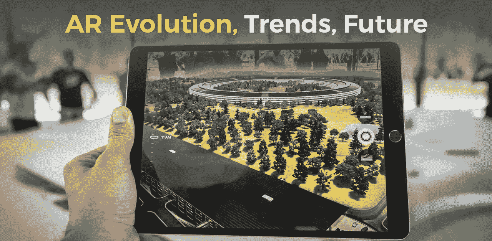

# 增强现实(AR)趋势:2021 年的过去、现在和未来预测

> 原文：<https://towardsdatascience.com/augmented-reality-ar-trends-the-past-present-future-predictions-for-2019-8e1148345304?source=collection_archive---------7----------------------->

Augmented Reality (AR) Trends

2020 年已经过去，在增强现实领域留下了一些密集的增长记录。这项技术肯定会通过开发更多的雏鸟项目继续在软件领域发展，并出现在大规模产品中。2018 年，许多公司体验了各种增强现实原型以及 POC 概念。

许多创新项目向世界表明，增强现实具有非常好的商业价值和未来潜力。大型企业正在见证增强现实的增长，他们已经计划使用 AR 开发他们即将到来的项目。

专家们正试图将基于增强现实的项目转化为实时客户应用。2021 年的增强现实预测称，AR 技术将继续增长，并加快步伐，打破所有头条新闻。

# **增强现实的发展确实在进步**

ar 是[类型的技术](https://digitalizetrends.com/types-of-technology/)之一，最初由萨瑟兰于 1968 年[开始，他在头戴式显示系统的构建中使用了 AR。就增强现实的发展而言，它已经迅速用于商业、物流、游戏、制造、零售行业等领域。AR 曾经是一种活动，可以通过其视觉覆盖轻松促进任何业务的增长。](https://www.wired.com/2009/09/augmented-reality-the-ultimate-display-by-ivan-sutherland-1965/)

许多组织已经使用增强现实技术进行了实验，结果让他们大吃一惊。报告称，通过构建一个基本的 AR 项目，准确率提高了 90%，时间消耗减少了 30%。该项目得到了进一步的管理，效率后来通过 DHL 得到了提高，使其达到了 25%,并在更广泛的推广中继续增长。

如今，增强现实几乎适用于所有的建筑行业。报告证明，大多数关于增强现实的反馈都是积极的，因为就设计师和客户而言，这是一个非常透明的过程。

# **增强现实对未来的洞察**

**1。AR 与人工智能(AI)的密切关系**

人工智能对于增强现实的操作非常重要。AR 允许在观看者的视觉视角中标记和识别对象。我们今天使用的许多社交媒体应用程序都是结合增强现实和人工智能开发的。例如，在 Instagram 和 Snapchat 上有各种各样的[有趣的滤镜](https://www.bustle.com/p/how-to-use-face-filters-on-instagram-stories-seriously-up-your-social-media-game-57966)，比如狗滤镜、兔子耳朵、猪滤镜等等。它们基于面向消费者的应用程序。

除非并且直到 AI 和 AR 都被组合和操作，否则这些应用不会起作用。我们肯定会看到并开始使用更多的社交媒体应用程序，它们具有图像增强等功能。

2. **AR 在教学和培训方面**

培训和教学技术都属于教育领域。通过使用增强现实技术，任何信息或数据都可以实时传递给学习者。这些系统提供了更好的视觉感受，并能找出最终导致最佳实践的物体和危险。增强现实已经证明了它的价值，它降低了训练的风险和成本。2021 年，我们将看到使用增强现实技术并使用更昂贵的设备和工具进行工作的行业快速增长。

**3。AR 与虚拟现实的联系**

脸书是最常用的社交媒体应用之一，它相信增强现实和虚拟现实环境。 [AR vs VR](https://technostacks.com/blog/ar-vs-vr) 也是时下病毒式的话题。

增强现实将人们联系在一起，在虚拟现实的帮助下使他们社会化。虚拟现实和增强现实一起开发了“电话会议”,用户可以看到彼此，同时也可以相互交流。

这些电话会议也可以同时承载两个以上的人。所有这一切碰巧都是因为增强现实和虚拟现实之间的联系才成为可能。随着这两个平台的结合，一个名为 Spatial 的先驱已经为 AR 设备的使用铺平了道路。

这些工具和设备允许用户见证插针板和白板。增强现实和虚拟现实共同作用于基于设计的文档，这些文档位于实时对象之上。在 2021 年，我们可能会看到用户通过使用虚拟现实见面和社交。还有一个关于这些系统在 VR 和 AR 头戴设备销售方面增长的预测。2021 年将是令人兴奋的一年，等待和体验现实世界中人们之间的互动。

**4。AR 正在赶超汽车行业**

自动驾驶汽车可能还需要几年时间才能成为现实。与此同时，许多汽车公司正在利用增强现实和人工智能技术来标志他们在市场上的存在。汽车行业是增强现实业务的到来。在 2021 年，我们将会看到语音助手方面的发展，比如 [Siri](https://www.apple.com/in/siri/) 。汽车中的增强现实技术也会有所增长。

汽车公司目前正在借助摄像机镜头，在汽车周围的仪表板上显示图形。这项技术有可能减少事故的发生，因为它有能力指出危险以及沿途的历史地标。

看到基于 AR 技术的公司取得的成果，特斯拉、丰田、奔驰和沃尔沃等大型汽车公司已经签署了在这个平台上工作的合同。增强现实技术也有能力保护汽车挡风玻璃上的 AR 数据。

在增强现实技术的帮助下，我们还可以体验常用车道的识别、导航提示、危险检测、正确方向信息等。

通过使用 AR 技术，公司可能会制定策略来改善驾驶员的安全状况。这些策略将允许驾驶员将全部注意力集中在道路上，同时浏览显示在手机屏幕上的反馈。这个过程还可以增加驾驶员在车辆中的舒适程度，并且他可以方便地驾驶他的汽车。

# **即将推进的 AR 趋势**

因此，这里有一些我们期待很快成熟和流行的增强现实趋势。

**a)移动 AR 是秀塞**

随着基于[耳机的 AR](https://www.techopedia.com/definition/23143/augmented-reality-headset-ar-headset) 的推出，出现了更多使用增强现实进行测量、可预测跟踪、改进渲染和 3D 检测的进步。苹果已经展示了他们的一些经验，通过使用一种新的文件格式来检测物体来共享 AR 空间。

这种格式被称为 USDZ 或通用场景描述。这种格式对第三方软件可能比以往更加开放。

**b) AR 提供自然体验**

大家都在等着看手势识别的改进。有些问题，比如凝视的方向，是很有趣的。为了给用户提供自然的体验，最好制造一种方便的产品。例如，当用户只是看着一个物体，它就会立即被检测到，这将会非常有趣。这是我们可以在现实生活中通过消除一个人转头的工作来实现的。

目前，很少有公司专注于最小化跟踪延迟，这是最新 AR 设备中的主要问题之一。这些问题不会持续超过一毫秒，但是它们仍然会给用户带来一定程度的不适。2021 年，我们将看到更多问题在增强现实测试的帮助下得到解决，因为它可能会跟踪任何东西。

**c) AR 迎来扩展现实(XR)**

扩展现实是一种我们可以数字化改变现实的形式。XR 由思维现实、虚拟现实和增强现实组成。“扩展现实”缩写中的字母“X”代表了上述所有字母。

所有这些现实在其目的和起源上都是独特的。他们的界限有时会被删除，他们重叠的相似之处会变得更加明显。我们相信今年 2021 年将会成功利用所有这些现实。这是增强现实的顶级趋势之一。

**d) XR 的重点仍然是在娱乐领域**

娱乐领域目前正在尽可能地利用增强现实和扩展现实以及虚拟现实的领域，今年肯定不会后退一步。XR 有充分的潜力在未来几年在娱乐领域生存下去。

苹果在游戏中使用增强现实，而其他公司则将其用于教育目的。我们将继续见证移动 AR 在业务和软件开发方面的快速增长。

**AR 市场为现代化创新解决方案铺平道路**

如果你有一个有意义的想法，可以增加产品的产量和销量，那么增强现实技术已经准备好以其现代化和创新的能力带你走向成功。随着增强现实领域的快速发展，你的想法将会占上风，并获得超越其艺术结构或领域的胜利。

许多被市场抛弃的想法现在又重新出现，只是因为使用了卓越的增强现实技术和趋势。例如，在室内导航设计中面临的问题，如场景的定位、起点和终点、标记等，现在正以很高的速度返回来解决并进入市场。

随着时间的推移，这些技术将在增强现实的帮助下得到改进和完善。市场总是对那些在他们的想法中利用增强现实的人开放。

**f) AR 导致进化而非革命**

2018 年可能不是增强现实的突破时期，但苹果等许多顶级公司正在尽最大努力，通过实施更好的想法，将增强现实带入跨平台环境。

让 AR 直接出现在浏览器中，这是苹果目前正在努力的一个想法，预计甚至在 2021 年就会有一些创新。这将消除下载移动应用程序的需要。我们非常急切地等待 XR 技术在应用后为企业服务的方式。在技术专业知识稳步增长的情况下，必须正确和精确地使用算法进行增强现实开发。

# **前进**

许多技术专家正在考虑 AR，因为它被认为在几乎每个应用领域都取得了成功。几乎任何问题都可以在[增强现实解决方案](https://technostacks.com/augmented-reality/)的帮助下迎刃而解。当谈到使用增强现实开发应用程序时，很明显它提供了如此好的机会来愉悦用户体验。通过包括增强现实的使用，我们可以在多个领域带来更多的进步，尤其是考虑到增强应用程序开发的未来。

UX 的设计师们已经开始使用增强现实技术趋势来改进他们的设计。这种增强现实技术无疑会给 UX 专家带来很多优势。UX 的专业人士正试图提高设备的能力，以利用其在 IT 世界的进步。

因此，今年充满了许多惊喜，等待着通过使用 ar 技术提高任何对象的当前质量、效率和生产率。做好准备，见证 AR 技术单独或与虚拟现实和人工智能相结合的发展。