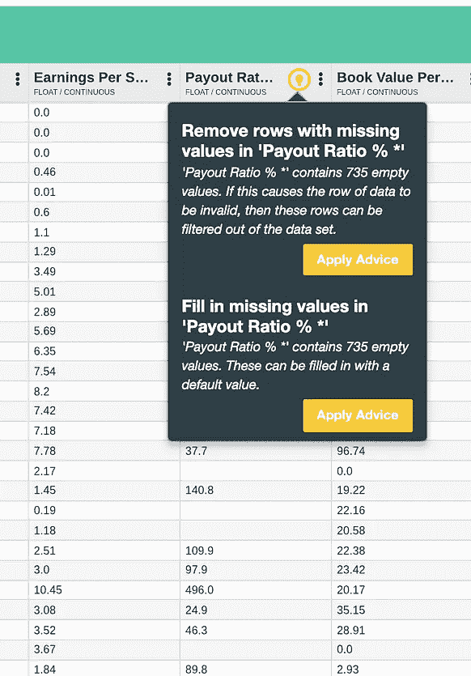
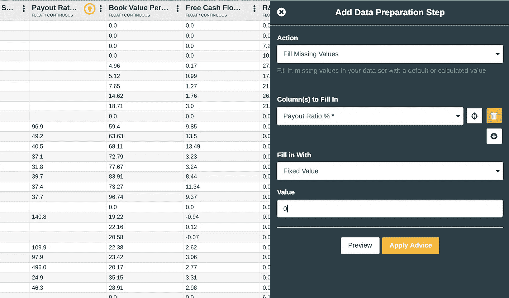

# 用数据科学充实投资分析师

> 原文：<https://towardsdatascience.com/augmenting-investment-analysts-with-data-science-98297cb1ccb0?source=collection_archive---------15----------------------->

## 基本面投资如何受益于机器学习

基本面投资包括建立一个世界如何旋转和走向的理论，然后确定与战略愿景一致的相关投资。第二部分可能相当乏味，因为它意味着梳理符合该战略的数百到数千家公司的财务指标，以确定定价过低或过高的投资，然后分别买入或卖出。本文将展示如何将机器学习模型与基本投资策略相结合，以允许分析师以透明和可解释的方式衡量他们的投资论点。建模将通过 [AuDaS](http://mindfoundry.ai/audas) 完成，这是一个易于访问和使用的数据科学之旅使能器。

**免责声明**:此信息仅供参考。它不构成也无意构成任何金融工具买卖的投资建议或要约或邀约，也不作为任何交易的官方确认。不保证所有市场价格、数据和其他信息的完整性或准确性，如有变更，恕不另行通知。

# 下载数据

财务比率数据是使用以下简单脚本从[晨星](http://Morningstar.com)获取的:

datadict={}
用于报价器中的名称:
用于范围(10)中的尝试:
尝试:
data dict[name]=(PD . read _ CSV([http://financials.morningstar.com/ajax/exportKR2CSV.html?t='+name](http://financials.morningstar.com/ajax/exportKR2CSV.html?t='+name) ，skiprows=2))

除:
print('带'+name+'的错误-重试')
time . sleep(0.3 *尝试+0.5)

else:
break
else:
print('无法导入'+name)

为了简单起见，我从最初的 100 个特性中抽取了 22 个。

# 投资论点

对于每家公司，如果是好的投资，我们给 1 分，如果不是，给 0 分。分数是根据一个非常简单的 T21 理论得出的，即如果一只股票的每股收益在第二年增加，那么这只股票就是好股票。当我们考虑年度财务数据时，我们也将在几年内拍摄公司的年度快照，以建立一个合理平衡的数据集。这也说明了一个事实，即一项投资并不总是多年保持良好！

我们现在想用 AuDaS 建立一个分类器，它已经学习了输入和分数之间的关系，以预测哪些投资值得持有。

# 数据预处理

这是上传到 AuDaS 的数据快照。

在对数据集进行初步分析后，AuDaS 能够识别出支付率%栏中的一些缺失值，这引发了一些关于如何纠正它的建议。当派息率缺失时，这仅仅意味着没有股息返还给投资者，因此我们可以用 0 来填充缺失的值。奥达斯使得按照建议行动变得非常容易。

应用该建议会在数据工作流中添加一个用于审计目的的步骤，如果需要，该步骤也可以反转。

然后，我们可以查看直方图视图，直观地了解我们的“好”和“坏”公司在财务比率中的分布情况。

似乎没有一个清晰的模式，但希望 AuDaS 能够为我们找到一个机器学习模型，准确地映射变量之间的动态！

# 构建模型

在 AuDaS 中，我们只需要指定我们希望预测 score 列，因为它已经自动排除了 ticker 列(因为它具有级别标识)。此外，AuDaS 为训练模型提供了一个健壮的框架，该框架不会过度拟合，并且可以在生产中工作。

AuDaS 中的建模由 [Mind Foundry](http://mindfoundry.ai) 的专有优化器[**OPTaaS**](https://mindfoundry.ai/optaas) 提供支持。它使用贝叶斯方法，从每次迭代中学习什么可行，什么不可行，从而更有效地收敛到最佳解决方案！ **OPTaaS** 作为单独产品提供(可从我的 [**个人资料**](https://towardsdatascience.com/@charlesbrecque) 中获得**试用链接)，目前由全球量化对冲基金和[量子计算机](/bayesian-optimization-quantum-computing-27a9cbbf0930)使用！**

经过几次迭代后，AuDaS 已经找到了一个简单的随机森林分类器，其分类准确率为 67%。

AuDaS 还提供了相关特性和各种性能统计数据。在我们的案例中，似乎每股账面价值对得分的影响最大，其次是派息率%和每股收益。

# 做预测

AuDaS 构建的模型既可以在平台内使用，也可以通过应用程序或 excel 电子表格进行部署。然后我从[晨星](http://financials.morningstar.com/ratios/r.html?t=MSFT&region=usa&culture=en-US)拿了微软 2018 年的财务数据，让奥达斯预测它的分数。

AuDaS 使用 [LIME](https://www.google.com/url?sa=t&rct=j&q=&esrc=s&source=web&cd=5&cad=rja&uact=8&ved=2ahUKEwj8zpLA_YbgAhXrXRUIHY48DDgQFjAEegQIAxAB&url=https%3A%2F%2Fchristophm.github.io%2Finterpretable-ml-book%2Flime.html&usg=AOvVaw0UQpnDNoD_0YahYvc3PZL7) 来解释每个特征对预测的影响。正如你所看到的，特性之间的错综复杂比预期的更复杂，这表明分析师在没有机器学习的情况下很难做出结论！

# 聚集股票

然后，我们可以通过要求 AuDaS 对公司进行聚类来扩展分析。AuDaS 使用 K 均值聚类确定了 8 个聚类:

在构建投资组合时，此分析可用于最终风险分析。

这里没有介绍的其他相关用例可能是:

*   预测公司收入以得出估价
*   为贸易结算预测贸易失败
*   依赖分销策略的基金的营销/销售优化

您可以观看下面的端到端演练:

如果您有任何问题或希望观看 AuDaS 的现场演示，请不要犹豫与[联系](http://Charles.brecque@mindfoundry.ai)！

【**更新**:我开了一家科技[公司](http://www.legislate.tech/)。你可以在这里找到更多的

## 团队和资源

[Mind Foundry](http://www.mindfoundry.ai) 是牛津大学的一个分支机构，由斯蒂芬·罗伯茨(Stephen Roberts)和迈克尔·奥斯本(Michael Osborne)教授创立，他们在数据分析领域已经工作了 35 年。Mind Foundry 团队由 30 多名世界级的机器学习研究人员和精英软件工程师组成，其中许多人曾是牛津大学的博士后。此外，Mind Foundry 通过其分拆地位，拥有超过 30 名牛津大学机器学习博士的特权。Mind Foundry 是牛津大学的投资组合公司，其投资者包括[牛津科学创新](https://www.oxfordsciencesinnovation.com)、[牛津技术和创新基金](http://www.oxfordtechnology.com)、[牛津大学创新基金](https://innovation.ox.ac.uk/award-details/university-oxford-isis-fund-uoif/)和 [Parkwalk Advisors](http://parkwalkadvisors.com) 。