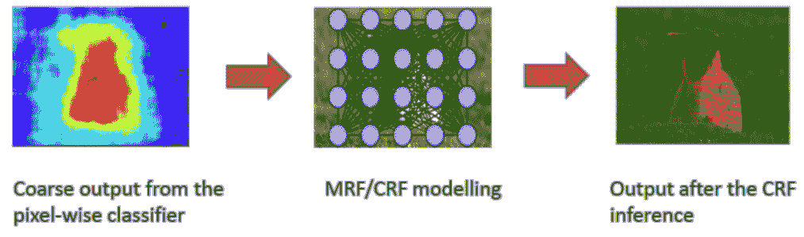
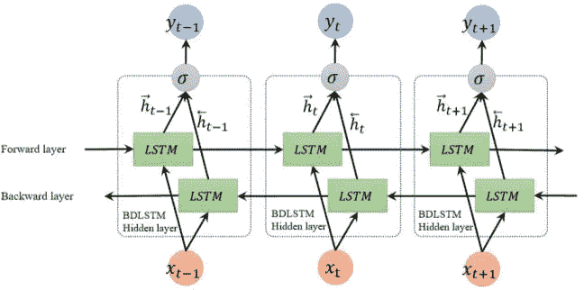
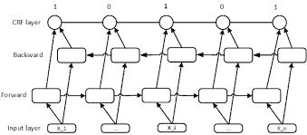
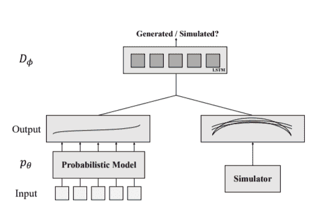
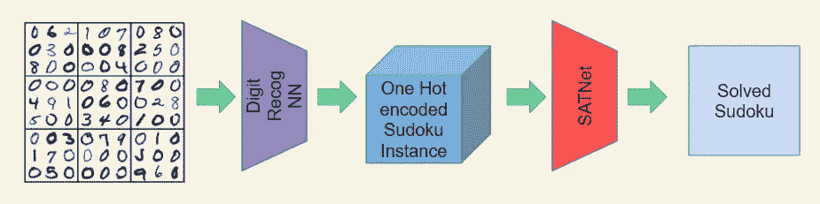

# 用约束优化增强神经网络

> 原文：<https://towardsdatascience.com/augmenting-neural-networks-with-constraints-optimization-ac747408432f?source=collection_archive---------9----------------------->

添加包含领域知识的约束是一种用世界知识增加神经网络并提高其性能的有趣方式，特别是在低数据设置中。



*Image from: Conditional Random Fields as Recurrent Neural Networks,* Zheng et al (2015)

在神经网络之上使用约束优化和/或逻辑模块已经成为 NLP 和计算机视觉中许多任务的结构化预测的相当普遍的实践。例如:BiLSTM-CRF 用于 NLP 中的序列对序列任务，或者使用来自神经网络的具有潜在功能的 CRF 用于图像分割任务。

如今，已经有很多积极的研究将这些优化模块直接整合到神经网络中，从而允许网络以端到端的方式进行训练。本文探讨了在神经架构中合并约束的流行方法，并提供了在尝试从数据中学习约束方面的最新进展的调查。

## 如何将约束纳入深度学习架构？

有四种流行的方法可以尝试将域约束合并到神经架构中:

*   在神经网络上使用约束优化层
*   添加约束违反惩罚
*   强制约束架构设计
*   数据扩充

**约束优化层**

一些流行的约束优化层是条件随机场、维特比解码、整数线性编程(ILP)或非线性编程(NLP)解算器。

因此，在通过约束优化层合并约束时发生的情况是，您获取神经网络的输出，并将该输出用作实施约束的优化层的潜在函数。

让我们用一个使用这种技术的流行架构来理解它吧— *BiLSTM CRF。*



BiLSTM Architecture

假设给你一个句子，你必须在上面做[词性标注](https://en.wikipedia.org/wiki/Part-of-speech_tagging)。双向 LSTM(或 BiLSTM)结构通常用于这种序列标记任务。BiLSTM 考虑要标记的单词及其前后的单词，以生成用于预测当前单词的标签的局部嵌入。

现在我们可以看到，在输出空间上有许多自然约束。例如，我们不会经常看到一个名词后跟一个形容词，或者一个副词后跟一个副词(所有这些都是软约束，因为存在一些例外)。有人会认为神经架构应该知道这些限制，但事实往往并非如此。CRFs 比 BiLSTM 表现更好就说明了这一点。



BiLSTM CRF architecture

一种创新的方法是将神经模型的优势与 CRF 相结合，这产生了 BiLSTM-CRF 或 LSTM-CRF 架构。BiLSTM 产生的丰富嵌入充当 CRF 层的特征。点击了解更多信息。

类似的技术也已经在计算机视觉中使用，通常用于通过将 HMM 或 CRFs 与神经网络相结合的分割任务。在这里看一个例子[。](/review-crf-rnn-conditional-random-fields-as-recurrent-neural-networks-semantic-segmentation-a11eb6e40c8c)

**约束违反处罚**

合并约束的另一种流行方法是使用约束违反惩罚作为正则化方法。我们引入了一个对应于违反约束惩罚的辅助损失项。这个增加的项给出了神经网络有多接近满足约束的可微分测量。这种约束条件的一个例子可以在[这里](https://arxiv.org/abs/1711.11157)找到。

这些项的添加也为半监督学习开辟了一条途径，因为即使没有输出标签，这种正则化项也可以用于调整模型以更加满足约束。事实上，对于某些问题，任何满足一组给定约束的非平凡假设都是最佳假设的良好近似。对这一假设的研究可以在没有数据(或数据量极低)的情况下进行。更多参考见[具有物理和领域知识的神经网络的无标签监督](https://arxiv.org/abs/1609.05566)。

**实施约束的神经架构设计**

这是最早也是最难以捉摸的强制约束方法之一。在这种方法中，我们设计的架构可以自动执行约束。我们可以通过使用推进这种方法的最近工作得到这种方法的直觉:[用一阶逻辑增强神经网络](https://arxiv.org/pdf/1906.06298.pdf)。这项工作仅限于对具有语义基础的神经元施加约束(因此，对大多数实际网络来说，这种方法仅限于输出神经元或注意神经元)。此外，约束的形式为`L -> R`。因此，每当 L 的激活为高时，R 的激活也应该为高，因此对应于 L 的激活的偏置项被添加到负责 R 的神经元，从而每当 L 为高时推动 R 变得更高。

**加强约束的数据扩充**

人们还可以通过增加数据来加强约束，以激励网络更加注意约束。再次获得这种方法的直觉，让我们考虑[一个逻辑驱动的神经模型一致性框架](https://svivek.com/research/publications/li2019logic-driven.pdf)。于是这个小组与 [SNLI](https://nlp.stanford.edu/projects/snli/) 一起完成任务。给定两个陈述 P 和 Q，我们需要判断 P 是否包含 Q，P 是否与 Q 矛盾，或者这两个陈述是中性的。自然，人们可以看到蕴涵的传递性和矛盾的交换性。然而，该论文表明，SOTA 模型的 SNLI 往往不执行这些一致性。因此，论文的主要贡献是使用数据扩充，使这些一致性得到加强。例如，如果(P，Q)在带有标签“矛盾”的数据集中，那么(Q，P)也应该加上标签“矛盾”，从而强制模型学习交换性。

## 怎样才能学会约束？

这是一个相当新的研究领域，我们让神经模型在有限的人工监督下从数据本身学习约束。我们将关注这一领域的两项工作。

**用于结构化预测的对抗性约束学习，*任等人***



Adversarial training to train a generator which can model output label space

它们为结构化预测任务提供了一种创新的半监督学习方法。他们的工作假设遵循真实输出空间分布的大量输出标签是可用的(可能来自模拟器)。然后，他们训练一个生成器网络，该网络可以使用对抗训练技术生成能够模拟真实输出标签空间的输出标签。他们使用有限量的标记训练数据来将输入标签与输出标签相关联，从而进一步调整该生成器。

[**SATNet:使用可微可满足性求解器桥接深度学习和逻辑推理，*王等***](https://arxiv.org/pdf/1905.12149.pdf)

这是一个我个人认为非常惊人的研究领域。基本上，他们试图构建一个能够从数据本身学习约束的架构。此外，他们设计的架构可以使用反向传播进行训练，因此可以插在任何深度学习架构之上，用于约束优化任务。他们通过学习解决数独来演示这个模型，只使用数独的实例，没有人为监督来识别约束。

他们试图学习一个 MAX2SAT 实例，该实例通过将手头的问题公式化为半确定的编程实例来对其建模。在正向传递中，它们求解当前 SDP 实例，以找到优化 SDP 的变量分配。然后，他们计算这个变量赋值的损失，并反向传播以修改 SDP 实例。

```
**Forward Pass** : Solve current approximated problem
**Backward Pass**: Improve approximated problem
```

现在，拥有反向传播能力的伟大之处在于，你可以将这个模块插在任何深度学习架构之上。考虑给你一个数独的图像，然后你可以有一个 CNN 来识别数字，在此之上，你可以有一个 SATNet 层来解决解码的数独实例。这整个架构可以进行端到端的训练。



Solving visual Sudoku with SATNet

向神经架构添加约束不仅有助于提高性能，而且还提供了更新的方法来利用未标记的数据，修剪输出空间，从而提高模型的可学习性并增加泛化能力。此外，强制约束一致性有助于使网络健壮和可靠。

这篇架构和算法的综述并不详尽，但我希望它能让你对架构和算法中的大多数常见约束有所了解。

*干杯！*