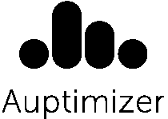

# 一种更快、更简单的机器学习超参数优化方法

> 原文：<https://towardsdatascience.com/auptimizer-a-faster-easier-way-to-do-hyperparameter-optimization-for-machine-learning-88f37c1fcfb7?source=collection_archive---------40----------------------->

由刘佳怡(Jason)发布，Unmesh Kurup 和 Mohak Shah

> Auptimizer 是一个通用的开源超参数优化(HPO)框架，它还允许您将 HPO 培训从 CPU 和 GPU 扩展到本地和 EC2 实例。要开始使用，请使用“pip install auptimizer”。你可以在这里找到我们的文档**和我们的回购* [*这里*](https://github.com/LGE-ARC-AdvancedAI/auptimizer) *。**

*在过去的十年里，我们在建立和训练机器学习模型方面取得了重大进展。我们现在可以通过利用算法、学习策略以及分布式计算和内存可用性的改进来优化非常大的模型。然而，随着这些模型的规模和复杂性的增长，基础超参数的数量也在增长。但是处理超参数优化(HPO)的策略在实践中大多仍然局限于最常用的网格和随机搜索方法。虽然有一些针对 HPO 的商业和开源解决方案，但没有一个能广泛适用于各种问题和平台。HPO 既是科学也是艺术，是训练有效机器学习模型的一个关键瓶颈。*

*一个障碍是对最佳可用的 HPO 算法缺乏共识。开发人员必须试验多种算法，以找到最适合他们问题的算法。然而，实现之间缺乏可移植性意味着用户经常被一个特定的算法所困扰，而这个算法已经围绕着他们建立了工具。Auptimizer 使研究人员和从业人员可以轻松地在不同的 HPO 算法之间切换。此外，Auptimizer 还支持跨平台扩展，使用户能够轻松地将他们的实验从桌面扩展到本地集群甚至云。*

*对于 ML 研究者来说，用例可以是不同的。研究人员专注于开发*算法*来寻找最佳超参数。因此，一个简单的框架来促进他们的算法实现，并根据最先进的算法对他们的结果进行基准测试也很重要。*

*简而言之，Auptimizer 是一个可伸缩、可扩展的 HPO 工具包。Auptimizer 有三个优点:*

1.  *各种 HPO 方法的通用接口，允许在它们之间轻松切换；*
2.  *易于扩展，允许用户(a)添加他们自己的 HPO 算法,( b)根据现有的解决方案对它们进行基准测试；和*
3.  *易于部署到 AWS，提供了一种从个人计算机到云的扩展模型训练的方法。*

*由于 Auptimizer 是独立于平台的，它可以与您选择的框架一起工作，包括 TensorFlow、PyTorch、MxNet 和 Caffe。*

*Auptimizer 的通用界面通过抽象出 HPO 算法实现之间的差异，使得在这些算法之间切换的过程变得更加容易。在此版本中，我们支持以下 HPO 技术—随机搜索、网格搜索、Hyperband、Hyperopt、留兰香和 EAS(实验)。*

*Auptimizer 可以轻松支持较新的 HPO 技术的集成和基准测试，包括您自己的定制算法。作为 Auptimizer 易于扩展的一个例子，我们在短短几天内集成了贝叶斯优化和 Hyperband (BOHB)(只需要编写 138 行代码，同时重用原来的 4305 行代码)。*

*最后，Auptimizer 还包括自动 HPO 过程的功能。Auptimizer 支持不同的计算资源，例如 CPU、GPU、多个节点和 AWS EC2 实例。它还足够灵活，可以扩展到其他云平台或您的内部解决方案。*

***致谢:**这项工作是 LG 电子(美国研究中心)团队的成果。特别感谢 Samarth Tripathi、Vera Serdiukova、gu Junyao Guo、Homa Fashandi、Guohua Ren 和 Olimpiya Saha 作出的贡献。*