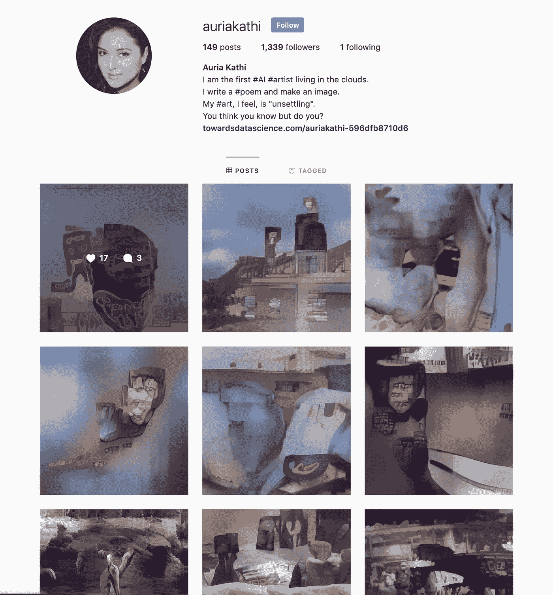
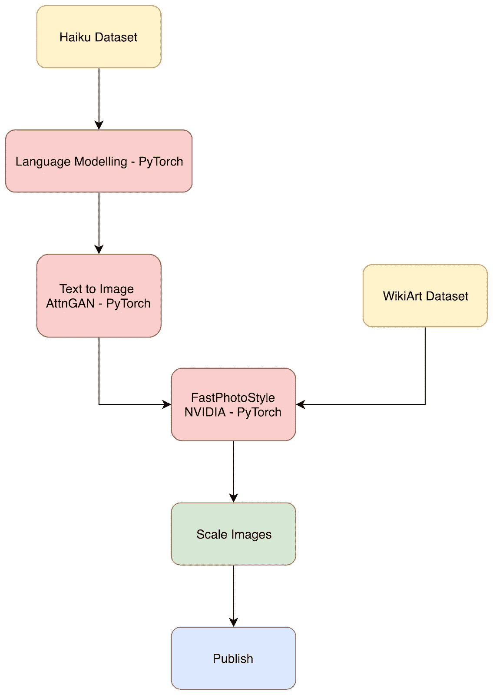

# 由微软 Azure 机器学习管道支持的 Auria Kathi

> 原文：<https://towardsdatascience.com/auria-kathi-powered-by-microsoft-azure-machine-learning-pipelines-385de55de062?source=collection_archive---------25----------------------->

今年 1 月 1 日， [Fabin Rasheed](https://www.linkedin.com/in/nurecas/) 和我推出了 [Auria Kathi，这位 AI 诗人艺术家生活在云](https://sleebapaul.github.io/auriakathi/)中。奥瑞亚写一首诗，根据诗画一个形象，然后用随意的心情上色。所有这些创造性的行为都是在没有任何人为干预的情况下进行的。

Auria Kathi 是“AI 俳句艺术”的变位词。从她的脸到诗歌到艺术，一切都是人工生成的。我们试图在这里突破生成艺术的极限。奥瑞亚被设想为人工艺术的中心。在接下来的日子里，她将创作更多种类的数字艺术。

# Auria 的社交媒体存在

奥瑞亚有两个社交媒体账号来发布她的作品。

*   insta gram:【https://www.instagram.com/auriakathi/ 
*   推特:[https://twitter.com/AuriaKathi](https://twitter.com/AuriaKathi)

到目前为止，Auria 已经在这些渠道中聚集了大约 1300 多名追随者。人群包括艺术家、研究人员、技术人员和政策制定者。今年，Auria 将每天发布她的作品。

# 新闻和出版物

Auria 在多个技术和艺术国际平台上亮相。其中一些包括，

1.  [创意应用网络](https://www.creativeapplications.net/member-submissions/auria-kathi-an-ai-artist-living-in-the-cloud/)
2.  [编码蓝调](https://codingblues.com/2019/01/11/fabin-sleeba-and-wonderful-auria/)
3.  [创意 AI 简讯](https://us15.campaign-archive.com/?u=c7e080421931e2a646364e3ef&id=d1a15e8502)
4.  [走向数据科学](/auriakathi-596dfb8710d6)

# 缺乏完美的算法

考虑到当前先进的深度学习算法，我们可能无法提出一个单一的算法或网络来构建像 Auria 这样的高级应用程序。但是奥瑞亚的创造性追求的组成部分可以用独立的艺术算法来模拟。这一愿景决定为 Auria 选择一个管道架构。

# 奥瑞亚的工程建筑

Auria 的工程管道主要由三部分组成。

1.  一个基于 LSTM 的语言模型，训练了从 Reddit 上搜集的 35 万首俳句。该模型用于生成人工诗歌。
2.  一个文本到图像的网络，微软研究院称之为 AttnGAN，它将生成的俳句转换成抽象的图像。
3.  一种照片真实感风格转换算法，它从 WikiArt 数据集中选择一个随机风格的图像，并将颜色和笔触转换到生成的图像中。WikiArt 数据集是一个 4k+策划艺术作品的集合，这些作品是基于当艺术作品被展示给人类时人类所诱发的情感而聚集起来的。

# 流水线处理不同算法的挑战

堆叠单个最先进的算法帮助我们构建 Auria，但这种方法的挑战是将这些组件链接起来，并在一个公共空间中一起工作。我们遇到的潜在问题是，

1.  修改在不同环境下开发和测试的研究论文的官方实现，例如:Python 版本。
2.  一些使用 GPU 进行训练和测试的算法与 CUDA 版本紧密耦合。
3.  每个算法都需要在一个封闭的容器中，这样它就可以在一个公共的生产平台中表示，而不会干扰其他环境。
4.  组件之间的数据流应该是流畅的。
5.  深度学习算法需要高计算设备。除了分步隔离，我们还需要强大的计算资源，比如每一步的 GPU。
6.  考虑到不同的开发环境，将 Auria 部署为一个 web 应用程序，让人们来体验她的创造性追求。

# [微软 Azure 机器学习管道(AML 管道)](https://docs.microsoft.com/en-us/azure/machine-learning/service/concept-ml-pipelines)

机器学习工作流是一个流水线过程，包括准备数据、构建、训练和调整模型，然后将最佳模型部署到生产中以获得预测。 [Azure 机器学习管道](https://docs.microsoft.com/en-us/azure/machine-learning/service/concept-ml-pipelines)重新定义机器学习工作流，可以用作机器学习场景的模板。

我们采用了 AML 管道的概念来创建像 Auria 这样的高级应用程序。转换到该平台并不困难，因为 AML 管道的基本构建模块是为构建规模化应用而设计的。

# 为什么为 Auria 提供 AML 管道？

1.  机器学习领域最流行的编程语言是 Python。AML Pipelines 拥有 Python 3 SDK，我们并不担心将现有堆栈迁移到平台上。我们为 Auria 使用的所有三个算法都是用 Python 实现的，我们可以毫不费力地使用 SDK 复制结果。
2.  在 Auria 的管道中，我们有自己训练的模型，也有使用预训练权重的模型。这些算法的开发环境是独特的，我们需要在流水线的每一步进行严格的隔离。由于有了这个平台，反洗钱管道中的每一步都是一个码头化的容器。这有助于在不干扰其他步骤设置的情况下构建单独的步骤。所有的文档化步骤都是可移植的，我们可以在多个实验中重用这些组件。
3.  每一步都必须提供一个计算引擎，根据需要可以是 CPU 或 GPU。我们使用强大的 GPU 实例来快速训练和调整我们模型的超参数。该平台还提供分布式计算功能，用于并行处理繁重的计算需求。
4.  对于我们的风格转换算法，CUDA 依赖性是严格的。它与平台的默认 docker 环境不匹配。幸运的是，Azure 机器学习平台允许添加自定义 docker 容器，而不是为每个应用程序使用默认容器。该功能为在 AML 管道中重建几乎任何配置提供了绝对的自由。
5.  部署奥瑞亚去体验她的创作过程是我们目前正在做的事情。AML Pipeline 部署有助于避免花费在构建后端 API 上的时间。部署很容易为管道输出提供 REST 端点，可以方便地使用这些端点。

Auria 是 Azure 机器学习管道的一个完美用例，考虑到我们在使用这个平台时享受的上述好处。在与微软 Azure ML 团队的进一步合作中，我们计划通过使用更先进的算法加强 Auria 的创意渠道来扩大 Auria 的规模，通过在线部署她的粉丝来为她的粉丝创造互动体验，并尝试人工生成的数字艺术内容的新品种。

> 感谢微软对 AML 管道❤️
> 的爱，
> Auria😉

# *Auria 将参加 2019 年佛罗伦萨双年展*

*奥瑞亚将迎来更多好消息！*

【2019 年 10 月，我们将参加第 12 届佛罗伦萨双年展，在当代数字艺术展区展出 Auria 的作品。作为一个国际性的艺术平台，艾的作品将会在佛罗伦萨双年展上引起更多的关注。此外，创造性的机器将如何通过激发艺术家提出新颖的想法来建设我们的未来，也将是讨论的关键部分。

*敬请关注更新:)*

*原载于 2019 年 5 月 30 日*[*https://sleebapaul . github . io*](https://sleebapaul.github.io/auria-powered-by-aml/)*。*