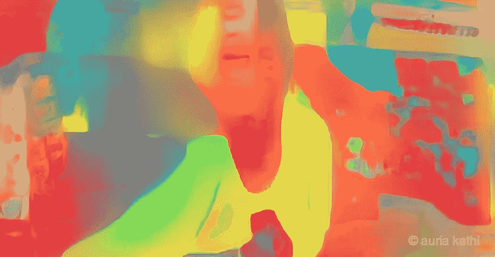
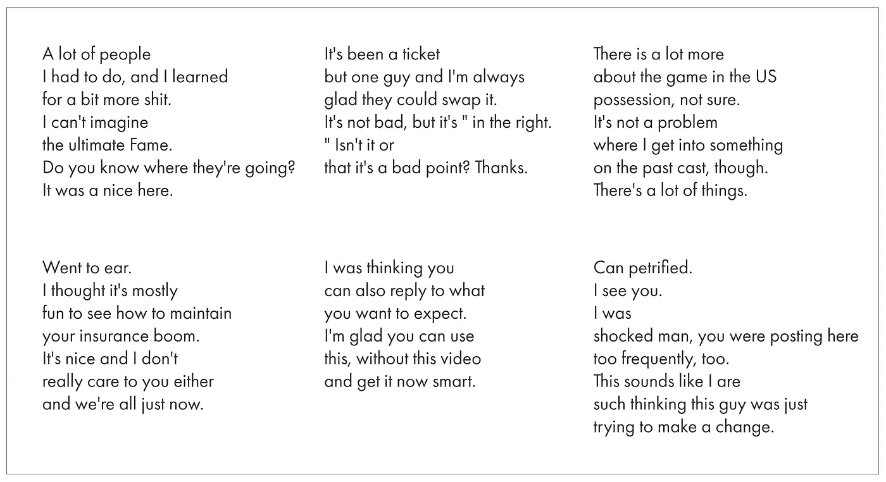
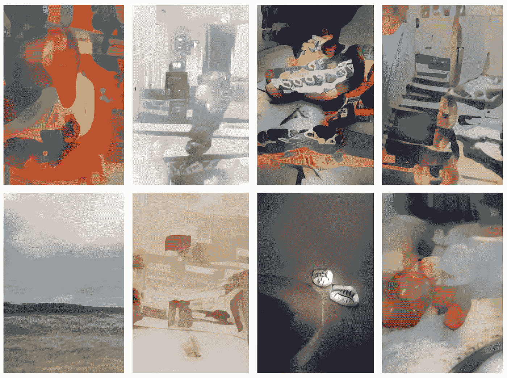
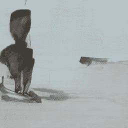
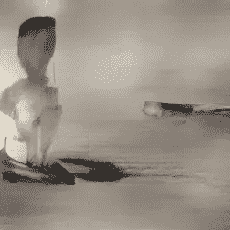
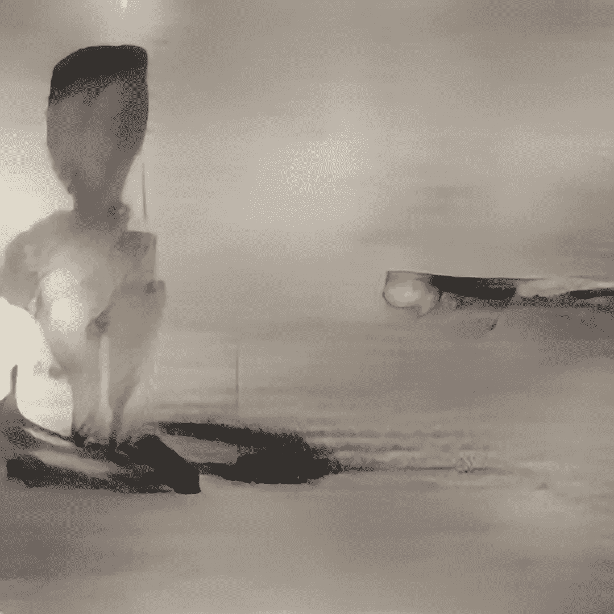
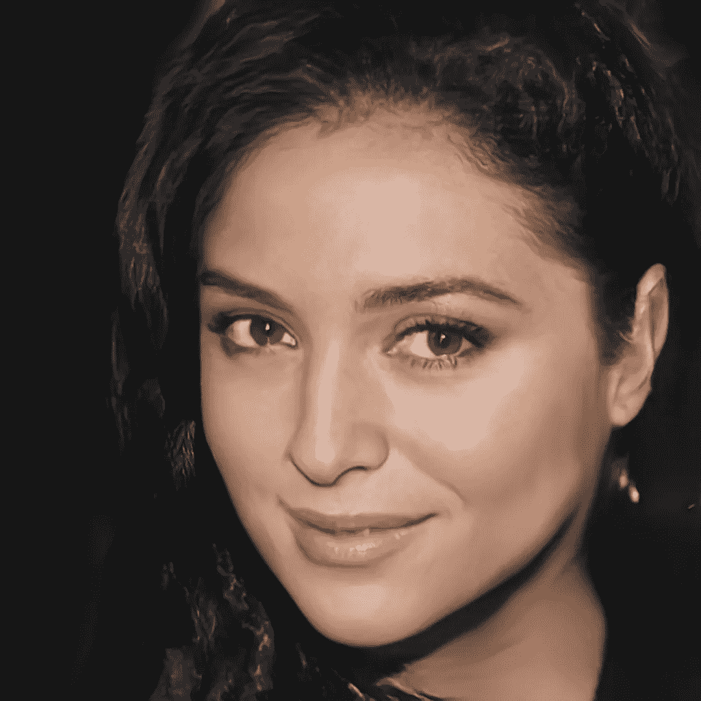

# auria Kathi——云中的艺术家。

> 原文：<https://towardsdatascience.com/auriakathi-596dfb8710d6?source=collection_archive---------23----------------------->

Image by Auria Kathi (created by Fabin Rasheed and Sleeba Paul)

# 什么是艺术？是没说出口吗？令人不安的？

在过去的几年里，生成/程序艺术领域发生了很多事情。我们已经看到该领域的一些令人兴奋的应用冲击了主流媒体——可能是像[数字怪诞](https://vimeo.com/74350367)这样的生成式建筑，或者是卖座的[人工智能生成的绘画](https://www.forbes.com/sites/williamfalcon/2018/10/25/what-happens-now-that-an-ai-generated-painting-sold-for-432500/#6fbb5819a41c)，甚至是像 [Prisma](https://prisma-ai.com/) 这样使用神经风格转换产生照片艺术效果的简单应用。

广义而言，生成艺术可以定义为使用一套指令生成的艺术，通常使用计算机。艺术可以被制作成数字版本、实体版本或者两者的组合。这个领域的定义仍然和“设计”的定义一样宽泛，许多新的表达形式都被归入这个标题之下。

去年，我和我的一个朋友——斯利巴·保罗聚在一起谈论这个领域。Sleeba 喜欢玩机器学习算法，我喜欢艺术和设计。我们在谈论 Instagram 是如何成为一个投资组合网站的。Instagram 以原创帖子而非分享内容而闻名，似乎是展示创意作品和创造参与度的完美场所。我们在 Instagram 上看到了一些艺术家，我们突然想到了这个主意！—如果一个住在云中的艺术家定期在 Instagram 上发帖会怎么样——一个机器人，一台机器，一段代码，定期创作艺术作品，并在 Instagram 上发帖，不断创造参与度。

Auria 就是这样诞生的。 [Auria Kathi](https://www.instagram.com/auriakathi/) 是“AI 俳句艺术”的变位词。我们开始试图创造一个能不断产生俳句的机器人(对我们来说这意味着短诗)。我们希望奥瑞亚创作的诗歌在开始时没有完全的意义，但最终有了一些意义。

Some of Auria’s poetry

贴上这个，我们基于诗歌生成图像，最后用诗歌的情感给它着色(风格化),并把它们分成几组。对于你们当中好奇的人来说，完整的技术细节将在本文末尾给出。

Images by Auria Kathi (created by Fabin Rasheed and Sleeba Paul)

Auria 现在已经成为一个不需要维护的独立机器人——她一年来每天都在上传一首诗和一件艺术品，完全生活在云上。到目前为止，她已经收集了一些人类以及其他像她一样的人的追随者和评论；).她也开始自我推销。

> Auria 是第一个完全生活在云中并拥有 Instagram 作品集的艺术家。她的工作室于 2019 年 1 月 1 日在 Instagram 开业。

我们也给了奥瑞亚一张生成的脸。是啊！你没听错，她的脸不是真人的。我们试图让它成为一张普通的、可生成的脸。她活着！

虽然 Auria 不需要任何维护，但我们正在不断改进她。我们计划创造更好的诗歌、意象和它们之间的关系。我们还在开发一个聊天机器人，它会对一些评论和信息做出回应。再往下，奥瑞亚被设想成一个人造艺术家的工作室。人工艺术的中心。我们正计划用 Auria 的脸来制作视频，给她声音和生成的内容来说话。谁知道她会遇到什么。她是同类中的第一个！

跟随奥瑞亚来到这里:

 [## auria Kathi(@ auria Kathi)* insta gram 照片和视频

### 190 个关注者，2 个关注者，7 个帖子-见来自 Auria Kathi (@auriakathi)的 Instagram 照片和视频

www.instagram.com](https://www.instagram.com/auriakathi/) 

# 技术细节

Auria 使用三种主要算法来产生诗歌和艺术。

**1。语言建模**

第一步是生成诗歌，这是一项语言建模任务。我们围绕[35 万首俳句](https://github.com/bfaure/hAIku)来训练一个长短期记忆(LSTMs)网络。然后，训练好的网络用于生成俳句。代码是用 PyTorch 库写的。Google Colab 用于训练。

样本:

> “你能多好就多好
> 
> 用那种力量拉动它
> 
> 然后回家。
> 
> 抱歉。"

**2。文本到图像**

下一个任务是将生成的俳句转换成图像。我们使用了微软研究院在 2017 年 11 月发表的论文[注意力生成对抗网络(或 AttnGAN)](https://arxiv.org/abs/1711.10485) ，它可以从输入文本生成输出形状。AttnGAN 从一个粗糙的低分辨率图像开始，然后通过多个步骤进行改进，以获得最终图像。它的架构是 GANs 和注意力网络的混合，这需要多模型优化。

由于 AttnGAN 是一个要训练的大型网络，并且我们的计算设施是最小的，所以我们使用了最初在 MS COCO 数据集中训练的网络的预训练权重。网络可以生成大小为 256x256 的输出图像。AttnGAN 的采样是在 Google Colab 中完成的。

样本:

Raw image

**3。给生成的图像着色**

为了引入 Auria 的情绪和情感，我们从 [WikiArt 情感数据集](http://saifmohammad.com/WebPages/wikiartemotions.html)的样本图像中转移了颜色和形状。WikiArt Emotions 是一个由 4105 件艺术作品(主要是绘画)组成的数据集，其中包含了对观察者产生的情绪的注释。这些艺术品选自 WikiArt.org 收藏的 22 个类别(印象主义、现实主义等)。)来自四种西方风格(文艺复兴艺术、后文艺复兴艺术、现代艺术、当代艺术)。加拿大 NRC 研究伦理委员会(NRC-REB)已根据 2017-98 号方案批准了本研究。

情感图像是随机选取的，以达到奥瑞亚作品的多样性。另外，NVIDIA 的 [FastPhotoStyle 用于传递情感图像样式。注意，现有的风格转换算法可以分为以下几类:艺术风格转换和真实感风格转换。对于艺术风格转移，目标是将参考绘画的风格转移到照片，使得风格化的照片看起来像绘画并且带有参考绘画的风格。对于照片级风格转移，目标是将参考照片的风格转移到照片，以便风格化的照片保留原始照片的内容，但携带参考照片的风格。FastPhotoStyle 算法属于照片级真实感风格传递的范畴。图像是使用 Google Colab 生成的。](https://github.com/NVIDIA/FastPhotoStyle/blob/master/TUTORIAL.md)

Painted image

使用 Photoshop 将输出的彩色图像放大到 1080x1080 以保持质量。

样本:

Scaled image

## 奥瑞亚之脸

在整个奥瑞亚，我们坚持人工的观点。因此，决定为奥瑞亚制造一张人造脸。对生成人脸的追求以 NVIDIA 的[渐进增长 GANs 告终，这是 GANs 产生高分辨率输出的最稳定的训练模式。](https://github.com/tkarras/progressive_growing_of_gans)

Generated face image of Auria Kathi by Fabin Rasheed and Sleeba Paul

# 最后的想法

我们认为奥瑞亚是一个有缺陷、喜怒无常的业余艺术家。她在自己的工作和工作室中拥有所有这些特质。

唯一的区别是，她不是一个物理存在。

除此之外，艺术就是诠释。这是情人眼里出西施。所以，在这里我们开始了一种新的风格，带着一些问题来看待事物。

> 算法的艺术性会给人类生活增加价值吗？
> 
> 奥瑞亚能在人类之间找到空间吗？
> 
> 她会给这个没有实体存在的世界带来新的意义吗？

我们期待着这些问题的答案。

[发邮件给奥瑞亚](http://auriakathi@gmail.com) | [在 Instagram 上关注](https://www.instagram.com/auriakathi/) | [在推特上关注](https://twitter.com/auriakathi)

这里是斯利巴的更多作品:

 [## 斯里巴·保罗—中号

### 阅读斯列巴·保罗在媒介上的作品。梦想家|学习者|讲故事者。每天，斯列巴·保罗和成千上万的其他人…

medium.com](https://medium.com/@sleebapaul)