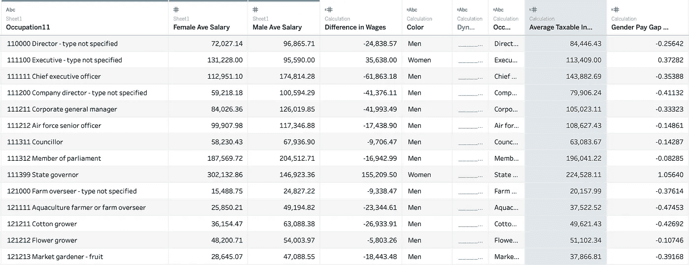
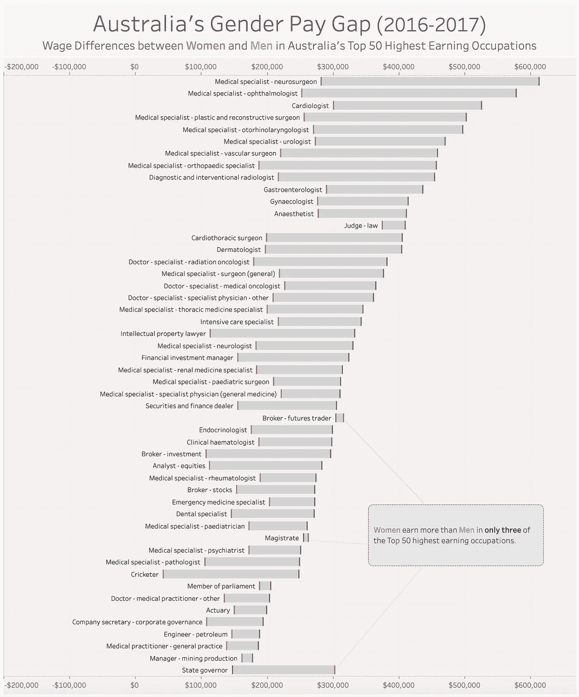
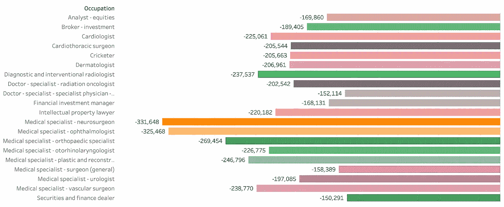
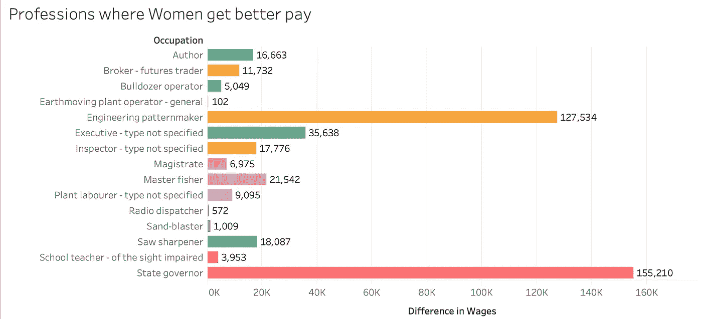
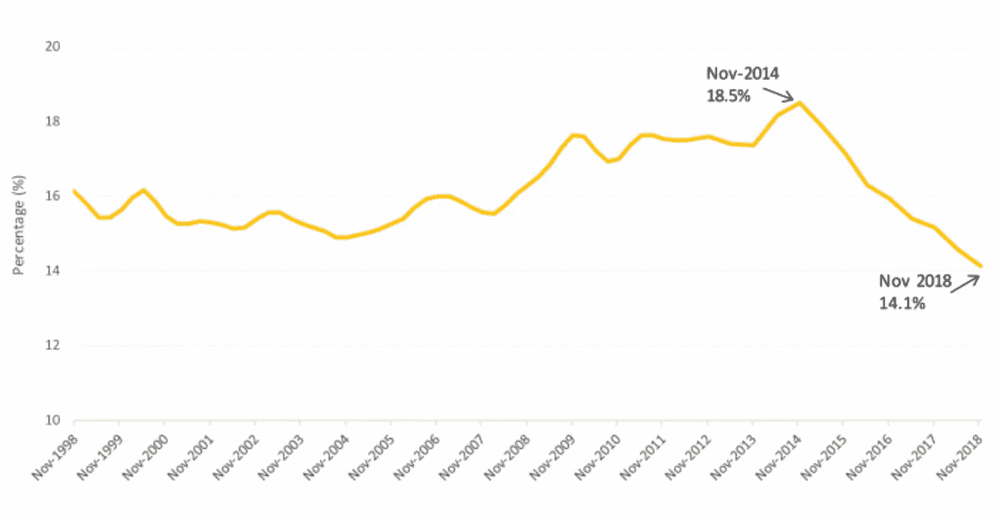

# 澳大利亚性别薪酬差距研究

> 原文：<https://towardsdatascience.com/australias-gender-pay-gap-study-d9f8a0aa0a5?source=collection_archive---------19----------------------->

2019 年 6 月 19 日是澳大利亚劳资关系体系认可“同工同酬”原则 50 周年。所以我认为分析工资数据来分析性别工资差距是否仍然存在是合适的。

1.  **性别薪酬差距概述**

根据[工作场所性别平等机构](https://www.wgea.gov.au/topics/gender-pay-gap)的数据，澳大利亚全国性别薪酬差距为 14.1%，是过去 20 年来最低的。全国性别工资差距是女性和男性每周平均全职基本工资收入之间的差异，以男性收入的百分比表示。

毕马威会计师事务所(KPMG)在最近发表的一篇关于这一主题的文章中，将性别薪酬差距定义为衡量薪酬公平和劳动力参与的指标。

[公平工作监察员](http://www.fairwork.gov.au/ArticleDocuments/711/Gender-pay-equity-best-practice-guide.pdf.aspx)将两性薪酬平等定义为:

*   从事同样工作的男女薪酬相同；
*   从事同等价值的不同工作的男女薪酬相同；
*   通过评估每项工作或每种工作类型的技能、责任和工作条件，以非歧视的方式评估工作的工资和条件，然后给予雇员相应的报酬；和
*   工作场所的组织结构和程序不妨碍女性雇员获得基于工作的培训、晋升或灵活的工作安排。

**2。组织中性别薪酬差距的类型**

1.  同类性别薪酬差距

从事同等或可比价值工作的男女之间的薪酬差距。例如在咨询行业，这相当于比较两个高级顾问。

2.逐级差距

在同一组织级别、工作职责相似的男女之间的薪酬差距。例如，比较在组织结构中处于同一级别的经理

3.全组织范围

这种性别薪酬差距源于整个组织中男女平均薪酬的差异

**3。性别薪酬差距的原因**

性别薪酬差距会受到许多因素的影响，例如:

*   招聘偏见和相关的薪酬决定。我已经写了一些关于招聘中的偏见以及如何减少这些偏见[这里](/exploring-recruitment-bias-using-machine-learning-and-r-8e071dad7dce)
*   妇女过多地承担无报酬的照料和家务工作
*   工作场所缺乏灵活性，无法兼顾照顾责任
*   女性离开工作岗位的时间更长(长期休假的影响)

**4。数据来源**

本分析使用的数据源取自 2016-2017 纳税年度的澳大利亚税收数据。该数据提供了 2016-17 年澳大利亚个人、公司、合伙企业、信托和基金的收入和税收状况概览。

用于数据分析的关键领域是职业、女性平均工资、男性平均工资、工资差异、男女工资差距百分比，即工资差异相对于男性平均工资的百分比。负的性别收入差距表明女性收入低于男性。

**5。数据假设**

1.  职业代码根据澳大利亚和新西兰标准职业分类进行分类。2016-2017 收入年度的统计数据来源于截至 2017 年 10 月 31 日处理的 2016 年个人所得税申报表。
2.  平均工资以纳税年度每个职业的所有报税人为基准。该数据集中没有考虑年龄、工作经验和工作级别。我将在下一篇文章中介绍这一分析。

**6。Tableau 可视化**

[的画面，即](https://public.tableau.com/profile/sambit.das#!/vizhome/AustraliasGenderPaygap/AustraliasGenderPayGap)，凸显了从事相同职业的男性和女性之间的一些重大薪酬差距。例如，一名男性神经外科医生(美国薪酬最高的工作)年薪高达 60 多万美元，相比之下，同样职位的女性年薪仅为 28 万多美元，足足低了 45%。

男性薪酬最高的职位大多在医学领域，眼科医生的年薪超过 57 万美元，心脏病医生的年薪为 52.5 万美元等。

在全国收入最高的 50 个职业中，只有 3 个职业的女性收入高于男性。

**6。性别薪酬差距最大的职业**

下图列出了全国男女薪酬差距最大的 20 个职业。

**7。女性收入高于男性的职业**

治安官、州长和经纪人是美国收入最高的前 50 个职业中唯一女性收入高于男性的职业。

当我把分析范围扩大到 500 个职业时，只有 15 个职业显示出有利于女性的正性别工资。

**8。那么，最近缩小性别薪酬差距的趋势是什么呢？**

在澳大利亚，我们在过去的两年里看到了一个可喜的变化。根据 WGEA 的数据，在两年的时间里，性别工资差距已经从平均 16%下降到 14%。目前为 14.1%，这意味着女性平均每周比男性少挣 239.80 美元。

Diagram source : WGEA gender pay gap factsheet Nov 18

毕马威会计师事务所的文章是一个很好的地方，可以让你了解一家公司在缩小性别薪酬差距方面应该采取的步骤和方法。这篇文章包括如何创建商业案例和利用数据来赞助和支持公司中的性别薪酬差距的一步一步的方法，还包括对澳大利亚公司进行性别薪酬差距分析的案例研究。

在 [SBS 新闻](https://www.sbs.com.au/news/gender-pay-gap-must-be-closed-with-force)最近发表的另一篇文章中，DCA 的首席执行官 Lisa Annese 说，女性厌倦了主要落在她们肩上的无酬照护角色和家务负担，特别是如果她们是母亲的话。妇女脱离劳动大军的时间过长，影响了她们发展技能、接受培训和增加终生收入的机会。

这个话题需要我们的关注和尊重。如果性别薪酬差距分析不是一个组织中商业案例的主题，现在是时候考虑采取措施了。在接下来的几个月里，我肯定会有更多关于这个话题的内容。

谢谢你。