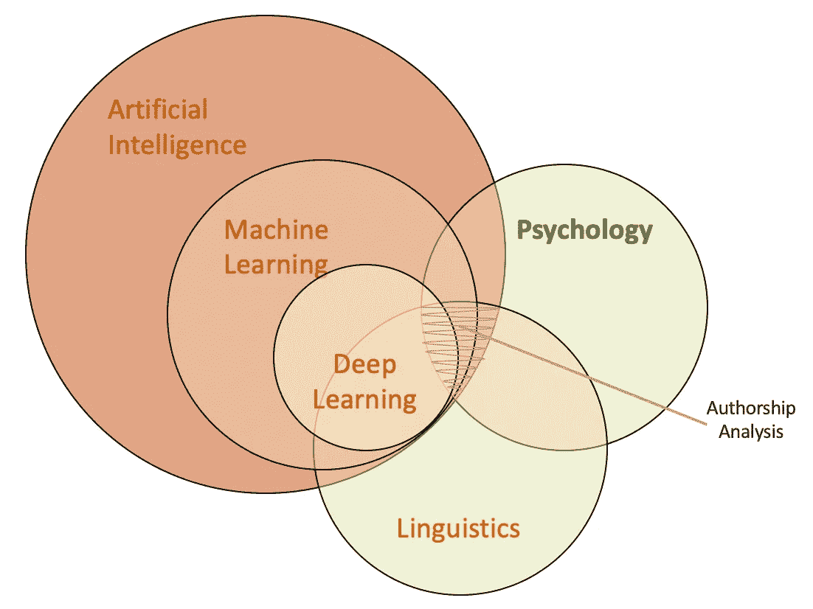

# 作为文本分类或聚类问题的作者分析

> 原文：<https://towardsdatascience.com/authorship-analysis-as-a-text-classification-or-clustering-problem-312549d4a4c0?source=collection_archive---------15----------------------->

你知道吗？J.K .罗琳被指控盗用了“麻瓜”一词，《达芬奇密码》的作者丹·布朗被指控侵犯了非文字版权，有人推测 1983 年的《希特勒日记》是阿道夫·希特勒本人写的，但有证据表明并非如此。

*许多这样的“文学”难题都经过了语言专家的检验，因为对话语进行分析和分类是相当复杂的，具有特定领域和高度多维性。*

*自然语言处理的最新研究领域之一是作者身份分析，它试图利用大数据和人工智能的计算能力，结合语言学和认知心理学，对文本的自动分类进行编码，识别作者简介并解决作者身份冲突。本文试图介绍作者分析的概念，它的应用领域和与之相关的主要子任务。*

## 简介:

通过识别作者的个性特征并检查他们撰写的文章来区分作者写作风格的艺术和科学被称为*作者身份分析*。因此，它还旨在根据与个人相关的*【可用信息】*确定个人的传记特征，如年龄、性别、母语和认知心理特征。

Authorship Analysis is a combination of Artificial Intelligence, Linguistics and Cognitive Psychology

在本文中，*“可用信息”*仅指作者身份分析上下文中的文本数据，然而，此上下文中的信息可能超出文本格式，因为它可能还涉及多模态观察的使用。多模态观察捕捉个人的特征，例如声音、语调、手势、身体姿势和其他身体行为方面。所有这些特征的组合反映了一个人的个性，因此有助于描述这个人。此外，在基于内容的分析中，位置、教育水平、社会地位和作者职业等社会经济变量的信息也至关重要。

## 作者身份分析任务的类型:

作者身份分析涉及的三个主要任务是*作者归属、作者验证和作者简介。*他们各自的目标解决了作者分析中的各种挑战。这些任务及其目的总结如下:

*i)作者归属:*作者归属是在调查来自多个具有明确作者身份的作者的集合文本之后，确定未预见的文本是否由特定个人所写。这在理想情况下是一个闭集多类文本分类问题。[2]

Author Attribution

*ii)作者验证:*该任务通过研究同一作者的语料库来确定个人是否已经创作了一段文本。这是一个二元单标签文本分类问题陈述。尽管这个任务看起来很简单，但作者验证实际上是一个复杂得多的过程。

Author Verification

*iii)作者简介:*作者简介也可以被认为是通过研究所创作的文本而对作者进行的个性识别。这包括通过检查作者的写作风格来预测他们的人口统计学特征，如性别、年龄、母语和个性特征。作者特征分析可以看作是一个多类多标签的文本分类和聚类问题。这是一个潜在的聚类问题，因为我们的目标是识别同质的写作风格，并将它们聚类在一起，以便在给定的语料库中进行相似性分析。

Author Profiling

这些任务中的每一个都是可扩展的，这取决于它们在现实世界中用于哪种问题陈述。有时，这些任务的目标相互重叠。

这些任务不限于英语作为自动作者身份分析的语言。正在研究和开发其他语言的计算机化应用程序，如希腊语、法语、荷兰语、西班牙语、阿拉伯语、葡萄牙语和意大利语。[2, 3, 5]

## 应用领域:

为什么作者分析很重要？它在法医分析和犯罪调查中起着至关重要的作用。此外，社交媒体和开放的网络资源引发了广泛的网络犯罪——虚假个人资料创建、机器人虚假评论、剽窃、黑暗网站促进网络化和有组织的恐怖活动、识别恐怖主义宣言、通过社交媒体消息进行骚扰和恐吓等等。[1]

了解消费者概况和反馈分析对市场分析至关重要，并打算调查匿名反馈作者的人口统计数据。作者分析任务有助于建立消费者档案，识别虚假评论和客户细分。

其他应用领域包括解决小说著作权纠纷、剽窃检测、文件年代测定、审查社会经济因素和心理健康检查。

# 参考资料:

[1] Reddy、T. Raghunadha、B. Vishnu Vardhan 和 P. Vijaypal Reddy。"作者简介技术综述."*国际应用工程研究杂志*11.5(2016):3092–3102。

[2] Stamatatos，Efstathios 等，“PAN 2014 年作者识别任务综述” *CLEF 2014 年评估实验室和研讨会工作笔记论文，英国谢菲尔德，2014 年*。2014.

[3] Stamatatos，Efstathios 等人，“pan/clef 2015 评估实验室概述”*欧洲语言跨语言评估论坛国际会议*。施普林格，查姆，2015。

[4] Rangel，Francisco 等，“PAN 2013 年作者特征分析任务概述” *CLEF 多语言多模式信息获取评估会议*。CELCT，2013 年。

[5] Rangel，Francisco 等，“pan 2017 第五次作者特征分析任务概述:twitter 中的性别和语言变体识别。”*谱号工作笔记论文* (2017)。