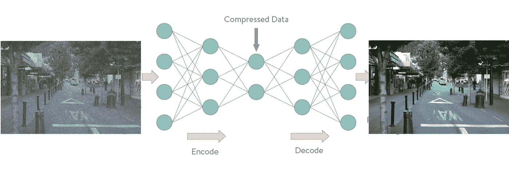
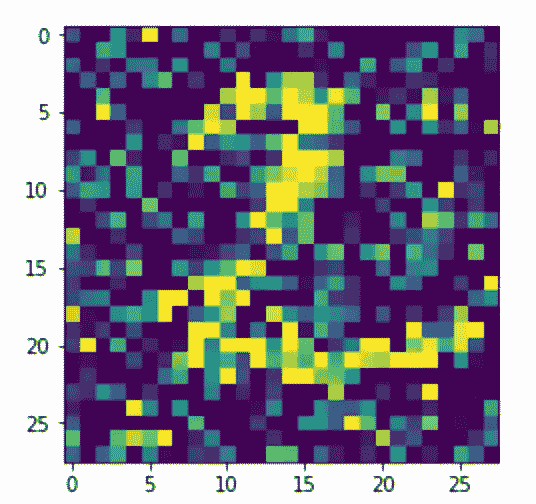
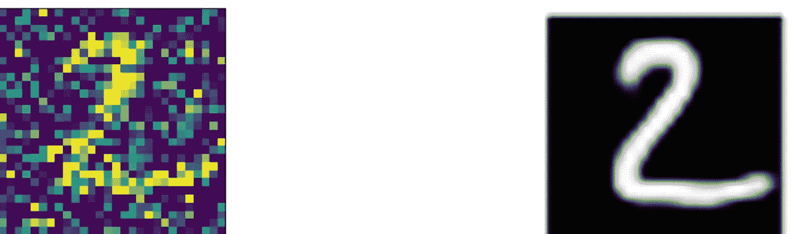

# 自动编码器:它是什么？它是用来做什么的？(第一部分)

> 原文：<https://towardsdatascience.com/auto-encoder-what-is-it-and-what-is-it-used-for-part-1-3e5c6f017726?source=collection_archive---------0----------------------->


Photo by [Tomas Sobek](https://unsplash.com/@tomas_nz?utm_source=medium&utm_medium=referral) on [Unsplash](https://unsplash.com?utm_source=medium&utm_medium=referral)

## 对自动编码器及其 Python 代码的一些常见用例的简单介绍

## 背景:

Autoencoder 是一个无监督的人工神经网络，它学习如何有效地压缩和编码数据，然后学习如何将数据从简化编码表示**重建回**尽可能接近原始输入的表示。****

根据设计，Autoencoder 通过学习如何忽略数据中的噪声来降低数据维数。

以下是从 [MNIST](http://yann.lecun.com/exdb/mnist/index.html) 数据集到自动编码器的输入/输出图像示例。


Autoencoder for MNIST

## 自动编码器组件:

自动编码器由 4 个主要部分组成:

1- **编码器**:其中模型学习如何减少输入维度，并将输入数据压缩成编码的表示。

2- **瓶颈**:包含输入数据的压缩表示的层。这是输入数据的最低可能维度。

3- **解码器**:其中模型学习如何从编码表示中重建数据，以尽可能接近原始输入。

4- **重建** **损失**:这是一种衡量解码器性能以及输出与原始输入接近程度的方法。

然后，训练包括使用反向传播，以最小化网络的重建损失。

你一定想知道为什么我要训练一个神经网络来输出一个和输入完全一样的图像或数据！本文将涵盖 Autoencoder 最常见的用例。让我们开始吧:

## 自动编码器架构:

根据使用情况，自动编码器的网络架构可以在简单前馈网络、LSTM 网络或卷积神经网络之间变化。我们将在接下来的几行中探索其中的一些架构。

# 1-用于异常检测的自动编码器:

有许多方法和技术可以检测异常和异常值。我在下面的另一篇文章中谈到了这个话题:

[](/5-ways-to-detect-outliers-that-every-data-scientist-should-know-python-code-70a54335a623) [## 每个数据科学家都应该知道的 5 种检测异常值的方法(Python 代码)

### 检测异常对任何企业都至关重要，无论是通过识别故障还是采取主动。这篇文章讨论了…

towardsdatascience.com](/5-ways-to-detect-outliers-that-every-data-scientist-should-know-python-code-70a54335a623) 

但是，如果您有相关的输入数据，则自动编码器方法将非常适用，因为编码操作依赖于相关的要素来压缩数据。

假设我们已经在 MNIST 数据集上训练了一个自动编码器。使用简单的前馈神经网络，我们可以通过构建如下简单的 6 层网络来实现这一点:

上面代码的输出是:

```
Train on 60000 samples, validate on 10000 samples
Epoch 1/10
60000/60000 [==============================] - 6s 103us/step - loss: 0.0757 - val_loss: 0.0505
Epoch 2/10
60000/60000 [==============================] - 6s 96us/step - loss: 0.0420 - val_loss: 0.0355
Epoch 3/10
60000/60000 [==============================] - 6s 95us/step - loss: 0.0331 - val_loss: 0.0301
Epoch 4/10
60000/60000 [==============================] - 6s 96us/step - loss: 0.0287 - val_loss: 0.0266
Epoch 5/10
60000/60000 [==============================] - 6s 95us/step - loss: 0.0259 - val_loss: 0.0244
Epoch 6/10
60000/60000 [==============================] - 6s 96us/step - loss: 0.0240 - val_loss: 0.0228
Epoch 7/10
60000/60000 [==============================] - 6s 95us/step - loss: 0.0226 - val_loss: 0.0216
Epoch 8/10
60000/60000 [==============================] - 6s 97us/step - loss: 0.0215 - val_loss: 0.0207
Epoch 9/10
60000/60000 [==============================] - 6s 96us/step - loss: 0.0207 - val_loss: 0.0199
Epoch 10/10
60000/60000 [==============================] - 6s 96us/step - loss: 0.0200 - val_loss: 0.0193
```

正如您在输出中看到的，验证集的最后重建损失/误差是 0.0193，这非常好。现在，如果我传递 MNIST 数据集中的任何正常图像，重建损失将非常低(< 0.02)，但如果我尝试传递任何其他不同的图像(异常值或异常值)，我们将获得较高的重建损失值，因为网络无法重建被视为异常的图像/输入。

请注意，在上面的代码中，您可以仅使用编码器部分来压缩一些数据或图像，也可以仅使用解码器部分通过加载解码器层来解压缩数据。

现在，让我们做一些异常检测。下面的代码使用两个不同的图像来预测异常分数(重建误差),使用我们上面训练的自动编码器网络。第一幅图像来自 MNIST，结果是 5.43209。这意味着图像不是异常。我使用的第二个图像是一个完全随机的图像，不属于训练数据集，结果是:6789.4907。这个高误差意味着图像是异常的。同样的概念适用于任何类型的数据集。

# 2-图像去噪:



Image denoising

去噪或降噪是从信号中去除噪声的过程。这可以是图像、音频或文档。您可以训练自动编码器网络来学习如何消除图片中的噪声。为了测试这个用例，让我们重新使用著名的 MNIST 数据集，并在数据集中创建一些合成噪声。下面的代码将简单地给数据集添加一些噪声，然后绘制一些图片以确保我们已经成功地创建了它们。

上面代码的输出是下图，非常嘈杂和模糊:



在本例中，让我们构建一个卷积自动编码器神经网络。我将介绍构建网络的每一个步骤:

首先，我们定义输入层和输入数据的维度。MNIST 数据集包含尺寸调整为 28 X 28 的影像。因为图像是灰度的，所以图像的颜色通道是 1，所以形状是(28，28，1)。

第二层是卷积层，该层创建卷积核，卷积核与层输入卷积以产生输出张量。32 是卷积中输出滤波器的数量,( 3，3)是内核大小。

在每个卷积层之后，我们使用最大池函数来降低维数。(28，28，32)减少了两倍，因此在第一次最大池化之后是(14，14，32)，然后在第二次最大池化之后是(7，7，32)。这是图像的编码表示。

```
input_img = Input(shape=(28, 28, 1))

nn = Conv2D(32, (3, 3), activation='relu', padding='same')(input_img)
nn = MaxPooling2D((2, 2), padding='same')(nn)
nn = Conv2D(32, (3, 3), activation='relu', padding='same')(nn)
encoded = MaxPooling2D((2, 2), padding='same')(nn)
```

下面的代码是原始数字的重建部分。这是网络实际学习如何从输入图像中去除噪声的地方。我们使用上采样功能将图像重建到原始尺寸(28，28)

```
nn = Conv2D(32, (3, 3), activation='relu', padding='same')(encoded)
nn = UpSampling2D((2, 2))(nn)
nn = Conv2D(32, (3, 3), activation='relu', padding='same')(nn)
nn = UpSampling2D((2, 2))(nn)
decoded = Conv2D(1, (3, 3), activation='sigmoid', padding='same')(nn)
```

现在，剩下的最后一步是创建模型，编译它，然后开始训练。我们通过运行以下命令来实现这一点:

```
autoencoder = Model(input_img, decoded)
autoencoder.compile(optimizer='adadelta',loss='binary_crossentropy')
autoencoder.fit(x_train_noisy, x_train,
                epochs=50,
                batch_size=256,
                validation_data=(x_test_noisy, x_test))
```

训练完成后，我尝试通过网络传递一幅有噪声的图像，结果令人印象深刻，噪声被完全消除了:



如果您缩放上面的 ConvNet，您可以使用它来消除任何类型的图像、音频或扫描文档的噪声。

在文章的这一部分，我介绍了自动编码器的两个重要用例，并构建了两个不同的神经网络架构——CNN 和前馈。在第 2 部分中，我将介绍自动编码器的另外两个重要用例。第一个是如何通过构建 LSTM 网络将 autoencoder 与一系列数据结合使用，第二个用例是一种称为变分 Autoencoder (VAE)的用例，主要用于生成模型和生成数据或图像。敬请期待！