# 使用 Python Dash、主题分析和 Reddit Praw API 自动生成常见问题

> 原文：<https://towardsdatascience.com/auto-generated-faq-with-python-dash-text-analysis-and-reddit-api-90fb66a86633?source=collection_archive---------25----------------------->

## 使用快速虚线可视化进行主题建模概述

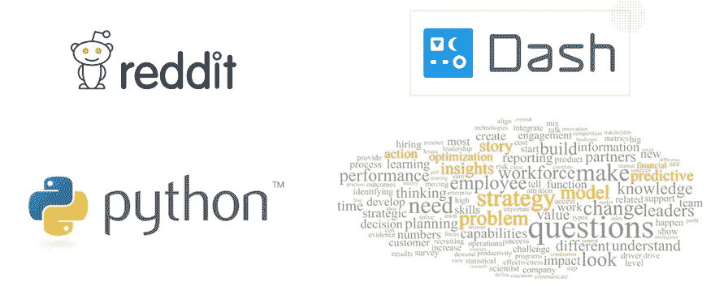

Dash Topic Modelling with Reddit API and Python

# 问题陈述

> “该死，在我离开 3 天后，我已经失去了我的 Slack 组中的重要内容”
> 
> “应该可以快速访问最相关的帖子，并让我快速更新”

同行评审或论坛的最大问题是网站上的大量可用信息。很多时候，我们对大量与他们搜索的内容无关的评论感到沮丧。以这个 Reddit 为例，在这里，我们的主页上有很多帖子。所有的信息都很难跟踪。

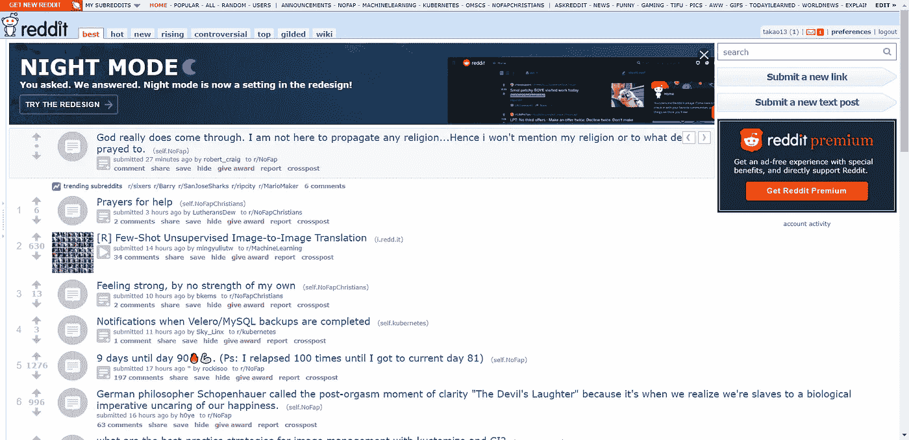

These Reddit Posts show how much clutters a forum could bring just by a few days of inactivity

在本文中，我们将了解更多关于如何使从 Reddit 这样的论坛中提取信息更容易、更直观。一种方法是构建一个仪表板页面，用于从论坛中提取关键主题，并将它们打包在一个可过滤的仪表板中以进行快速概述——我将这称为*自动生成的常见问题解答*,因为它会遍历文本语料库，提取主题以形成趋势和模式，从而创建一个常见问题解答(FAQ)/帖子。这将帮助我们在正确的时间与正确的信息保持联系。

**免责声明:本免责声明告知读者，文中表达的观点、想法和意见仅属于作者，不一定属于作者的雇主、组织、委员会或其他团体或个人**。**参考文献是从列表中挑选的，与其他作品的任何相似之处纯属巧合**

这篇文章是从作者的论文中摘录的，是佐治亚理工学院计算机科学硕士期末作业的一部分。

# 为什么自动生成常见问题？

虽然总是有搜索引擎让我们在这些论坛上找到我们需要的信息，但功能是有限的，特别是对于那些不活跃或落后于讨论流程的用户。最终，搜索引擎会对我们有用，因为我们已经知道他们应该寻找什么(例如最新的机器学习论文)。然而，它的功能可能对我们这些想要对一个趋势话题做出贡献或者想要发现与一个话题相关的新想法/信息的人没有用。

## 考虑以下知识矩阵

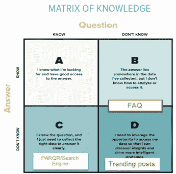

Matrix of Knowledge and the solutions in between

在学习过程中存在四个知识领域。第一种涉及已知的知识，即已知的和容易获得的知识，以帮助解决一个人熟悉的问题。接下来是已知的未知，或者是一个人目前不知道但可以获得的知识。一个例子是寻找关于 python 编程语法的信息，而我目前对此一无所知。第三种形式是未知的已知。这被定义为一个人知道存在但不知道如何访问/获得的知识。一个例子是完成一个不知道如何开始/研究的任务。最后一种情况是未知的未知，一个人不知道的知识。在这种情况下，一个人实际上对正在发生的事情一无所知，也不知道知道什么是重要的。当一个人工作太忙而忘记了论坛中的讨论流程时，可能会发生这种情况。

我们的解决方案将有助于 C 和 D 领域，在那里用户可能不知道在给定的时间什么是重要的主题。我们的目标是为用户提供一个知识仪表板，以便快速浏览论坛讨论。

# 用途和 Github 代码

本概念证明(POC)的目的是作为佐治亚理工学院计算机科学硕士作业提交的一部分创建的，作者目前正在管理该作业。本文中的部分内容经过修改，以更好地反映一般读者的需求。请参考我们的论文[这里](https://bit.ly/2Waxa1K)。

我们的目标是用 Python 和 Flask/Dash 将这个应用程序构建成一个网页应用程序。用于版本控制的其他工具如 Github 也将被实现。请参考我们的 Github 代码[这里](https://github.com/VincentTatan/EduTechAutoGenFaq)

# 工作流程

现在让我们把手弄脏吧。创建自动生成常见问题时，我们需要考虑 3 个步骤

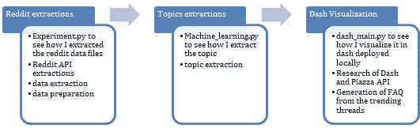

The workflow of creating Auto-Gen FAQ

## 使用 Praw Python 库提取 Reddit

> 我们如何提取 Reddit 语料库？

身份验证从使用 Reddit 的 praw 库开始。我不会详细谈论如何准备好您的身份验证，因为有许多可用的资源。请随意访问[这里](http://www.storybench.org/how-to-scrape-reddit-with-python/)

Reddit praw code to input authorization profiles

然后，我们将获得子编辑信息，该信息将被导出到。

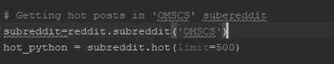

Reddit Code to gain a certain subreddit channel

然后我们可以打开这个 hot_python，它显示了带有以下元数据的 JSON 数据

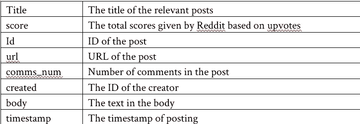

Metadata retrieved after extracting posts from Reddit Praw

## 主题抽取

> 本节说明了如何用 Python 进行近似主题建模

我们将使用一种称为非负指标因子分解(NMF)的技术，这种技术用于从单词包(单词列表)中寻找提取主题。NMF 引入了一种确定性算法，使用文本语料库创建单一表示。由于这个原因，NMF 被表征为最大似然算法。

有关 NMF 和其他主题建模技术的更多信息，请参考本研究论文[此处](https://www.aclweb.org/anthology/D12-1087)

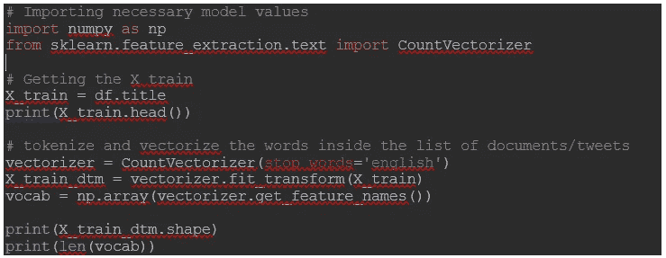

Using sklearn Count Vectorizer to vectorize words

这将在 topics.csv 中的 1115 个帖子上返回 500 个单词。

我们将使用 NMF 获得一个文档-主题矩阵(这里的主题也称为“组件”)和每个主题的热门词汇列表。我们将通过使用相同的变量名:doctopic 和 topic_words 来进行类比

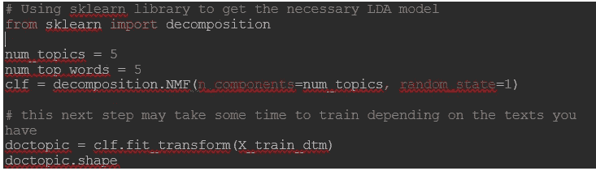

doctopic and topic words created

然后，我们将生成如下主题和可视化

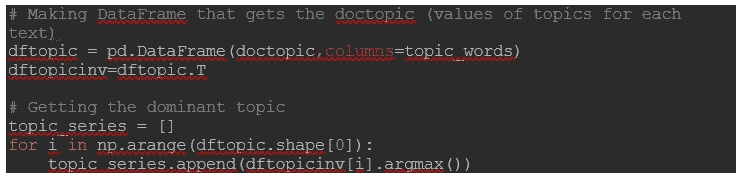

DocTopic Created

这将创建 5 个主题的可视化，每个主题将根据 NMF 管理的欧几里德距离将 5 个密切相关的单词分组在一起。在给定主题长度的情况下追加 argmax 的计算还帮助我们为语料库中的每个文档定义潜在的主导主题。

## 以下是找到的 5 个主题

主题 1: omscs 项目学生工作课程

主题 2:计算机科学本科学位非评论

主题 3:乔治亚理工学院在线硕士项目

主题 4:课程班级学期学生新

话题 5:工作提供承诺的时间

# 主题分析的分析和可视化

然后，我们尝试将主题映射到每个相关的帖子，我们将计算与某些主题相关的帖子的数量，并以饼状图和折线图的形式显示它们。第一个饼图是基于每个帖子的主要话题的投票。

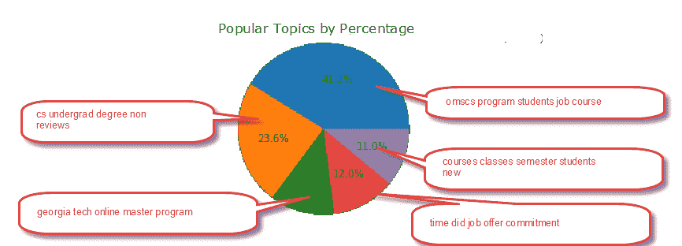

## **分析**

从这里我们可以看到，热门话题谈论硕士和非硕士学生的工作机会。其次是对 omscs 学生的时间承诺。然后是项目和本科课程。

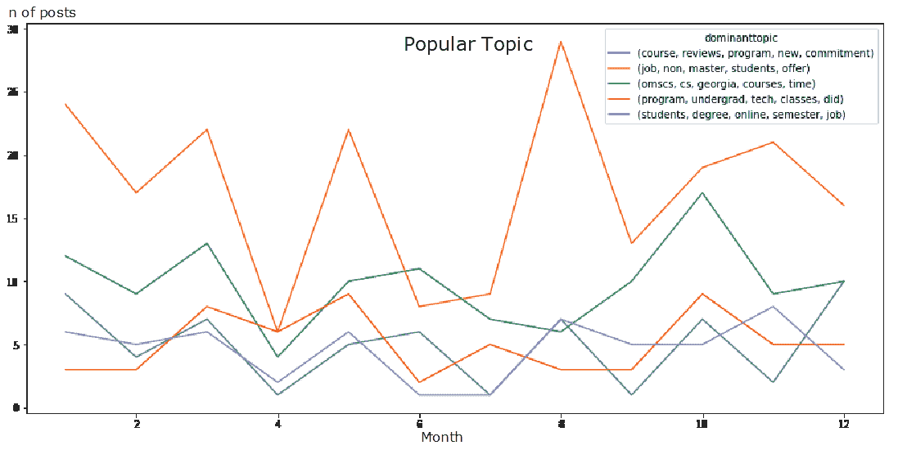

## **分析**

1.在五月和八月，我们可以看到关于硕士研究生的工作和工作机会的话题越来越多

2.10 月，OMSCS 学生对时间和工作量的兴趣呈上升趋势(可能是由于新的 sems 的开始)

3.对于整体活动，我们可以看到 4 月份有所下降，但 10 月份有所上升

# Dash 可视化

我们将使用 Dash Python，它是构建在 Plotly 和 Flask 之上的 Python 数据可视化框架。这将是我们在本地可视化和部署的基础。请查看我们的演示和演示下面的一个更生动的应用程序视图。

通过我们的应用程序，用户将能够选择最近最重要的主题，对它们进行过滤，并显示时间表。此外，下表将展示给定其所选主题的最相关的帖子。因此，用户不必点击所有可用的帖子，只需快速浏览一下这个仪表板，就可以了解关于某些主题的讨论。

只需点击几下鼠标，即可过滤所选主题并显示相关帖子。

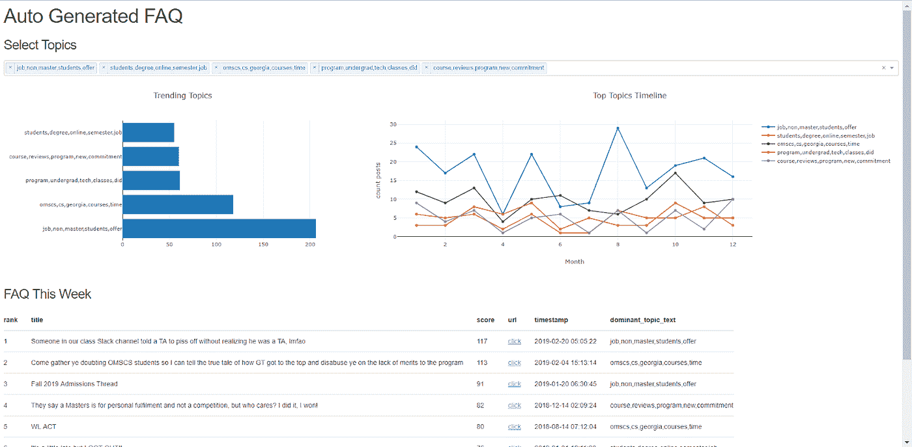

Dash Python Visualization

# 调查:我们的应用程序有用吗？

在构建了以下原型之后，我们构建了一个调查来表明确认应用程序的有用性。从这个结果中，我们发现 93%的受访者认为该应用程序非常有用。用户还发现该应用程序非常直观，可以节省手动搜索未分类帖子的时间。这标志着我们的应用程序成功地为论坛访问者增加了价值。

## **应用程序的有用性**

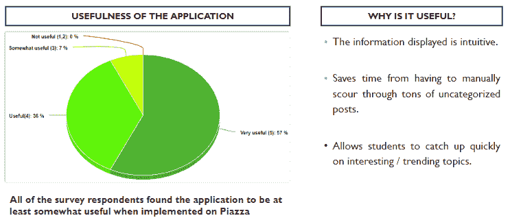

## **建议的改进**

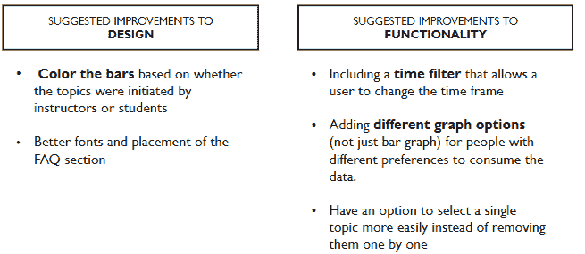

# 演示

Demo for Auto Generated FAQ for Online Master of Computer Science Educational Tech

# 结论和未来工作

这个项目让我们有机会解决一个实际的相关问题，这个问题我们很多人似乎都在 Reddit 等论坛上遇到过。我们可以添加许多功能和用户体验来改进该应用程序，但目前，该应用程序已经成功处理了上述核心问题，即从杂乱帖子的论坛中提取相关主题和趋势。

## 感谢

我们要感谢我们的同学和我的导师郄佳朝·范·奥肯，感谢他们对我们最终完成这篇论文的工作成果的支持和有益的评论。最后是 Ranon Sim，他负责该工具的总体项目管理

## 最后…

咻…就是这样，关于我的想法，我把它写成了文字。我真的希望这对你们来说是一个伟大的阅读。我希望我的想法能成为你发展和创新的灵感来源。

请通过我的 [LinkedIn](http://www.linkedin.com/in/vincenttatan/) 联系我，并订阅我的 [Youtube 频道](https://www.youtube.com/user/vincelance1/videos)

请在下面留言，寻求建议和反馈。

快乐编码:)