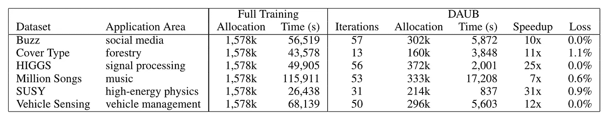

# 奥塔伊:秘制调味酱

> 原文：<https://towardsdatascience.com/autoai-the-secret-sauce-f42e80b90070?source=collection_archive---------25----------------------->

## 加速你的人工智能之路

## 让数据科学家的生活更轻松

Photo by [Sam X](https://unsplash.com/@samx?utm_source=medium&utm_medium=referral) on [Unsplash](https://unsplash.com?utm_source=medium&utm_medium=referral)

在最近一次预测消费者信贷风险的竞赛中，AutoAI 击败了 90%的参赛数据科学家。

AutoAI 是一种新工具，它利用复杂的训练功能来自动化许多复杂而耗时的功能工程和构建机器学习模型的任务，而无需成为数据科学专家。

下一个视频显示了“自动”工具的预览。今天的 UI 与视频中的有点不同，视频中的 UI 将很快推出。今天你可以试试这里的。

Re-create Example Following [This Tutorial](https://github.com/IBMDataScience/autoai)

# 人工智能的智能自动化

AutoAI 自动准备数据，应用算法，并构建最适合您的数据和用例的模型管道。它结合了 IBM 的研究方法和 Watson Studio 的能力。

AutoAI 包括自动:

*   型号选择
*   特征工程和
*   超参数优化

## **型号选择**

为了有效地选择最佳模型，AutoAI 针对数据的小子集运行估计器。数据的样本逐渐增加，在这个迭代过程中消除了估计量。这种方法确保选择最佳估计器，同时节省计算时间和存储。高达 31 倍的加速。

Results from paper¹ of applying Model Selection method (DAUB) vs full training.

## 特征工程

提出正确的功能集是机器学习项目中最耗时的步骤之一。AutoAI 的自动特征工程结合了以下两种技术:

1.  模式学习从成千上万的数据集中提取最常见的转换。这一步离线进行。
2.  一种有效剪枝特征空间的强化学习方法。奖励函数是在新特征空间评估的质量度量和在原始特征空间评估的质量度量之间的差异。

## 超参数优化

自动超参数调整背后的方法针对高成本的函数评估进行了优化，例如使用大数据集训练函数。它改进了最佳性能的流水线，同时收敛到搜索最佳参数时所涉及的非线性问题的良好解决方案。

> 过去需要几天或几周的事情，**只需要几分钟**。

# 为什么 AutoAI 不同于其他 AutoML 库？

1.  **灵活**。结果管道可以部署为 web 服务或导出为 Python 脚本。
2.  **过度拟合**是在训练模型中观察到的最常见问题之一。过度拟合的模型无法在新的看不见的数据上表现良好。AutoAI 采用基于交叉验证的稳健方法来避免过度拟合。
3.  **易用性**。选择要预测的数据和列是用户需要的唯一操作。
4.  不断进步。几个团队正在同时改进 AutoAI 工具的性能。敬请关注新的贡献！

## 你愿意重现视频中的例子吗？

对于如何建立视频示例的一步一步的方向，请按照[这个链接](https://github.com/IBMDataScience/autoai)。

[1]萨穆洛维兹、特索罗和萨巴瓦尔。“通过增量数据分配选择接近最优的学习者”，人工智能 AAAI 会议，2016 年。[http://www . cs . Toronto . edu/~ horst/cog robo/papers/moment-aaai 2016 . pdf](http://www.cs.toronto.edu/~horst/cogrobo/papers/daub-AAAI2016.pdf)

[2] Khurana、Samulowitzb 和 Turaga。"使用强化学习的预测模型的特征工程."，2018 年人工智能 AAAI 大会。[https://www . aaai . org/OCS/index . PHP/AAAI/aaai 18/paper/view/16564/16719](https://www.aaai.org/ocs/index.php/AAAI/AAAI18/paper/view/16564/16719)

[3]科斯塔和南尼奇尼。" RBFOpt:一个用于黑盒优化的开源库，具有昂贵的函数求值."，*数学规划计算*，2018。[https://link.springer.com/article/10.1007/s12532-018-0144-7](https://link.springer.com/article/10.1007/s12532-018-0144-7)

特别感谢 Jean-Fran ois Puget 和 Horst Samulowitz 的宝贵反馈。特别感谢阿历克斯·斯温和迈克尔·塞斯塔克👏对视频的贡献。

***Twitter:***[@ castan](https://twitter.com/castanan) ***LinkedIn:***@[jorgecasta](https://www.linkedin.com/in/jorgecasta/)