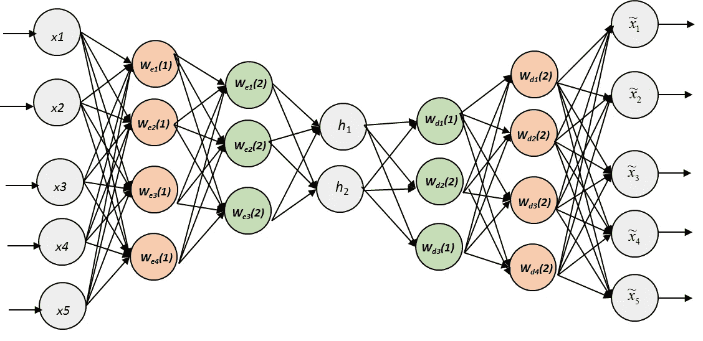
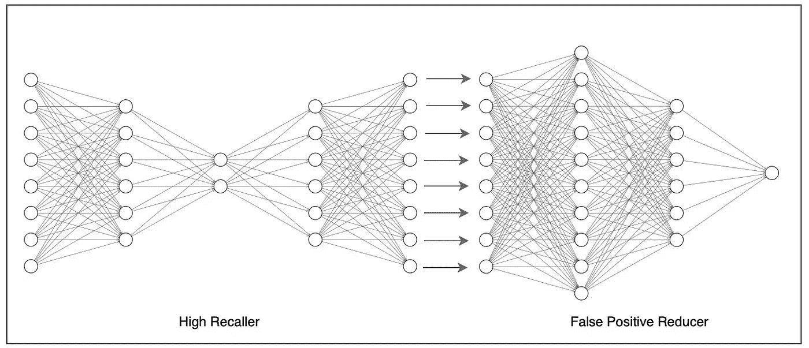

# 用于无标记数据集异常检测的自动编码神经网络

> 原文：<https://towardsdatascience.com/autoencoder-neural-network-for-anomaly-detection-with-unlabeled-dataset-af9051a048?source=collection_archive---------4----------------------->

# 问题—解决方案

在大多数你想用人工智能解决的实际问题中，你可能没有一个带标签的数据集。特别是在预测异常值时，可能你有数百万的历史数据，其中也包括异常值。如果您试图从这样一个未标记的数据集中检测那些异常值/异常，并且担心没有标记的数据集，那么这里有一个有趣的解决方案。

这些天来，每当你遇到不平衡的数据集时，训练一个模型并使其合适应该是一个很大的麻烦。但现在这正是我们所需要的。你所需要的只是一个包含近 1%异常的不平衡数据集。

# 自动编码器神经网络

The architecture of autoencoder neural network (Source — [deep-autoencoders](/deep-autoencoders-for-collaborative-filtering-6cf8d25bbf1d))

与典型的神经网络相反，在典型的神经网络中，您给出许多输入并得到一个或多个输出，自动编码器神经网络在输出层中具有与输入层相同数量的神经元。这基本上意味着数字输入和输出是相同的。不仅是计数，就连它试图预测的输出也与输入相同。是的，autoencoder 神经网络的工作是将数据编码成一个小代码(压缩)并解码回来以再现输入(解压缩)。在上图中，你也可以看到输出向量是输入向量的近似值。这个特殊的属性使我们能够将它用于未标记的数据集。

自动编码器神经网络通常用于从计算机视觉到自然语言处理的降维。要了解更多关于自动编码器神经网络的信息，请阅读这个[维基百科页面](https://en.wikipedia.org/wiki/Autoencoder)。

## 对于一个未标记的数据集，这怎么可能呢？

由于我们试图用该模型再现输入，最适合的损失函数是均方误差(MSE)。在训练模型时，它试图做的是最小化 MSE。为了最小化 MSE，它应该尝试尽可能地适应数据集(即，它应该尝试尽可能地再现许多数据)。在我们的案例中，由于数据集包含 99%的正常数据和仅 1%的异常数据，因此在训练时，模型会遗漏一小部分数据，并拟合其余 99%的数据，因此 MSE 非常非常小。这是背后的核心逻辑，这使得即使对于未标记的数据集，也可以使用它来预测异常。

## 如何预测异常现象？

在训练模型时，它会学习正常数据的特征外观，并将其压缩为一个小元素，然后将其解码为带有小误差的输入。当通过模型发送异常时，它将无法再现它，因为它被训练为仅再现正常数据，并且将以较大的 MSE 结束。我们需要做的是计算输出与输入相比的 MSE，并通过检查输出来正确区分异常，我们需要根据我们的需要设置 MSE 的阈值，以便它以良好的精度和召回率进行预测。

# 这还不是全部

大多数时候，通过不断调整超参数并检查输出以得出最佳阈值，很难获得完全令人满意的结果。但是我们有更多的选择。

Two neural networks stacked together to improve both recall and precision

## 高级召回者

即使我们用成千上万的数据训练它，我们得到的异常也只有几百个。因此，现在人类可以手动检查异常输出，并将其中一些标记为误报。因此，我们可以让我们的自动编码器神经网络模型作为一个**高召回器**。这意味着保持低阈值，以便几乎所有的实际异常都被检测到(高召回率)以及其他假阳性异常(低精度)。

现在，我们有一个小数据集，可以手动标记为假，其余的保持为真。对于这个人工标注的数据集，我们来介绍一个新的人工神经网络模型。

## 假阳性减少器

有了现在的数据集，我们可以选择神经网络或基于复杂性，甚至随机森林或任何其他典型的 ML 模型，我们可以简单地训练它。这使得我们能够通过消除最终输出中的假阳性来准确预测我们想要预测的实际异常。

## 实时预测

我们现在需要做的就是堆叠这些模型，以便在实时预测中，那些被高调用模型(自动编码器神经网络)预测为异常的模型通过假阳性减少模型(人工神经网络)发送。这种神经网络的结合为我们提供了一个具有高召回率和高精确度的**深度神经网络模型**。