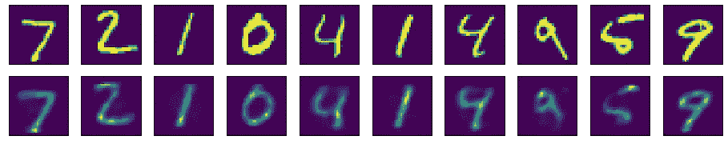
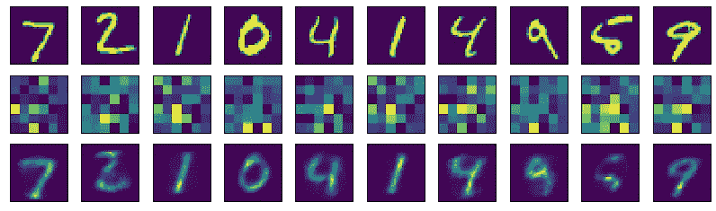

# 自动编码器神经网络:什么和如何？

> 原文：<https://towardsdatascience.com/autoencoder-neural-networks-what-and-how-354cba12bf86?source=collection_archive---------5----------------------->

## 关于如何在 Keras 中为初学者建立一个自动编码器网络的清晰、基本的说明

**前言**

我将通过使用 [Keras](https://keras.io/) 和 Python 创建一个自动编码器。首先，我将说明什么是自动编码器，以及我们如何实现它。然后，我将通过步骤实际创建一个。可能会用 [MNIST](http://yann.lecun.com/exdb/mnist/) ，因为它很普通也很简单。

**简介:什么是自动编码器？**

自动编码器接受任何输入，将其分割成某种压缩版本，并使用它来重建输入内容。所以基本上，输入 *x* 进入隐藏层 *h，* ***h = f(x)，*** 出来就是重构****r = g(h)****。*当 *r* 接近 *x、*或输出看起来像输入时，自动编码器是好的。*

*那么，拥有一个精确输出输入内容的神经网络是一件好事吗？在许多情况下，并不是真的，但他们经常被用于其他目的。一个共同的目标是，隐藏层 *h* 应该有一些限制，以便它提取关于 *x* 的重要细节，而实际上不需要保留 *x* 提供的所有信息，从而充当一种有损压缩，并且它应该根据示例自动完成此操作*，而不是由人类设计来识别显著特征( [Chollet](https://blog.keras.io/building-autoencoders-in-keras.html) ，2016)。**

*为什么是 tho？*

*通常，当人们编写自动编码器时，希望中间层 *h* 以某种压缩格式呈现有用的属性。在这里，我们将建立一个叫做*的不完全自动编码器*，这基本上意味着我们缩小隐藏层，这样它就无法存储输入给我们的相同数量的信息，我们试图从中获得一个良好的重建。构建这样的模型会迫使 autoencoder 找到您提供给它的数据的最显著的特征。在现实生活中，它可以用于降低数据集的维数，这有助于数据可视化，或潜在的去噪数据。*

***零件清单***

*这是我们需要创建的东西的基本列表。*

1.  *输入数据——什么被编码和解码？*
2.  *编码功能——需要有一个接收输入并对其进行编码的层。*
3.  *解码功能——需要有一个层来接收编码输入并对其进行解码。*
4.  *损失函数—当解码版本的输出非常接近原始输入数据(损失很小)时，自动编码器为*好*，当解码版本看起来与原始输入一点也不像时，自动编码器为*差*。*

***进场***

*最简单的自动编码器大概是这样的:x → h → r，其中函数 *f(x)* 产生 *h* ，函数 *g(h)* 产生 *r* 。我们将使用神经网络，所以我们不需要计算实际的函数。*

*从逻辑上来说，**步骤 1** 将是获取一些数据。我们将从 Keras 数据集库中获取 MNIST。它由 60，000 个训练样本和 10，000 个手写数字 0-9 的测试样本组成。接下来，我们将做一些基本的数据准备，以便我们可以将其作为输入集输入到我们的神经网络中， *x.**

*然后在**步骤 2 中，**我们将建立基本的神经网络模型，从 *x.* 中给我们隐藏层 *h**

1.  *我们将把一个单一的*密集的*隐藏层与一个 *ReLU* 激活层放在一起，它将 *x* 作为输入。*
2.  *接下来，我们将把这一层的输出传递到另一个*密集*层，并通过一个 sigmoid 激活层运行输出。*

*一旦我们有了模型，我们将能够在**步骤 3** 中训练它，然后在**步骤 4** 中，我们将可视化输出。*

*我们把它放在一起:*

*首先，我们不要忘记必要的导入来帮助我们创建我们的神经网络(keras)，做标准矩阵数学(numpy)，绘制我们的数据(matplotlib)。我们称之为**步骤 0** 。*

```
*# Importing modules to create our layers and model.
from keras.layers import Input, Dense
from keras.models import Model# Importing standard utils
import numpy as np
import matplotlib.pyplot as plt*
```

***第一步**。导入我们的数据，做一些基础的数据准备。因为我们不打算在这里使用标签，我们只关心 *x* 值。*

```
*from keras.datasets import mnist(train_xs, _), (test_xs, _) = mnist.load_data()*
```

*接下来，我们将在 0 和 1 之间对它们进行归一化。因为它们是灰度图像，值在 0 到 255 之间，我们将输入表示为 float32 并除以 255。这意味着如果值是 255，它将被规范化为 255.0/255.0 或 1.0，以此类推。*

```
*# Note the '.' after the 255, this is correct for the type we're dealing with. It means do not interpret 255 as an integer. 
train_xs = train_xs.astype('float32') / 255.
test_xs = test_xs.astype('float32') / 255.*
```

*现在想一想，我们有 28 x 28 的图像，值在 0 和 1 之间，我们想把它们作为输入向量传递到神经网络层。我们做什么呢我们可以使用卷积神经网络，但在这个简单的例子中，我们只使用密集层。那我们怎么把它放进去？我们将把每个图像展平成一个 784 x 1 值的一维向量(28 x 28 = 784)。*

```
*train_xs = train_xs.reshape((len(train_xs), np.prod(train_xs.shape[1:])))test_xs = test_xs.reshape((len(test_xs), np.prod(test_xs.shape[1:])))*
```

***第二步。**我们来拼凑一个基本网络。我们将简单地创建一个编码层和一个解码层。我们将把它们放在一起，形成一个名为 autoencoder 的模型。我们还将减小编码的大小，这样我们就可以得到一些数据压缩。为了简单起见，这里我们用 36。*

```
*# Defining the level of compression of the hidden layer. Basically, as the input is passed through the encoding layer, it will come out smaller if you want it to find salient features. If I choose 784 for my encoding dimension, there would be a compression factor of 1, or nothing.
encoding_dim = 36
input_img = Input(shape=(784, ))# This is the size of the output. We want to generate 28 x 28 pictures in the end, so this is the size we're looking for. 
output_dim = 784encoded = Dense(encoding_dim, activation='relu')(input_img)
decoded = Dense(output_dim, activation='sigmoid')(encoded)*
```

*现在创建一个模型，接受 input_img 作为解码器层的输入和输出。然后编译模型，在这种情况下用 adadelta 作为优化器，用 binary_crossentropy 作为损失。*

```
*autoencoder = Model(input_img, decoded)autoencoder.compile(optimizer='adadelta', loss='binary_crossentropy')*
```

***第三步。**我们的模特已经准备好训练了。你不需要图形处理器就能运行这个，不会花很长时间。我们将在我们创建的 autoencoder 模型上调用 fit，为 15 个时期的输入和输出传递 x 值，使用相对较大的批处理大小(256)。这将有助于它训练得更快。我们将启用 shuffle 来防止每个批次中出现同质数据，然后我们将使用测试值作为验证数据。*注意:如果你想在不过度拟合的情况下训练更长时间，稀疏和正则化可能会被添加到你的模型中。**

```
*autoencoder.fit(train_xs, train_xs, epochs=15, batch_size=256, shuffle=True, validation_data=(test_xs, test_xs)*
```

*就是这样。自动编码器完成。你会看到它应该有大约 0.69 的损失，这意味着我们创建的重建通常相当好地代表了来自高度压缩版本的输入。但是我们不能自己去看一下吗？*

***第四步。**为此，我们将进行一些推理，从输入数据中获取我们的重构，然后我们将使用 matplotlib 显示它们。为此，我们想使用预测方法。*

*思维过程是这样的:获取我们的测试输入，通过 autoencoder.predict 运行它们，然后显示原始数据和重建数据。*

```
*# Run your predictions and store them in a decoded_images list. 
decoded_images = autoencoder.predict(test_xs)*
```

**

*The top row is the inputs, and the bottom row is the reconstruction from our autoencoder model.*

*下面是你如何得到上面的图像:*

```
*# We'll plot 10 images. 
n = 10
plt.figure(figsize=(16, 3))
for i in range(n):
    # Show the originals
    ax = plt.subplot(2, n, i + 1)
    plt.imshow(test_xs[i].reshape(28, 28))
    ax.get_xaxis().set_visible(False)
    ax.get_yaxis().set_visible(False)# Show the reconstruction
    ax = plt.subplot(2, n, i + 1 + n)
    plt.imshow(decoded_imgs[i].reshape(28, 28))
    ax.get_xaxis().set_visible(False)
    ax.get_yaxis().set_visible(False)plt.show()*
```

*就是这样。这是最基本的自动编码器。非常感谢[Fran ois Chollet](https://medium.com/u/7462d2319de7?source=post_page-----354cba12bf86--------------------------------)，我从他的[文章](https://blog.keras.io/building-autoencoders-in-keras.html)中学到了这一点，并启发了本教程的基础知识，并感谢 Goodfellow 等人将深度学习作为无价的参考。*

*如果你喜欢这个教程或者有什么建议，请在下面留言。*

*编辑:我在这里添加了查看隐藏层的功能，这绝对很有趣。你可以看到，从这些 6 x 6 的图像中，神经网络能够重建原始输入。你开始明白为什么这可能有用了吗？*

**

*The top row is the input, the middle row is the hidden encoding, and from that the bottom row is reconstructed.*

*我们如何得到中间一排？这很简单，我们用第一个隐藏层创建一个模型。为什么？我们这样做是为了运行预测功能，并将其结果添加到 python 中的列表中。*

```
*# Create a Model from the layer. 
encoder = Model(input_img, encoded)# Save the results to encoded_imgs. This must be done after the autoencoder model has been trained in order to use the trained weights.
encoded_imgs = encoder.predict(test_xs)*
```

*然后，我们稍微修改一下 matplotlib 指令，以包含新的图像:*

```
*# We'll plot 10 images. 
n = 10
plt.figure(figsize=(14, 4))
for i in range(n):
    # Show the originals
    ax = plt.subplot(3, n, i + 1)
    plt.imshow(test_xs[i].reshape(28, 28))
    ax.get_xaxis().set_visible(False)
    ax.get_yaxis().set_visible(False) # Show the middle layer
    ax = plt.subplot(3, n, i + 1 + n)
    plt.imshow(encoded_imgs[i].reshape(6, 6))
    ax.get_xaxis().set_visible(False)
    ax.get_yaxis().set_visible(False) # Show the reconstruction
    ax = plt.subplot(3, n, i + 1 + n * 2)
    plt.imshow(decoded_imgs[i].reshape(28, 28))
    ax.get_xaxis().set_visible(False)
    ax.get_yaxis().set_visible(False)plt.show()*
```

*暂时就这样吧！我希望这篇教程能帮助你理解一些自动编码器背后的思维过程，以及如何在你的神经网络中使用它们。*