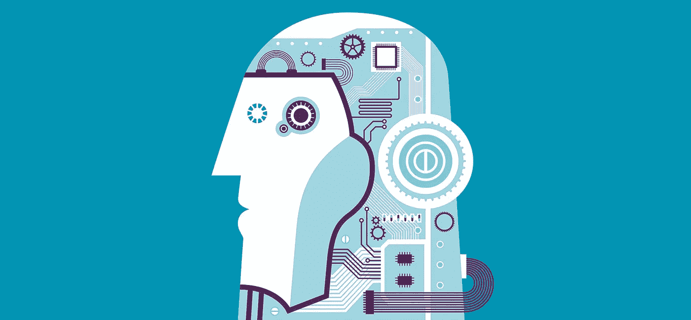
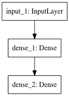
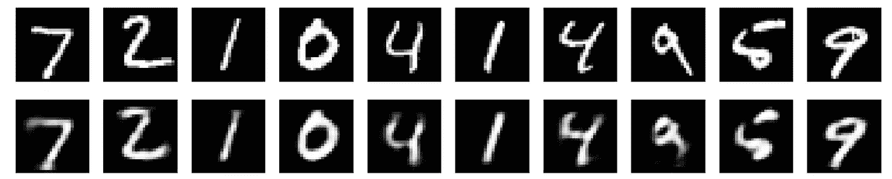
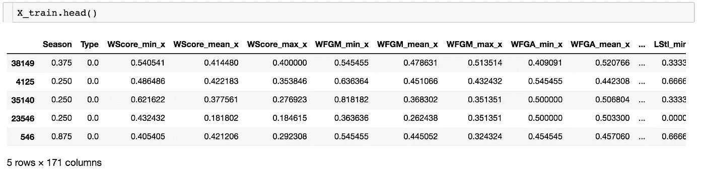

# 降维自动编码器

> 原文：<https://towardsdatascience.com/autoencoder-on-dimension-reduction-100f2c98608c?source=collection_archive---------6----------------------->

## 对表格数据应用自动编码器的一个例子

在特征工程过程中，特别是在一些比赛中，一种常见的情况是，一个人穷尽地尝试所有类型的特征组合，最终得到太多难以选择的特征。为了避免过度拟合，可以选择具有最高重要性的特征子集，或者应用一些降维技术。

我依稀记得有一次 Kaggle 比赛，一等奖的解决方案是在降维中使用 autoencoder。因此，在这篇文章中，让我们来谈谈 autoencoder 以及如何将它应用于一般的表格数据。结构如下:

1.  通过一个简单的例子来理解自动编码器的概念
2.  对竞赛数据应用自动编码器

# 自动编码器的一个好例子

这里有一个关于自动编码器[的很好的解释](https://blog.keras.io/building-autoencoders-in-keras.html)。让我们从最基本的例子开始，说明 autoencoder 如何工作，然后将其应用于竞争数据中的一般用例。

最基本的自动编码器遵循以下结构:

请注意，输入和输出具有相同的维数(事实上，输入被用作输出的“标签”)，而隐藏层具有较少的维数，因此它包含输入层的压缩信息，这就是为什么它充当原始输入的降维。从隐藏层，神经网络能够解码信息到它的原始维度。从`input_layer -> hidden_layer`开始叫编码，`hidden_layer -> output_layer`叫解码。

从某种意义上说，Autoencoder 是一种无监督学习，因为它不需要外部标签。编码和解码过程都发生在数据集内。

> 自动编码器是从数据示例中自动学习的，这是一个有用的特性:这意味着很容易训练算法的专门实例，这些实例将在特定类型的输入上表现良好。它不需要任何新的工程，只需要适当的训练数据。

让我们通过一个例子来理解 autoencoder 的机制。

我们将使用著名的 [MNIST](https://en.wikipedia.org/wiki/MNIST_database) 数据来看看图像是如何被压缩和恢复的。

## 建立网络

这个例子来自 Keras 博客。

我们的网络非常简单:大小为 784 的输入图像将通过密集层，并被编码为大小为 32 的图像，解码层将从该层恢复到大小为 784 的原始尺寸。结构简单如:

为了得到自动编码器的中间结果，我们还记录了`encoded`。

## 准备数据集和培训

数据被标准化为 0 和 1，并传递到我们的自动编码器。**注意，输入和输出都是** `**x_train**` **，我们的想法是希望我们的编码层足够丰富，以恢复尽可能多的信息。**

## 想象结果

将原始图像与从我们的编码层恢复的图像进行比较。

请注意，我们的 32 维隐藏层能够恢复 784 维的图像，并能够很好地捕捉信息。

现在让我们将这种降维技术应用于一个竞争数据集。

# 表格数据的自动编码器

在帖子[这里](https://medium.com/@zhangyue9306/kaggle-competition-ncaa-match-prediction-65b46b8f3892)中，我们应用了一些通用特征工程技术，在数据集上生成了 170 多个特征。让我们试着降低它的维度。

我们在训练和验证中拆分数据，训练数据如下所示，有 171 列:

现在我们使用同样的技术，把维数减少到 40，

`encoder`将在以后用于降维。

现在让我们对降维后的维度进行预测，

为了进行比较，我们仍然应用 lightgbm 进行预测，结果是 0.595，只有 40 个特征，而之前是 0.57，有 171 个特征。虽然降维模型并没有优于上一个，但我相信我们看到了 autoencoder 的优势。([代码](https://github.com/MJeremy2017/Machine-Learning-Models/tree/master/AutoEncoder))

# 结论

这里介绍的自动编码器是最基本的，在此基础上可以扩展到深度自动编码器和去噪自动编码器等。

autoencoder 在竞争中的另一个优势是，人们可以基于训练和测试数据来构建 autoencoder，这意味着编码层也将包含来自测试数据的信息！我在 Kaggle 竞赛中读到的一等奖解决方案的帖子使用了去噪 autoencoder，方法是在原始特征中添加一些噪声，以使他的网络更加健壮，同时，他还将测试数据用于他的模型中，我相信这也是他获胜的原因。

**参考**:

[1][https://blog.keras.io/building-autoencoders-in-keras.html](https://blog.keras.io/building-autoencoders-in-keras.html)