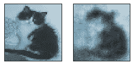
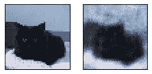

# 自动编码器:深度学习与 TensorFlow 的热切执行

> 原文：<https://towardsdatascience.com/autoencoders-deep-learning-with-tensorflows-eager-api-data-stuff-378318784ae?source=collection_archive---------16----------------------->


We are so deep. Source: [Pixabay](https://pixabay.com/photos/coral-cay-aquarium-sea-reef-water-1053834/).

深度学习在过去几年中彻底改变了机器学习场景。我们能把它应用到图像压缩中吗？深度学习算法重建小猫照片的能力有多强？什么是自动编码器？

今天我们将找到所有这些问题的答案。

# 图像压缩:所有关于模式

我之前讲过[无监督学习](http://www.datastuff.tech/machine-learning/k-means-clustering-unsupervised-learning-for-recommender-systems/):应用机器学习在**未标记数据**中发现**模式**。

在图像压缩的情况下，假设大多数图像是**而不是完全随机的**是很有意义的。

用更恰当的话来说，可以有把握地假设大多数图像并不完全由**噪声**(就像你打开一台旧电视时的静电噪声)构成，而是遵循*一些* **底层结构**。

如果我们知道所有的图像都有共同点，那就更好了。进行图像压缩的最基本的方法之一是找到重复的像素流，给它们分配一个(较亮的)标签，并用该标签替换它们。

理想情况下，如果两个图像几乎相同，压缩程序可以存储两个图像，占用的空间不会比其中任何一个图像多。这应该也适用于图像的一部分。最后，我猜像无监督学习这样的模式发现机器应该擅长这个。

出于这项工作的目的，我们将使用我从 [Kaggle](https://www.kaggle.com/c/dogs-vs-cats) 下载的小猫图片数据集。这将保证大多数图片有一些共同的结构。

这里是 GitHub 项目今天的代码和数据，如果你想跟进的话。然而，像往常一样，我将在这里添加最重要的片段。

但是在我们用代码弄脏我们的手之前，是时候学习一些深度学习了！

# 自动编码器:无监督式深度学习

尽管我们称自动编码器为“无监督学习”，但它们实际上是一种伪装的监督学习算法。我知道，我也很震惊！

然而，它们有一个非常特殊的属性，这使得它们从普通的分类器中脱颖而出:**它们的输入和输出是相同的**。

# 训练自动编码器

当我们训练一个自动编码器时，我们实际上是在训练一个人工神经网络

*   取一个输入向量 *X* 。
*   应用一些数学知识(我现在不会进入深度学习的细节，但[这是我用来学习这些科目的书](https://amzn.to/2LU5uNR))。
*   返回另一个向量。在这种特殊情况下，我们希望它还是 X，或者尽可能接近 X。

然而，有一个技巧:在前馈过程(从输入到输出)中，神经网络会降低输入的维度，并在返回最后一层之前再次增加它。

# 维度的诅咒

自动编码器接受一个向量 *X* 作为输入，可能有很多分量。例如，对于具有 48×48 分辨率的 3 通道—*RGB*—图像， *X* 将具有 6912 个分量。即使它们中的每一个都只是一个浮点数，那也是 27Kb 的数据(非常小！)形象。这增加得很快。对如此多的元素进行所有数学运算所花费的时间也非常相关。

因此，我们必须将这个向量映射到一个更小的空间。在这个特殊的例子中，我试着把它缩小到原来的一半。然而，我们打算保留大部分数据。

# 自动编码器的体系结构

我们称降低输入向量维度的网络层为*编码器*，因为它*将*数据编码成一个更小的向量。

然后，我们对这个更小的向量进行操作，在我们的例子中，它的维数又减少了 2 倍。如果我们正在设计一个实际的图像压缩器，这将是我们将存储的输入版本，节省 75%的空间。然而在训练期间，这只是*解码*之前的一个中间步骤。

最后，使用减少的向量，自动编码器将不得不尽可能好地重建原始图像。

为了做到这一点，它将首先使其通过一个*解码器*层，该层再次将减少的向量映射到一个具有输入向量一半尺寸的向量。最后一层，我们得到一个与原始图像尺寸相同的矢量，希望非常相似。

Autoencoder 的层架构如下所示:


Source: Medium

# 使用自动编码器的结果

训练自动编码器会有很多效果:

*   重建的图像不会与原始图像完全相似。
*   我们将能够保存更轻的简化向量，然后使用重建，只要它足够好(无论我们如何定义)，而不是原始图像。
*   我们现在将有一个神经网络，它已经学习了小猫图片中的一些潜在模式。

这最后一个是最有价值的结果。

自动编码器的一些行业应用包括:

*   有监督的深度学习模型的特征工程:我们不会直接向它们提供数据，而是通过自动编码器的隐藏层来提供数据。
*   异常检测:自动编码器在重建狗、风景或虫子的图片方面非常糟糕。这给了我们一种自动检查图片是否是一只小猫的方法。

现在你知道了我们为什么要做我们正在做的事情，让我们用一些实际的代码来实践一下吧！

# 使用 Tensorflow 训练自动编码器

在本教程中，我们将使用 Tensorflow 的热切执行 API。我不得不说，这比以前的*会话*要直观得多，以至于我不会介意性能是否有所下降(我没有察觉)。

我们的数据集包含超过 8000 张小猫的图片，大小和颜色各不相同，位置也各不相同。你可以在 [GitHub 项目](https://github.com/StrikingLoo/AutoEncatter)中看到它，以及加载它的代码。

由于 PyPlot 处理 numpy 浮点数组的方式，并且为了加速网络的收敛，图像被加载为范围从 0 到 1 的浮点数组，而不是从 0 到 255。

# 设计自动编码器

在 Tensorflow 吞下 Keras 变得渴望之前，用它写一个神经网络是相当繁琐的。现在，它的 API 已经变得直观了。

这是我用 Tensorflow 的 Keras API 设计的第一个自动编码器。

然而，这个模型有一些重大缺陷！首先，它收敛得太慢，即使学习率很高(我们会达到这一步)。其次，它返回了一个大小合适的向量…除了一些元素大于 1！这既不符合 PyPlot 的图形，也不符合我们的输入先验——每个像素有三个介于 0 和 1 之间的值。


我通过用 sigmoid 激活函数替换最后一层的 ReLu 来解决这个问题，所以它总是返回 0 到 1 之间的数字。

然而，仍然存在收敛速度的因素。我能做些什么来解决这个问题？幸运的是，我到处看过一些深度学习论文，有一个我用过几次的东西叫做**批量规范化**。它应该有自己的文章，所以我不会深入研究它。

## 批量标准化

简而言之，批处理规范化层为当前一批训练实例计算前一层的平均值和标准偏差。然后减去平均值并除以标准偏差，从而归一化图层的输出(对于批处理)。在训练后的前馈中，该层将使用从整个训练数据集估计的参数开始归一化。

这使得模型收敛得更快，因为它对输入或隐藏层的分布变化不太敏感。它还将对投入的自然分布变化更加稳健，在生产环境中更具长期可持续性。

这样，解码器只需要学习如何解码方差为 1 的中心变量，而不是任何随机的东西。同样的事情适用于编码器。仅这个变化就使得模型在前 5 或 6 个时期开始收敛。

# 训练自动编码器

这是我们期待已久的时刻！是时候训练我们的自动编码器了！

Tensorflow 的急切执行要求我们首先编译模型。这意味着我们要定义一个优化器(我用的是 Adam，它很快)，一个损失(在这种情况下是均方差，这是一种非常标准的测量重建误差的方法)，以及监控指标。最重要的是，这里是我们选择模型学习率的地方。

最后，我们开始训练模型。

这将开始培训(并使我的笔记本电脑听起来像维多利亚时代的火炉)并打印如下消息:

```
Epoch 2/2 7373/7373 [==============================] - 59s 8ms/sample - loss: 0.0183 - mean_squared_error: 0.0183 - val_loss: 0.0350 - val_mean_squared_error: 0.0350
```

如果验证数据集中的 MSE 值 *val_mean_squared_error* 保持向 0 收敛，我们将知道模型正在学习。如果训练损失持续下降，但验证损失稳定，或者更糟，上升，那么这意味着模型过度拟合。那我们该怎么办？我们能

*   添加更多数据，
*   减小压缩量，或者
*   提高学习率。

这不是我经常遇到的问题。

另一方面，培训损失可能很糟糕。
有多糟糕？如果我们从 0 到 1 之间的随机数中取样，我们得到的值大约是 25%，因为这是 1/2 的平方，也就是平均随机误差。

对于我尝试的大多数配置，这是长时间的训练损失(例如，没有使用批处理规范化，或者当我采样的数据少于一半时)。

如果发生这种情况，我们应该降低学习率(以避免收敛到局部最小值)，增加训练数据集的大小，或者降低目标，减少数据压缩。

我第一次尝试压缩到原来重量的九分之一，而不是四分之一，网络不可能知道。

# 结果呢

最后，这里是一些结果！



这个模型特别适合黑猫或白猫，可能是因为它们有最强烈的对比和最极端的颜色。

当我试图将输入压缩到原始大小的九分之一时，就会发生这种情况:


它基本上只得到正确的轮廓，而且只对黑色或深灰色的猫有效。

# 结论

我对结果感到惊讶:将图像压缩到其大小的四分之一，猫仍然可以被识别，这意味着分类器可能会告诉照片中有一只猫。

Tensorflow 现在的 API 比旧的舒服直观了很多，很高兴终于可以不用想着 sessions 和 graphs 做深度学习了。

我认为批量规范化被证明在加速训练方面非常有效，这是一个我应该经常使用的工具。

最后，将来我想尝试不同的图像压缩算法。k-意味着基于聚类的，可能是卷积自动编码器。然而，这是另一篇文章的想法。

你呢？你认为你能为这个数据集训练一个更好的自动编码器吗？我应该做得更好的 1000 件事情中的一些是什么，或者我忘记调整的超参数，可以极大地提高模型的性能？请在评论中告诉我，我仍在不断学习。

我希望你觉得这篇文章有趣或有帮助，也许你已经学到了一些东西。

如果你希望了解更多关于深度学习的知识，并成为这方面的专业人士，那么 Goodfellow 和 Bengio 的[深度学习书籍](https://amzn.to/2LU5uNR)绝对不会错。
它的第一章让深度学习最终为我点击，自动编码器上的那一章是纯金的。

*关注我上* [*中*](http://medium.com/@strikingloo)*[*dev . to*](http://www.dev.to/strikingloo)*或*[*Twitter*](http://twitter.com/strikingloo)*获取更多机器学习教程。**

**原载于 2019 年 4 月 20 日*[*http://www . data stuff . tech*](http://www.datastuff.tech/machine-learning/autoencoder-deep-learning-tensorflow-eager-api-keras/)*。**