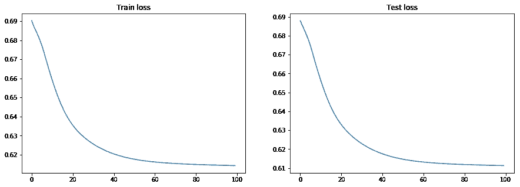
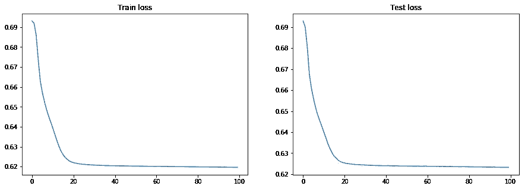
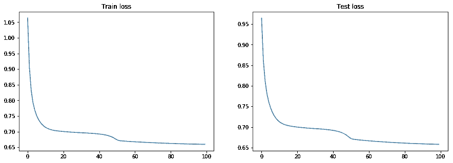

# 股票市场时间序列压缩的自动编码器

> 原文：<https://towardsdatascience.com/autoencoders-for-the-compression-of-stock-market-data-28e8c1a2da3e?source=collection_archive---------2----------------------->

## 用 Pythonic 探索不同的神经网络自动编码器来降低比特币价格时间序列的维度


## 摘要

股票市场数据空间是高度多维的，因此，试图利用价格形成中的潜在模式或结构的算法可能会遭受所谓的“维数灾难”。在这篇短文中，我们将探讨 4 种不同类型的自动编码器在较低和可追踪维度空间中捕捉股票市场价格动态信息的潜力。为此，我们将使用 Python 编程语言，并且作为示例，我们将把这些算法应用于比特币价格时间序列的压缩。构建神经网络模型的代码(使用 Keras 库)和所用的完整 Jupyter 笔记本可在文章末尾找到。

## 自动编码器的基础知识

自动编码器是一种输入和输出数据相同的神经网络。因此，它是所谓的无监督学习或自我监督学习的一部分，因为与监督学习不同，它不需要人工干预，如数据标记。正如我们将看到的，自动编码器的架构可能会有所不同，但一般来说，它包括一个编码器和一个解码器，前者将输入转换为低维表示，后者试图从低维表示中重建原始输入。因此，这些模型在中间存在某种“瓶颈”,迫使网络学习如何在低维空间中压缩数据。当训练这些算法时，目标是能够以最小量的信息损失来重建原始输入。一旦模型被训练，我们就可以通过只使用 autoencoder 的编码器组件随意压缩数据。


A representation of a basic autoencoder: an encoder maps the input X to a compressed representation in the bottleneck and a decoder tries to map the compressed representation to X’, which is the original input with a certain amount of information loss.

## 数据和目标

我们要使用的数据是从 2015 年 1 月 1 日开始到今天的 Coindesk 比特币价格指数的 1 小时烛台收盘价格组成的比特币时间序列。具体来说，我们将使用前 93%的数据作为训练数据集，最后 7%的数据作为测试数据集。比特币价格将被转换为对数回报(即价格 x+1 和价格 x 之间差额的对数)，并将产生 10 个连续回报的窗口。这些连续回报窗口中的每一个都将使用一个最小最大缩放器归一化到范围[0，1]。

不同自动编码器模型的目标是能够将 10 维输入压缩到 3 维潜在空间。这构成了一个 3.3 的缩减系数，它应该具有相当好的精度。

对于每个尝试的模型，我们将显示模型的摘要、在训练时期的每个阶段训练和测试数据集的损失，以及最后从测试数据集提取的 10 个随机选择的价格回报窗口的自动编码器的输入和输出(即模型没有看到这些数据点)。所选择的测试窗口将有意地在所有模型中保持相同，以便能够比较每个模型可能正在学习哪种特征。

## 第一个模型:一个简单的多层 percepetron (MLP)自动编码器

```
Layer (type)                 Output Shape              Param #   
=================================================================
input_2 (InputLayer)         (None, 10)                0         
_________________________________________________________________
dense_3 (Dense)              (None, 3)                 33        
_________________________________________________________________
dense_4 (Dense)              (None, 10)                40        
=================================================================
Total params: 73
Trainable params: 73
Non-trainable params: 0
```



所使用的模型非常简单，但是输入和输出之间的比较揭示了网络提取一些重要特征(例如峰值和低谷)的能力。有趣的是，我们可以看到，尽管输入相当不同，但有些输出彼此几乎完全相同。

## 第二种模式:深度自动编码器

```
_________________________________________________________________
Layer (type)                 Output Shape              Param #   
=================================================================
input_3 (InputLayer)         (None, 10)                0         
_________________________________________________________________
dense_5 (Dense)              (None, 6)                 66        
_________________________________________________________________
batch_normalization_1 (Batch (None, 6)                 24        
_________________________________________________________________
dense_6 (Dense)              (None, 3)                 21        
_________________________________________________________________
dense_7 (Dense)              (None, 6)                 24        
_________________________________________________________________
batch_normalization_2 (Batch (None, 6)                 24        
_________________________________________________________________
dense_8 (Dense)              (None, 10)                70        
=================================================================
Total params: 229
Trainable params: 205
Non-trainable params: 24
```


尽管多了几个参数，但在考虑训练/测试损失时，我们似乎达到了类似的精度。然而，输入/输出示例显示了不同类型的图，其中大多数包含一个单独的低峰或高峰，这与之前的结果不同，之前的结果在中间范围内变化更大。

## 第三种模式:1D 卷积自动编码器

```
_________________________________________________________________
Layer (type)                 Output Shape              Param #   
=================================================================
input_4 (InputLayer)         (None, 10, 1)             0         
_________________________________________________________________
conv1d_1 (Conv1D)            (None, 10, 16)            64        
_________________________________________________________________
max_pooling1d_1 (MaxPooling1 (None, 5, 16)             0         
_________________________________________________________________
conv1d_2 (Conv1D)            (None, 5, 1)              49        
_________________________________________________________________
max_pooling1d_2 (MaxPooling1 (None, 3, 1)              0         
_________________________________________________________________
conv1d_3 (Conv1D)            (None, 3, 1)              4         
_________________________________________________________________
up_sampling1d_1 (UpSampling1 (None, 6, 1)              0         
_________________________________________________________________
conv1d_4 (Conv1D)            (None, 5, 16)             48        
_________________________________________________________________
up_sampling1d_2 (UpSampling1 (None, 10, 16)            0         
_________________________________________________________________
conv1d_5 (Conv1D)            (None, 10, 1)             49        
=================================================================
Total params: 214
Trainable params: 214
Non-trainable params: 0
```



第三个模型变得有点有趣。在这个模型中，我们使用内核大小为 3 的卷积，其思想是这些卷积应该查看出现在 3 个返回组中的模式。结果令我吃惊。在大多数情况下，我们可以看到主要的“事件”被很好地表现出来，而整体重建非常平滑，因为我们对回报应用了移动平均。

## 第四款:LSTM 自动编码器

```
_________________________________________________________________
Layer (type)                 Output Shape              Param #   
=================================================================
input_5 (InputLayer)         (None, 10, 1)             0         
_________________________________________________________________
lstm_1 (LSTM)                (None, 3)                 60        
_________________________________________________________________
repeat_vector_1 (RepeatVecto (None, 10, 3)             0         
_________________________________________________________________
lstm_2 (LSTM)                (None, 10, 1)             20        
=================================================================
Total params: 80
Trainable params: 80
Non-trainable params: 0
```



虽然诸如长短期记忆(LSTM)模型等递归神经网络特别适合处理时间序列，但我们可以看到，它们作为自动编码器的性能非常差。Goodfellow 等人在他们的著作《深度学习》中简明扼要地解释了这一点:

> 当递归网络被训练来执行需要从过去预测未来的任务时，网络通常学习使用 h(t)[压缩表示]作为一种对过去输入序列直到 t 的任务相关方面的有损汇总。这种汇总通常必然是有损的，因为它将任意长度的序列映射到固定长度的向量 h(t)。
> 
> […]
> 
> 最苛刻的情况是当我们要求 h(t)足够丰富以允许近似恢复序列时，如在自动编码器框架中。

## 好处:深度自动编码器+合成数据

自动编码器背后的思想是将原始的高维度降低到较低的维度。在我们的例子中，由于我们正在应用的规范化方案，这个高维空间的值在 0 和 1 之间是连续的。然而，人们可能会认为，如果我们将这个 0 到 1 的范围离散化为 10 个箱，突然之间，我们会将整个 0 到 1 的范围划分为 10 个简单的类别。现在，如果我们的窗口有 10 个返回长度，使用这个“离散化的”连续空间，我们可以很容易地生成 10 的 10 次方个不同的现有组合或“离散化的时间序列”。这个“合成”数据集可以用作训练数据集，几乎事实上丰富了我们的模型，并教会它理解比特币时间序列中欠采样的价格空间部分。多好的主意，不是吗？


或者……是吗？结果是苦乐参半。一些进展有了很大的改善(例如，将第一列与以前的模型进行比较)，但其他的进展非常糟糕(例如，第六列)。这让我想到，或许对整个可能性空间进行等概率采样并不是一个最佳的想法。通过对整个空间进行均等采样，我们正在迫使网络学会均等地压缩整个空间，而不管该空间是否实际上与代表比特币或股票价格相关。我们必须记住，像所有的神经网络一样，自动编码器是一个函数逼近器，因此它试图全局逼近我们在训练中使用的所有数据点。这种全局优化本质上意味着，为了更好地逼近某些值，在逼近其他值时必然会损失性能。这表明，为了使这个想法可行，我们应该找到更聪明的方法，只对相关空间进行采样，以便网络只在相关压缩时达到最佳状态。

## **未来工作**

我们已经看到，自动编码器可以用来压缩股票收益的时间序列。如果目标仅仅是压缩数据，那么尝试其他经典的降维算法会很有意思，比如 PCA，它很可能在这个特定的任务中表现得更好。

然而，使用自动编码器的优点是，它的一些组件，如编码器，可以在几个独立的股票市场回报上单独训练，然后在其他端到端神经网络中重用，同时仍然保持通过反向传播进行全局优化的潜力。

我接下来想尝试的一些想法是:

1.  使用来自非常不同的股票市场工具(例如，非加密货币或其他加密货币)和不同年份时间跨度的数据训练本文中描述的相同自动编码器，以查看在这里评估的完全相同的任务(比特币数据压缩)下性能是否提高。
2.  将经过训练的编码器直接插入专门用于未来价格回报预测或 x+1 上涨/下跌价格预测的其他神经网络，并将其性能与直接接受原始价格回报而不是压缩表示的网络进行比较。

## Jupyter 笔记本

像往常一样，这里的朱庇特笔记本重现了我的作品:

*这个项目是我们在*[*cryptodatum . io*](https://cryptodatum.io)*研究的一部分，这是一个加密货币数据 API，旨在提供即插即用的数据集来训练机器学习算法。如果您喜欢我们在本文中展示的数据，您可以在*[*https://cryptodatum . io*](https://cryptodatum.io.)获得免费的 API 密钥并亲自使用它

[](https://cryptodatum.io)