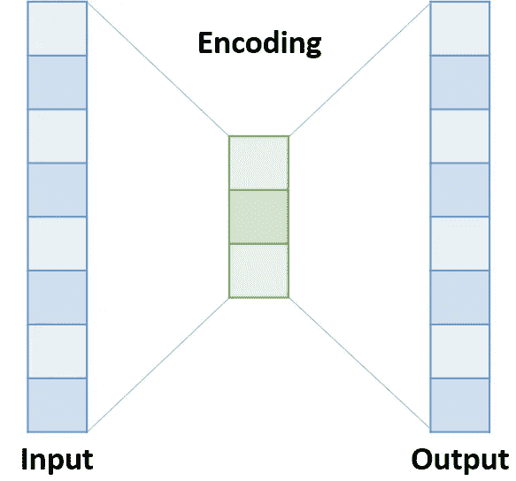
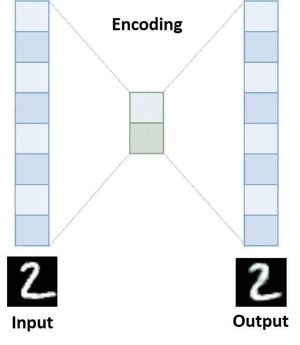
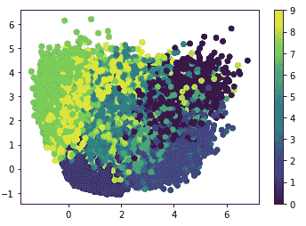

# 自动编码器的直观解释

> 原文：<https://towardsdatascience.com/autoencoders-in-keras-273389677c20?source=collection_archive---------16----------------------->

## 深度学习

## 以及如何在 Keras 中实现它们


Photo by [Aditya Chinchure](https://unsplash.com/@adityachinchure?utm_source=medium&utm_medium=referral) on [Unsplash](https://unsplash.com?utm_source=medium&utm_medium=referral)

# **动机**

最近的许多深度学习模型依赖于从数据中提取复杂的特征。目标是将输入从其原始格式转换成由神经网络计算的另一种表示。该表示包含描述输入的隐藏唯一特征的要素。

考虑一个人脸数据集，其中每个输入都是一个人的图像。原始格式的图像表示太复杂，机器无法使用。相反，为什么不让神经网络自动计算每张脸的重要特征，比如:眼睛类型、鼻子类型、两眼之间的距离、鼻子位置等。嗯，这听起来很有趣…使用这些功能，我们可以很容易地**比较两张脸**，**找到相似的脸**，**生成新的脸**，以及许多其他有趣的应用。

这个概念被称为**编码**，因为我们正在生成数据的编码版本。在本文中，我们将了解更多关于编码的内容，如何使用**自动编码器**计算它们，以及最终如何在 **Keras** 中实现它们。

# **自动编码器**

一个**自动编码器**是一个奇怪的神经网络，因为它的输入和输出是相同的。所以，它是一个试图自我学习的网络！我知道这很疯狂，但是你会明白为什么这很有用。

假设我们有以下神经网络:

*   有 100 个神经元的输入层
*   具有 3 个神经元的隐藏层
*   具有 100 个神经元的输出层(与输入层相同)



Image by Author

现在，如果我们让神经网络接受输入，并试图预测输出中的相同值，会发生什么？这不就意味着网络学会了如何只用 3 维*(隐藏层中的神经元数量)*来表示 100 维输入，然后再次重建相同的输入吗？此外，这些三维或特征似乎足以表示输入值所描述的内容。这很有趣。这就像压缩文件一样。我们减小了文件大小，但我们可以再次解压缩它，并获得相同的数据。事实上，在自动编码器中数据并不完全相同，因为它们是有损耗的，但是你明白了。

# **目标**

我们将使用著名的 **MNIST** 数字数据集来演示这个想法。目标是从给定的 28*28 图像生成 2D 编码。因此，我们正在使用自动编码器实现一个降维算法！酷吧？让我们开始…

# **编码时间**

首先，我们导入数据集:

```
from keras.datasets import mnist
(data, labels), (_, _) = mnist.load_data()
```

需要重塑和调整:

```
data = data.reshape(-1, 28*28) / 255.
```

是时候定义网络了。我们需要三层:

*   大小为 28*28 的输入层
*   大小为 2 的隐藏层
*   大小为 28*28 的输出图层



Image by Author

```
from keras import models, layers
input_layer = layers.Input(shape=(28*28,))
encoding_layer = layers.Dense(2)(input_layer)
decoding_layer = layers.Dense(28*28) (encoding_layer)
autoencoder = models.Model(input_layer, decoding_layer)
```

让我们编译和训练…我们将使用像素值之间的二元交叉熵损失来拟合模型:

```
autoencoder.compile('adam', loss='binary_crossentropy')
autoencoder.fit(x = data, y = data, epochs=5)
```

你注意到这个窍门了吗？ **X =数据**和 **y =数据**也是如此。

在拟合模型之后，网络应该学习如何计算隐藏编码。但我们还是要提取出对此负责的那一层。在下文中，我们定义了一个新模型，其中我们删除了最后一层，因为我们不再需要它:

```
encoder = models.Model(input_layer, encoding_layer)
```

现在，我们不再预测最终输出，而是只预测隐藏的表示。看看我们如何使用它:

```
encodings = encoder.predict(data)
```

就是这样！现在你的*编码*变量是一个(n，m)数组，其中 n 是例子的数量，m 是维数。第一列是第一个特征，第二列是第二个特征。但是那些特征是什么呢？事实上，我们不知道。我们只知道它们是每个输入值的良好代表。

让我们把它们画出来，看看我们会得到什么。

```
import matplotlib.pyplot as plt
plt.scatter(encodings[:, 0], encodings[:, 1], c=labels)
plt.colorbar()
```



Image by Author

漂亮！看看神经网络是如何学习隐藏特征的。显然，它学会了每个数字的不同特征，以及它们在 2D 空间中的分布。现在，我们可以将这些功能用于可视化、聚类或任何其他目的…

# **最终想法**

在这篇文章中，我们学习了自动编码器以及如何应用它们进行降维。自动编码器非常强大，并在许多现代神经网络架构中使用。在以后的文章中，您将了解更复杂的编码器/解码器网络。

如果你喜欢这篇文章，请点击“鼓掌”按钮，我将不胜感激👏所以可能会传染给他人。也可以在 [*推特*](https://twitter.com/alimasri1991) *，* [*脸书*](https://www.facebook.com/alimasri91) *，* [*上关注我直接发邮件给我*](mailto:alimasri1991@gmail.com) *或者在*[*LinkedIn*](https://www.linkedin.com/in/alimasri/)*上找我。*