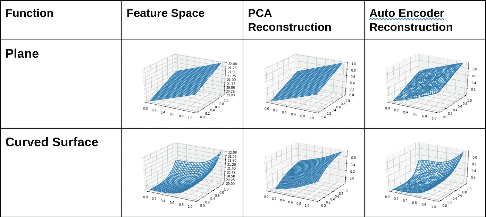

# 自动编码器与 PCA:何时使用？

> 原文：<https://towardsdatascience.com/autoencoders-vs-pca-when-to-use-which-73de063f5d7?source=collection_archive---------2----------------------->

[Source](https://magenta.tensorflow.org/music-vae)

**降维需求**

在机器学习项目中，我们经常遇到维数灾难问题，其中数据记录的数量不是特征数量的重要因素。这通常会导致问题，因为这意味着使用稀缺的数据集训练大量的参数，这很容易导致过度拟合和泛化能力差。高维数也意味着非常大的训练时间。因此，降维技术通常被用来解决这些问题。尽管特征空间存在于高维空间中，但它通常具有低维结构。

两种非常常见的降低特征空间维数的方法是 PCA 和自动编码器。我将只提供对这些的简要介绍，更多理论性的比较请看这篇[的帖子](/understanding-pca-autoencoders-algorithms-everyone-can-understand-28ee89b570e2)。

**PCA**

PCA 本质上学习将数据投影到另一个空间的线性变换，其中投影的向量由数据的方差定义。通过将维度限制到占数据集方差大部分的特定数量的组件，我们可以实现维度减少。

**自动编码器**

自动编码器是神经网络，可用于通过堆叠多个非线性变换(层)将数据减少到低维潜在空间。他们有一个编码器-解码器架构。编码器将输入映射到潜在空间，解码器重构输入。使用反向传播对它们进行训练，以精确重建输入。在潜在空间具有比输入更低的维数时，自动编码器可以用于维数减少。凭直觉，这些低维潜变量应该编码输入的最重要的特征，因为它们能够重构输入。

**对比**

1.  PCA 本质上是线性变换，但是自动编码器能够模拟复杂的非线性函数。
2.  PCA 特征彼此完全线性不相关，因为特征是到正交基的投影。但是自动编码的特征可能具有相关性，因为它们只是为了精确重建而被训练的。
3.  PCA 比自动编码器速度更快，计算成本更低。
4.  具有线性激活功能的单层自动编码器非常类似于 PCA。
5.  由于参数数量太多，自动编码器容易过拟合。(尽管规范化和精心设计可以避免这种情况)

**什么时候用哪个？**

除了对计算资源的考虑，技术的选择取决于特征空间本身的性质。如果这些特征彼此之间具有非线性关系，那么 autoencoder 将能够更好地将信息压缩到低维潜在空间中，利用其模拟复杂非线性函数的能力。特征具有非线性关系意味着什么？让我们做几个简单的实验来回答这些问题，并阐明这两种技术的相对有用性。

**实验 2D**

这里，我们构建二维特征空间(x 和 y 是两个特征),它们之间具有线性和非线性关系(具有一些附加噪声)。我们将比较自动编码器和 PCA 在将输入投影到潜在空间后准确重建输入的能力。PCA 是具有明确定义的逆变换的线性变换，并且来自 autoencoder 的解码器输出给我们重构的输入。我们对 PCA 和自动编码器都使用一维潜在空间。

显然，如果在特征空间中存在非线性关系(或曲率),自动编码的潜在空间可以用于更精确的重建。其中由于 PCA 仅保留到第一主分量上的投影，任何垂直于它的信息都丢失了。让我们看看下表中由均方误差(MSE)测量的重建成本。

**实验 3D**

进行类似的 3D 实验。我们创建两个三维特征空间。一个是存在于 3D 空间中的 2D 平面，另一个是 3D 空间中的曲面。

我们可以看到，在平面的情况下，数据具有清晰的二维结构，具有两个分量的 PCA 可以解释数据的 100%的方差，因此可以实现完美的重建。在曲面的情况下，二维 PCA 不能解释所有的变化，因此丢失了信息。覆盖大部分方差的到平面的投影被保留，而其他信息丢失，因此重建不是那么精确。另一方面，autoencoder 能够使用二维潜在空间精确地重建平面和曲面。因此，在自动编码器的情况下，2D 潜在空间能够编码更多的信息，因为它能够非线性建模。下表提供了重建成本。

**随机数据实验**

这里我们创建一个没有任何共线性的随机数据。所有特征都是从均匀分布中独立采样的，彼此之间没有关系。我们对 PCA 和自动编码器都使用二维潜在空间。

我们看到，PCA 能够以最大的方差保留在平面上的投影，并且丢失了许多信息，因为随机数据不具有基本的 2 维结构。Autoencoder 也表现不佳，因为功能之间没有潜在的关系。

**结论**

为了使降维有效，在特征空间中需要有底层的低维结构。即这些特征应该彼此具有某种关系。

如果在低亮度结构中存在非线性或曲率，则自动编码器可以使用更少的维度来编码更多的信息。因此，在这些情况下，它们是更好的降维技术。

实验的所有代码都可以在这里找到:

 [## muaz-urwa/PCA-vs-自动编码器

### 此时您不能执行该操作。您已使用另一个标签页或窗口登录。您已在另一个选项卡中注销，或者…

github.com](https://github.com/muaz-urwa/PCA-vs-AutoEncoders)