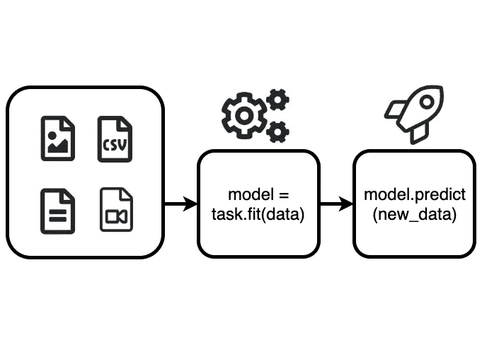
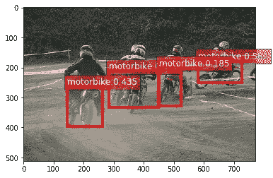
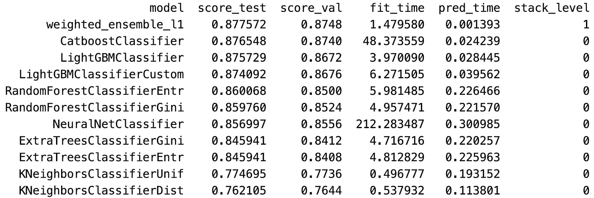

# 自动增长:深度学习自动

> 原文：<https://towardsdatascience.com/autogluon-deep-learning-automl-5cdb4e2388ec?source=collection_archive---------4----------------------->

## 用 3 行 Python 代码实现最先进的结果

*作者:*[](https://medium.com/@innixma)**、乔纳斯·穆勒、* [*杭张*](https://hangzhang.org/) *、巴拉吉·卡马科蒂**

**感谢亚伦·马卡姆、李牧、马蒂亚斯·西格、塔利亚·乔普拉和盛扎的早期反馈和编辑。**

# *引入自动旋转*

*[**autoglon**](https://auto.gluon.ai/)是一个新的**开源** AutoML 库，它为涉及图像、文本和表格数据集的真实世界应用程序自动化深度学习(DL)和机器学习(ML)。无论您是 ML 新手还是经验丰富的从业者，AutoGluon 都会简化您的工作流程。有了 AutoGluon，您只需使用几行 Python 代码就可以开发和改进最先进的 DL 模型。在这篇文章中，我们解释了自动增长的好处，演示了如何在 Linux 上安装它，并开始使用自动增长在几分钟内以最先进的性能解决现实世界的问题。*

**

# *动机和主要特征*

*从历史上看，实现最先进的 ML 性能需要广泛的背景知识、经验和人力。数据准备、特征工程、验证分割、缺失值处理和模型选择只是 ML 应用中必须解决的许多任务中的一部分。一个特别困难的任务是超参数的选择。*

*超参数表示用户在构建模型时必须做出的许多选择，例如数据处理步骤、神经网络体系结构和训练期间使用的优化器。每个超参数都以不透明的方式影响最终模型的预测性能，而更强大的模型(如深度神经网络)需要调整的超参数越来越多。轻微的超参数修改可能会显著改变模型质量。由于通常不清楚如何做出这些决定，开发人员通常手动调整他们的 ML 管道的各个方面，以便在实践中实现强大的预测性能，这可能需要许多迭代和艰苦的人力努力。AutoGluon 自动执行前面提到的所有任务，创造一种真正脱离方向盘的体验。您不必花费宝贵的时间来管理这些实验或首先学习如何做这些实验，您可以简单地指定您希望何时准备好训练好的模型，AutoGluon 将利用可用的计算资源在其分配的运行时间内找到最强的 ML 方法。

autoglon 使您能够在图像分类、对象检测、文本分类和使用表格数据集的监督学习等任务上自动实现一流的性能。每个任务的超参数是使用高级调整算法自动选择的，如贝叶斯优化、超带和强化学习。有了 AutoGluon，您不需要对底层模型有任何了解，因为所有的超参数都将在默认范围内自动调整，这些范围对于特定的任务和模型来说是已知的。

对于专业的 ML 从业者来说，自动生成允许这个过程被容易地定制。例如，您可以为某些超参数指定要考虑的值范围，还可以使用自动优化来自动调整您自己的定制模型的各个方面。如果您可以访问多台机器，AutoGluon 可以轻松地在它们之间分配计算，以便更快地返回训练好的模型。*

# *通过实例自动增长*

## *装置*

*在训练模型之前，你必须安装自动旋翼。Linux 支持自动登录，MacOS 和 Windows 支持即将推出。可以通过遵循此处的安装说明[来安装自动旋翼。

本演示使用了一台带 GPU 的 Linux 机器。要安装支持 GPU 的 Linux 版 AutoGluon，请在“终端”中运行以下命令，或者参考安装 wiki 中的仅 CPU 安装:](https://auto.gluon.ai/stable/index.html#installation)*

```
*# CUDA 10.0 and a GPU for object detection is recommended
# We install MXNet to utilize deep learning models
pip install --upgrade mxnet-cu100
pip install autogluon*
```

## *对象检测示例*

*我们以目标检测任务为例，展示了 AutoGluon 的简单接口。在目标检测中，不仅要识别图像中的目标，还要用包围盒来定位它们。
我们将使用自动旋翼在一个为演示目的而创建的小玩具数据集上训练一个物体检测器(以确保快速运行)。该数据集是使用 [VOC 数据集](http://host.robots.ox.ac.uk/pascal/VOC/) [1]的摩托车类别生成的。在下面的 Python 代码中，我们首先导入 AutoGluon，将对象检测指定为感兴趣的任务(`ObjectDetection as task`)，将数据下载到我们的机器上，最后将其加载到 Python 中:*

```
*import autogluon as ag
from autogluon import ObjectDetection as taskurl = '[https://autogluon.s3.amazonaws.com/datasets/tiny_motorbike.zip](https://autogluon.s3.amazonaws.com/datasets/tiny_motorbike.zip)'
data_dir = ag.unzip([ag.download](http://ag.download/)(url))
dataset = task.Dataset(data_dir, classes=('motorbike',))*
```

*接下来，我们可以通过简单地调用`fit()`函数来使用自动旋转训练检测器模型:*

```
*detector = task.fit(dataset)*
```

*在这个对`fit()`的单次调用中，AutoGluon 在不同的网络配置和优化超参数下训练了许多模型，选择其中最好的作为最终返回的检测器。在没有任何用户输入的情况下，对`fit()`的调用也自动利用了最先进的深度学习技术，如预训练的 YOLOv3 网络的迁移学习。我们可以使用`predict()`方法在新图像上测试训练过的检测器:*

```
*url = '[https://autogluon.s3.amazonaws.com/images/object_detection_example.png](https://autogluon.s3-us-west-2.amazonaws.com/images/object_detection_example.png)'
filename = ag.download(url)
index, probabilities, locations = detector.predict(filename)*
```

**

*AutoGluon 的预测功能会自动加载测试图像，并输出每个检测到的对象的预测对象类别、类别概率和边界框位置。如上所示，可视化图像被自动生成。我们可以看到，尽管只在非常小的数据集上训练我们的检测器，但摩托车还是以合理的精度被检测和定位。有关使用自动旋转进行物体检测的完整教程，请访问[自动旋转网站](https://auto.gluon.ai/stable/tutorials/object_detection/index.html)。*

## *表格数据示例*

*最常见的数据形式是表格数据集。这些由通常在逗号分隔文件(CSV)或数据库中找到的结构化数据组成。在表格数据集中，每列代表某个变量的测量值(又名*特性*)，行代表单个数据点。自动增长可用于训练模型，这些模型根据同一行中的其他列来预测特定列的值，并且能够推广到以前看不到的示例。

我们将要训练的数据集是[成人收入分类数据集](https://archive.ics.uci.edu/ml/datasets/adult)【2】。该数据集包含约 48，000 人的信息，包括年龄等数字特征和职业等分类特征。数据集通常用于预测个人收入。在本例中，我们将预测个人年收入是否超过 50，000 美元。我们将使用 80%的数据来训练自旋转，20%的数据来测试产生的自旋转预测器。使用自动引导，不需要指定验证数据。AutoGluon 将使用提供的训练数据以最佳方式分配验证集。

作为一个例子，我们提供了 Python 代码，该代码首先导入自动登录并指定一个`task`，在这里我们将使用`TabularPrediction`处理表格数据。然后，我们从位于 S3 的 CSV 文件中加载`Dataset`。只需对`fit()`进行一次调用，AutoGluon 就会处理数据，并训练一个称为“预测器”的多样化 ML 模型集合，该模型能够预测该数据中的“类别”变量。它将使用其他列作为预测特征，如个人的年龄、职业和教育。这个模型集合包括在 ML 竞争社区中因其质量、鲁棒性和速度而闻名的经过验证和测试的算法，如 [LightGBM](https://github.com/microsoft/LightGBM) 、 [CatBoost](https://github.com/catboost/catboost) ，以及持续优于更传统的 ML 模型(如逻辑回归)的深度神经网络。

注意，我们不需要做任何数据处理、特征工程，甚至不需要声明预测问题的类型。AutoGluon 自动准备数据，推断我们的问题是回归还是分类(包括是二元还是多类)。经过训练的预测器模型将保存到 task.fit()调用中指定的位置。*

```
*from autogluon import TabularPrediction as task
train_path = 'https://autogluon.s3.amazonaws.com/datasets/AdultIncomeBinaryClassification/train_data.csv'
train_data = task.Dataset(file_path=train_path)
predictor = task.fit(train_data=train_data, label='class', output_directory='ag-example-out/')*
```

*现在我们的预测模型已经训练好了，我们将对以前看不到的测试数据进行预测。我们既可以直接使用返回的预测值，也可以从我们指定的输出目录中加载它。*

```
*predictor = task.load('ag-example-out/')
test_path = 'https://autogluon.s3.amazonaws.com/datasets/AdultIncomeBinaryClassification/test_data.csv'
test_data = task.Dataset(file_path=test_path)
y_test = test_data['class']
test_data_nolabel = test_data.drop(labels=['class'],axis=1)
y_pred = predictor.predict(test_data_nolabel)
y_pred_proba = predictor.predict_proba(test_data_nolabel)
print(list(y_pred[:5]))
print(list(y_pred_proba[:5]))*
```

*[' <=50K’, ‘ <=50K’, ‘ > 50K '，'<=50K’, ‘ <=50K’]
[0.077471，0.0093894，0.973065，0.0021249，0.001387]

现在我们来看看车型排行榜:*

```
*leaderboard = predictor.leaderboard(test_data)*
```

**

*AutoGluon’s model leaderboard*

*该排行榜显示了由 AutoGluon 训练的每个模型，它们在测试和验证数据上的分数，以及以秒为单位的训练时间。可以看出，`weighted_ensemble`在验证和测试集上表现最好，达到了 87.76%的准确率，对于这个问题来说[是一个非常强的结果](https://www.openml.org/t/7592) [3]。

有关使用自动增长对表格数据进行监督学习的完整教程，请参见[自动增长表格预测教程](https://auto.gluon.ai/stable/tutorials/tabular_prediction/index.html)。*

# *了解更多并做出贡献*

*在这篇文章中，我们介绍了 AutoGluon，这是我们为给 ML 专家和新人提供最好的 ML 和深度学习体验而做出的微薄努力。该库不仅易于使用，而且能够在各种应用中实现优于其他 ML 方法的高质量模型。虽然这篇文章关注的是使用表格数据进行对象检测和预测，但自动生成也可以轻松应用于其他任务，包括[文本](https://auto.gluon.ai/stable/tutorials/text_prediction/index.html)和[图像](https://auto.gluon.ai/stable/tutorials/image_classification/index.html)分类。AutoGluon 甚至可以用于细化涉及定制模型的任意 ML 任务(在 [MXNet](https://mxnet.apache.org/) 和 [PyTorch](https://pytorch.org/) 中)。我们欢迎社区参与我们的旅程。前往[autoglon GitHub 库](https://github.com/awslabs/autogluon/)开始，并查看[autoglon 网站](https://auto.gluon.ai/)上的教程，在您的应用中快速尝试复杂的 AutoML 解决方案。我们渴望听到您的结果和反馈！*

# *引文*

*[1] Everingham，Mark 等人，“pascal 视觉对象类挑战:回顾”*国际计算机视觉杂志*111.1(2015):98–136。
[2]杜瓦和格拉夫(2019)。UCI 机器学习知识库[http://archive . ics . UCI . edu/ml]。加州欧文:加州大学信息与计算机科学学院。
[3]华金·范肖伦、扬·范里恩、贝恩德·比什尔和路易斯·托戈。OpenML:机器学习中的网络科学。SIGKDD 探索 15(2)，第 49–60 页，2013 年。*

# *资源*

*[autoglon 网站](https://auto.gluon.ai/)
[autoglon Github 资源库](https://github.com/awslabs/autogluon/)
[潜入深度学习](http://d2l.ai/)
[MXNet 胶子](https://gluon.mxnet.io/)*