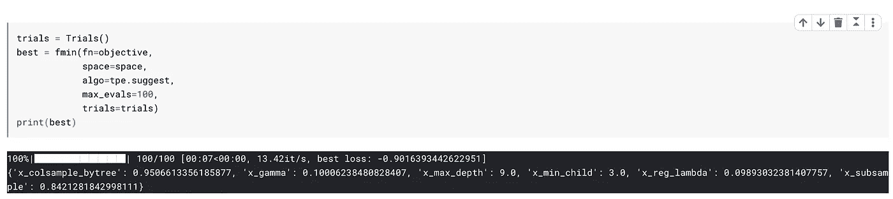

# 为您的模型自动调整超参数

> 原文：<https://towardsdatascience.com/automate-hyperparameter-tuning-for-your-models-71b18f819604?source=collection_archive---------15----------------------->

Photo by [Marcin Nowak](https://unsplash.com/@marcin?utm_source=medium&utm_medium=referral) on [Unsplash](https://unsplash.com?utm_source=medium&utm_medium=referral)

## 因为你的时间比机器更重要

当我们创建我们的机器学习模型时，我们面临的一个常见任务是如何调整它们。

人们最终采取不同的手动方法。有些有效，有些无效，大量时间花在预测和一遍又一遍地运行代码上。

这就给我们带来了一个本质问题:我们能自动化这个过程吗？

不久前，我正在参加 Coursera 课程的 [**【如何赢得数据科学竞赛】**](https://www.coursera.org/specializations/aml?siteID=lVarvwc5BD0-BShznKdc3CUauhfsM7_8xw&utm_content=2&utm_medium=partners&utm_source=linkshare&utm_campaign=lVarvwc5BD0) 的一次课堂竞赛。学到了很多新东西，其中之一就是 Hyperopt——一个贝叶斯参数调整框架。

我很惊讶。晚上我把我的 Mac 和远视留在一起了。早上我拿到了结果。这太棒了，我确实避免了很多尝试。

***这个帖子是关于自动化超参数调优的，因为我们的时间比机器更重要。***

# 那么，什么是远视呢？

从 Hyperopt 网站:

> *Hyperopt 是一个 Python 库，用于对笨拙的搜索空间进行串行和并行优化，搜索空间可能包括实值、离散和条件维度*

***简单来说，这意味着我们得到了一个可以最小化/最大化任何函数的优化器。*** 例如，我们可以用这个来最小化日志损失或最大化准确性。

我们都知道网格搜索或随机网格搜索是如何工作的。

网格搜索逐个遍历参数，而随机搜索随机遍历参数。

> 因此，Hyperopt 旨在以一种明智的方式搜索参数空间。

细节我就不多说了。但是如果你想知道更多关于它是如何工作的，看看 J Bergstra 的这篇 [**论文**](https://conference.scipy.org/proceedings/scipy2013/pdfs/bergstra_hyperopt.pdf) 。下面是来自 Github 的 [**文档**](https://github.com/hyperopt/hyperopt/wiki/FMin) 。

# 我们的数据集

为了解释 hyperopt 是如何工作的，我将处理来自 UCI 的[心脏数据集](https://www.kaggle.com/ronitf/heart-disease-uci)，因为它是一个简单的数据集。除了产生利润之外，为什么不利用数据科学做些好事呢？

给定一些变量，该数据集预测心脏病的存在。

这是数据集的快照:

目标分布如下所示:

# 远视循序渐进

因此，在尝试运行 hyperopt 时，我们需要创建两个 Python 对象:

1.  ***一个目标函数:*** 目标函数以超参数空间为输入，返回损失。这里我们称我们的目标函数为`objective`
2.  ***一个超参数的字典:*** 我们将通过使用变量`space`来定义一个超参数空间，这个变量实际上只是一个字典。我们可以为不同的超参数值选择不同的分布。

最后，我们将使用 hyperopt 包中的`fmin`功能，通过`space`最小化我们的`objective`。

你可以跟随这个 [Kaggle 内核](https://www.kaggle.com/mlwhiz/how-to-use-hyperopt?scriptVersionId=20362799)中的代码。

## 1.创建目标函数

这里，我们创建一个目标函数，它将一个超参数空间作为输入:

*   我们首先定义一个分类器，在本例中是 XGBoost。试着看看我们如何从空间获取参数。例如`space[‘max_depth’]`
*   我们使分类器适合训练数据，然后在交叉验证集上进行预测。
*   我们计算想要最大化或最小化的所需指标。
*   因为我们只在 hyperopt 中最小化使用`fmin`,如果我们想最小化`logloss`,我们只发送我们的度量。如果我们想最大限度地提高精度，我们将尽量减少`-accuracy`

## 2.为您的分类器创建空间

现在，我们 ***为分类器创建超参数*** 的搜索空间。

为此，我们最终使用了许多定义各种分布的 hyperopt 内置函数。

正如您在下面的代码中看到的，我们对`subsample`超参数使用 0.7 到 1 之间的均匀分布。我们还给出了子样本参数`x_subsample`的标签。您需要为您定义的每个超参数提供不同的标签。我通常在我的参数名前添加一个`x_`来创建这个标签。

你也可以定义很多其他的发行版。hyperopt 优化算法目前认可的一些最有用的随机表达式是:

*   `hp.choice(label, options)` —返回选项之一，应为列表或元组。
*   `hp.randint(label, upper)` —返回范围[0，上限]内的随机整数。
*   `hp.uniform(label, low, high)` —统一返回一个介于`low`和`high`之间的值。
*   `hp.quniform(label, low, high, q)` —返回一个类似 round(uniform(low，high) / q) * q 的值
*   `hp.normal(label, mu, sigma)` —返回一个正态分布的实数值，其平均值为μ，标准差为σ。

还有很多其他发行版。你可以点击查看[。](https://github.com/hyperopt/hyperopt/wiki/FMin)

## 3.最后，运行 Hyperopt

一旦我们运行这个，我们就能得到模型的最佳参数。事实证明，我们在这个问题上做到了 90%的准确率。

现在我们可以用这些最佳参数重新训练我们的 XGboost 算法，我们完成了。

# 结论

运行上面的程序给我们的学习算法提供了很好的超参数。这让我节省了很多时间去思考各种其他的假设并测试它们。

我倾向于在调优我的模型时大量使用这个。 ***根据我的经验，整个过程中最关键的部分是建立超参数空间，这需要经验和对模型的了解。***

所以，Hyperopt 是一个非常棒的工具，但是千万不要忘记理解你的模型是做什么的。从长远来看，这是很有帮助的。

你可以在这个 [Kaggle 内核](https://www.kaggle.com/mlwhiz/how-to-use-hyperopt?scriptVersionId=20362799)中获得完整的代码。

# 继续学习

如果你想了解更多关于实用数据科学的知识，请看看 Coursera 的 [**“如何赢得数据科学竞赛”**](https://coursera.pxf.io/yRPoZB) 课程。从这个课程中学到了很多新的东西，这个课程是由最多产的卡格勒教授的。

还有另一个叫做 Optuna 的框架，你可以用它来代替 Hyperopt。在这里阅读。

谢谢你的阅读。将来我也会写更多初学者友好的帖子。在**关注我或者订阅我的 [**博客**](http://eepurl.com/dbQnuX?source=post_page---------------------------) 了解他们。一如既往，我欢迎反馈和建设性的批评，可以通过 Twitter [@mlwhiz](https://twitter.com/MLWhiz?source=post_page---------------------------) 联系。**

**此外，一个小的免责声明-在这篇文章中可能会有一些相关资源的链接，因为分享知识从来都不是一个坏主意。**