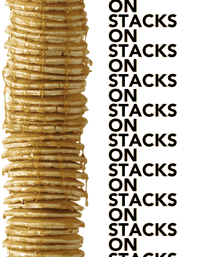
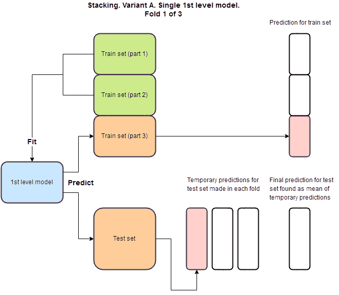
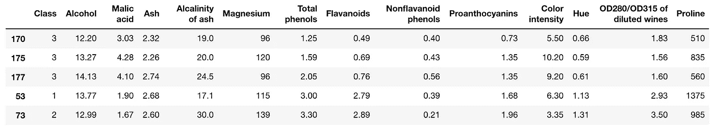

# Python 中的自动化堆栈

> 原文：<https://towardsdatascience.com/automate-stacking-in-python-fc3e7834772e?source=collection_archive---------3----------------------->

## 如何在节省时间的同时提高性能

# 介绍

当谈到将机器学习算法推向新的高度时，利用堆叠(堆叠概括)是一个非常热门的话题。例如，现在大多数获奖的 Kaggle 提交文件都使用了某种形式的堆叠或其变体。戴维·沃伯特*在 1992 年的论文*中首次介绍了叠加泛化*，*它们的主要目的是减少泛化误差。根据沃伯特的说法，它们可以被理解为“交叉验证的更复杂版本”*。虽然沃伯特本人当时指出，大部分堆叠概括是“黑色艺术”，但似乎构建越来越大的堆叠概括会战胜较小的堆叠概括。然而，随着这些模型的规模不断增加，它们的复杂性也在增加。自动化构建不同架构的过程将大大简化这一过程。本文的剩余部分将处理我最近遇到的包 ***vecstack*** ，它正在尝试这个 ***。****



Source: [https://giphy.com/gifs/funny-food-hRsayJrDAx8WY](https://giphy.com/gifs/funny-food-hRsayJrDAx8WY)

# 堆叠式概化看起来像什么？

堆叠概化结构背后的主要思想是使用一个或多个一级模型，使用这些模型进行预测，然后使用这些预测作为要素来拟合一个或多个二级模型。为了避免过度拟合，通常使用交叉验证来预测训练集的 OOF(折叠外)部分。该套件中有两种不同的变体，但我将在本段中描述“变体 A”。为了得到这个变量的最终预测，我们取所有预测的平均值或众数。可以使用 vecstacks 文档中的这张 GIF 来可视化整个过程:



# 用例:构建用于分类的堆叠式概化

看了文档之后，是时候自己尝试使用这个包了，看看它是如何工作的。为此，我决定使用 UCI 机器学习库中的葡萄酒数据集。这个数据集的问题陈述是使用 13 个特征，它们都代表了葡萄酒的不同方面，来预测葡萄酒来自意大利的三个栽培品种中的哪一个。

首先，让我们导入我们的项目需要的包:

```
**import pandas as** pd
**from** **sklearn.datasets** **import** load_iris
**from** **sklearn.model_selection** **import** train_test_split
**from** **sklearn.metrics** **import** accuracy_score
**from sklearn.neighbors import** KNeighborsClassifier
**from** **sklearn.ensemble** **import** RandomForestClassifier
**from** **xgboost** **import** XGBClassifier
**from** **vecstack** **import** stacking
```

现在，我们准备导入数据并查看它，以便更好地理解它的样子:

```
**link** = '[https://archive.ics.uci.edu/ml/machine-learning-databases/wine/wine.data'](https://archive.ics.uci.edu/ml/machine-learning-databases/wine/wine.data')
**names** = ['Class', 'Alcohol', 'Malic acid', 'Ash',
         'Alcalinity of ash' ,'Magnesium', 'Total phenols',
         'Flavanoids', 'Nonflavanoid phenols', 'Proanthocyanins',     'Color intensity', 'Hue', 'OD280/OD315 of diluted wines',
         'Proline']**df** = **pd**.**read_csv**(link, header=None, names=names)
**df**.**sample**(5)
```

运行上面的代码块给我们带来了:



注意我用的是**。样()**改为 if **。head()** 避免由于假设整个数据集具有前五行的结构而被误导。幸运的是，这个数据集没有任何缺失值，所以我们可以很容易地使用它来测试我们的包，而不需要任何通常需要的数据清理和准备。

接下来，我们将从输入变量中分离出响应，并按照 vecstacks 文档中的示例执行 80:20 的训练测试分割。

```
**y** = df[['Class']]
**X** = df.iloc[:,1:]**X_train, X_test, y_train, y_test** = train_test_split(X, y, test_size=0.2, random_state=0)
```

我们越来越接近有趣的部分了。还记得之前的 GIF 吗？现在是时候为我们的堆叠概括定义一些第一级模型了。这一步绝对值得单独写一篇文章，但是为了简单起见，我们将使用三个模型:KNN 分类器、随机森林分类器和 XGBoost 分类器。

```
**models** = [
    **KNeighborsClassifier**(n_neighbors=5,
                        n_jobs=-1),

    **RandomForestClassifier**(random_state=0, n_jobs=-1, 
                           n_estimators=100, max_depth=3),

    **XGBClassifier**(random_state=0, n_jobs=-1, learning_rate=0.1, 
                  n_estimators=100, max_depth=3)
]
```

这些参数在设置之前没有被调优，因为本文的目的是测试这个包。如果你要优化性能，你不应该只是复制和粘贴这些。

从文档中取出下一部分代码，我们实际上是使用第一级模型进行预测来执行 GIF 的第一部分:

```
**S_train, S_test** = **stacking**(models,                   
                           X_train, y_train, X_test,   
                           regression=False, 

                           mode='oof_pred_bag', 

                           needs_proba=False,

                           save_dir=None, 

                           metric=accuracy_score, 

                           n_folds=4, 

                           stratified=True,

                           shuffle=True,  

                           random_state=0,    

                           verbose=2)
```

堆叠函数接受几个输入:

*   ***车型*** :我们前面定义的第一级车型
*   ***X_train，y_train，X_test*** :我方数据
*   ***回归*** :布尔值，表示是否要使用函数进行回归。在我们的例子中设置为 False，因为这是一个分类
*   ***模式:*** 使用前面描述的出叠方式进行交叉验证
*   ***needs_proba*** :布尔值，表示是否需要类别标签的概率
*   ***save_dir*** :将结果保存到目录 Boolean
*   ***度量*** :使用什么评估度量(我们一开始导入了 accuracy_score)
*   ***n_folds*** :交叉验证使用多少个折叠
*   *:是否使用分层交叉验证*
*   ****洗牌*** :是否洗牌*
*   ****random_state*** :设定再现性的随机状态*
*   ****详细*** : 2 这里是指打印所有信息*

*这样，我们得到以下输出:*

```
*task:         [classification]
n_classes:    [3]
metric:       [accuracy_score]
mode:         [oof_pred_bag]
n_models:     [4]model  0:     [KNeighborsClassifier]
    fold  0:  [0.72972973]
    fold  1:  [0.61111111]
    fold  2:  [0.62857143]
    fold  3:  [0.76470588]
    ----
    MEAN:     [0.68352954] + [0.06517070]
    FULL:     [0.68309859]model  1:     [ExtraTreesClassifier]
    fold  0:  [0.97297297]
    fold  1:  [1.00000000]
    fold  2:  [0.94285714]
    fold  3:  [1.00000000]
    ----
    MEAN:     [0.97895753] + [0.02358296]
    FULL:     [0.97887324]model  2:     [RandomForestClassifier]
    fold  0:  [1.00000000]
    fold  1:  [1.00000000]
    fold  2:  [0.94285714]
    fold  3:  [1.00000000]
    ----
    MEAN:     [0.98571429] + [0.02474358]
    FULL:     [0.98591549]model  3:     [XGBClassifier]
    fold  0:  [1.00000000]
    fold  1:  [0.97222222]
    fold  2:  [0.91428571]
    fold  3:  [0.97058824]
    ----
    MEAN:     [0.96427404] + [0.03113768]
    FULL:     [0.96478873]*
```

*再一次，参考 GIF，现在剩下要做的就是在我们的预测上拟合我们选择的第二层模型，以做出我们的最终预测。在我们的例子中，我们将使用 XGBoost 分类器。这一步与 sklearn 中的常规拟合和预测没有显著不同，除了这样一个事实，即我们不是使用 X_train 来训练我们的模型，而是使用我们的预测 S_train。*

```
***model** = **XGBClassifier**(random_state=0, n_jobs=-1, learning_rate=0.1, 
                      n_estimators=100, max_depth=3)

**model** = model.fit(**S_train**, y_train)**y_pred** = model.predict(S_test)print('Final prediction score: [%.8f]' % accuracy_score(y_test, y_pred))Output: Final prediction score: [0.97222222]*
```

# *结论*

*使用 vecstacks 的堆叠自动化，我们成功预测了正确的葡萄酒品种，准确率约为 97.2%！如您所见，该 API 与 sklearn API 并不冲突，因此可以在尝试加速堆叠工作流时提供一个有用的工具。*

*一如既往，如果您有任何反馈或发现错误，请随时联系我。*

**参考文献*:*

*[1]戴维·h·沃尔波特，(1992)，神经网络*

*[2]伊戈尔·伊万诺夫， [Vecstack](https://github.com/vecxoz/vecstack) (2016)，GitHub*

*[3] M. Forina 等人，[葡萄酒数据集](https://archive.ics.uci.edu/ml/datasets/wine) (1991)，UCI 机器学习知识库*