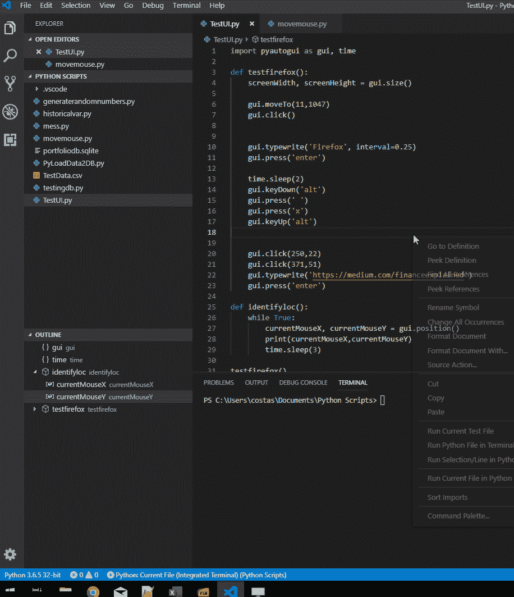

# 用 Python 中的 PyAutoGUI 实现自动化 UI 测试

> 原文：<https://towardsdatascience.com/automate-ui-testing-with-pyautogui-in-python-4a3762121973?source=collection_archive---------10----------------------->

## 回归测试你的用户界面的一个快速简单的方法

当没有必要的安全措施来保证质量控制时，发布一个新版本的产品可能是一个令人紧张的经历。假设您的产品有一个用户界面(UI)，那么在每次发布之前进行 UI 测试是明智的。

当然，您已经准备好了集成测试，并且您确信系统将端到端地工作，包括 UI。然而，根据您所在的行业以及您的应用程序的重要性，您可能需要确保并证明它是可行的。鉴于这是您每次发布应用程序时都想要重复的事情，您可能想要自动化这种类型的测试。

一种快速简单的方法是利用一个名为 PyAutoGUI 的 Python 库，它将允许您执行自动化的 UI 测试。


Photo by [Med Badr Chemmaoui](https://unsplash.com/@medbadrc?utm_source=medium&utm_medium=referral) on [Unsplash](https://unsplash.com?utm_source=medium&utm_medium=referral)

# 简介 PyAutoGUI

PyAutoGUI 本质上是一个 Python 包，可以跨 Windows、MacOS X 和 Linux 工作，它提供了模拟鼠标光标移动和点击以及键盘按钮按压的能力。

你可以在他们的[主页](https://pyautogui.readthedocs.io/en/latest/introduction.html)上找到关于这个包的更多信息，包括下面显示的快速概览:

```
import pyautogui
screenWidth, screenHeight = pyautogui.size()
currentMouseX, currentMouseY = pyautogui.position()
pyautogui.moveTo(100, 150)
pyautogui.click()
pyautogui.moveRel(None, 10)  # move mouse 10 pixels down
pyautogui.doubleClick()
pyautogui.moveTo(500, 500, duration=2, tween=pyautogui.easeInOutQuad)  # use tweening/easing function to move mouse over 2 seconds.
pyautogui.typewrite('Hello world!', interval=0.25)  # type with quarter-second pause in between each key
pyautogui.press('esc')
pyautogui.keyDown('shift')
pyautogui.press(['left', 'left', 'left', 'left', 'left', 'left'])
pyautogui.keyUp('shift')
pyautogui.hotkey('ctrl', 'c')
```

# 用法示例

为了了解这在实践中是如何工作的，让我们快速构建一个示例 python 脚本。我们首先假设我们的应用程序 Firefox(作为一个例子)已经部署到一台测试 Windows 10 的机器上，我们希望自动测试 UI 的某些方面。

要做的第一件事，是导入包并捕捉我们屏幕的大小。我们也可以假设 Windows 任务栏总是在屏幕的底部，所以我们可以继续启动开始菜单按钮。

```
import pyautogui as gui, time
screenWidth, screenHeight = gui.size()
gui.moveTo(0,screenHeight)
gui.click()
```

一旦执行了上面的代码，我们就可以搜索 Firefox，然后启动它。

```
gui.typewrite('Firefox', interval=0.25)
gui.press('enter')
```

我增加了每个字母的打字间隔，以适应较慢的机器。然后，我们需要确保窗口最大化到屏幕上。windows 的快捷键是 Alt + Space，然后是 x。

```
time.sleep(2) #give 2 seconds for firefox to launch
gui.keyDown('alt')
gui.press(' ')
gui.press('x')
gui.keyUp('alt')
```

此时，我们可以开始添加我们希望工具测试的特性。例如，我们可能想测试打开一个新标签页并在网站中键入内容。为此，我们想知道屏幕上的某些位置。为了识别它们，我们可以在后台运行以下脚本，当我们将鼠标悬停在我们想要的位置上时，可以看到位置输出:

```
import pyautogui as gui, time
def identifyloc():
    while True:
        currentMouseX, currentMouseY = gui.position()
        print(currentMouseX,currentMouseY)
        time.sleep(3)
identifyloc()
```

使用这个，我发现“新标签”按钮在位置(250，22)，地址栏在(371，51)。因此，我可以使用下面的代码:

```
gui.click(250,22)
gui.click(371,51)
gui.typewrite('https://medium.com/financeexplained')
gui.press('enter')
```

然后我们可以继续添加尽可能多的测试场景。当然，在执行完所有这些之后，仍然需要有人查看日志和 UI，以确保我们没有遇到任何错误。

将所有这些放在一起:

```
import pyautogui as gui, time
def testfirefox():
    screenWidth, screenHeight = gui.size()
    gui.moveTo(0,screenHeight)
    gui.click()
    gui.typewrite('Firefox', interval=0.25)
    gui.press('enter')
    time.sleep(2)
    gui.keyDown('alt')
    gui.press(' ')
    gui.press('x')
    gui.keyUp('alt')
    gui.click(250,22)
    gui.click(371,51)
    gui.typewrite('[https://medium.com/financeexplained'](https://medium.com/financeexplained'))
    gui.press('enter')def identifyloc():
    while True:
        currentMouseX, currentMouseY = gui.position()
        print(currentMouseX,currentMouseY)
        time.sleep(3)testfirefox()
```



在你走之前，我经常写关于金融和技术的博客。如果你想了解我的文章，别忘了[关注我](https://medium.com/@costasandreou)！