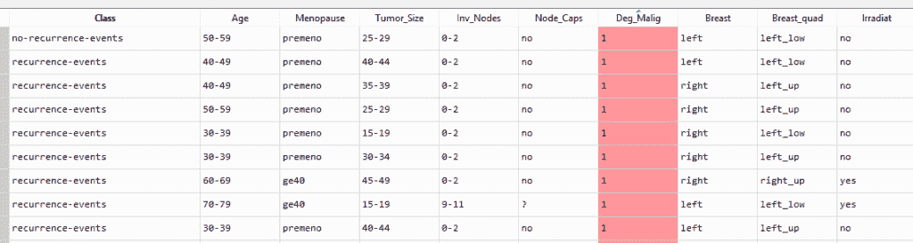
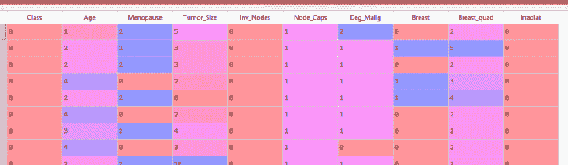
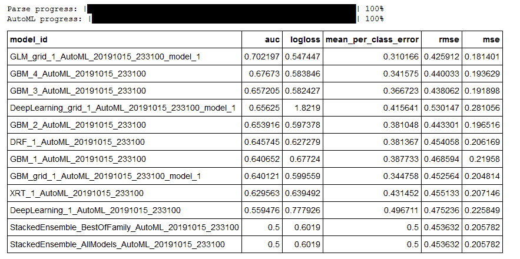
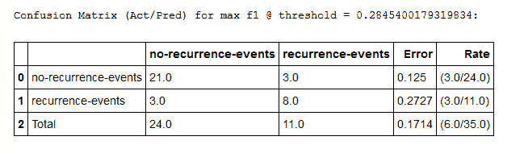
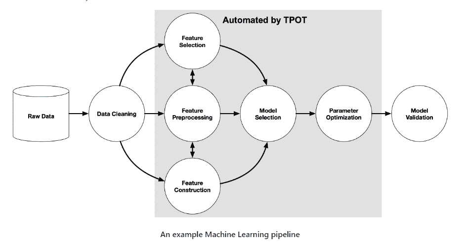
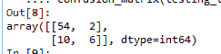

# 使用 Python 中的 AutoML 自动调整和选择 ML 模型

> 原文：<https://towardsdatascience.com/automate-your-ml-model-tuning-and-selection-2f8c0b6992ce?source=collection_archive---------31----------------------->

在同一数据集上测试不同的 ML 方法以评估模型性能可能是一项单调乏味的任务。此外，正确调整深度学习模型可能需要几个小时，如果不是几天的话。幸运的是，在过去的十年中，人们一直在努力开发自动化 ML 模型选择和调整的方法。虽然目前可用的开源解决方案并不是银弹(也不应该这样对待！)，在构建 ML 或 DL 模型时使用 AutoML 可以节省大量的时间，至少可以为您指出最佳模型的正确方向。在这篇文章中，我回顾了 Python 中目前可用的一些 AutoML 实现，并提供了具体的例子(包括代码！).

Python 中目前可用于自动化模型选择和调优的一些选项如下( [1](https://www.ml4aad.org/automl/) ):

1.  H2O 一揽子计划
2.  auto-sklearn 包
3.  TPOT 一揽子计划

在本帖中，我们将回顾 H2O 包和 TPOT 包中的 AutoML 功能。可惜 auto-sklearn 只在 Linux 操作系统上可用(我没有)，所以就不覆盖了。

# 数据

在这篇文章中，我们将使用通过 UCI 机器学习知识库获得的一个众所周知的数据集，[乳腺癌数据集](https://archive.ics.uci.edu/ml/datasets/breast+cancer)，根据各种因素对癌症是否复发进行分类(二进制结果为 0 或 1)。潜在的预测变量包括患者的年龄(分类变量——分箱),患者是否已经绝经(分类变量),以及肿瘤大小(分类变量——分箱)等。数据集的快照如下所示:



*Snapshot of the breast cancer data, available via the UCI repository*

在我们通过任何 autoML 函数运行数据之前，让我们稍微清理一下。主要是，我们使用 sklearn 的 LabelEncoder()函数将所有的分类变量转换成数字(使用标签编码对 H2O 来说不是必需的，但对 TPOT 来说是必需的):



*Data after being label-encoded*

现在我们有了一个干净的数据集，可以使用了，让我们对它运行 AutoML。

# H20 的汽车

[H20](http://docs.h2o.ai/h2o/latest-stable/h2o-docs/welcome.html) 是一个开源的 ML 库，允许用户快速构建、测试和生产 ML 模型。H2O 的 AutoML 功能可以自动为训练数据集选择最佳 ML 或 DL 模型。该软件包非常通用和强大。

# 下载 H20

[这个链接](http://docs.h2o.ai/h2o/latest-stable/h2o-docs/downloading.html)包含了为 Python 下载 H20 的说明。该软件包需要一些必须预先安装的依赖项。提供了使用 Anaconda 和普通 Python 进行安装的指导。

# 在我们的数据集上运行 H2O 的 AutoML

我们使用以下代码对数据集执行 H2O AutoML:



*A snapshot of the leaderboard for H2O’s AutoML results*

如上图所示，控制台中会出现最合适型号的排行榜。根据排行榜的结果，我们表现最好的模型是一般线性模型(GLM)，其次是梯度增强模型(GBM)。我们可以通过 H2O 的 model_performance()函数运行我们的测试数据来衡量 GLM 的性能，其中 aml.leader 是性能最好的模型:



*Confusion matrix for test predictions, generated via H2O’s model_performance() function*

基于上述混淆矩阵，该模型的总体准确率约为 83%，召回率约为 73%，准确率为 87.5%。考虑到我们在通过 AutoML 运行数据集之前实际上没有对其进行预处理，这是一个惊人的结果。

# TPOT 汽车公司

TPOT，或基于树的流水线优化工具，是最早开发的 AutoML 方法之一。兰德尔·奥尔森博士在宾夕法尼亚大学计算遗传学实验室工作时开发了 TPOT。TPOT 的主要目标是通过基因编程实现 ML 流水线的自动化。TPOT 自动化流程图如下所示( [3](https://github.com/EpistasisLab/tpot) ):



*The ML pipeline as automated by the TPOT package (*[*3*](https://github.com/EpistasisLab/tpot)*)*

正如你在上面的示意图中看到的，TPOT 的 AutoML 功能可以自动完成 ML 管道后数据清理。流水线中的具体自动化步骤包括特征选择和预处理、模型选择和参数优化。

# 为 Python 下载 TPOT

TPOT 的功能依赖于 scikit-learn，所以你需要安装 sklearn(如果你还没有)和 TPOT 来使用 TPOT 的 AutoML 功能:

```
pip install sklearn 
pip install tpot
```

# 使用 TPOT 的 AutoML 函数

我们将使用 H2O 汽车公司示例中使用的相同癌症数据集，再次预测癌症是否会复发(“类别”列)。我们通过 run_tpot_automl()函数运行标签编码的数据集:

该代码输出一个名为 tpot_classifier_pipeline.py 的 python 文件。该文件包含模型的优化 ML 管道:

我们对自动输出文件进行了一些编辑，并返回预测的测试结果以及相关的混淆矩阵:



*Confusion matrix of test outputs.*

在检查所选 AutoML 模型的结果时，一个额外的树分类器(一个随机森林的变体)，总的模型精度是 83%。模型召回率为 75%，准确率约为 84%。与 H2O AutoML 模型的结果几乎完全相同，但精度得分较低。

# 不同的包装如何堆叠

如果您正在对一个模型进行 AutoML 采样，我建议尝试这两个包，因为您的结果可能与本文中的结果不同。就每个方案而言，以下是我观察到的利弊:

**H2O 汽车**

优点:

1.  易于下载
2.  几乎不需要数据预处理(标签编码是不必要的，因为它与 TPOT)
3.  结果很容易解释
4.  选择最佳型号时，对各种 ML 和 DL 类型进行采样

缺点:

1.  Spyder 是我的首选 IDE(可以通过 Anaconda 发行版获得)，它不会显示 H2O 输出。H2O 必须在 Jupyter 笔记本或同等电脑上运行，才能显示排行榜结果。

TPOT 汽车

优点:

1.  结果是高度可解释的，并且生成包含最佳 ML 管道的自动化文件。
2.  易于下载。

缺点:

1.  需要进行更多的数据预处理，才能将数据集转换成可接受的格式来运行 AutoML。
2.  至少在这个例子中，不如 H2O 的 AutoML 精确。*然而，这可能是一次性的，当使用其他数据集进行采样时，结果可能会有所不同。*

**我的 Python AutoML 包教程到此结束。感谢阅读！本教程的完整代码可通过我的个人 Github repo 获得:**[**https://Github . com/kperry 2215/automl _ examples/blob/master/automl _ example _ code . py**](https://github.com/kperry2215/automl_examples/blob/master/automl_example_code.py)

**看看我的其他一些机器学习文章:**

[](https://techrando.com/2019/08/23/unsupervised-machine-learning-approaches-for-outlier-detection-in-time-series/) [## 时间序列中离群点检测的无监督机器学习方法

### 包括示例 Python 代码！在这篇文章中，我将介绍一些我最喜欢的检测时间序列中异常值的方法…

techrando.com](https://techrando.com/2019/08/23/unsupervised-machine-learning-approaches-for-outlier-detection-in-time-series/) [](https://techrando.com/2019/08/14/a-brief-introduction-to-change-point-detection-using-python/) [## 使用 Python - Tech Rando 进行变化点检测简介

### 我的很多工作都大量涉及时间序列分析。我使用的一个很棒但不太为人所知的算法是…

techrando.com](https://techrando.com/2019/08/14/a-brief-introduction-to-change-point-detection-using-python/) 

# 来源

1.  AutoML。从 https://www.ml4aad.org/automl/[取回](https://www.ml4aad.org/automl/)
2.  AutoML:关于自动机器学习的信息。从 http://automl.info/tpot/[取回](http://automl.info/tpot/)
3.  TPOT:一个 Python 自动机器学习工具，使用遗传编程优化机器学习管道。从 https://github.com/EpistasisLab/tpot[取回](https://github.com/EpistasisLab/tpot)

*原载于 2019 年 10 月 21 日 https://techrando.com**T21*[。](https://techrando.com/2019/10/21/automate-your-ml-model-tuning-and-selection-a-review-of-different-python-automl-packages/)