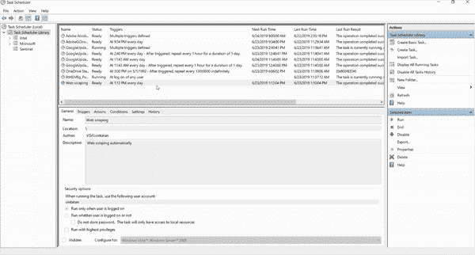
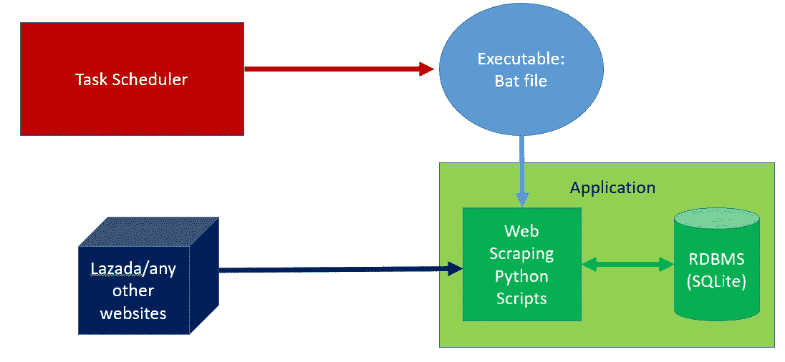
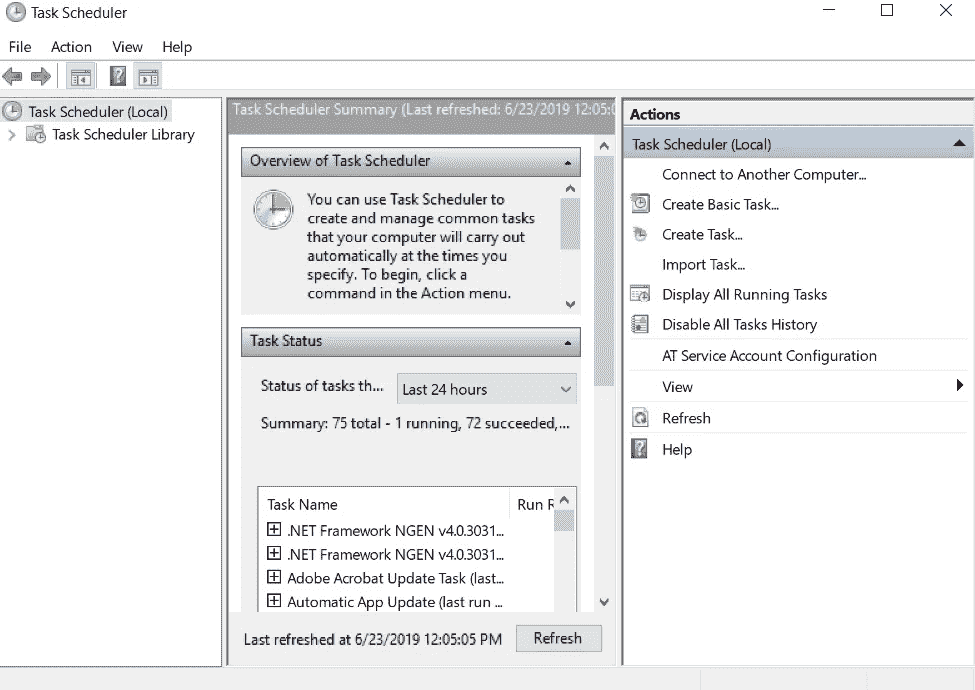
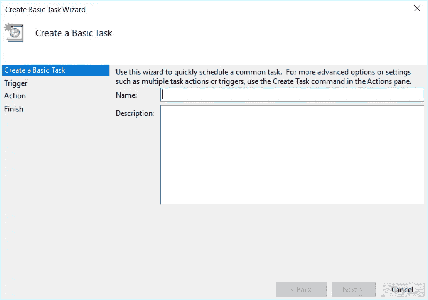
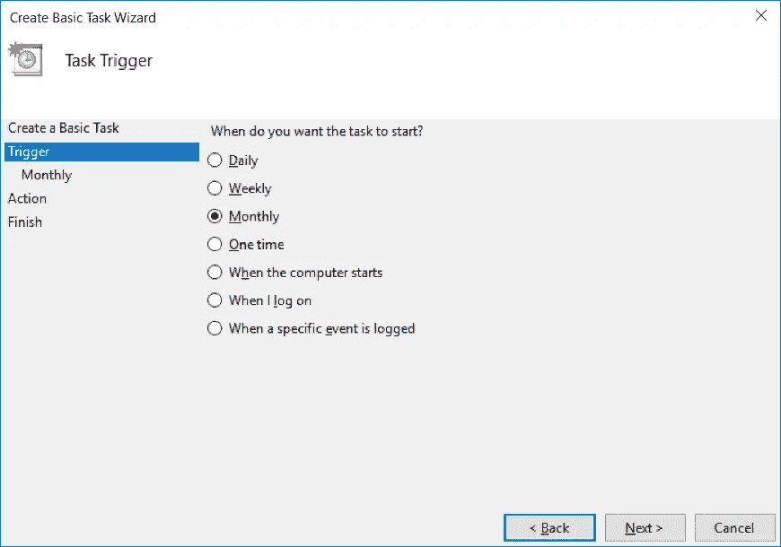
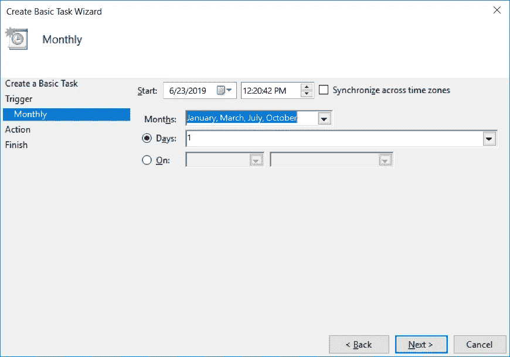
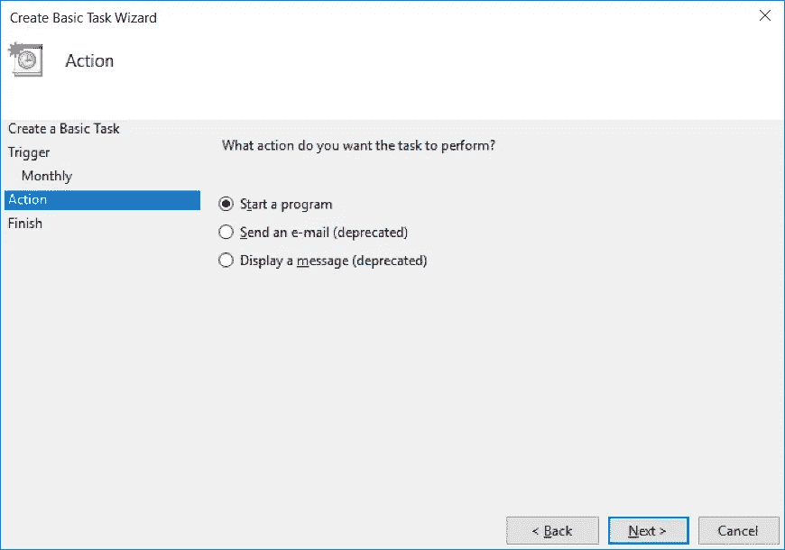
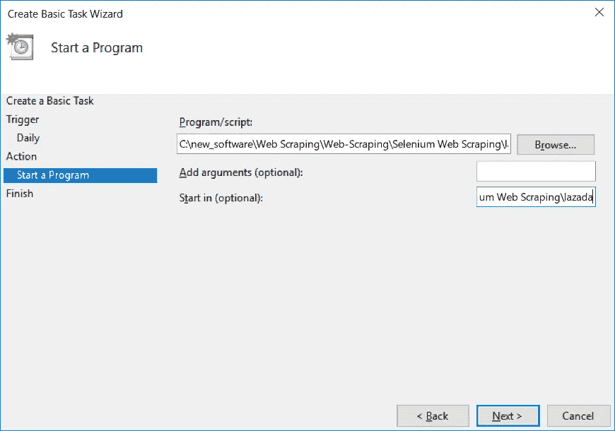
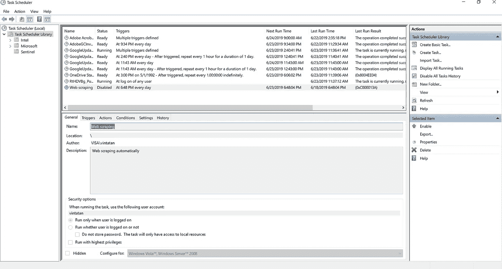
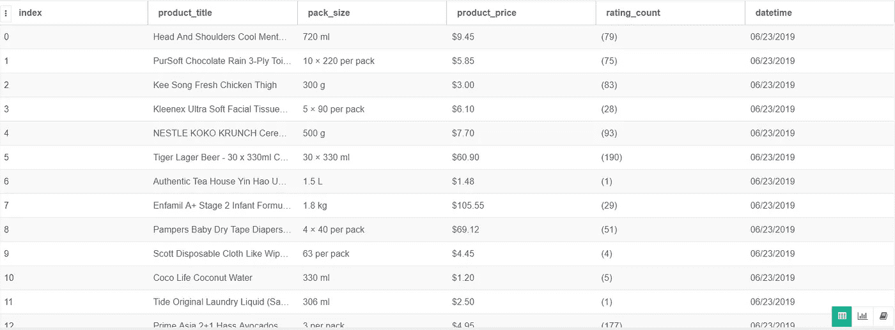

# 使用任务调度器自动化您的 Python 脚本

> 原文：<https://towardsdatascience.com/automate-your-python-scripts-with-task-scheduler-661d0a40b279?source=collection_archive---------0----------------------->

## 数据专业人员权威指南

## Windows 任务计划程序抓取替代数据


Credit: Stocksnap

> 每天运行我的 Python 脚本太麻烦了。
> 
> 我需要一种定期自动运行我的 Python 脚本的方法

想象一下，你的经理让你半夜醒来运行一个脚本。这将是你最大的噩梦。你过早醒来，暴露在可怕的蓝光下，每天午夜都不能好好睡觉。

作为任何数据专业人员，您可能需要运行多个脚本来生成报告或部署分析管道。因此，你需要了解一下**计划者**来避免破坏你的周末。

> 每个数据工程师和科学家在某个时间点都需要运行定期任务。

根据定义，周期性任务是指在没有或很少人工干预的情况下，按照一定的时间间隔重复执行的任务。在数据和技术快速发展的时期，你需要运行脚本来开发数据库备份、Twitter 流等。

幸运的是，有了任务调度器，您现在可以根据需要每天/每周/每月/每年运行 Python 脚本来执行定期任务。

在本教程中，您将学习如何运行任务调度程序来从 Lazada (电子商务)网站的[网页抓取数据，并将其转储到](/in-10-minutes-web-scraping-with-beautiful-soup-and-selenium-for-data-professionals-8de169d36319) [SQLite RDBMS](/relational-database-management-rdbms-basic-for-data-professionals-aca3567f03da) 数据库中。

这是自动运行您的脚本的快速一瞥！



Running Web Scraping Scripts with Task Scheduler then append it to SQLite Disk

> 我们开始吧！

# 这些方法

在本教程中，我们将使用 Windows 任务计划程序运行 bat 脚本，该脚本将触发 Python 脚本。要执行这些脚本，我们有两个简单的步骤:

1.  创建 Python 可执行文件(bat 文件)
2.  在 Windows 任务计划程序中配置任务

但是，如果您是 Linux 用户，并且没有可用的 Windows 任务调度程序，您应该使用 [cron 调度程序](https://medium.com/@Ratik96/https-medium-com-ratik96-scheduling-jobs-with-crontab-on-macos-add5a8b26c30)。

# 创建 Windows 可执行 bat 文件以运行 Python

> 一个 **BAT 文件**是一个 DOS **批处理文件**用来执行 Windows 命令提示符(cmd.exe)下的命令。它包含一系列通常可能在 DOS 命令提示符下输入的行命令。 **BAT 文件**最常用于在 Windows 中启动程序和运行维护实用程序。—fileinfo.com

使用 bat 文件作为我们的可执行文件，我们将运行脚本存储在一个文件中，然后双击 bat 文件，在 cmd(命令提示符)上执行命令来运行 python 脚本。

你需要做的就是创建一个新的 bat 文件(例如:web-scraping.bat)并编写可执行脚本，格式为 **<你的 Python.exe 位置> <你的 python 脚本位置>** 。可以添加*暂停*命令，避免执行后关闭命令提示符。

```
C:\new_software\finance\Scripts\python.exe "C:/new_software/Web Scraping/Web-Scraping/Selenium Web Scraping/scraping-lazada.py"
pause
```

一旦你双击这个 bat 文件，Windows 将打开你的命令提示符并运行网页抓取工具。为了调度这个双击/执行，我们将把我们的任务调度器挂接到 bat 文件。

# 在 Windows 任务计划程序中配置任务

**Windows 任务调度器**是一个默认的 Windows 应用程序，用于管理任务以响应基于事件或基于时间的触发。例如，你可以建议某个点击和计算机动作(比如重启)，甚至建议像每个财政季度第一天的*这样的时间来执行任务。*

从更大的角度来看，这个任务将包含脚本和元数据，以定义将执行什么操作以及如何执行操作。您可以在参数中添加特定的安全上下文，并控制调度程序将在何处运行程序。Windows 将把所有这些任务序列化为**。作业**文件放在一个叫做**任务文件夹**的特殊文件夹中。



The process flow of Task Scheduler to automate application’s web scraping

在本教程中，我们将设置一个基于时间的事件来运行我们的应用程序，并将数据转储到 SQLite 中。总共有多少

1.  点击开始窗口，搜索任务计划程序，并打开它。
2.  单击右侧窗口中的创建基本任务
3.  选择你的触发时间。
4.  为我们之前的选择选择准确的时间。
5.  开始一项计划
6.  在之前保存 bat 文件的地方插入程序脚本。
7.  单击完成。

## 我们开始吧！

1.  **点击开始窗口，搜索任务调度器，打开**。



Task Scheduler Windows

2.**在右侧窗口**点击创建基本任务。

你应该把你的任务名称(如:网页抓取)和描述(如:网页抓取和 SQLite 转储自动每天下午 6 点)



3.**选择您的触发时间**。

你可以选择每天，每周，甚至每月触发时间。从逻辑上讲，这种选择很大程度上取决于您希望刷新数据源中的值的频率。例如，如果您的任务是收集 MarketWatch 股票资产负债表，您应该在每个财务季度运行这些脚本。



4.**为我们之前的选择选择准确的时间**。

我们将选择一月、四月、七月和九月来表示所有早期财务季度。



5.**启动程序**

在这里，您将能够启动 Python 脚本，发送电子邮件，甚至显示消息。请随意选择你最喜欢的。但是，您应该小心，因为有一些不推荐使用的任务将在后续补丁中删除。



6.在之前保存 bat 文件的地方插入程序脚本。

这将自动运行 Python 脚本的任务调度程序。确保在应用程序文件夹的位置包含 Start in，以便访问所有相关的元素(Selenium Browser 可执行文件/ SQLite 磁盘)



7.**点击完成**。

您可以在任务计划程序的首页查看您创建的任务计划。



> 祝贺您，您已经在 Windows 中设置了第一个自动计划程序。

# 结果

下面是 gif 动画，供大家参考。请注意调度程序是如何自己运行 Python 脚本的。一旦脚本运行完毕，它会将提取的值转储到 SQLite 数据库中。将来，该应用程序将在每次满足触发条件时运行，并将更新后的值追加到 SQLite 中。


Running Web Scraping Scripts with Task Scheduler then append it to SQLite Disk



Data appended into SQLite using Task Scheduler

## 最后…


Boy laughing while reading a book, source: Unsplash

我真的希望这是一本很棒的读物，是你发展和创新的灵感来源。

请**在下面评论**出来建议和反馈。

如果你真的喜欢它，请查看我的个人资料。还有更多关于数据分析和 Python 项目的文章会让你感兴趣。

快乐编码:)

# 关于作者

Vincent Tatan 是一名数据和技术爱好者，拥有在 Visa Inc .和 Lazada 实施微服务架构、商业智能和分析管道项目[的相关工作经验。](https://bit.ly/2I8jkWV.)

Vincent 是土生土长的印度尼西亚人，在解决问题方面成绩斐然，擅长全栈开发、数据分析和战略规划。

他一直积极咨询 SMU BI & Analytics Club，指导来自不同背景的有抱负的数据科学家和工程师，并为企业开发他们的产品开放他的专业知识。

请通过 [**LinkedIn**](http://www.linkedin.com/in/vincenttatan/) **，**[**Medium**](https://medium.com/@vincentkernn)**或** [**Youtube 频道**](https://www.youtube.com/user/vincelance1/videos) 联系文森特