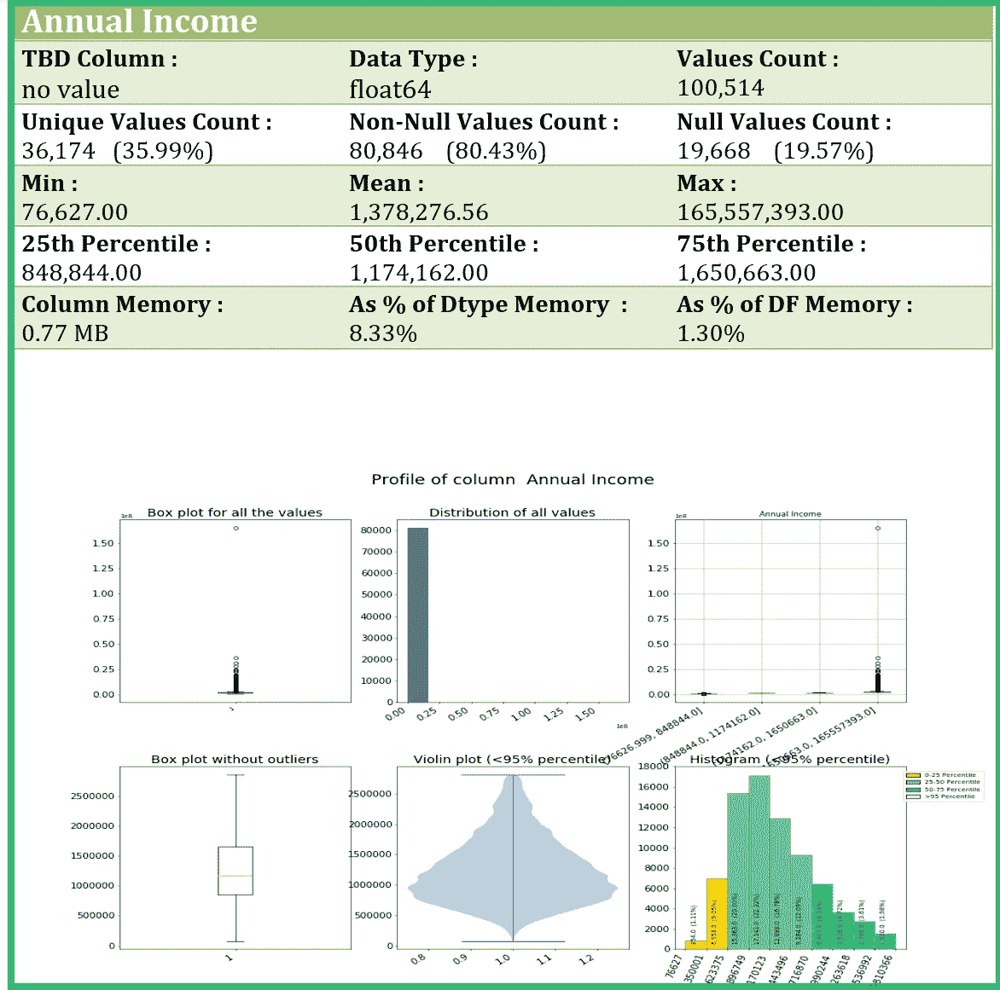

# 使用 Python 的自动化数据剖析

> 原文：<https://towardsdatascience.com/automated-data-profiling-99523e51048e?source=collection_archive---------10----------------------->

## 使用 Python 生成带有数据分析输出的 MS Word 文档。

这篇博客是关于自动化**探索性数据分析过程(EDA)** 的**数据剖析**阶段的。我们将使用 Python 自动执行数据分析过程，并生成一个 Microsoft Word 文档作为数据分析结果的输出。

将 MS Word 文档作为数据分析结果输出的主要优势在于，它可用于捕捉领域专家关于数据质量、数据转换和特征工程的讨论和决策，以便进一步建模和可视化。

A sample page for numeric column data profiling

Python 代码的优势在于它保持了通用性，使想要修改代码的用户能够轻松地添加更多功能或更改现有功能。例如，更改为数字列数据配置文件生成的图形类型，或从 Excel 文件加载数据。

你可以从我的 GitHub 网站[下载完整的代码。将以下文件下载到一个文件夹中，以执行 Python 代码:](https://github.com/AnalyticsInsightsNinja/Python_TidyData)

[01 _ 16 _ av _ automated _ data _ profiling _ MS _ word . ipynb](https://github.com/AnalyticsInsightsNinja/Python_TidyData/blob/master/01_16_av_automated_data_profiling_MS_WORD.ipynb)

请注意，您将需要“docx”包来生成 MS Word 文档输出。

# **什么是探索性数据分析(EDA)**

探索性数据分析指的是一套由 John Tukey 开发的技术，以一种有趣的特征将变得明显的方式显示数据。与通常从数据的假设模型开始的经典方法不同，EDA 技术用于 ***鼓励数据建议可能合适的模型*** 。

【来源:[http://www.statgraphics.com/exploratory-data-analysis】](http://www.statgraphics.com/exploratory-data-analysis)

数据剖析是探索性数据分析过程的第一阶段***。***

# 什么是数据剖析过程？

**数据分析**是检查从现有信息源(如数据库或文件)获得的数据，并收集关于该数据的统计数据或信息摘要的过程。

数据剖析的目的是 ***找出现有数据是否可以方便地用于其他目的*** *。*

数据剖析利用描述性统计的方法，例如最小值、最大值、平均值、模式、百分位数、标准偏差、频率、变化、合计(例如计数和总和)以及在数据剖析期间获得的附加元数据信息，例如数据类型、长度、离散值、唯一性、空值的出现、典型的字符串模式和抽象类型识别。

【来源:[https://en.wikipedia.org/wiki/Data_profiling](https://en.wikipedia.org/wiki/Data_profiling)

# **数据简介 Data frame(DPD)——游戏改变者！**

Python 和 Pandas 提供了许多分析数据的函数。但是这些命令必须单独发出，并且信息将是分散的。这是一个重复而繁琐的手动过程。

**数据剖析数据框架**是一种改变游戏规则的方式，可以在一个数据框架中方便地访问所有数据剖析信息，该数据框架是通过结合 Pandas 包的许多数据剖析功能和 Python 的通用统计功能而生成的。

# **创建数据概要数据帧**

创建 DPD 的代码可以从我的 GitHub 站点 [AnalyticsInsightsNinja](https://github.com/AnalyticsInsightsNinja/Python_TidyData) 下载。

将以下文件下载到一个文件夹中，以执行 Python 代码:

[01 _ 16 _ av _ automated _ data _ profiling _ MS _ word . ipynb](https://github.com/AnalyticsInsightsNinja/Python_TidyData/blob/master/01_16_av_automated_data_profiling_MS_WORD.ipynb)

请注意，您将需要“docx”包来生成 MS Word 文档输出。

由于代码可以免费下载，所以在本文中，我将只讨论创建 DPD 的关键方面。

首先，创建一个数据帧，其行数等于数据集中的列数。这是因为 DPD 中的行是列的轮廓，因此 DPD 中的行数等于数据集中的列数。所需的列被添加到数据框架中。

源数据中的列与值计数、唯一值计数等详细信息一起作为行添加到 DPD 中。

下一步是使用以下命令生成源数据帧配置文件的数据帧:

df . describe()t . round(2)

这将创建一个源数据概要数据帧，对其进行转置(T)并将数值四舍五入到两位小数。

创建 DPD 的 ***关键步骤*** 是将最初创建的 DPD 与上述 describe()函数产生的数据帧合并。

> **pd.merge(data_qlt_df，raw_num_df，how='left '，left_on='column_name '，right_index=True)**

然后将剩余的列添加到 DPD 中。

# **生成图表/图形**

在代码的不同点，生成不同的图/图形并保存到磁盘。这些图像将被插入到 MS Word 文档的适当位置。

## **数字列的图表/图形**

对于数字列，会生成以下图形:

*   列中所有值的箱线图
*   列中所有值的直方图
*   列中所有值的四分位数箱线图
*   无异常值的箱线图
*   小于 95%的值的小提琴图
*   小于 95%的值的直方图

在上图中，小于 95%的值的直方图是一个 ***自定义版本*** 直方图，具有不同百分位范围的条形值计数、条形范围值和彩色条形。这个直方图的代码可以从我的 GitHub 站点 AnalyticsInsightsNinja 下载— [PythonVisualAnalytics](https://github.com/AnalyticsInsightsNinja/PythonVisualAnalytics) 。

## **数字列的图表/图形**

对于“对象”类型的列，为前二十五(25)个值绘制列的唯一值的标准化值。

## **相关图**

数字列的相关图有助于确定列之间的关系和/或了解列如何受另一列的影响。

# **最终输出**

最终的 Microsoft Word 文档是使用“ **docx** ”包创建的。

生成带有数据分析细节的 MS Word 文档的代码有些冗长，因为进入 Word 文档的每个细节都必须编码。但是输出值每一行代码！

Sample pages from the final Data Profile MS Word document

Sample numeric column data profile

示例数据配置文件 MS Word 文档可以从我的 GitHub 站点下载([Data _ Profile _ df _ MS _ Word . docx](https://github.com/AnalyticsInsightsNinja/Python_TidyData/blob/master/data_profile_df_MS_WORD.docx))。

# **数据分析之后的下一步是什么？**

正如本博客前面提到的，数据剖析的目的是 ***发现现有数据是否可以方便地用于其他目的*** *。*

那么使用 DPD 可以做出什么决定呢？

*   列名和数据类型:了解列是什么，列数据类型是否正确，列是否对用于建模目的的特征工程有用，或者可用于可视化分析，等等。
*   从磁盘到 RAM 的内存增加:可以决定是否需要优化列数据类型以适应 RAM。
*   数字列统计:根据列的最大值和最小值，可以决定列类型是否可以向下转换以优化内存使用。例如从 float64 向下转换到 float16
*   唯一值计数:根据列类型和唯一值的数量，可以决定它是否是要转换为“分类”数据类型的候选列。
*   空值的百分比或数量:可以决定是否可以以有意义的方式填充空值，如果列具有大量空值，该列是否有任何有用的用途，是否可以删除该列，如果该行的列值为空，是否可以删除观察/行，等等。
*   列值分布:可以决定如何处理异常值，是否应该丢弃异常值，什么样的视觉效果可以有效地识别趋势或模式，等等。
*   相关性图:可以决定相关性是否可以用于进行预测，强相关列是否可以用一个列代替多个列而不丢失信息，等等。

**注意**:需要注意的是，任何关于数据的决策都需要领域知识，或者需要了解领域知识和数据的人。在没有正确理解数据和领域知识的情况下做出的决策可能会导致糟糕的分析和分析。

# 结论

在本文中，我们探索了如何使用 Python 来自动化**探索性数据分析过程(EDA)** 的**数据剖析**阶段。

将 MS Word 文档作为数据分析结果输出的主要优势在于，它可用于捕捉领域专家关于数据质量、数据转换和特征工程的讨论和决策，以便进一步建模和可视化。

虽然有各种现有的软件和软件包来帮助数据分析过程，但是该代码提供了一些非常有用的好处:

1.  Python 代码是通用的，因此可以对其进行修改，以将用户需要的任何数据源加载到 Pandas 数据框架中。
2.  一旦数据被加载到 Pandas 数据帧中，剩下的数据分析代码就可以不加任何修改地执行，以产生最终的 MS Word 输出。
3.  数据配置文件的输出是一个完整的 Microsoft Word 文档，可用于记录关于数据的进一步讨论和决策。