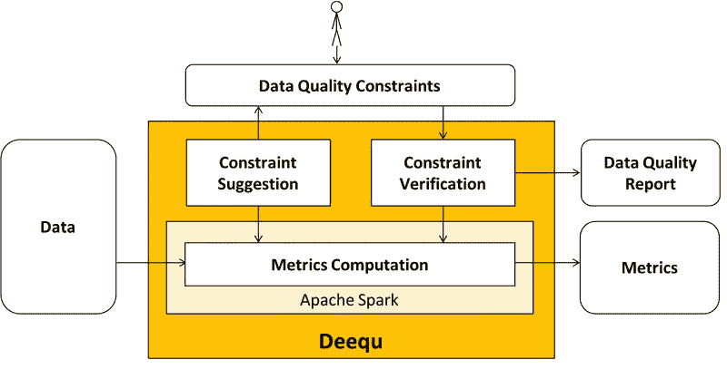
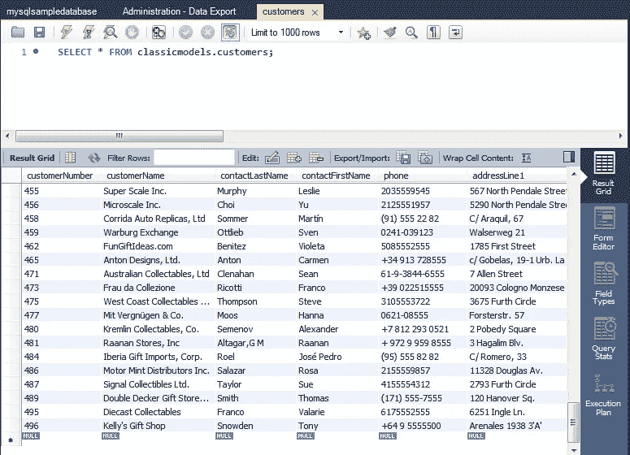

# 使用 Apache Spark 进行大规模自动化数据质量测试

> 原文：<https://towardsdatascience.com/automated-data-quality-testing-at-scale-using-apache-spark-93bb1e2c5cd0?source=collection_archive---------2----------------------->

## 亚马逊的开源库——dee qu


Photo by [Stephen Dawson](https://unsplash.com/@srd844?utm_source=unsplash&utm_medium=referral&utm_content=creditCopyText) on [Unsplash](https://unsplash.com/search/photos/data?utm_source=unsplash&utm_medium=referral&utm_content=creditCopyText)

我一直是一名技术架构师，主要负责数据湖/中心/平台类的项目。每天，我们都会从 100 多个业务系统中获取数据，以便分析和 BI 团队可以在项目中使用这些数据。

## 问题陈述

在接收数据时，我们避免任何转换。数据从源位置复制。源可以是 MySQL、SQL Server、Oracle、DB2 等类型。目标系统可以是 Hadoop/Hive 或 Big Query。尽管没有对数据进行转换，因为源系统和目标系统是不同的，但有时这些简单的数据接收可能会导致数据质量问题。源系统和目标系统可以有不同的数据类型，这可能会导致更多的问题。数据中的特殊字符可能会导致行/列移位。

## 可能的解决方案

为了解决这个问题，大多数开发人员在构建数据管道后，使用手工方法进行数据质量测试。这可以通过运行一些简单的测试来完成，比如

*   源和目标之间的样本数据比较
*   主键列上的空检查
*   日期列上的空检查
*   分类列的计数比较
*   等等。

这种方法有时效果很好，但是很耗时并且容易出错。因此，我开始寻找一些自动化的选项。

# 亚马逊的 Deequ

我对开源数据质量测试框架的搜索止步于来自**亚马逊**的 **Deequ** 库。 [Deequ](https://github.com/awslabs/deequ) 在亚马逊被用于验证许多大型生产数据集的质量。系统会定期计算数据质量指标。



Source — [https://aws.amazon.com/blogs/big-data/test-data-quality-at-scale-with-deequ/](https://aws.amazon.com/blogs/big-data/test-data-quality-at-scale-with-deequ/)

Deequ 建立在 Apache Spark**之上，因此它可以自然地扩展到海量数据。最棒的是，你不需要详细了解 Spark 就可以使用这个库。 **Deequ** 提供如下功能**

*   **约束建议** —测试什么。有时可能很难找到在特定对象中测试什么。Deequ 提供了内置的功能来识别要测试的约束。
*   **度量计算** —一旦我们知道要测试什么，我们就可以使用库给出的建议并运行测试来计算度量。
*   **约束验证**——使用 Deequ，我们还可以放置测试用例，并获得用于报告的结果。

# 让我们开始行动吧

为了运行 Deequ，我们需要首先准备好我们的工作站。您可以在一台简单的 Windows/Linux/Mac 机器上尝试一下。

## 先决条件

*   **安装 Scala**——你可以从——[https://www.scala-lang.org/](https://www.scala-lang.org/)下载安装 Scala
*   **安装 Apache Spark**——你可以从——[https://spark.apache.org/](https://spark.apache.org/)下载安装 Spark
*   **下载 Deequ 库** —您可以下载 Deequ JAR，如下所示—

```
wget http://repo1.maven.org/maven2/com/amazon/deequ/deequ/1.0.1/deequ-1.0.1.jar
```

*   **准备好要测试的数据** —如果你没有要测试的数据，你可以准备一个。对于本教程，我安装了一个 MySQL 实例，并从 http://www.mysqltutorial.org/mysql-sample-database.aspx[加载了一些样本数据](http://www.mysqltutorial.org/mysql-sample-database.aspx)
*   **下载 JDBC Jars** —对于您想要运行这些测试的任何类型的数据库，请确保在`$SPARK_HOME/jars`中添加 JDBC Jars。因为我要在 MySQL & Hive 上运行我的测试，所以我添加了各自的 JDBC jar。

## 在交互模式下启动 Spark

为了运行测试，我们将使用上一步下载的库在交互模式下启动 Spark，如下所示

```
PS D:\work\DataTesting> spark-shell --conf spark.jars=deequ-1.0.1.jar
Spark context Web UI available at [http://localhost:4040](http://SLB-CR3K882.DIR.slb.com:4040)
Spark context available as 'sc' (master = local[*], app id = local-1561783362821).
Spark session available as 'spark'.
Welcome to
      ____              __
     / __/__  ___ _____/ /__
    _\ \/ _ \/ _ `/ __/  '_/
   /___/ .__/\_,_/_/ /_/\_\   version 2.4.3
      /_/Using Scala version 2.11.12 (Java HotSpot(TM) 64-Bit Server VM, Java 1.8.0_171)
Type in expressions to have them evaluated.
Type :help for more information.scala>
```

## 约束建议

我计划在前面步骤中加载的`customer`表上运行测试。您可以使用 MySQL Workbench/CLI 来验证数据是否正确加载。



为了运行约束建议，我们需要首先使用 Spark 连接到 DB。

> 请注意，使用这种方法，我们将查询下推到底层数据库。所以直接在生产系统上运行时请小心。

```
import org.apache.spark.sql.SQLContextval sqlcontext = new org.apache.spark.sql.SQLContext(sc)val datasource = sqlcontext.read.format("jdbc").option("url", "jdbc:mysql://<IP>:3306/classicmodels").option("driver", "com.mysql.jdbc.Driver").option("dbtable", "customers").option("user", "<username>").option("password", "<password>").option("useSSL", "false").load()
```

在有效的连接上，您可以检查表的模式—

```
scala> datasource.printSchema()
root
 |-- customerNumber: integer (nullable = true)
 |-- customerName: string (nullable = true)
 |-- contactLastName: string (nullable = true)
 |-- contactFirstName: string (nullable = true)
 |-- phone: string (nullable = true)
 |-- addressLine1: string (nullable = true)
 |-- addressLine2: string (nullable = true)
 |-- city: string (nullable = true)
 |-- state: string (nullable = true)
 |-- postalCode: string (nullable = true)
 |-- country: string (nullable = true)
 |-- salesRepEmployeeNumber: integer (nullable = true)
 |-- creditLimit: decimal(10,2) (nullable = true)scala>
```

现在，让我们运行约束建议—

```
import com.amazon.deequ.suggestions.{ConstraintSuggestionRunner, Rules}
import spark.implicits._ // for toDS method// We ask deequ to compute constraint suggestions for us on the data
val suggestionResult = { ConstraintSuggestionRunner()
  // data to suggest constraints for
  .onData(datasource)
  // default set of rules for constraint suggestion
  .addConstraintRules(Rules.DEFAULT)
  // run data profiling and constraint suggestion
  .run()
}// We can now investigate the constraints that Deequ suggested. 
val suggestionDataFrame = suggestionResult.constraintSuggestions.flatMap { 
  case (column, suggestions) => 
    suggestions.map { constraint =>
      (column, constraint.description, constraint.codeForConstraint)
    } 
}.toSeq.toDS()
```

一旦执行完成，您可以打印如下所示的建议—

```
scala> suggestionDataFrame.toJSON.collect.foreach(println){"_1":"addressLine1","_2":"'addressLine1' is not null","_3":".isComplete(\"addressLine1\")"}
{"_1":"city","_2":"'city' is not null","_3":".isComplete(\"city\")"}
{"_1":"contactFirstName","_2":"'contactFirstName' is not null","_3":".isComplete(\"contactFirstName\")"}
{"_1":"state","_2":"'state' has less than 69% missing values","_3":".hasCompleteness(\"state\", _ >= 0.31, Some(\"It sho
uld be above 0.31!\"))"}
{"_1":"salesRepEmployeeNumber","_2":"'salesRepEmployeeNumber' has less than 25% missing values","_3":".hasCompleteness(\
"salesRepEmployeeNumber\", _ >= 0.75, Some(\"It should be above 0.75!\"))"}
{"_1":"salesRepEmployeeNumber","_2":"'salesRepEmployeeNumber' has no negative values","_3":".isNonNegative(\"salesRepEmp
loyeeNumber\")"}
{"_1":"customerName","_2":"'customerName' is not null","_3":".isComplete(\"customerName\")"}
{"_1":"creditLimit","_2":"'creditLimit' is not null","_3":".isComplete(\"creditLimit\")"}
{"_1":"creditLimit","_2":"'creditLimit' has no negative values","_3":".isNonNegative(\"creditLimit\")"}
{"_1":"country","_2":"'country' is not null","_3":".isComplete(\"country\")"}
{"_1":"country","_2":"'country' has value range 'USA', 'Germany', 'France', 'Spain', 'UK', 'Australia', 'Italy', 'New Ze
aland', 'Switzerland', 'Singapore', 'Finland', 'Canada', 'Portugal', 'Ireland', 'Norway  ', 'Austria', 'Sweden', 'Belgiu
m' for at least 84.0% of values","_3":".isContainedIn(\"country\", Array(\"USA\", \"Germany\", \"France\", \"Spain\", \"
UK\", \"Australia\", \"Italy\", \"New Zealand\", \"Switzerland\", \"Singapore\", \"Finland\", \"Canada\", \"Portugal\",
\"Ireland\", \"Norway  \", \"Austria\", \"Sweden\", \"Belgium\"), _ >= 0.84, Some(\"It should be above 0.84!\"))"}
{"_1":"postalCode","_2":"'postalCode' has less than 9% missing values","_3":".hasCompleteness(\"postalCode\", _ >= 0.9,
Some(\"It should be above 0.9!\"))"}
{"_1":"customerNumber","_2":"'customerNumber' is not null","_3":".isComplete(\"customerNumber\")"}
{"_1":"customerNumber","_2":"'customerNumber' has no negative values","_3":".isNonNegative(\"customerNumber\")"}
{"_1":"contactLastName","_2":"'contactLastName' is not null","_3":".isComplete(\"contactLastName\")"}
{"_1":"phone","_2":"'phone' is not null","_3":".isComplete(\"phone\")"}
```

这意味着你的测试用例已经准备好了。现在让我们运行指标计算。

## 度量计算

查看列和建议，现在我想运行指标计算。你可以这样做—

```
import com.amazon.deequ.analyzers.runners.{AnalysisRunner, AnalyzerContext}
import com.amazon.deequ.analyzers.runners.AnalyzerContext.successMetricsAsDataFrame
import com.amazon.deequ.analyzers.{Compliance, Correlation, Size, Completeness, Mean, ApproxCountDistinct, Maximum, Minimum, Entropy, GroupingAnalyzer}val analysisResult: AnalyzerContext = { AnalysisRunner
  // data to run the analysis on
  .onData(datasource)
  // define analyzers that compute metrics
  .addAnalyzer(Size())
  .addAnalyzer(Completeness("customerNumber"))
  .addAnalyzer(ApproxCountDistinct("customerNumber"))
  .addAnalyzer(Minimum("creditLimit"))
  .addAnalyzer(Mean("creditLimit"))
  .addAnalyzer(Maximum("creditLimit"))
  .addAnalyzer(Entropy("creditLimit"))
  .run()
}
```

如果运行成功，您可以看到结果

```
// retrieve successfully computed metrics as a Spark data frame
val metrics = successMetricsAsDataFrame(spark, analysisResult)metrics.show()scala> metrics.show()
+-------+--------------+-------------------+-----------------+
| entity|      instance|               name|            value|
+-------+--------------+-------------------+-----------------+
| Column|   creditLimit|            Entropy|4.106362796873961|
| Column|customerNumber|       Completeness|              1.0|
| Column|customerNumber|ApproxCountDistinct|            119.0|
| Column|   creditLimit|            Minimum|              0.0|
| Column|   creditLimit|               Mean|67659.01639344262|
| Column|   creditLimit|            Maximum|         227600.0|
|Dataset|             *|               Size|            122.0|
+-------+--------------+-------------------+-----------------+
```

您还可以存储这些数字以供进一步验证，甚至显示趋势。在本例中，我们运行的是使用[超对数](https://en.wikipedia.org/wiki/HyperLogLog)算法计算的`ApproxCountDistinct,`。这通过近似非重复计数来减少源系统的负担。

可用分析器的完整列表可在以下位置找到—[https://github . com/aw slabs/de equ/tree/master/src/main/Scala/com/Amazon/de equ/analyzer](https://github.com/awslabs/deequ/tree/master/src/main/scala/com/amazon/deequ/analyzers)

## 约束验证

现在让我们使用验证套件运行测试用例。

```
import com.amazon.deequ.{VerificationSuite, VerificationResult}
import com.amazon.deequ.VerificationResult.checkResultsAsDataFrame
import com.amazon.deequ.checks.{Check, CheckLevel}val verificationResult: VerificationResult = { VerificationSuite()
  // data to run the verification on
  .onData(datasource)
  // define a data quality check
  .addCheck(
    Check(CheckLevel.Error, "Data Validation Check") 
      .hasSize(_ == 122 ) 
      .isComplete("customerNumber") // should never be NULL
      .isUnique("customerNumber") // should not contain duplicates
      .isNonNegative("creditLimit")) // should not contain negative values
  // compute metrics and verify check conditions
  .run()
}
```

运行完成后，您可以查看结果

```
// convert check results to a Spark data frame
val resultDataFrame = checkResultsAsDataFrame(spark, verificationResult)resultDataFrame.show()scala> resultDataFrame.show()
+-------------------+-----------+------------+--------------------+-----------------+------------------+
|              check|check_level|check_status|          constraint|constraint_status|constraint_message|
+-------------------+-----------+------------+--------------------+-----------------+------------------+
|Data Validate Check|      Error|     Success|SizeConstraint(Si...|          Success|                  |
|Data Validate Check|      Error|     Success|CompletenessConst...|          Success|                  |
|Data Validate Check|      Error|     Success|UniquenessConstra...|          Success|                  |
|Data Validate Check|      Error|     Success|ComplianceConstra...|          Success|                  |
+-------------------+-----------+------------+--------------------+-----------------+------------------+
```

如果某个特定的案例失败了，您可以查看如下所示的详细信息

```
resultDataFrame.filter(resultDataFrame("constraint_status")==="Failure").toJSON.collect.foreach(println)
```

## 增量数据的数据验证

Deequ 还提供了一种验证增量数据加载的方法。你可以在[https://github . com/aw slats/dee qu/blob/master/src/main/Scala/com/Amazon/dee qu/examples/algebraic _ States _ example . MD](https://github.com/awslabs/deequ/blob/master/src/main/scala/com/amazon/deequ/examples/algebraic_states_example.md)了解更多关于这种方法的信息

## 异常检测

Deequ 还提供了一种检测异常的方法。GitHub 页面列出了一些方法和策略。详情可以在这里找到——[https://github . com/aw slabs/dee qu/tree/master/src/main/Scala/com/Amazon/dee qu/anomaly detection](https://github.com/awslabs/deequ/tree/master/src/main/scala/com/amazon/deequ/anomalydetection)

# 结论

总的来说，我认为 Deequ 是一个很好的工具，可以用于数据湖/中心/数据仓库类用例中的数据验证和质量测试。亚马逊甚至发表了一篇关于这种方法的研究论文。这可以在 http://www.vldb.org/pvldb/vol11/p1781-schelter.pdf 观看

如果你尝试这个，一定要让我知道你的经历。如果你有一些有趣的想法，请不要忘记在评论中提及。

```
Hey, if you enjoyed this story, check out [Medium Membership](https://deshpandetanmay.medium.com/membership)! Just $5/month!*Your membership fee directly supports me and other writers you read. You’ll also get full access to every story on Medium.*
```