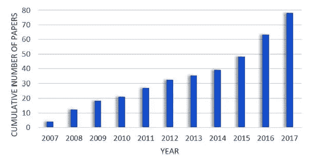
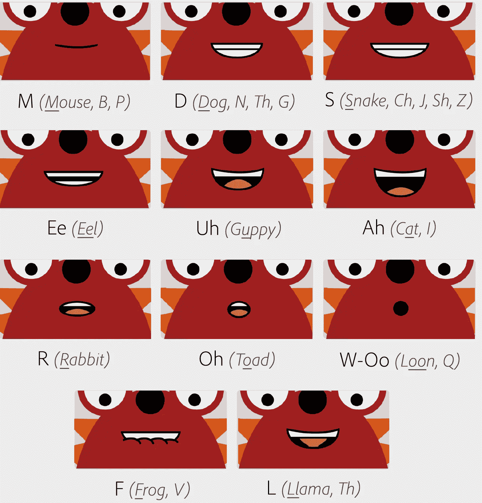
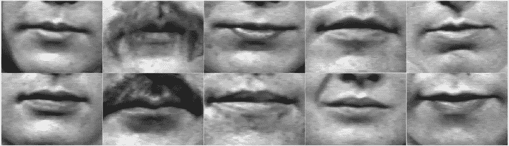
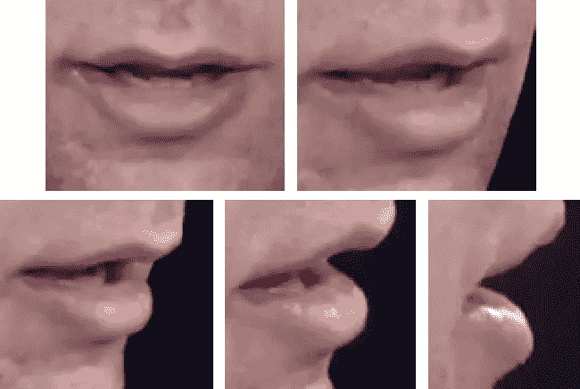
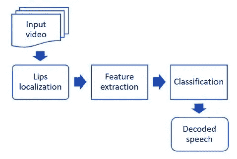
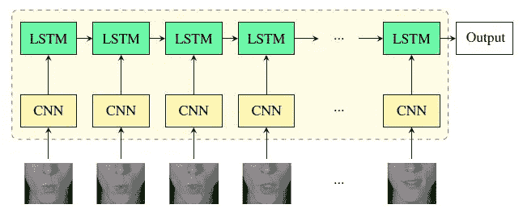

# 自动唇读:简化

> 原文：<https://towardsdatascience.com/automated-lip-reading-simplified-c01789469dd8?source=collection_archive---------10----------------------->

## 看一眼自动化唇读的世界(ALR)

## 为什么要读唇语？

专业的唇读并不是最近才有的概念。它实际上已经存在了几个世纪。显然，唇读背后的最大动机之一是为听力障碍者提供一种理解对他们说的话的方式。

然而，随着计算机视觉和深度学习领域技术的进步，机器自动唇读现在已经成为现实可能。请注意这个领域的发展，显示为每年发表的关于 ALR 的论文的累积数量。

Cumulative number of papers on ALR systems published between 2007 and 2017 [1]

这些进步开辟了各种新的讨论途径，涉及 ALR 的应用、窥探私人谈话的道德问题，以及最重要的是它对数据隐私的影响。

 [## 自动唇读可能会威胁到数据隐私(但暂时不会)

### 想想唇语的错综复杂，你就明白了。

medium.com](https://medium.com/datadriveninvestor/automated-lip-reading-may-threaten-data-privacy-but-not-for-a-while-b08392914351) 

然而，我今天不是来讨论这个问题的。这个博客是为那些想更深入了解这些 ALR 系统如何工作的好奇的少数人准备的。任何之前完全没有深度学习经验的人都可以肤浅地关注博客。即使是对深度学习的初步了解，也足以充分体会其中的细节。

## 唇读难吗？

看看这个《行尸走肉》几个短片的*烂唇读*视频就知道了(把声音关了)。*再看一遍*，有声音，只是为了好玩:P

*滑稽..对吗？对话似乎与视频非常匹配，但显然有些地方感觉不对劲。到底出了什么问题？首先，这些显然不是真正的对话。但是为什么它们看起来如此完美？*

这是因为嘴唇运动和音素(语言中最小的声音单位)之间没有直接的一一对应关系。比如/p/和/b/在视觉上是无法区分的。所以，同样的嘴唇动作可能是许多不同句子的结果。

但是专业的唇语读者是怎么做到的呢？专业的唇读是对唇动、肢体语言、手部动作和语境的理解的结合，以解读说话者想要说的话。听起来很复杂..对吗？好吧，让我们看看机器是怎么做的…

## ALR、ASR 和 AV-ASR 有什么区别？

首先，让我们了解一下 3 个看似常见的术语 ALR、ASR 和 AV-ASR 之间的区别

*   自动唇读(ALR) :-试图理解仅仅基于视频(视觉)的说话内容。
*   自动语音识别(ASR) :-试图仅根据音频来理解正在说的内容。通常称为语音转文本系统。
*   视听-自动语音识别(AV-ASR) :-使用音频和视觉线索来理解正在说的内容。

## 字母和数字识别

ALR 早期的工作集中在简单的任务上，如字母或数字识别。这些数据集包含各种说话者的小片段，具有各种空间和时间分辨率，说单个字母(或音素)或数字。这些任务在 ALR 的早期阶段很流行，因为它们允许研究人员在受控的环境和受限的词汇下工作。

Frames from AVLetters, one of the most used alphabet recognition dataset

## 单词和句子识别

虽然字母和数字识别的受控设置对于在早期设计阶段分析算法的有效性是有用的，但是得到的模型不具有在野外运行的能力。ALR 系统的目的是理解自然语音，自然语音主要是由句子构成的，这使得有必要获取包含单词、短语和语音平衡句子的数据库以及可以有效处理这些内容的模型。

Frames from OuluVS2, a multi dimensional audio-visual dataset for tasks like ALR, ASR and AV-ASR

## 管道的浅见

典型 ALR 系统主要由三部分组成

1.  嘴唇定位，
2.  视觉特征的提取，
3.  并分类成序列

第一个模块集中在人脸和嘴唇检测上，本质上是一个计算机视觉问题。第二个模块的目标是为每一帧可观察到的视觉信息提供特征值(数学值)，这也是一个计算机视觉问题。最后，分类块旨在将这些特征映射到语音单元，同时确保完整的解码消息是连贯的，这属于自然语言处理(NLP)的领域。这个最后的块通过使用上下文帮助在视觉上相似的语音单元之间消除歧义。

## 基于深度学习的 ALR 系统

在过去的几年里，ALR 系统的性能有了显著的提高，这要归功于基于深度学习的架构越来越多地参与到管道中。

前两个模块，即嘴唇定位和特征提取是使用 CNN 完成的。一些其他基于 DL 的特征提取架构也包括 3D-CNN 或前馈网络。最后一层由 LSTMs 组成，通过考虑所有单独的帧输出来进行最终分类。其他一些基于 DL 的序列分类体系结构包括 Bi-lstm、GRUs 和 lstm。

An example of a DL based baseline for ALR systems [1]

## 下一步是什么？

在过去几年中，可以看到从传统架构到端到端 DNN 架构的明显技术转移，目前由 CNN 功能结合 LSTMs 主导。

然而，在大多数这些模型中，系统的输出被限制在预定义数量的可能类别(字母、单词甚至句子)，这与目标是自然语音的连续唇读形成对比。最近生产连续唇读系统的尝试集中于基本语言结构，例如字符或音素。因此，不足为奇的是，ALR 系统目前的主要挑战是能够模拟连续的唇读系统。

这个博客是为机器学习领域创建简化介绍的努力的一部分。点击此处的完整系列

 [## 机器学习:简化

### 在你一头扎进去之前就知道了

medium.com](https://medium.com/@prakhargannu/machine-learning-simplified-1fe22fec0fac) 

*或者干脆阅读系列的下一篇博客*

 [## 人体姿态估计:简化

### 看看人类姿势估计的世界

towardsdatascience.com](/human-pose-estimation-simplified-6cfd88542ab3) 

## 参考

*[1]费尔南德斯-洛佩兹、阿德里亚娜和费德里科-苏克诺。“深度学习时代的自动唇读调查。”图像与视觉计算(2018)。
【2】钟，俊儿，和安德鲁·齐塞曼。"通过看视频学习唇读单词."计算机视觉与图像理解 173(2018):76–85。
[3] K.L. Moll，R.G. Daniloff，言语过程中帆运动时机的研究，J. Acoust。社会主义者我是。50 (2B) (1971 年)*