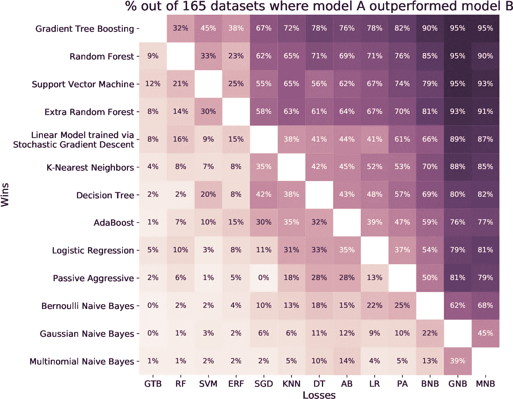
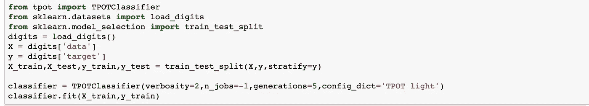
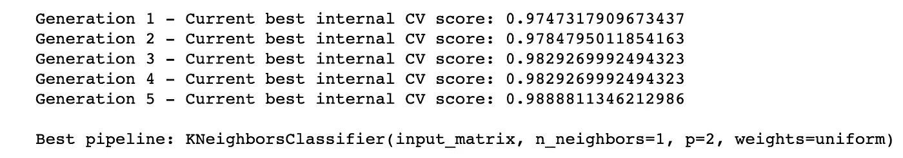

# 自动化机器学习

> 原文：<https://towardsdatascience.com/automated-machine-learning-d8568857bda1?source=collection_archive---------8----------------------->

自动机器学习(AutoML)目前是数据科学中爆炸性的子领域之一。对于那些不精通机器学习的人来说，这听起来很棒，对于当前的数据科学家来说，这很可怕。媒体对 AutoML 的描述让它看起来能够彻底改变我们创建模型的方式，不再需要数据科学家。虽然一些公司如 [DataRobot](https://www.datarobot.com/) 的目标是完全自动化机器学习过程，但该领域的大多数公司都在创建 AutoML 作为一种工具，以增加当前数据科学家的产量，并简化进入该领域的过程，使其更容易获得。

AutoML 作为一个完全自动化过程的工具，在理论上是一个很好的想法，但是在现实世界中，它引入了许多偏见和误解的机会。在过去的几年里，机器学习领域已经开始脱离“黑盒”模型，转而使用更简单、更容易解释的模型。复杂的模型可能难以解读，因此很难知道模型何时引入了偏差。AutoML 现在加剧了黑盒模型的这个问题，它不仅隐藏了模型的数学，还在后台执行以下操作:

*   数据清理
*   特征选择
*   型号选择
*   参数选择。

随着以上所有的自动化，使用这些系统的人还剩下什么呢？除了获取数据集和读取结果，什么都不做。这种程度的自动化给我们的模型和解释它们的人都带来了潜在的问题。在学习成为数据科学家的过程中，有三件事变得尤为重要。

1.  模型的好坏取决于给定的数据，如果数据有缺陷，模型很容易产生偏差。
2.  机器非常擅长最大化人类给定的目标函数，无论该目标函数是否准确或正确。
3.  学习数据科学的很大一部分是为了理解模型的算法及其结果，如果没有这方面的知识，很容易对模型结果做出不正确的推断。

在过去的几年里，我们已经看到了许多关于流通模型的报告，这些模型不断地做出不正确的/有偏见的预测。如果现实世界中存在偏差，那么如果在模型中没有对其进行适当的考虑，这种偏差很容易增加。如果我们用 AutoML 来完全自动化这个过程，可能弊大于利。然而，完全自动化只是少数公司研究人员的目标，还有一个方面可能会使社区受益匪浅。

我看了 Randall Olsen 在 Scipy 2018 的演讲，[自动机器学习的过去、现在和未来](https://www.youtube.com/watch?v=QrJlj0VCHys)。在他的演讲中，他强调 AutoML 不是为了取代数据科学家，而是像我上面所说的那样，是为了提高当前数据科学家的生产力，让那些多年来没有研究这些算法的人更容易进入这个领域。

Source: SemanticsScholar.org

作为一名数据科学家，我可以使用这些应用程序快速浏览我的数据，并了解如何开始建模。AutoML 不会告诉我使用哪个模型，而是让我知道什么模型和技术是有效的，节省了我花在探索性数据分析和数据清理上的时间，而这些时间可以花在微调模型上。一个例子是 TPOT，由上位实验室创建，这是一个基于 Scikit-Learn(一个非常流行的机器学习库)构建的 Python 自动语言库。其设计旨在快速运行数据分析，并让您知道哪些模型、功能和参数比其他更有效。

Source: [https://epistasislab.github.io/tpot/](https://epistasislab.github.io/tpot/)

TPOT 应该被看作是一个起点或一个比较模型，而不是一个最终产品。它打开了思路和技术，以我们可能没有想到或没有时间深入探索的方式接近我们当前的数据集。可以想象，这些算法具有非常复杂的样本空间/模型，数据集越大，使用的算法越复杂，情况就越复杂。使用非常高级的算法来导航该样本空间，包括:

*   元学习
*   贝叶斯优化
*   遗传表演程序
*   多臂强盗

因为它们非常复杂，所以运行时间非常长，根据问题的不同可能需要几天时间。这只是加强了 AutoML 将被用作帮助数据科学家的工具的想法，因为这些算法可以在后台运行，而我们则在项目的其他方面工作。在接下来的几年里，这些工具将继续改进，但它们不会取代数据科学家。相反，它们将增强我们所能完成的，并允许机器学习随着该领域变得越来越容易接近而发展。

我想看看这些 AutoML 库是如何运行的，所以我按照 Randall Olsen 演讲中的代码，在 MNIST 数据集上运行 TPOT，这是一个包含数字的图像数据集。这只需要 9 行代码，我就可以达到 98%的准确率。

TPOT 能够使用欧氏距离确定 K 个最近邻，K =1 是分类 MNIST 数据集的最佳算法。虽然这种方法快速、简单且准确，但不需要理解它在做什么或告诉我们什么。失去了这一点，我们就失去了对模型的所有解释，也失去了决定我们为什么会得到这些数字的能力。

引用作品:

[https://www.youtube.com/watch?v=QrJlj0VCHy](https://www.youtube.com/watch?v=QrJlj0VCHys)