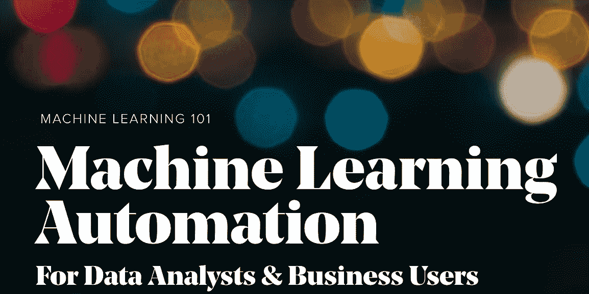
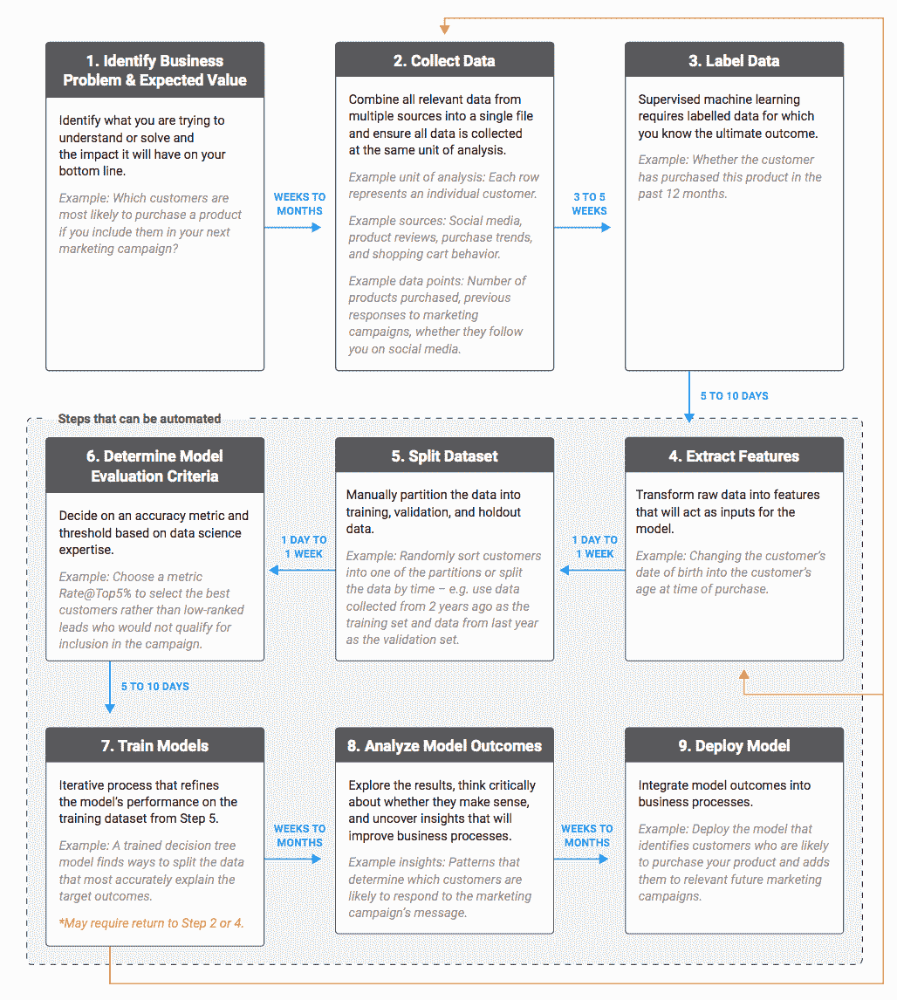
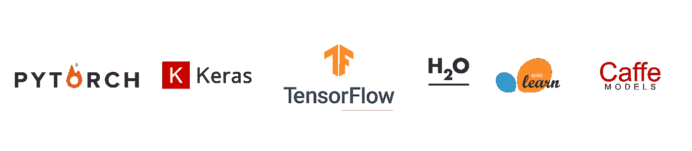

# 面向数据分析师和业务用户的自动化机器学习

> 原文：<https://towardsdatascience.com/automated-machine-learning-for-data-analysts-business-users-63ed9b34f92?source=collection_archive---------28----------------------->

## 增强人工智能——机器学习

## 在不到五分钟的时间内构建您的第一个机器学习模型。

Automated Machine Learning for Business Users & Data Analysts

> `***Automated Machine Learning (AutoML) represents a fundamental shift in the way organizations of all sizes approach machine learning and data science.***`

机器学习是人工智能的一个分支，基于这样一种想法，即系统可以从数据中学习，识别模式并在最少的人工干预下做出决策。机器学习为我们在各个行业提供了一些重大突破。金融服务、零售、医疗保健、银行等领域一直在以这样或那样的方式使用机器学习系统，结果非常有希望。

今天的机器学习不仅仅局限于 R&D，而且已经渗透到企业领域。然而，传统的机器学习过程严重依赖于人类，并不是所有的企业都有资源投资于经验丰富的数据科学团队。即使公司拥有资源、数据科学家和工程师，这些专业人员也不得不每月花费数百个小时来构建和维护这些机器学习系统。

我们的研究还表明，当前大多数数据科学家缺乏领域专业知识，因此需要与不同部门的专业人员合作来解决特定问题，例如，预测哪些客户更有可能购买产品。这些部门代表是具有更深层次业务知识和分析技能的专家，但缺乏预测分析技能，特别是机器学习。

> `***Automated ML democratizes the machine learning model development process, and empowers its users, no matter what their data science expertise is, to identify an end-to-end machine learning pipeline for any problem***`

自动化机器学习正在催生公民数据科学家，因为它使在现实世界中构建和使用机器学习模型变得更加容易，而无需编写代码。自动化机器学习融合了来自顶级数据科学家的最佳机器学习实践，最先进的开源库，使机器学习和数据科学在整个组织中更容易获得。

以下是传统的模型构建过程:

**图一:**

Traditional Machine Learning Model Building Process

从上面的**图 1** 可以看出，用传统流程开发一个模型是极其耗时、重复和繁琐的。自动化机器学习应用程序自动执行通常需要熟练的数据科学家才能完成的模型构建任务。自动化机器学习系统不是花费几周或几个月的时间，而是快速的，通常需要几天时间让业务用户/数据分析师建立数百个模型，进行预测并产生见解。数据分析师的机器学习自动化使组织能够事半功倍。

AutoML 使医疗保健、金融科技、银行等行业的企业有可能利用先进的机器学习和人工智能技术，这些技术以前仅限于拥有大量资源的组织。通过自动化大多数机器学习建模任务，AutoML 使业务用户和数据分析师能够轻松实现机器学习解决方案，并更加专注于解决复杂的业务问题。

跨行业的数据分析师和业务用户可以使用自动化机器学习来:

> `***1\. Implement ML-powered solutions without extensive programming knowledge***`
> 
> `***2\. Save time and resources***`
> 
> `***3\. Leverage data science best practices***`
> 
> `***4\. Agile problem-solving***`

# 自动化机器学习是如何工作的？

有许多工具，每个都有自己的内部功能，但我们将只关注 m trons dp2——一种内置数据准备和 AutoML 库的新型应用程序。

通过使用非常直观的 Web 用户界面，用户可以通过五个简单的步骤构建新的项目和运行 ML 实验。

> `***1\. Identify the use-case: predict demand, customer churn or credit card fraud***`
> 
> `***2\. Identify the ML problem type: Regression, Classification or Time-Serices***`
> 
> `***3\. Upload your data or connect your data source***`
> 
> `***3\. Choose your target variable (the variable you want to predict)***`
> 
> `***4\. Train & evaluation 100s of machine learning algorithms****`
> 
> `***5\. Deploy the best performing algorithm and make predictions*****`

* mltrons 自动机器学习管理最先进的库，如 AutoKeras、PyTorch、TensorFlow、H2O、TPOT、Caffe、SageMaker 和 AlphaD3M，以建立最适合数据的模型。Mltrons 内置了支持深度学习的 GPU。

Available libraries within the mltrons framework

** mltrons AutoML for data analysts 允许他们使用“假设”情景模拟器来创建多种结果的策略。这填补了数据分析师/科学家和执行决策者之间的空白。

# 一切从今天开始！

这是为了快速产生价值，尽可能多地承担你能处理的小项目。借助自动化机器学习，数据分析师可以开始构建机器学习模型，并将他们的技能提升到一个新的水平。另一方面，企业可以获得多项成功，并在更短的时间内完成其组织内的多个使用案例，这将形成势头，并使迭代和扩展数据货币化成为可能。

**关于作者**

[Raheel Ahmad](https://www.linkedin.com/in/raheelahmad12/) 是 [mltrons](https://www.mltrons.com) 的首席执行官和联合创始人。你可以在[推特](https://twitter.com/rahmad657)、[脸书](https://www.facebook.com/raheelahmad786)和 [LinkedIn](https://www.linkedin.com/in/raheelahmad12/) 上和他联系。