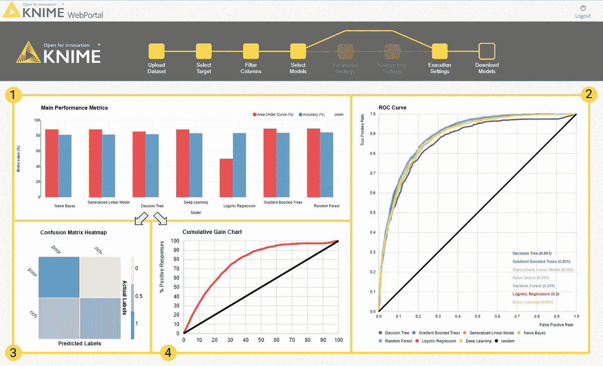
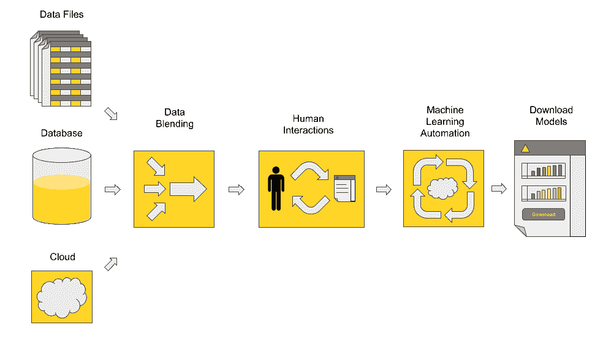

# 自动化机器学习:到底有多少？

> 原文：<https://towardsdatascience.com/automated-machine-learning-just-how-much-7330fd4f882e?source=collection_archive---------19----------------------->

**我对三位数据科学家和指导自动化专家的采访**

Landing page of the Guided Automation web application

目前有很多关于[自动机器学习](https://en.wikipedia.org/wiki/Automated_machine_learning)的讨论。也有很高程度的怀疑。

我和数据科学家 [Paolo Tamagnini](https://www.linkedin.com/in/paolo-tamagnini/) 、 [Simon Schmid](https://www.linkedin.com/in/simon-schmid/) 和 [Christian Dietz](https://www.linkedin.com/in/christian-dietz-18702056/) 在一起，从他们的角度就这个话题问了几个问题，我发现[引导自动化](https://youtu.be/iMdNFY_hplw)的概念也很有趣，因为它直接涉及自动化机器学习的实践。

**Rosaria Silipo:** 什么是自动化机器学习？

**Christian Dietz:** 自动化机器学习是指构建一个系统、流程或应用程序，能够在尽可能少的人工输入下自动创建、训练和测试机器学习模型。 [CRISP-DM](https://en.wikipedia.org/wiki/Cross-industry_standard_process_for_data_mining) 周期是在近 20 年前引入的，现在是一个具有标准步骤的既定流程，如数据准备、功能工程和功能优化、模型训练、模型优化、模型测试和部署，这些步骤在大多数数据科学项目中都很常见。自动化的目的是尽可能地从这些步骤中去除人工干预。

有不同的算法和策略可以做到这一点，这些算法和策略因复杂性和性能而异，但主要思想是让业务分析师能够训练大量模型，并通过少量配置提供最佳模型。

我们通常只谈论自动化机器学习，但它实际上是将自动化融入尽可能多的循环步骤中——而不仅仅是模型的训练/选择。例如，自动化数据争论或数据可视化的应用程序也开始出现。

**Rosaria:** 在没有专家干预的情况下，自动化机器学习真的可以完全自动化[数据科学周期](https://www.dataversity.net/practicing-data-science/)吗？

**西蒙·施密德:**这是个棘手的问题！有人说能，有人说不能。

在我看来，对于标准的数据科学问题，自动化机器学习可以完全自动化数据科学周期。你知道这种情况:你有一些数据，这些数据很一般，很好地描述了问题，没有不平衡的类。你选择一个模型，在训练集上训练它，在测试集上评估它。如果性能可以接受，就部署它。没有大的意外。在这种情况下，整个循环可以自动化，甚至引入一些额外的优化步骤。

然而，更复杂的数据科学问题可能需要一定程度的人工或专家的参与。

例如，领域专家可以在继续机器学习过程之前添加一些关于数据处理和过滤的独特知识。此外，当数据领域变得比简单的表格数据更复杂时，例如，包括文本、图像或时间序列，领域专家可以为数据准备、数据划分和特征工程提供定制技术。

基本上，你的问题的答案是“有时”正是因为这个原因，我们的团队使用了一个允许两种选择的框架。您可以运行一个完全自动化的周期，或者您可以决定在过程中的选择点进行干预。这是通过一个叫做[引导分析](https://www.knime.com/blog/principles-of-guided-analytics)的特性提供的功能。Guided Analytics 允许您在工作流中散布交互点，从而在需要时将数据科学应用转向不同的方向。

**罗萨莉亚:**你已经描述过了，但是我想我们的读者会从一些额外的细节中受益。你能告诉我们更多关于引导式分析的信息吗？

**Paolo Tamagnini** :引导式分析是指在数据管道中灵活地添加交互点，即在分析过程中数据经过的一系列步骤之间。当你开发一个数据处理或数据分析应用程序时，你不仅仅是为自己开发，也是为其他人开发。因此，为了让任何人都有机会调整分析如何进行，您应该在整个管道的战略位置添加一些交互点。

数据管道也称为工作流，交互点是网页，通过包装的元节点无需任何脚本即可轻松创建。例如，在报告应用程序中，您可以请求用户选择要显示的时间窗口或 KPI 在数据争论应用程序中，你可以询问哪些数据源应该混合在一起，应该构建什么样的特性；在[机器学习](https://www.dataversity.net/neural-machine-translation-with-sequence-to-sequence-rnn/)应用中，您可以要求用户指定目标变量和输入变量、应训练的模型以及是否需要执行特征工程。

**Rosaria:** 所以，引导自动化是你对自动化机器学习应用的解释。你能简单描述一下它是如何工作的吗？

**克里斯蒂安:** [引导式自动化](https://www.knime.com/blog/intelligently-automating-machine-learning-artificial-intelligence-and-data-science)是将引导式分析与自动化机器学习相结合的产物。您可以灵活地要求业务分析师在必要的时候加入他们的专业知识，从而自动化分析的标准部分。自动化和交互的适当数量取决于不同的问题。有时，您可以继续使用默认的选择，而有时您需要进一步的输入来改进和控制这个过程。

自动化机器学习应用的引导式分析中的常见交互点是上传数据和选择目标的时间，指定哪些特征将用作输入和训练哪些模型，而自动化主要涉及超参数优化和特征选择。您还可以添加可选的交互点，例如定制功能工程或选择定制可伸缩性的执行环境。

该流程包括自动化和交互点，如下图所示。在为引导式自动化实现蓝图工作流时，我们遵循了这个图表中的一般方法。

Image Credit: [KNIME](https://www.knime.com/)

**Rosaria:** 这个引导自动化的蓝图…这个蓝图是我可以购买的软件解决方案吗？

**保罗:**买？不，是免费的！就像我们在使用的所有示例和蓝图工作流一样。你所需要做的就是下载一个开源副本，启动它，打开[实例服务器](https://www.knime.com/knime-introductory-course/chapter1/section2/examples-server)，在 50 _ Applications/36 _ Guided _ Analytics _ for _ ML _ Automation 找到蓝图，拖放到你的本地工作区，然后你就可以在你自己的数据上自动化机器学习过程了。请随意定制它。它最终是一个蓝图，您可以根据您的数据科学问题对其进行改进和定制，以实现最佳性能。

**罗莎丽亚:**不错！我需要特殊的软件来正确运行引导自动化的蓝图吗？

绝对不行。在 KNIME Server 上，您可以从任何 web 浏览器远程访问交互点，这非常有用。但是使用开源和免费的分析平台，您还可以运行蓝图，访问交互点，并通过客户端内置的 web 浏览器与工作流进行交互。

Rosaria: 在哪里可以学习如何定制引导式自动化的蓝图？

一般来说，你可以从免费的电子学习课程开始。在那里，您可以了解更多:如何访问数据，如何执行 ETL 操作，以及如何显示绘图和图表。

感谢 Christian、Paolo 和 Simon 的宝贵时间和清晰的回答！现在我更了解自动化机器学习的一般概念，引导式分析，以及您创建的蓝图，引导式自动化。

*为首次发表于*[*data versity*](https://www.dataversity.net/automated-machine-learning-just-how-much/)*。*