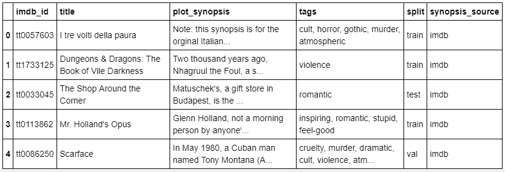
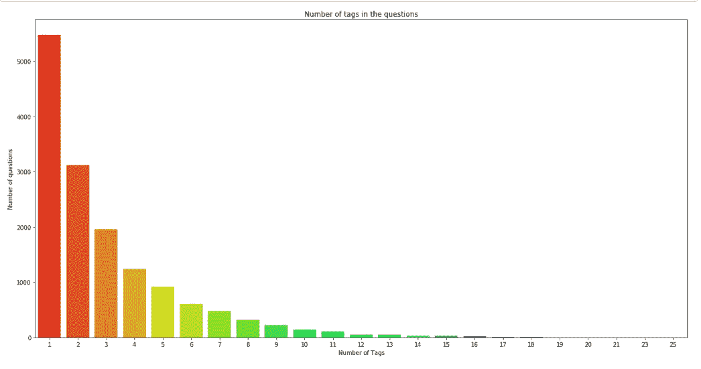
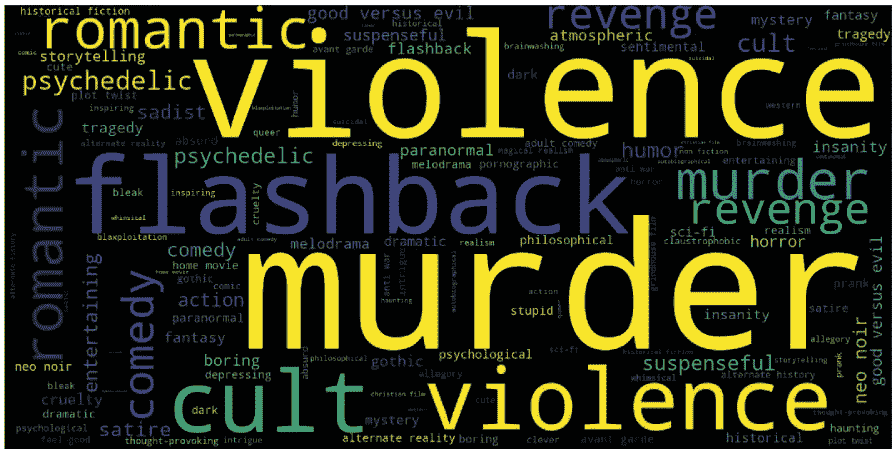
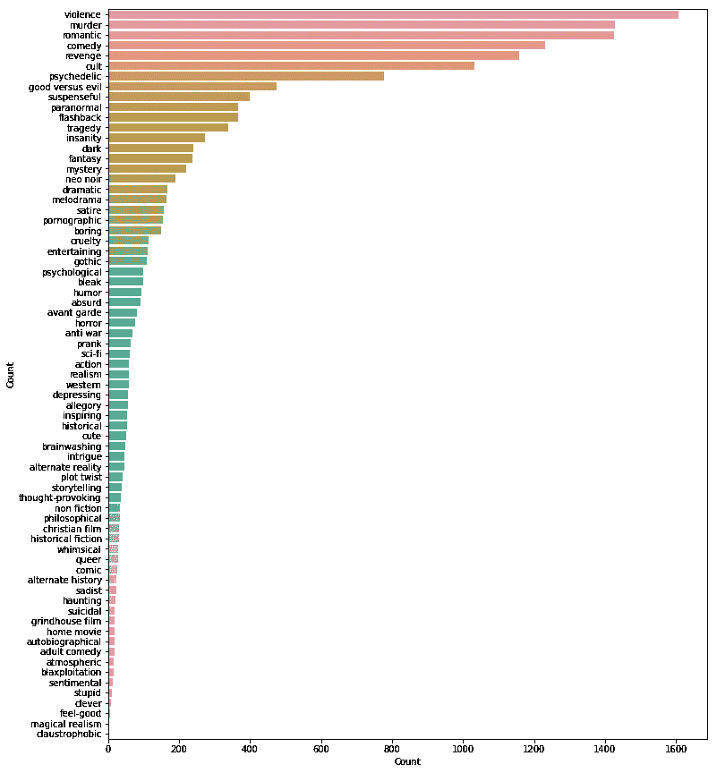
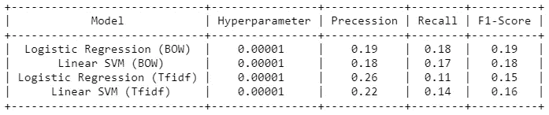
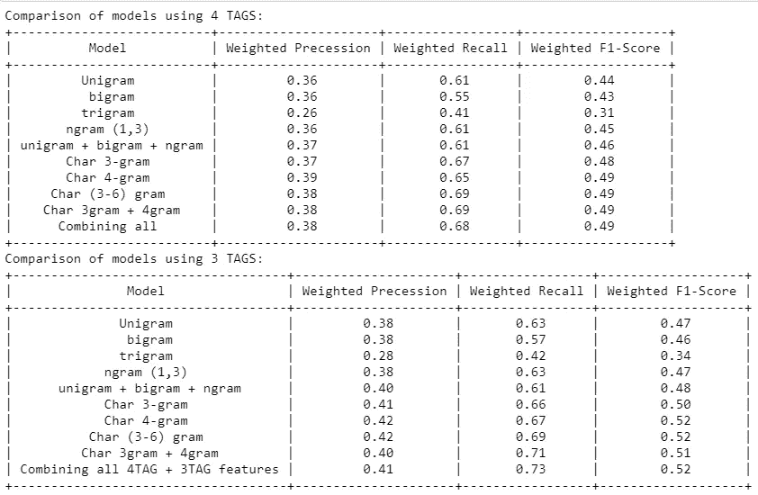

# 自动电影标记——一个多类分类问题

> 原文：<https://towardsdatascience.com/automated-movie-tagging-a-multiclass-classification-problem-721eb7fb70c2?source=collection_archive---------17----------------------->

## 从电影概要中自动提取标签的多类分类问题。


Photo by: Kyle Hinkson on Unsplash

电影标签揭示了关于电影的各种各样的异质信息，如类型、情节结构、配乐、元数据、视觉和情感体验。这些信息对于构建自动系统来为电影创建标签很有价值。

自动标记系统也有助于推荐引擎改进相似电影的检索，以及帮助观众预先知道对电影的期望。

在这篇文章中，我们将使用广泛的机器学习算法和 NLTK 功能从电影概要中挖掘出电影标签。所以让我们开始吧！

# **数据来源**

我们在本案例研究中使用的数据是从 [Kaggle](https://www.kaggle.com/cryptexcode/mpst-movie-plot-synopses-with-tags#mpst_full_data.csv) 中的数据集收集的，该数据集包含超过 14k 部电影和大约 142 个独特的标签。

我们来看看数据:



从上表中，我们可以看到每部电影都有概要和与之对应的几个异构标签。此外，数据是从 IMDB 和维基百科收集的。

# 探索性数据分析

首先，我们尝试从数据集中删除重复项并进行分析:

1.  每个问题的标签数。
2.  最常见的标签。
3.  数据集中标签的频率。

**每个问题的标签数量:-**

[Code](https://github.com/shamim-io/MPST-Movie-Plot-Synopses-with-Tags/blob/master/theshamimahmed%40gmail.com_CS1_V3.ipynb)



在进行了一些计算后，我们发现大多数电影都有一个标签。每部电影的平均标签数为 2.99。

**最常用的标签:-**

为此，我们将绘制一个单词云并将其可视化。



**标签的频率:-**



在分析了上述 EDA 之后，我们得出结论，一些电影有大量的标签，但大多数电影只标记了一两个标签。谋杀、暴力、倒叙和浪漫是语料库中出现频率最高的四个标签。最不常用的标签是愚蠢，聪明，感觉良好，幽闭恐惧症。

# 情节提要的清理和预处理

现在，我们已经完成了重复数据删除，我们的数据需要一些预处理，然后才能继续分析和建立预测模型。

因此，在预处理阶段，我们按以下顺序执行以下操作

1.  从移除 HTML 标签开始
2.  删除任何标点符号或有限的一组特殊字符，如、或。或者#，等等。
3.  检查单词是否由英文字母组成，并且不是字母数字
4.  检查单词的长度是否大于 2(据调查，没有两个字母的形容词)
5.  将单词转换成小写
6.  移除[停用词](https://en.wikipedia.org/wiki/Stop_words)
7.  单词被词汇化——第三人称的单词被改成第一人称，过去时态和将来时态的动词被改成现在时态。
8.  最后，雪球[用词干](https://en.wikipedia.org/wiki/Stemming)这个词(据观察，它比波特[用词干](https://en.wikipedia.org/wiki/Stemming)要好)

现在，我们已经对标签分析有了简单的了解，并在更大程度上清理了我们的情节概要，让我们开始真正有趣的部分。

# 利用情节概要预测标签的机器学习方法

最重要的工作是将数据分成训练集和测试集。集合的训练部分将用于训练模型。我们使用测试部分[交叉验证](https://en.wikipedia.org/wiki/Cross-validation_(statistics))并测试训练好的模型。为此，我们根据文本语料库中给定的列`split`拆分数据。

```
x_train=new_data.loc[(new_data['split'] == 'train') |(new_data['split'] == 'val')]
x_test=new_data.loc[(new_data['split'] == 'test')]
```

接下来，我们定义随机基线模型来比较我们提出的模型在预测电影标签的任务中的性能。基线模型将所有标签分配给所有电影。

但在继续之前，让我们先了解几个术语:

[**Pipeline**](https://scikit-learn.org/stable/modules/generated/sklearn.pipeline.Pipeline.html) 类允许将多个进程粘贴到单个 Scikit-learn 估计器中。我们将在开始部分使用相同的。

[**OneVSRest 分类器**](https://scikit-learn.org/stable/modules/generated/sklearn.multiclass.OneVsRestClassifier.html) ，对于每个分类器，该类与所有其他类匹配。

[**计数矢量器**](https://scikit-learn.org/stable/modules/generated/sklearn.feature_extraction.text.CountVectorizer.html) 提供了一种简单的方法，既可以标记一组文本文档，构建一个已知单词的词汇表，还可以使用这个词汇表对新文档进行编码。

[**tfidfttransformer**](https://scikit-learn.org/stable/modules/generated/sklearn.feature_extraction.text.TfidfTransformer.html)**将计数矩阵转换为归一化的 tf 或 tf-idf 表示。CountVectorizer 和 TfidfTransformer(use _ IDF = False)都产生词频，TfidfTransformer 正在对计数进行规范化。**

**A [**宏观平均**](https://datascience.stackexchange.com/questions/15989/micro-average-vs-macro-average-performance-in-a-multiclass-classification-settin) 计算 [**精度**](https://en.wikipedia.org/wiki/Precision_and_recall) ， [**召回**](https://en.wikipedia.org/wiki/Precision_and_recall) 和[**f1-独立地为每个类评分**](https://en.wikipedia.org/wiki/F1_score) ，然后取平均值(因此平等地对待所有类)，而 [**微观平均**](https://datascience.stackexchange.com/questions/15989/micro-average-vs-macro-average-performance-in-a-multiclass-classification-settin) 将聚集所有类的贡献来计算平均度量。在多类别分类设置中，如果您怀疑可能存在类别不平衡(例如，一个类别的示例可能比其他类别的多得多)，微平均值是更好的选择。**

**所有上述术语需要更广泛的解释，但那是另一天的故事。**

**由于这是一个多类分类问题，我们将上述模块用于我们的基线和特征工程(将在下面讨论)模型。**

```
Micro-average quality numbers
Precision: 0.1586, Recall: 0.3639, F1-measure: 0.2209
Macro-average quality numbers
Precision: 0.0733, Recall: 0.1752, F1-measure: 0.0969 precision    recall  f1-score   support
avg / total       0.20      0.36      0.25      9020
```

**我们观察到该模型在只有 25%的微观 f1 分数的情况下表现不佳。让我们尝试使用 [**网格搜索**](https://scikit-learn.org/stable/modules/generated/sklearn.model_selection.GridSearchCV.html) 超参数调整建立另一个模型。我们将使用逻辑回归和 oneVSRest 分类器作为我们的分类算法。**

```
vectorizer = CountVectorizer(min_df=0.00009, max_features=50000, tokenizer = **lambda** x: x.split())
vectorizer.fit(x_train['preprocessed_data'])
x_train_multilabel = vectorizer.transform(x_train['preprocessed_data'])
x_test_multilabel = vectorizer.transform(x_test['preprocessed_data'])
```

****网格搜索交叉验证:****

```
0.10172648121582308
{'estimator__alpha': 1e-05}
```

**我们现在使用网格搜索得到的最佳超参数`1e-05`建立模型。**

```
Micro-average quality numbers
Precision: 0.0678, Recall: 0.3704, F1-measure: 0.1146
Macro-average quality numbers
Precision: 0.0471, Recall: 0.3029, F1-measure: 0.0717
              precision    recall  f1-score   support
avg / total       0.16      0.37      0.21      9020
```

**我们观察到我们的基线模型仍然没有改进。我们使用不同的模型进行了一些其他的实验，我们可以得到以下结果。**

****

# **特征工程**

**现在，为了提高模型的性能，非常需要特征工程。在进行特征工程之前，我们考虑的参数是:-**

1.  **提取单词 n-grams (n=1，2，3)**
2.  **字符 n 元语法(n=3，4)**
3.  **跳过 n 元语法(n=2，3)**

**我们在情节概要上执行所有上述操作，因为它们是强词汇表示。我们使用术语频率-逆文档频率(TF-IDF)作为加权方案。**

**我们在上面已经看到，每个大纲的标签分布并不均匀。有些大纲有 20 个标签，而有些只有 1 个标签。但是平均来说，每个大纲的标签数量是 2.9 个(见 EDA)。所以我们会考虑每个情节大纲 4 个标签，并进行我们的操作。**

```
vectorizer = CountVectorizer(tokenizer = **lambda** x: x.split(','), binary='true', max_features = 4)
multilabel_y_train = vectorizer.fit_transform(y_train)
multilabel_y_test = vectorizer.transform(y_test)
```

**什么是 n-gram，uni-gram，bi-gram，tri-gram？**

**在计算语言学和概率领域，n 元语法是来自给定文本或语音样本的 n 个项目的连续序列。使用拉丁数字前缀，大小为 1 的 n-gram 被称为“**unigram**”；尺寸 2 是一个“**二元组**”(或者，不太常见的是，“二元组”)；大小 3 是一个“**三元组**”。 *(* [*维基*](https://en.m.wikipedia.org/wiki/N-gram) *)***

## **Unigram**

```
0.4297968028569633
{'estimator__alpha': 0.001}
```

**注:- `SGDClassifier`与`log`的损失是[的 Logistic 回归](https://en.wikipedia.org/wiki/Logistic_regression)。现在让我们来构建 unigram 模型。**

```
Micro-average quality numbers
Precision: 0.3311, Recall: 0.6079, F1-measure: 0.4287
Macro-average quality numbers
Precision: 0.3223, Recall: 0.5954, F1-measure: 0.4118
              precision    recall  f1-score   support

           0       0.20      0.54      0.29       308
           1       0.25      0.53      0.34       507
           2       0.48      0.64      0.55       844
           3       0.36      0.68      0.47       552

   micro avg       0.33      0.61      0.43      2211
   macro avg       0.32      0.60      0.41      2211
weighted avg       0.36      0.61      0.44      2211
```

**我们观察到模型的 f1 值、精确度和召回率都有显著提高。类似地，我们通过改变`ngram_range=(2,2)`、三元组`ngram_range=(3,3)`和`ngram_range=(1,3)`对二元组执行相同的操作。我们观察到所有的模型都比我们的基线模型表现得更好。一旦我们建立了所有的 n 元模型。我们组合这些特征，并在其上运行我们的分类器。**

## ****单字+双字+单字****

**有一个非常好的方法来组合 Scipy 提供的稀疏矩阵，称为`hstack`或水平堆叠。我们将使用相同的来组合我们的特征。**

```
**from** **scipy.sparse** **import** coo_matrix, hstack
train_1 = hstack((x_train_multilabe_uni, x_train_multilabe_bi),format="csr",dtype='float64')test_1 = hstack((x_test_multilabel_uni, x_test_multilabel_bi),format="csr",dtype='float64')train_2 = hstack((train_1, x_train_1),format="csr",dtype='float64')
test_2 = hstack((test_1, x_test_1),format="csr",dtype='float64')
```

**型号:**

```
Micro-average quality numbers
Precision: 0.3509, Recall: 0.6065, F1-measure: 0.4446
Macro-average quality numbers
Precision: 0.3358, Recall: 0.5894, F1-measure: 0.4232
              precision    recall  f1-score   support

           0       0.21      0.55      0.30       308
           1       0.28      0.47      0.35       507
           2       0.48      0.67      0.56       844
           3       0.38      0.68      0.48       552

   micro avg       0.35      0.61      0.44      2211
   macro avg       0.34      0.59      0.42      2211
weighted avg       0.37      0.61      0.46      2211
```

**我们看到性能再次提高。但是，让我们再深入一点，看看我们能否将 f1 分数提高到 50%以上。**

## **字符 3 克**

**char n-gram 是来自给定文本或语音样本的 n 个字符的连续序列。在 Char 3-gram 特征化过程中，我们所做的唯一改变是将`analyzer = 'char'`作为矢量函数的一个参数。**

```
vectorizer = TfidfVectorizer(sublinear_tf=**True**, strip_accents='unicode', analyzer='char', ngram_range=(3, 3),  max_features=20000)
x_train_3char = vectorizer.fit_transform(X_train)
x_test_3char = vectorizer.transform(X_test)
```

**同样，我们继续进行网格搜索和建模。**

```
Micro-average quality numbers
Precision: 0.3567, Recall: 0.6680, F1-measure: 0.4651
Macro-average quality numbers
Precision: 0.3408, Recall: 0.6407, F1-measure: 0.4418
              precision    recall  f1-score   support

           0       0.22      0.52      0.31       308
           1       0.28      0.62      0.38       507
           2       0.49      0.74      0.59       844
           3       0.38      0.68      0.49       552

   micro avg       0.36      0.67      0.47      2211
   macro avg       0.34      0.64      0.44      2211
weighted avg       0.37      0.67      0.48      2211
```

**我们也对 Char 4-gram 执行相同的操作，但是放置`analyzer =char` `ngram_range = (4,4)`，我们得到下面的结果。**

```
 precision    recall  f1-score
weighted avg       0.39      0.65      0.49
```

**我们接近 50%的 f1 分数。我们还试图通过结合 char 3 和 char 4-gram 特性来构建一个模型，但是这个模型并没有显示出任何显著的改进。**

**我们在上面做 EDA 时已经看到，每个大纲的平均标签数是 2.9。所以现在我们会考虑每个剧情梗概 3 个标签。让我们看看我们能否让性能超过 50%大关。**

# **带 3 个标签的型号**

**像往常一样，我们从类标签的二进制矢量化开始，这次有 3 个类。**

```
vectorizer = CountVectorizer(tokenizer = **lambda** x: x.split(','), binary='true', max_features = 3)
multilabel_y_train = vectorizer.fit_transform(y_train)
multilabel_y_test = vectorizer.transform(y_test)
```

**正如上面解释的模型，我们建立了一元，二元，三元模型，但它们的行为与我们的 4 类标签模型相同。然后我们尝试了角色级别的模型，嘣！！该车型的性能超过了 f1 得分的 50%。**

**对于使用 3 个类级别的 char 3-gram，我们得到了以下结果。**

```
 precision    recall  f1-score   support

           0       0.28      0.58      0.38       507
           1       0.50      0.73      0.59       844
           2       0.39      0.63      0.48       552

   micro avg       0.39      0.66      0.49      1903
   macro avg       0.39      0.65      0.48      1903
weighted avg       0.41      0.66      0.50      1903
```

**类似地，对于 char 4-gram:**

```
 precision    recall  f1-score   support

           0       0.29      0.61      0.40       507
           1       0.49      0.74      0.59       844
           2       0.41      0.68      0.51       552

   micro avg       0.41      0.69      0.51      1903
   macro avg       0.40      0.68      0.50      1903
weighted avg       0.42      0.69      0.52      1903
```

# **总结和观察**

****

# **结论和后续步骤:**

1.  **我们最初建立了基线模型。基线模型的主要问题是地块概要不平衡，每个概要的标签数量变化很大。**
2.  **在 EDA 中，我们观察到平均每部电影有 2.9 个标签。所以我们确实选择了 4 个标签和 3 个标签建立了 2 套模型，并对它们进行了很大程度的分析。**
3.  **在 4 标签模型(3char + 4char gram)的情况下，模型表现最佳，微 f1 分数为 49%，这与基线模型相比有显著提高。**
4.  **在 3 标签模型的情况下，再次(3 察尔+4 察尔克)模型表现最佳，微 f1 分数为 51%，这也是从基线模型的显著增加。**
5.  **有一点我注意到，我的模型比他们在研究论文中使用的模型表现得更好，这是一个令人满意的问题。**
6.  **最后，我也使用了语义向量，如 word2vec、手套向量和潜在狄利克雷分配(LDA)来进一步改进我的模型，但它们没有多大帮助。**

**源代码可以在我的 [**Github repo**](https://github.com/shamim-io/MPST-Movie-Plot-Synopses-with-Tags) 上找到。我期待听到任何反馈或问题。**

****研究论文:**[https://arxiv.org/pdf/1802.07858.pdf](https://arxiv.org/pdf/1802.07858.pdf)**

****数据来源:**[https://www . ka ggle . com/cryptexcode/mpst-movie-plot-synopses-with-tags # mpst _ full _ Data . CSV](https://www.kaggle.com/cryptexcode/mpst-movie-plot-synopses-with-tags#mpst_full_data.csv)**