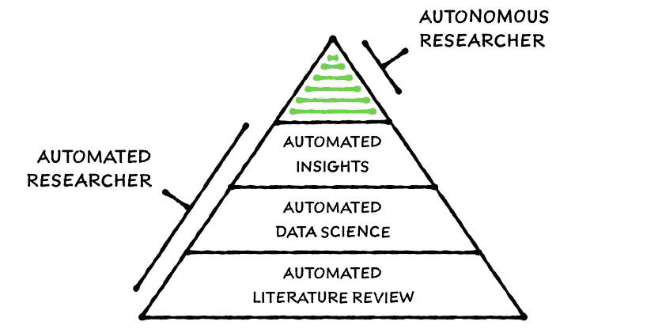
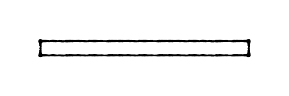
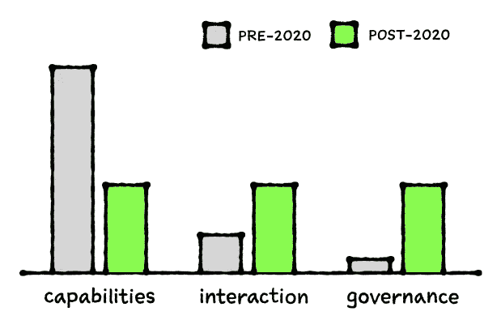
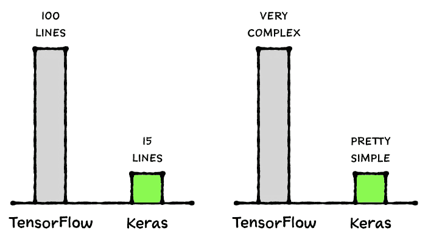
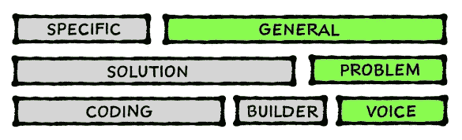
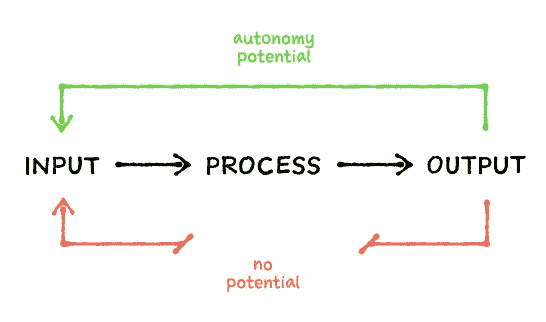
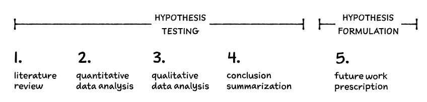

# 自动化研究及其他:人工智能的进化

> 原文：<https://towardsdatascience.com/automated-researcher-and-beyond-the-evolution-of-artificial-intelligence-5db4fdde6f1c?source=collection_archive---------18----------------------->

## 你很快就能向机器解释一个研究问题，并得到相应的答案。

欢迎来到演播室…一个装载栏在屏幕上移动……系统扫描你的脸……一个略带东德口音的声音说道:

*“早上好，今天你想做什么？”*

自 2025 年以来，类似的解决方案在研究界掀起了一场风暴。承诺非常简单；解释你的机器——例如，笔记本电脑或智能手机——研究问题，机器会找到答案。

你首先解释说，你对了解晚期宫颈癌患者死亡率的相关因素感兴趣。

*“你想让我从一篇文献综述开始吗？”*

每月都有数百篇关于宫颈癌的新论文发表。在自动化研究系统出现之前，研究人员已经放弃了对所有主题进行全面文献综述的尝试，但最新发表的文章数量仍然允许的最小众的主题除外。在过去的 12 个月中，标题中提到“宫颈癌”的论文总共约有 10，000 篇，而这只是潜在相关文章的一小部分。在世纪之交，我们已经失去了包含在某一特定主题的著作纲要中的集体智慧的轨迹。

你决定接受文献综述。

“我应该提供全面的结论还是要点？结论将把你的设备的预计到达时间从大约 3 分钟缩短到几天。对于 300 美元的云计算预算，我们可以将得出结论的预计时间减少到大约一个小时。”

你决定从高光开始，这样你在几分钟后就会看到一些东西。

“收到，我们开始吧？”

你确认后，机器就开始工作了。

# 自动化文献综述

这台机器能找到几百万篇潜在相关的科学文章。一些文件调查和讨论研究主题。其他人通过引用、作者和其他因素与主题有着有意义的联系。有些信号对人类来说没有意义，它们是隐藏在文章内容深处的潜在倾向，以及其他方面，与其他文章形成微妙的联系。有时最强的联系来自令人惊讶的不同话题。先进的机器智能能力是实用性和惊喜之间的平衡。结果需要几分钟才能出来，尽管事实上一切都发生在不到 1000 美元的平板电脑上。你可以用你的智能手机，这不会花太多时间。

*“结果可在您的设备上获得。”*

你拿起你的设备，在你打开一个易于阅读的交互式文献综述的发现摘要之前。到 2000 年人类无法完成的事情，任何人都可以在喝杯咖啡的时间内完成。

# 机器智能的参数化

到 21 世纪 20 年代早期，研究人员已经完全参数化了计算机辅助研究的基本方面。非常粗略地说，基于机器智能的决策系统涉及数据的收集和准备、模型的选择、优化和测试，以及验证和管理最终的解决方案。构成使用数据回答研究问题的各个阶段的所有单个活动，都经过精心规划和参数化，达到了允许所有这些过程完全自动化的程度。

直到最近几年，数据科学家通常将一半的时间用于所谓的 ETL 活动——提取、转换和加载数据——没有人再做数据准备了。机器会以人类无法想象的方式来做这件事，在决定最佳输入数据是什么样子之前，会经历大量不同的变化。机器也可能决定使用相关的公共数据，以努力获得研究问题的最佳结果。

一旦所有涉及的过程都按照它们所包含的参数清晰地表达出来——这只是一个时间问题，而不是像一些人认为的那样是一个可行性问题——自动化相关的过程就成了一个简单的工程问题。没有什么新东西需要构建，所有东西都可以通过已有的开源包获得。人们只需要以创建新的、完全自动化的工作流的方式来组合这些功能。一旦工作流实现自动化，几个人工智能研究小组就明白，为了更好地利用机器智能的承诺，采取更平衡的系统开发方法至关重要。尽管几十年来，诸如新的神经网络架构之类的能力开发受到了研究人员和开发人员的极大关注，但是交互和治理在很大程度上被忽略了。

回到 2020 年，*互动*和*治理*方面涉及许多至关重要的未解决问题；例如减少使用通用机器智能 API 所涉及的认知开销，以及人工智能安全性和伦理。这种三大支柱之间的平衡转变引发了创造*自动化研究*的竞赛。

# 超越一般性

人工智能的大问题——通用性，在 2020 年之前的几年里已经被 TensorFlow 和 Pytorch 等解决方案解决了。事实上，普遍性到 2015 年已经解决了，没有人只是清楚地知道它已经发生了。TensorFlow 等平台允许精通计算机的研究人员为几乎任何研究问题创建解决方案。随着这些平台的成功，出现了第一个机器智能解决方案 API，例如 Keras 和 fast . ai。*解决方案 API*从根本上简化了研究人员解释他们正在寻找的解决方案的方式。深度学习*解决方案 API*将数百行陈旧的计算机代码简化成一个类似儿童玩乐高积木的过程。

*解决方案 API*没有解决的问题，与人类几十万年来的交流方式有关。我们更擅长用文字来解释一个研究问题，而不是用计算机代码来描述解决方案。接下来，显而易见的进展涉及到自 1962 年*所有演示之母*以来，人类与信息系统交互方式中最重要的范式转变。这个转变就是*问题 API。*

# 问题 API

机器智能领域的重大突破并不是来自新的深度学习模型架构，或者该研究领域关注的任何东西。相反，这是一个安静而艰难的缓慢过程，重点是人类与机器的交互方式。结果就是第一个*问题 API。*在 2030 年的今天，仍然有很多*解决方案 API，*但是研究人员很少使用。相反，*解决方案 API*是*问题 API*的构建模块，就像差异化引擎是*解决方案 API*的构建模块一样。问题 API 的想法非常简单；几千年来，研究过程一直专注于提出问题(陈述问题)，然后通过严格的过程，找到答案。回想起来，很明显，未来的研究将遵循相同的已被证实的范式。此外，用人类语言表达问题的能力极大地扩大了受益于机器智能发展的研究人员和其他人的数量。

到 2020 年，超过一百万的研究人员在科学和工业的几乎所有可以想象的领域使用*解决方案 API*。经过 50 多年的神经网络研究和发展，人工智能终于起飞了。

尽管如此，机器仍然依赖于人——通过编程或拖放构建器——来清晰准确地表达解决方案。机器解决给定问题的能力在很大程度上依赖于高技能的人给它如何做的精确指令。指导*解决方案 API*需要理解专业语言、统计函数和许多其他复杂的事情。一些这种复杂性被带到了第一个*问题 API 中；*为了充分利用系统的优势，仍然需要适度的技术知识。

# 声音革命

语音理解和合成方面的发展最近使得除了语音之外不使用任何东西与机器进行有意义的交互成为可能。语音消除了复杂控制的需要，这种控制使高技能的 0.1%和世界其他人口之间的鸿沟永久化。

解决方案 API 的出现及其与语音技术的融合使能够使用最先进人工智能的人数从 2020 年的几百万人增加到 2030 年的几亿人。一个前所未有的科学发现、创新和人类创造力的时代开始了。

# 自动化研究人员及其他

2030 年，离真正的自动化研究者还有一段路要走。人类研究人员相信，根据我们今天所知道的一切，不出五到十年，基于机器智能的系统就会让 21 世纪初的数据科学家角色变得多余。未来的路线图现在还包括一个自动化研究人员的伪自主版本。

自动化研究人员是伪自主研究系统的先驱，伪自主研究系统不仅能够测试假设，还能够获取已执行研究的结果，并基于发现制定新的假设。这意味着该系统能够无止境地横向和纵向探索研究主题。虽然自主系统的前提很简单——系统的输出需要是同一系统可接受的输入——但在自主研究系统在回答人类最紧迫的问题方面发挥重要作用之前，仍需要做很多工作。

最终，自主研究系统将能够发现全新的科学领域。没有人能够准确地说出发展需要多长时间才能达到这一点。一旦与假设测试相关的流程变得成熟，假设公式的工作无疑会加速，就像我们看到的第一个*解决方案 API*和第二个*问题 API 一样。*至少在 2032 年之前，我们的研究一直专注于系统从文献综述或定量数据分析中形成有意义的定性见解的能力。

一旦机器能够形成定性的见解，扩展基于可用答案形成新问题的能力——包括以前从未问过的问题——将只是一个时间问题。

## 点击了解更多关于 autonomi[的信息。](http://autonom.io)

## 点击此处，了解更多与人工智能[相关的系统性风险。](/thou-shalt-not-fear-automatons-6d0c7395f6e7)

## 如果你♥了这篇文章，请分享它。