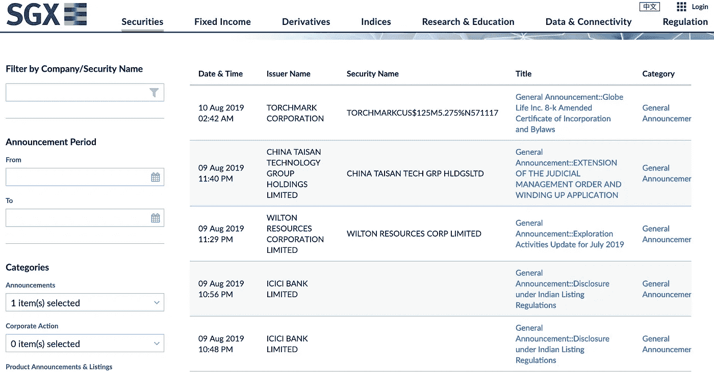
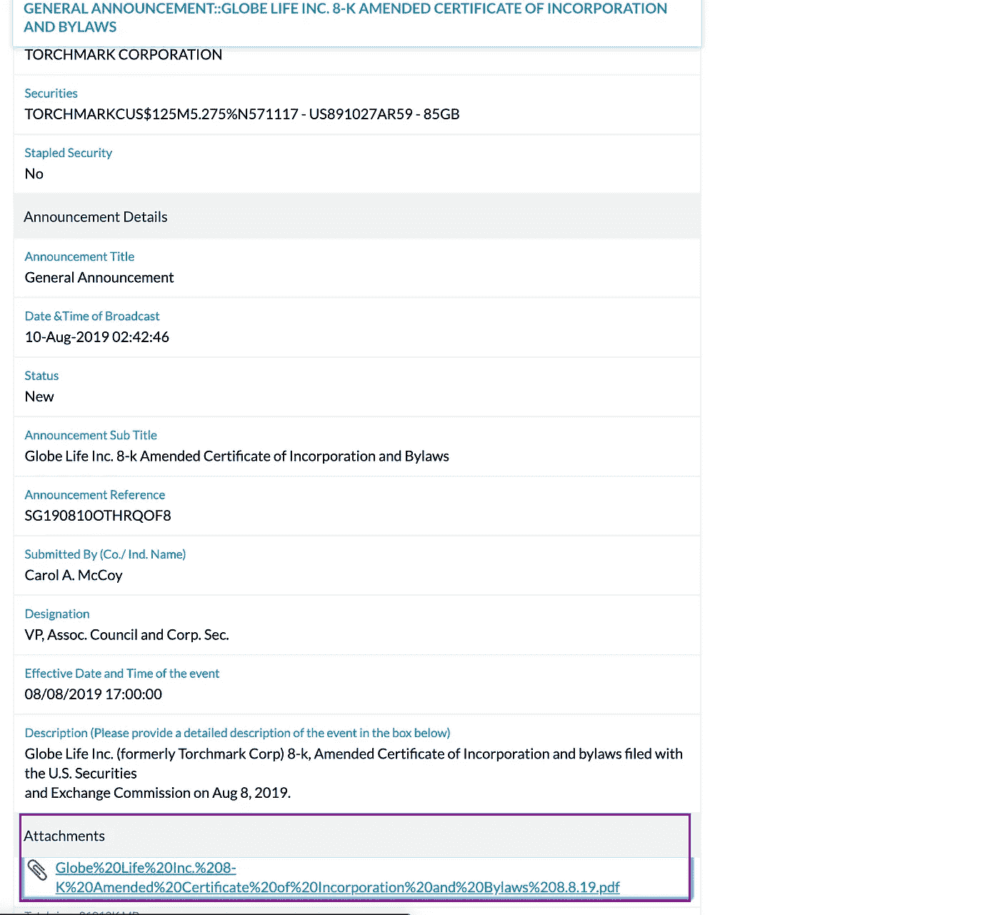
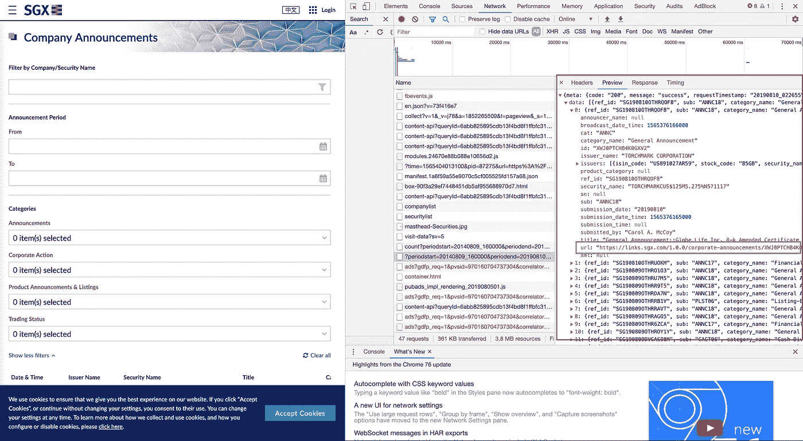
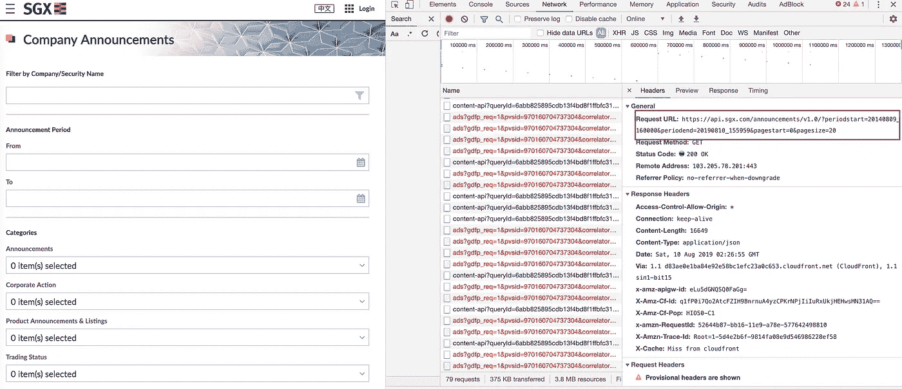
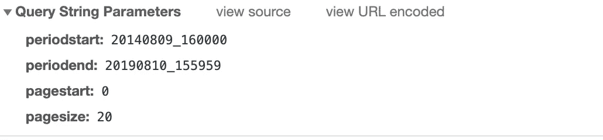
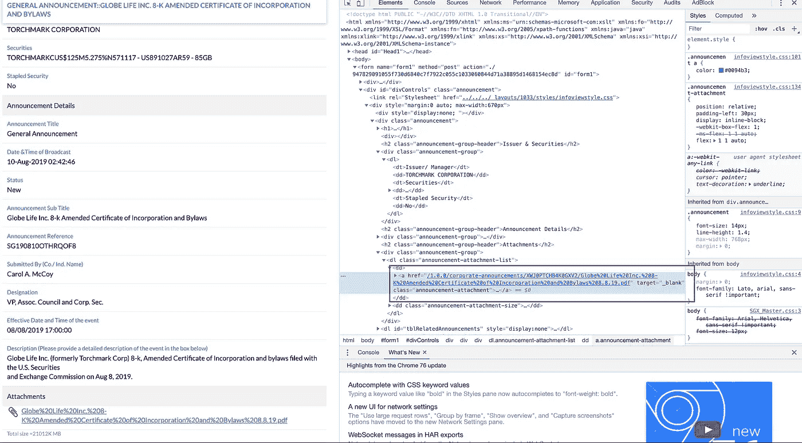

# 如何建立一个自动化的股票新闻收集器

> 原文：<https://towardsdatascience.com/automated-stock-news-collectors-get-rid-of-boring-stuff-using-python-part-3-e85d1753fb4b?source=collection_archive---------24----------------------->

一步一步打造自动化机器！

## 使用 Python 摆脱无聊的东西(第 3 部分)

> 你厌倦了重复做同样的事情吗？
> 
> *感觉你的生活只是一遍又一遍地做着同样的事情？*

欢迎来到**使用 Python** 系列摆脱无聊的东西！请随意访问这个[链接](https://towardsdatascience.com/tagged/getridboringstuff)，你将能够看到这个正在进行的系列中的所有故事。

*如果您想申请任何网页抓取服务，请随时通过此[链接](http://datainfinite.mystrikingly.com/)告诉我。:)

要不，我们开始吧！

我将用一个案例来说明。在本案例研究中，我们需要从 SGX(新加坡证券交易所)网站下载文件，并将它们上传到指定的 google drive 文件夹中。

**这是我将要分享的议程:**

**第 1 部分** **—从 SGX 获取所有 PDF 文件的链接**

**第 2 部分—从上述提取的链接下载所有 PDF 文件**

**第 3 部分—将文件上传到 Google Drive**

希望你会喜欢这个系列，让我们把手弄脏。

# **第一部分** **—从 SGX 获取所有 PDF 文件的链接**

# 快速浏览 SGX 网站

让我们看看显示公司新闻([链接](https://www2.sgx.com/securities/company-announcements))的 SGX 主页，如下面的快照 1 所示:

[Snapshot 1](https://www2.sgx.com/securities/company-announcements)

如果您点击标题列中的每个元素，您将被定向到显示相应新闻的详细信息的页面。

在该页面中，您可能会在页面底部找到一个链接来下载 pdf 格式的指定报告(以紫色框突出显示)，如下面的快照 2 所示。

[Snapshot 2](https://links.sgx.com/1.0.0/corporate-announcements/XWJ0PTCHB4K0GXV2/947829091055f730d6840c7f7922c055c1033060844d71a38895d1468154ec8d)

所以，我们今天的目标是下载所有最新的 pdf 文件并上传到 google drive。

# 开始刮

让我们浏览到 [SGX 公司公告页面](https://www2.sgx.com/securities/company-announcements)，查看该页面。如果你仍然不确定如何检查一个 html 页面，请参考这个[链接](/paper-trading-get-rid-of-boring-stuff-using-python-part-1-914ab3b04724)以获得更详细的说明。

Snapshot 3

经过仔细检查，我们可以看到所有的新闻数据都是通过 api 调用获得的"？periodstart=…”(如快照 3 中突出显示的紫色框所示)。

在 inspect 面板的紫色框中，有一个我用黄色突出显示的框。从那里你将能够找到我们首先需要抓取的 **url** ，因为每个 url 都将引导我们到显示相应公司新闻的页面(这些页面的一个例子是 snapshot2)。

Snapshot 4

Snapshot 5

参考快照 4 中的紫色方框，API 的基础 url 是[https://api.sgx.com/announcements/v1.0/](https://api.sgx.com/announcements/v1.0/)？，之后呢？将是查询字符串参数。

什么是查询字符串参数？你可以把它看作是你需要添加到“？”后面的 url 的扩展查询满足条件的数据。我们这里以 2014 08 09 _ 16000(**period start)**为例**。**

20140809_16000 可以看成 date + '_' + 16000，意思是我们可以把它改成我们需要的日期。反之亦然，对于 **periodend** ，可以查看为 date + '_' + 155959。

例如，您想只抓取 2019-01-01 到 2019-02-01 的新闻，您可以将**周期开始日期**更改为 20190101，将**周期结束日期**更改为 20190201。

上面的代码首先将查询的开始日期初始化为今天的前一天，将查询的结束日期初始化为今天。通过将它们附加到 base_url，我们可以获得今天的公司公告。注意，我们将收到的数据是 JSON 格式的。因此，通过将 JSON 作为参数直接传递给`pd.DataFrame()`，我们可以直接将数据从 JSON 格式转换成 pandas dataframe。接下来，过滤 dataframe，使其只包含我们感兴趣的股票的新闻，在我们的例子中，它是“LODHA DEVELOPERS INTERNATIONAL LIMITED”。

# 第 2 部分— **从上面提取的链接下载所有 PDF 文件**

在得到多个公司公告链接后，我们就该下载所有需要的 pdf 文件了。

通过查看详细新闻信息页面，您会发现附件链接是在以下位置捕获的:

节点:a

属性:href

因此，通过使用 parser BeautifulSoup 并获取`a`标签的属性`href`中的值，您将能够获得 pdf 的链接。现在，要在指定的 URL 上下载 pdf 文件，我们只需要获取响应的内容，并将其输出到 pdf 格式的文件中。

*注意`wb`的用法，因为我们将获得的 URL 上的 pdf 内容是二进制格式的，我们需要让 Python 知道我们要将二进制内容写入输出文件。此外，确保你的文件名有。pdf 作为扩展。

基于以上要点， *def get_pdf()* 函数负责将所有相应的链接下载到我的默认文件夹**数据**。简而言之，我将遍历熊猫数据帧，检索所有链接，然后下载我们需要的所有 pdf 文件。

**在这里跟进，恭喜你！你只剩下最后一步了！**

# 第 3 部分— **将文件上传到 Google Drive**

首先，你应该通过这个[链接](https://medium.com/@billydharmawan/google-drive-api-with-python-part-i-set-up-credentials-1f729cb0372b?)获得你的 google drive 证书。

然后，将凭证文件名保存为 **client_secret.json** ，并将其放在 python 文件的同一个目录中。

接下来，复制上面的脚本，将**current _ Google _ folder _ id**填入你的目标文件夹 id。该脚本会将您的令牌保存到外部文件****mycreds . txt**中，这样您就不需要每次运行该脚本时都在 google drive 上登录您的帐户。**

**上面的要点是首先获取当前 google 文件夹中的所有文件夹名称。然后，它将检查指定的股票名称的文件夹是否已经存在，如果不存在，它将创建一个文件夹，并使用股票名称命名。之后，将所有文件上传到与指定股票名称同名的文件夹中。**

**最后，它将删除**数据**目录中的所有文件，以保持本地**数据**文件夹的干净。**

**终于完成了！如果你从一开始就遵循所有的步骤，你将能够看到你的文件被上传到你的目标谷歌文件夹！**

****

# **最终想法**

**非常感谢你一直读到故事的结尾，我真的希望你能从你的业务、日常工作等中受益。自动化对于释放你的时间非常重要，这样你就可以专注于完成其他工作。**

**欢迎在下面留下你感兴趣的话题的评论。我将在未来发布更多关于我的经历和项目的帖子。**

# **关于作者**

**[低魏宏](https://www.linkedin.com/in/lowweihong/?source=post_page---------------------------)是 Shopee 的数据科学家。他的经验更多地涉及抓取网站，创建数据管道，以及实施机器学习模型来解决业务问题。**

**他提供爬行服务，能够为你提供你所需要的准确和干净的数据。你可以访问这个网站查看他的作品集，也可以联系他获取抓取服务。**

**你可以在 [LinkedIn](https://www.linkedin.com/in/lowweihong/?source=post_page---------------------------) 和 [Medium](https://medium.com/@lowweihong?source=post_page---------------------------) 上和他联系。**

** [## ●伟鸿-中等

### 在媒体上阅读低纬鸿的作品。数据科学家|网络搜集服务:http://datainfinite.mystrikingly.com/…

medium.com](https://medium.com/@lowweihong?source=post_page-----b84d1e9ea595----------------------)**