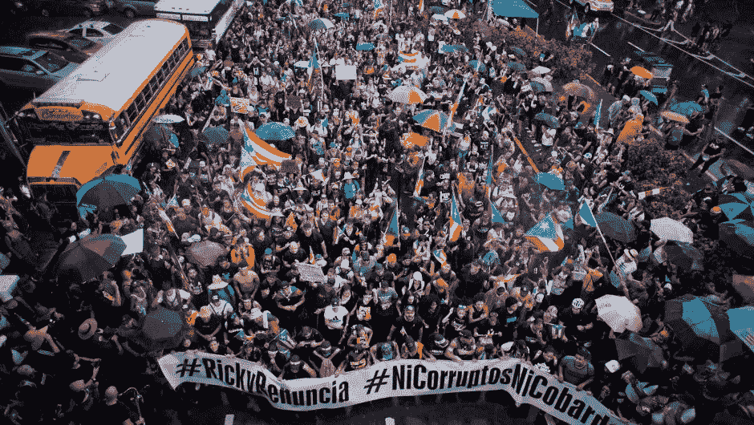
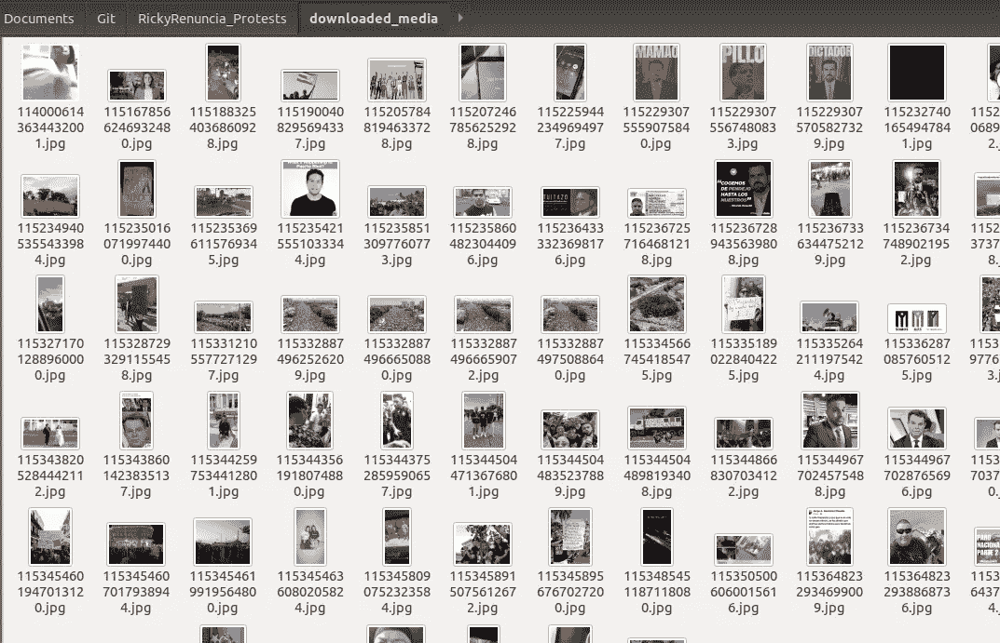

# 在 Twitter 中自动收集# RickyRenuncia 下的图片

> 原文：<https://towardsdatascience.com/automatic-collection-of-images-under-rickyrenuncia-in-twitter-a86adb7124cb?source=collection_archive---------21----------------------->

使用 Python 和 Twitter API



Source: [https://cnnespanol.cnn.com/gallery/fotos-las-mejores-imagenes-de-las-protestas-en-puerto-rico/](https://cnnespanol.cnn.com/gallery/fotos-las-mejores-imagenes-de-las-protestas-en-puerto-rico/)

示威活动于 2019 年 7 月 13 日在波多黎各开始，当时披露了 889 页的电报聊天记录(昵称为 Telegramgate)，波多黎各总督 Ricardo Roselló与其他 11 名成员(当时包括前任和现任政府雇员)一起参加了这次聊天。示威背后的目的是让州长辞职。

7 月 13 日至 7 月 24 日，波多黎各的别霍圣胡安和其他城市(以及波多黎各以外的地方)发生了各种抗议活动。7 月 24 日，晚上 11 点多，这位波多黎各总督终于向公众让步，辞去了他的职务。他的辞职将于 2019 年 8 月 2 日生效。

现代波多黎各历史上最大的游行之一发生在 2019 年 7 月 22 日星期一。游行发生在美洲快车上。据估计，超过 50 万人参加了游行。

在游行的照片上统计参加人数可能是有用的。为了做到这一点，我们必须首先检索游行的照片。这个博客将专注于照片检索(数据收集)。我们将从 Twitter 上检索一些游行的照片，获取标签为# RickyRenuncia(翻译为“Ricky 辞职”)的推文，这些推文发布于 7 月 20 日至 7 月 23 日(7 月 22 日是最大的游行日)。我们选择只使用# RickyRenuncia 这个标签，因为它是最常用的(有一段时间它在 Twitter 上很流行)。

在后面的博客中，我们将重点讨论在拥挤的游行照片中计算人数的问题。

这里讨论的代码可以在 GitHub 的我的账户`meramos`下获得，在一个名为`RickyRenuncia_Protests`的存储库中，在 Jupyter 的名为`get_photos.ipynb`的笔记本中。

[](https://github.com/meramos/RickyRenuncia_Protests) [## mera mos/Ricky renucia _ 抗议

### 此时您不能执行该操作。您已使用另一个标签页或窗口登录。您已在另一个选项卡中注销，或者…

github.com](https://github.com/meramos/RickyRenuncia_Protests) 

**注意**:本文解释的代码可以用来搜索 Twitter 上的任何其他标签。

如果你想了解更多关于 Telegramgate 文件的信息，这份文件激起了人们对州长及其同事的愤怒，请阅读我的博客“用 Python 分析 Telegramgate”:

[](https://medium.com/@mariaeramosmorales/telegramgate-analysis-in-python-457d4a36164e) [## Python 中的远程门户分析

### 处理 889 页聊天信息

medium.com](https://medium.com/@mariaeramosmorales/telegramgate-analysis-in-python-457d4a36164e) 

# 开发要求

要运行代码，您需要在计算机上安装 Python 3。你还需要一个 Twitter 开发者账户，你可以在这里创建[。要创建 Twitter 开发者帐户，您需要一个 Twitter 帐户。](https://developer.twitter.com/)

这些是您将使用的库:

*   [**python-Twitter**](https://python-twitter.readthedocs.io/en/latest/):用于轻松连接 Twitter API，搜索包含# RickyRenuncia 标签的推文。通过运行`pip3 install python-twitter`进行安装。
*   [**URL lib . request**](https://docs.python.org/3/library/urllib.request.html#module-urllib.request):用于打开和读取 URL 的内容。Python 默认有这个库。
*   [**os**](https://docs.python.org/3/library/os.html) :用于操作系统相关功能。我们用它来确保我们不会用同一个 Twitter ID 多次保存图片。Python 默认有。
*   [**熊猫**](https://pandas.pydata.org/) :用于创建一个包含已下载图像信息的表格，并从中创建一个 CSV 文件。

# 连接到 Twitter API

在您的 Twitter 开发者帐户上搜索您的凭证。您需要以下内容:

*   消费者密钥
*   消费者秘密
*   访问令牌
*   访问令牌秘密

要获取这些值，您必须在您的 Twitter 开发人员帐户下创建一个应用程序，然后访问它。要访问您现有的应用程序，首先点击 Twitter 开发者页面最右侧的用户名右侧的向下箭头，然后点击标题为“应用程序”的选项。进入后，点击感兴趣的应用程序上的“详细信息”按钮。然后点击“密钥和令牌”。在“消费者 API”下，您将找到消费者密钥和消费者密码，在“访问令牌和访问令牌密码”下，您将找到访问令牌和访问令牌密码。

如果您将代码保存在版本控制系统(VCS)中，如 GitHub 或 BitBucket，我建议您将 API 凭证保存在与代码不同的文件中，并将该文件添加到。gitignore 文件，这样您就不会意外地将您的凭证推送到您的存储库中。

对于包含 Twitter API 凭证的配置文件，我们将遵循以下格式。该脚本将有一个名为`credentials`的字典变量，包含键`consumer_key`、`consumer_secret`、`access_token`和`access_token_secret`。我们将文件命名为`config.py`，但是它可以有任何其他名称。

Set Twitter API credentials.

要使用库`python-twitter`和存储在`config.py`中的凭证连接到 Twitter API，请运行以下命令:

Connect to the Twitter API.

# 构建搜索查询

您希望使用[标准搜索 API](https://developer.twitter.com/en/docs/tweets/search/api-reference/get-search-tweets.html) ，它返回与指定查询匹配的相关 Tweets 的集合。然后你需要定义你想要搜索什么。

我们想要标签为“rickyrenuncia”的推文。我们想要流行和非流行的推文，我们希望将这些推文限制在 7 月 20 日至 7 月 23 日。我们希望获得 API 每次调用允许的最大 tweets 数，即 100。

调用端点时，您可以指定各种参数。下面是我们使用的查询参数:

*   `q`:必选。需要 UTF 8，URL 编码的搜索查询。最多允许 500 个字符。可以包含运算符。我们将其设置为`rickyrenuncia`。
*   `result_type` : *可选*。您希望收到什么类型的搜索结果。默认值为`mixed`。有效值为:`mixed`、`recent`、`popular`。`mixed`在响应中包括流行和实时结果。`recent`仅包括最近的结果。`popular`仅包括最受欢迎的结果。我们将其设置为`mixed`。
*   `include_entities` : *可选*。是否包括写推文的人的用户名。默认值为`false`。我们将其设置为`true`。
*   `with_twitter_user_id` : *可选*。是否包括写 tweet 的用户的 Twitter ID。默认值为`false`。我们将其设置为`true`。
*   `since` : *可选*。返回给定日期后创建的推文。接受的日期格式为`YYYY-MM-DD`。我们将其设置为`2019-07-20`。
*   `until` : *可选*。返回给定日期之前创建的推文。接受的日期格式为`YYYY-MM-DD`。我们将其设置为`2019–07–23`。【 ***重要*** :搜索索引有 7 天限制！超过一周的日期将找不到推文。这个问题有一些解决方法，在这篇博客中没有讨论。]
*   `count` : *可选*。每页返回的推文数量。最大允许值为 100。默认值为 15。我们把它设置为 100。

Define query parameters.

Build query.

我们得到的查询是:

```
q=rickyrenuncia&result_type=mixed&include_entities=true&with_twitter_user_id=true&since=2019–07–20&until=2019–07–23&count=100
```

# 运行搜索查询

要运行搜索查询，请运行以下命令:

How to make a call to the search endpoint of the Twitter API.

搜索端点最多只能提供 100 个结果。为了获得更多，我们必须用不同的`max_id`值多次调用搜索端点。根据[文档](https://developer.twitter.com/en/docs/tweets/timelines/guides/working-with-timelines):

> 为了正确使用 max_id，应用程序对时间轴端点的第一个请求应该只指定一个计数。在处理此响应和后续响应时，请跟踪收到的最低 ID。这个 id 应该作为 max_id 参数的值传递给下一个请求，该请求将只返回 ID 小于或等于 max_id 参数值的 Tweets。注意，因为 max_id 参数是包含性的，所以实际上将再次返回具有匹配 id 的 Tweet。

正如文档所述，为了检索更多的 tweet，我们需要将`max_id`指定为返回的最小 tweet ID，并继续重复这一过程，直到我们得到所有想要的 tweet。

我们决定在 Twitter API 允许的情况下尽可能多地进行连续调用。我们发现，我们可以一口气打 180 个背靠背的电话，检索 18000 条推文。随意试验不同的迭代次数。

在下面的代码中，我们初始化了两个空数组，一个名为`all_results`，我们将在其中存储所有 API 搜索结果，另一个名为`IDs`，我们将在其中存储 tweets 的 ID，以便跟踪在后续调用中指定`max_id`的最小 ID。`IDs`在每个循环中被重新分配。我们将`max_id`初始化为`None`，因为在第一个 API 调用中，我们不应该为`max_id`指定值。第一次迭代后，将使用列表`IDs`中存在的最小 ID 定义`max_id`，并且将扩展`query`字符串以包含`max_id`参数。在以后的迭代中，包含`max_id`参数的`query`字符串部分被替换为新的`max_id`值。

运行循环后，我们将有 18000 条推文存储在`all_results`中。大约有 179 条 tweets 将被重复，因为按照文档中的说明，`max_id`查询参数是包含性的。我们选择保持重复。

Make 180 calls to the search endpoint for a total of 18000 results.

# 从 Tweets 下载媒体

现在下载每条读入的推文中的媒体(照片)。

`all_results`中的每个元素都是`python-twitter`包中`Status`类的一个对象。`Status`类表示 twitter API 使用的状态结构。它有各种属性，包含关于 Tweet 的信息。我们只使用`media`属性来获取 tweet 下图片的 URL。

`media`属性是来自`python-twitter`包的`Media`类对象的列表。`Media`类表示 tweet 的媒体组件。它包含与媒体相关的各种属性。我们使用属性`id`和`media_url`。`id`是图片在 Twitter 中的 ID，`media_url`是图片/视频在 tweet 中的 URL。我们使用 id 为我们下载的媒体分配名称，以便跟踪图像的来源。

在运行代码的文件夹中创建一个名为`downloaded_media`的文件夹，并运行以下代码:

Function for creating URL of tweet where downloaded image comes from.

Download images and keep track of image origins by saving image ID, image URL, and tweet URL.

`downloaded_img_ids`包含文件夹`downloaded_media`中的文件名。我们用这个来确保我们不会重新下载图片，因为一些读入的推文可能是分享我们已经下载的媒体的转发。

为了创建一个包含图像来源信息(图像 ID、图像 URL、tweet URL)的 CSV 文件，我们使用 Pandas 库从`image_origins`字典中创建一个 dataframe，删除包含重复图像 ID 的行(如果有的话),并从中创建一个 CSV 文件。

Create CSV with information on the images’ origins.

生成的 CSV 文件将作为一个名为`image_origins.csv`的文件保存在您运行代码的位置。

# 结果

图像现在将出现在您运行代码的文件夹中的`download_media`文件夹中。我们下载了 895 张图片。



Subset of images downloaded from the Tweets the Search API returned on July 25.

我们下载的图片可以在[这里](https://drive.google.com/drive/folders/1BlOxl9Q858O0pf8EI6hiithgPN6rBJDz?usp=sharing)标题为`downloaded_media`的文件夹下找到。一个 CSV 和一个包含图像来源信息的电子表格(一列是与文件名相关的图像 ID，一列是图像 URL，一列是 tweet URL)也显示在那里，标题为`image_origins`。

# 结论

在本文中，我们将展示如何在特定时间范围内检索特定标签下的推文，以及如何下载这些推文下的媒体文件。我们提供了一个链接，链接到 Google Drive 中的一个文件夹，其中包含一个包含下载图像的文件夹和一个包含图像来源信息的电子表格。

不幸的是，我们遇到了一个限制，Twitter API 不允许检索调用端点超过 7 天的帖子。这使得这里讨论的代码的结果不可再现(代码运行并工作，但它不会返回指定时间范围内的图像)。然而，还有其他方法可以检索历史推文。GitHub 中有解决这个问题的库。以下是其中一个存储库:

[](https://github.com/PJHRobles/Twitter-Get-Old-Tweets-Scraper) [## PJHRobles/Twitter-Get-Old-Tweets-Scraper

### Twitter 的 API 不再允许使用应用程序检索过去 7 天的推文。一些第三方应用程序可用…

github.com](https://github.com/PJHRobles/Twitter-Get-Old-Tweets-Scraper) 

在未来的博客中，我们可能会讨论如何使用这些存储库之一来检索历史 Twitter 数据。

现在我们有了来自 Twitter 上# RickyRenuncia 标签的照片，以及抗议日期的子集，我们可以精心挑选人群的图像，并使用它们来计算其中的人数。

# 参考

1.  [新直径:克罗诺吉亚德拉卡达德罗塞洛](https://www.elnuevodia.com/noticias/locales/nota/cronologiadelacaidaderossello-2506805/)
2.  [Python-Twitter 文档](https://python-twitter.readthedocs.io/en/latest/installation.html)
3.  [面向开发者的 Twitter:搜索 Tweets /标准搜索 API](https://developer.twitter.com/en/docs/tweets/search/api-reference/get-search-tweets.html)
4.  [面向开发者的 Twitter:获取 Tweet 时间轴](https://developer.twitter.com/en/docs/tweets/timelines/guides/working-with-timelines)
5.  [Stackoverflow: twitter api 计数超过 100，使用 twitter 搜索 api](https://stackoverflow.com/questions/44301195/twitter-api-count-more-than-100-using-twitter-search-api)