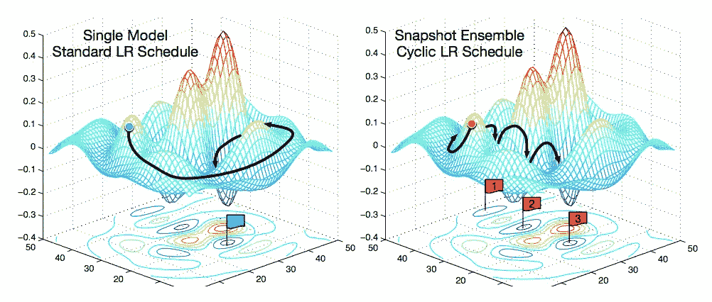
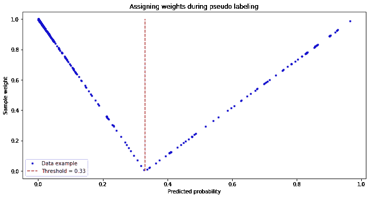
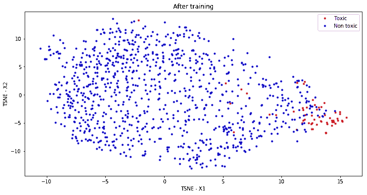

# 有毒问题的自动检测

> 原文：<https://towardsdatascience.com/automatic-detection-of-toxic-questions-1f97dfcf091?source=collection_archive---------15----------------------->


When you are trying to remove toxic questions and comments from a website (“Night cleaning”, photo by Yuri Shchennikov)

Quora 是一个让人们互相学习的平台。在 Quora 上，人们可以提出问题，并与贡献独特见解和权威观点的其他人交流。几个月前，Quora 在 Kaggle 上组织了一场比赛，名为 Quora 不真诚问题分类，旨在解决当今任何主要网站都存在的一个问题——如何处理有毒和分裂性内容。一个关键的挑战是剔除不真诚的问题——那些基于错误前提的问题，或者由用户提出的问题，这些用户宁愿发表声明，而不是寻找有用的答案。

这篇文章将描述我解决这个问题的方法，它帮助我进入了前 3%(在 4000 名参与者中排名第 85 位，个人银牌)。

# **问题公式化**

数据集由 130 万个问题组成，目标是将问题标记为有毒或无毒(二元分类任务)。一个不真诚的问题被定义为一个旨在陈述而不是寻找有用答案的问题。以下迹象可能被用来发现一个不真诚的问题([完整定义](https://www.kaggle.com/c/quora-insincere-questions-classification/data)):

*   有着非中性的语气
*   是贬低或煽动性的
*   不是基于现实的
*   使用性内容(乱伦，兽交，恋童癖)来寻求震撼，而不是寻求真正的答案

问题示例:

```
Non-toxic questions: 
1\. What are the best rental property calculators?

2\. Apart from wealth, fame, and their tragic ends, what did Anthony Bourdain and Kate Spade have in common that might provide some insight into their choice to take their own lives?

3\. How do you find your true purpose or mission in life?

4\. What is the relation between space and time if they are connected? Are they converting continuously in each other?

5\. Is there an underlying message that can be read into the many multilateral agreement exits of the Trump administration during its first year and a half?____________________________________________________________________Toxic questions: 
1\. Lol no disrespect but I think you are ducking smart?

2\. Are Denmark and England destroyed by Muslim immigrants?

3\. How am I supposed to get a girlfriend if every woman thinks every man is a rapist?

4\. How many black friends does a white person need to make what they say 'not racist' on this basis?

5\. Are Russian women more beautiful than Ukrainian women?
```

比赛使用[*F1-score*](https://en.wikipedia.org/wiki/F1_score)*指标，计算 56k(公开)和 376k(私人)未公开试题。Quora 的虚假问题分类是只在内核中进行的比赛，所以你不用做预测，而是提交代码，然后在 Kaggle 平台上运行。主办方对两个阶段都设定了内存和时间限制:6 / 2 小时(CPU / CPU+GPU 使用量)。*

*还有，主办方决定禁止使用任何外部数据(反正也没阻止[某人](https://www.kaggle.com/c/quora-insincere-questions-classification/discussion/80665))，除了几个预先训练好的单词嵌入:[Google news-vectors-negative 300](https://code.google.com/archive/p/word2vec/)、 [glove.840B.300d](https://nlp.stanford.edu/projects/glove/) 、 [paragram_300 sl999](https://cogcomp.org/page/resource_view/106) 、 [wiki-news-300d-1M](https://fasttext.cc/docs/en/english-vectors.html) 。*

# *我们真的需要它吗？*

*在这场比赛中，我们必须发现有毒的问题。让我们假设这是开始竞争的唯一原因(其他原因可能包括雇用专业的数据科学家、产生宣传或者将生产中的模型分数与竞争中的最高分数进行比较)。在数据驱动项目的准备过程中，最重要但最少被问到的问题可能是:我们真的需要它吗？我们要解决什么问题？*

*有害行为对 Quora 社区有害。这可能会吓跑一些用户，因为他们觉得与世界分享他们的知识不安全。我们希望我们的用户自由地表达他们的想法，而不用担心被套牢。我们可以通过检测有毒问题并删除它们，或者使它们仅对问题的作者可见来实现这一点— [hellban](https://www.urbandictionary.com/define.php?term=hellban) ( *解决方案*)。为了检测有毒问题，我们可能会使用人工预审核(由 Quora 版主或机械土耳其人)，但这需要时间来处理所有问题，版主可能会被 Quora 上的大量问题淹没。因此，我们希望通过使用数据驱动的方法来自动化这一过程:在发布问题之前，它将由模型进行检查，这是我们在本次比赛中必须提出的。*

*这解决了最初的问题吗？我们可以从一个正在努力解决类似问题的领域——视频游戏行业——中吸取经验。据《[电子游戏公司能否驯服毒害行为？视频游戏中的大多数有毒评论来自“普通人，他们只是过了糟糕的一天”，禁止所有有毒玩家不会产生任何戏剧性的变化:](https://www.nature.com/news/can-a-video-game-company-tame-toxic-behaviour-1.19647)*

> *《常识》认为，互联网上的大部分残忍行为来自于一小部分网民——巨魔。事实上，林的团队发现，只有大约 1%的球员一直是有毒的。但事实证明，这些巨魔只产生了*英雄联盟*中约 5%的毒性。“绝大多数是普通人度过了糟糕的一天，”林说。*
> 
> *这意味着，即使 Riot 禁止了所有毒性最强的玩家，也不会有太大的影响。为了减少大多数玩家经历的不良行为，公司必须改变玩家的行为方式。*

*在我看来，删除有毒评论不会解决问题，但会减少它对社区的影响。它可以被整合到反巨魔战略中，但这只是解决这个问题的一揽子计划的一部分。无论如何，比赛的总体想法对我来说似乎是可行的和重要的，所以我决定参加。*

# *最终解决方案的主要部分*

## *实验测试*

*在整个比赛中，我在本地(在我的电脑上)和 Kaggle 内核中测试了我的管道。它允许我(1)同时运行更多的实验，(2)确保我的管道符合第二阶段的时间/内存需求。我跟踪了每个实验的结果(时间、验证分数、公共排行榜分数、评论和发现)，然后把它们放到 excel 文件中。*

## *验证策略*

*我认为这场比赛最重要的部分是不要相信公共排行榜。正如前面提到的，公共排行榜是根据 56k 个问题计算的，这大约是培训部分问题数量的 4%。这是一个非常小的部分，它可能只用于确保您没有在代码中犯任何严重的错误，而不是用于分数检查。*

*我决定完全信任我的验证，并使用 StratifiedKFold (K=5)策略进行局部验证和参数选择。对于最终提交，我对一次提交使用了相同的策略，对另一次使用了训练验证分割(90/10%)(允许两次最终提交)。*

## *预处理*

*我的预处理管道由几个步骤组成:*

*   *干净的数学公式。训练数据集中大约 2%的问题带有“数学”标签。里面的公式没有包含有用的信息，也没有有害的评论，但它极大地增加了问题的长度，所以我决定用单词“数学”代替这些公式。虽然，聪明的巨魔可以利用它，开始在数学公式里侮辱人。*

```
**[math] 2 + 2 = 4 [\math] ->* math*
```

*   *在单词和标点符号之间添加一个空格。事实证明，这是比去掉标点符号更好的策略:*

```
*"Wait... What is the relation between space and time if they are connected? Are they converting continuously in each other?" -> "Wait . . . What is the relation between space and time if they are connected ? Are they converting continuously in each other ?"*
```

*   *如果字典中没有该单词，请尝试将它的首字母小写/大写/大写，然后再试一次。这一简单而有效的举措逐渐减少了“新”单词(即不在 w2v 词汇表中的单词)的数量。比赛结束后，我意识到词干化或词汇化也可能减少缺席单词的数量。*

```
*for word, i in tqdm(word_index.items()):
    embedding_vector = embeddings_index.get(word)

    # 'ABcd' → 'abcd'
    if embedding_vector is None: 
        embedding_vector = embeddings_index.get(word.lower())

    # 'denis' -> 'Denis'        
    if embedding_vector is None: 
        embedding_vector = embeddings_index.get(word.capitalize())

    # 'usa' -> 'USA'
    if embedding_vector is None: 
        embedding_vector = embeddings_index.get(word.upper())

    # deling with numbers in Google News embedding 
    if word.isdigit() and (embedding_vector is None):
        temp_word = len(word) * '#'
        embedding_vector = embeddings_index.get(temp_word)

    # '1123336548956552515151515151544444444' -> 'number'
    if word.isdigit() and (embedding_vector is None):
        embedding_vector = embeddings_index.get('number')

    if embedding_vector is not None: 
        embedding_matrix.append(embedding_vector)
        in_vocab += 1
    else:
        non_in_vocab += 1 
        non_vocab.append(word)
        embedding_matrix.append(mean_vector)*
```

## *模型和嵌入*

*我在这场比赛中测试了 CNN 和 LSTM 模型，然而，最好的是下面的 LSTM:*

```
*def get_model(embedding_matrix, nb_words, embedding_size=607):
    inp = Input(shape=(max_length,))

    x = Embedding(nb_words, embedding_size, weights=   [embedding_matrix], trainable=False)(inp)
    x = SpatialDropout1D(0.3)(x)

    x1 = Bidirectional(CuDNNLSTM(256, return_sequences=True))(x)
    x2 = Bidirectional(CuDNNGRU(128, return_sequences=True))(x1)

    max_pool1 = GlobalMaxPooling1D()(x1)
    max_pool2 = GlobalMaxPooling1D()(x2)
    conc = Concatenate()([max_pool1, max_pool2])

    predictions = Dense(1, activation='sigmoid')(conc)
    model = Model(inputs=inp, outputs=predictions)

    adam = optimizers.Adam(lr=learning_rate)
    model.compile(optimizer=adam, loss='binary_crossentropy')
    return model*
```

*我使用了 google news 和 glove embedding 的串联，并根据句子中的相对位置(顺序号)、问题中的相对位置(顺序号)、 *is_upper* 、 *is_lower* 、 *is_ number* 、*is _ 标点符号*、单词中大写字母的含义(“单词”→ 1.0、“单词”→ 0.25)、单词在训练数据集中的出现频率，为每个单词的表示添加了额外的功能。*

## *快照集合*

*快照集合是之前在[快照集合:训练 1，免费获得 M](https://arxiv.org/abs/1704.00109)中描述的 Kaggle 比赛中常用的技术。其背后的思想非常简单:我们用循环学习率训练单个模型，在每个循环结束时保存模型的权重(一个循环的结束通常处于局部最小值)。最终我们会得到几个模型而不是一个。对集合的预测进行平均会给你一个比单一模型更好的分数。*

**

*During training, we are converging to and escaping from multiple local minima. A snapshot is taken in each local minimum*

## *伪标记*

*伪标注的思想是增加模型训练的可用数据量。在 Kaggle 竞赛中是一种常见的方法，但遗憾的是，在业界并没有那么常用(下面是一些关于这个话题的论文:[用自举](https://arxiv.org/abs/1412.6596)，[伪标签:深度神经网络的简单高效的半监督学习方法](https://www.researchgate.net/publication/280581078_Pseudo-Label_The_Simple_and_Efficient_Semi-Supervised_Learning_Method_for_Deep_Neural_Networks))。现在，有几种方法可以用于伪标记:*

1.  *1.添加训练数据的最有把握的例子(置信度*≥*水平*，*水平= 0.9* 的例子)。我们不应选择最高 *N1* %和最低 *N0* %的概率并将它们添加到训练数据集(由于类别不平衡)。相反，我们必须确定最佳阈值，并选择带有正面和负面标签的最有把握的示例。在神经网络训练的几个时期中遵循这种方法，我添加了大约 45k 个负样本和 100 个正样本。**
2.  **添加带有伪标签的完整测试数据，但根据其置信度为每个示例分配一个权重。我尝试了几种权函数，但我发现线性权函数是这项任务的最佳选择。**

****

**Assigning weights to pseudo labels (first 1000 data points in the test set). The more confident our predictions are — the bigger weight we assign during training**

## **最佳阈值选择**

**这个比赛的度量标准是 *F1 分数*，也就是说我们要提交类(0/1，无毒/有毒)。模型的输出是概率，所以我们需要选择合适的阈值来最大化得分。有许多方法可以做到这一点:**

*   ***训练前选择阈值*。我认为这种方式会导致非最优阈值，得分会更低。我已经测试过了，但是从来没有在最终提交中使用过。虽然，竞赛的[获胜者使用了这种方法的变体。](https://www.kaggle.com/c/quora-insincere-questions-classification/discussion/80568#latest-564470)**
*   ***拟合模型，对训练部分进行预测，选择阈值优化训练部分的得分*。直接超负荷。已测试，但未在最终提交中使用。**
*   ***拟合模型，对训练部分进行预测，选择阈值优化训练部分的得分*。直接超负荷。我已经测试过了，但是从来没有在最终提交中使用过。**
*   ***拟合模型，对验证部分进行预测，选择阈值优化验证部分的得分*。在我的管道中，验证部分用于选择最佳的历元数(这是验证数据的一个轻微的过度拟合)和优化神经网络的超参数(一个主要的过度拟合)。对已经“使用”的数据“按原样”选择阈值不是一个好主意。我们可能会完全过度拟合，在看不见的数据上得低分。相反，我决定在验证部分的子集上选择一个阈值，重复几次，然后汇总结果(这个想法是由统计学中的子采样思想激发的)。它让我在这场比赛和其他一些我必须选择门槛的比赛中取得了好成绩。**
*   ***作出 out of fold (OOF，意味着为每个 fold 建立一个单独的模型)预测，找到一个阈值*。这是一个好方法，但有两个问题:(1)我们没有这么多时间来做 OOF 预测，因为我们想尽可能多地拟合不同的模型( *CNN/LSTM* )。(2)这可能是一种情况，我们的验证分裂是有偏见的，我们将得到我们的预测“转移”。阈值搜索非常敏感，我们不会得到最优解。然而，我使用这种方法对每一次折叠的概率进行排序，以减少“转变”的影响。它对我来说已经足够好了。**

# **什么没有起作用**

**在比赛期间，我测试了大量的想法，但只有一小部分被用在了最终的流程中。在这一节中，我将概述一些对我无效的技巧。**

****

**A lot of stuff did not work during this competition (picture by [Schmitz](https://www.instagram.com/schmitz_illustration/))**

## **数据扩充和测试时间扩充(TTA)**

**想法是增加训练数据集。有几种方法可以做到这一点，最常用的是重复翻译(将英语句子翻译成法语，然后再翻译成英语)，以及同义词。重复翻译不是一个选项，因为在第二阶段互联网接入不可用，所以我决定专注于同义词。我测试了两种方法:**

*   **将句子拆分成单词，以预定义的概率通过 w2v 嵌入将一个单词替换为最接近的单词。重复几次得到不同的句子。**
*   **给句子中的随机单词加上随机噪声。**

**这两种方法都不太奏效。还有，我试着把问题组合在一起，即无毒+有毒=有毒。也没用。**

```
**Non toxic: Is there an underlying message that can be read into the many multilateral agreement exits of the Trump administration during its first year and a half?Toxic: Lol no disrespect but I think you are ducking smart?____________________________________________________________________New toxic: 
Is there an underlying message that can be read into the many multilateral agreement exits of the Trump administration during its first year and a half? Lol no disrespect but I think you are ducking smart?**
```

## **附加句子特征**

**我根据这个句子尝试了不同的功能，但是它们没有多大帮助。他们中的一些人降低了分数，所以我决定不将他们纳入最终模型。以下是我测试过的一些功能:字数、上位字数、数字个数、数字总和/均值/最大/最小值、标点符号个数、词频总和/均值/最大/最小值、一个问题中的句子个数、起始和结束字符等。**

## **神经网络内层输出**

**想法很简单:我们获取网络的*连接*层的输出，并在其上训练基于树的模型。我在最近的比赛中测试了这种方法，它总是增加最终合奏的分数。它允许我们使用不同的模型(神经网络和基于树的模型)进行混合，这将增加最终集成的分数。**

**但在这种情况下，这是一个非常微小的增加，特别是考虑到高输出维度所花费的时间(根据模型的不同，*连接*层~400 的维度)。**

****

**TSNE visualization of NN inner layer output of random 1000 questions in the validation dataset**