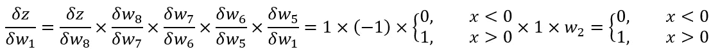

# 自动微分，解释

> 原文：<https://towardsdatascience.com/automatic-differentiation-explained-b4ba8e60c2ad?source=collection_archive---------5----------------------->

## 计算机如何计算导数？

Title image: [Source](https://upload.wikimedia.org/wikipedia/commons/thumb/8/89/Pure-mathematics-formul%C3%A6-blackboard.jpg/1280px-Pure-mathematics-formul%C3%A6-blackboard.jpg)

通过[梯度下降](/the-beginners-guide-to-gradient-descent-c23534f808fd)的过程，神经网络能够在每次训练中逐渐提高精确度。在梯度下降中，我们的目标是通过调整权重和偏差来最小化损失(即模型有多不准确)。

正如在[之前的系列文章](/step-by-step-the-math-behind-neural-networks-490dc1f3cfd9)中所解释的，通过找到损失函数的偏导数，我们知道我们必须调整多少(和在什么方向上)我们的权重和偏差来减少损失。在该系列中，我们手工计算了单神经元神经网络的导数均方误差损失函数。

然而，神经网络——计算机——是如何计算表达式的偏导数的呢？答案在于一个被称为**自动微分**的过程。让我用上一个系列中的成本函数来说明它，但是做了调整，使它是标量形式的。

Image 1: The cost function in scalar form

此外，由于自动微分只能计算表达式在某一点上的偏导数，所以我们必须为每个变量赋予初始值。我们假设:y = 5；w = 2；x = 1；并且 b=1。

我们来求函数的导数吧！

在我们开始推导这个表达式之前，必须把它转换成一个计算图形。一个计算图简单地将每个操作变成一个**节点**，并通过线将它们连接起来，称为**边**。我们的示例函数的计算图如下所示。

Figure 2: Computation graph for the scalar cost function

首先，让我们计算每个节点的值，从底部(输入变量)传播到顶部(输出函数)。这是我们得到的结果:

Figure 3: Values of each node

接下来，我们需要计算运算之间每个连接的偏导数，用边来表示。这些是每条边的偏角的计算:

Figure 4: Values of each edge

注意 max(0，x)分段函数的部分也是分段函数。该函数将所有负值转换为零，并保持所有正值不变。函数的部分(或者用图形表示，它的斜率)，应该在它的图上很清楚:

Figure 5: max(0, x) function. As seen, there is a slope of 1 when x>0, and a slope of 0 when x<0\. The slope is undefined when x=0.

现在我们可以继续计算偏导数了！让我们找出相对于重量的偏导数。如图 6 所示，只有一条线将结果与权重联系起来。

Figure 6: The path that connects the function to the weights

现在我们简单地将这些边相乘:

Figure 7: Partial

这是我们的部分！

这整个过程可以自动完成，并允许计算机准确快速地计算函数值的偏导数。正是这个过程，让 AI 能够像今天这样高效。

如果你喜欢这篇文章，或者有任何问题或建议，欢迎在下面留下评论！