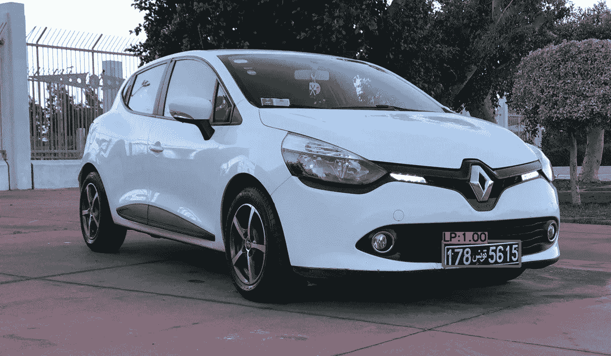
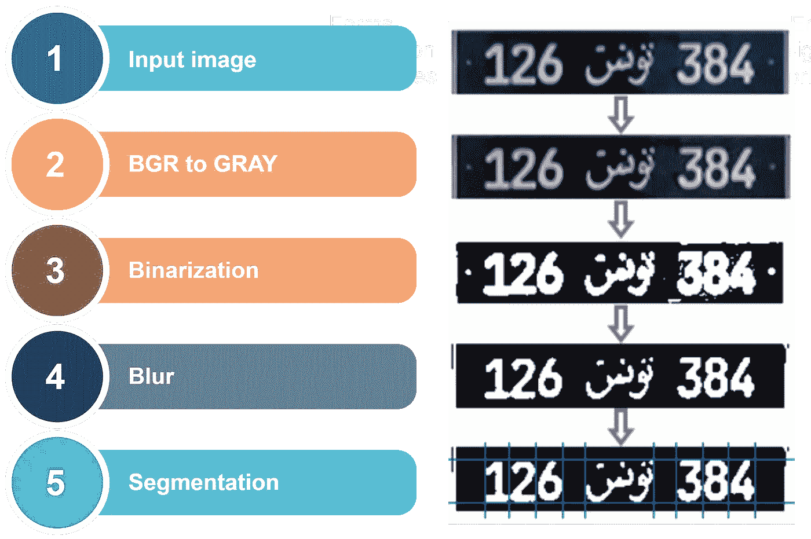
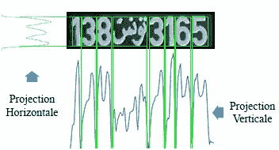
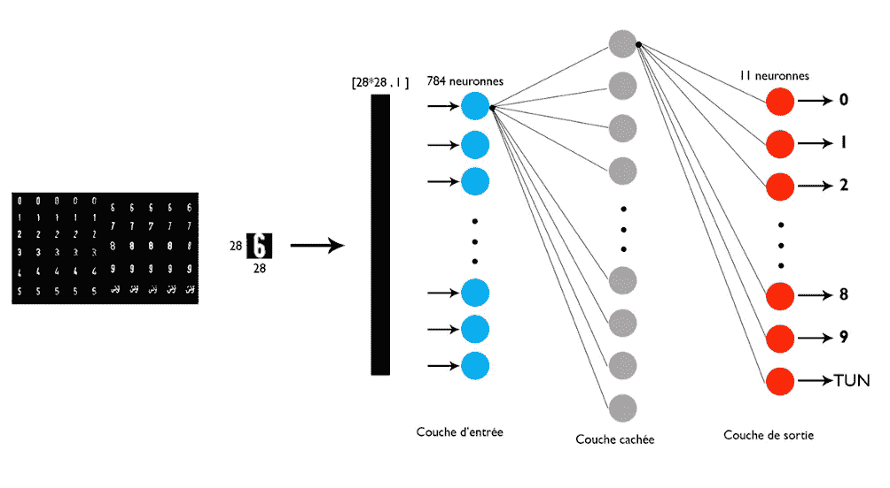

# 基于深度学习的车牌自动检测与识别

> 原文：<https://towardsdatascience.com/automatic-license-plate-detection-recognition-using-deep-learning-624def07eaaf?source=collection_archive---------0----------------------->


Photo by [Evgeny Tchebotarev](https://unsplash.com/@ev25?utm_source=medium&utm_medium=referral) on [Unsplash](https://unsplash.com?utm_source=medium&utm_medium=referral)

> **简介**

在现代世界的不同方面，信息技术的大规模集成已经导致将车辆视为信息系统中的概念资源。由于没有任何数据，自主信息系统没有任何意义，因此需要在现实和信息系统之间改革车辆信息。这可以通过人工代理或特殊的智能设备来实现，这些设备将允许在真实环境中通过车辆的牌照来识别车辆。在智能设备中，提到了车辆牌照的检测和识别系统。车牌检测和识别系统用于检测车牌，然后进行车牌识别，即从图像中提取文本，这一切都要归功于使用定位算法、分割车牌和字符识别的计算模块。车牌的检测和读取是一种智能系统，由于其在以下几个领域的潜在应用，所以它是相当重要的:

- **指挥力量**:该系统用于检测被盗和被搜查车辆。将检测到的车牌与报告的车牌进行比较。

- **停车管理:**汽车出入口的管理。

*   **道路安全:**该系统用于检测超过一定速度的车牌，将车牌读取系统与道路雷达相结合，穿越野火…

我们的项目将分为 3 个步骤:

> **第一步:车牌检测**

为了检测牌照，我们将使用 Yolo ( You Only Look One)基于卷积神经网络的深度学习对象检测架构。

这种架构是由约瑟夫·雷德蒙、阿里·法尔哈迪、罗斯·吉斯克和桑托什·迪夫瓦拉在 2015 年推出的第一版，以及后来的第 2 版和第 3 版。

Yolo v1:纸张[链接](https://arxiv.org/pdf/1506.02640.pdf)。

Yolo v2:纸张[链接](https://arxiv.org/pdf/1612.08242.pdf)。

Yolo v3:纸张[链接](https://arxiv.org/pdf/1804.02767.pdf)。

Yolo 是一个端到端训练的单一网络，用于执行预测对象边界框和对象类的回归任务。

这个网络非常快，它以每秒 45 帧的速度实时处理图像。一个较小版本的网络，快速 YOLO，每秒处理惊人的 155 帧。

**实施 YOLO V3:**

首先，我们准备了一个由 700 张包含突尼斯牌照的汽车图像组成的数据集，对于每张图像，我们创建一个 xml 文件(之后改为文本文件，其中包含与 Darknet 配置文件输入兼容的坐标。Darknet:该项目用于使用一个名为 [LabelImg](https://github.com/tzutalin/labelImg) 的桌面应用程序重新训练 YOLO 预训练模型。

```
# First download Darknet project
$ git clone [https://github.com/pjreddie/darknet.git](https://github.com/pjreddie/darknet.git)# in "darknet/Makefile" put affect 1 to OpenCV, CUDNN and GPU if you # want to train with you GPU then time thos two commands
$ cd darknet
$ make# Load convert.py to change labels (xml files) into the appropriate # format that darknet understand and past it under darknet/
   [https://github.com/GuiltyNeuron/ANPR](https://github.com/GuiltyNeuron/ANPR)# Unzip the dataset
$ unzip dataset.zip# Create two folders, one for the images and the other for labels
$ mkdir darknet/images
$ mkdir darknet/labels# Convert labels format and create files with location of images
# for the test and the training
$ python convert.py# Create a folder under darknet/ that will contain your data
$ mkdir darknet/custom# Move files train.txt and test.txt that contains data path to
# custom folder
$ mv train.txt custom/
$ mv test.txt custom/# Create file to put licence plate class name "LP"
$ touch darknet/custom/classes.names
$ echo LP > classes.names# Create Backup folder to save weights
$ mkdir custom/weights# Create a file contains information about data and cfg 
# files locations
$ touch darknet/custom/darknet.data# in darknet/custom/darknet.data file paste those informations
classes = 1
train  = custom/train.txt
valid  = custom/test.txt
names = custom/classes.names
backup = custom/weights/# Copy and paste yolo config file in "darknet/custom"
$ cp darknet/cfg/yolov3.cfg darknet/custom# Open yolov3.cfg and change :
# " filters=(classes + 5)*3" just the ones before "Yolo"
# in our case classes=1, so filters=18
# change classes=... to classes=1# Download pretrained model
$ wget https://pjreddie.com/media/files/darknet53.conv.74 -O ~/darknet/darknet53.conv.74# Let's train our model !!!!!!!!!!!!!!!!!!!!!
$ ./darknet detector train custom/darknet.data custom/yolov3.cfg darknet53.conv.74
```

完成训练后，要从图像中检测车牌，请从 darknet/custom/weights 中选择最新的模型，并将其路径或名称放在 object_detection_yolo.py 文件中，我们也将使用 yolov3.cfg 文件，只是在该文件中在训练前放置#以便我们可以训练，然后运行:

```
python object-detection_yolo.py --image= image.jpg
```

这就是我们的结果:



> **第二步:车牌分割**

现在我们要分割我们的车牌号码。输入的是车牌的图像，我们必须能够提取单字符图像。这个步骤的结果被用作识别阶段的输入，这是非常重要的。在车牌自动读取系统中。

分割是车牌自动识别中最重要的过程之一，因为任何其他步骤都以分割为基础。如果分割失败，识别阶段将是不正确的。为了确保正确的分割，必须进行初步处理。



**像素投影直方图**由寻找每个字符的上下限、左右组成。我们执行水平投影来找到字符的顶部和底部位置。一组直方图的值是沿着水平方向上的特定线的白色像素的总和。当沿着水平方向上的所有线的所有值被计算时，获得水平投影直方图。直方图的平均值然后被用作阈值来确定上限和下限。直方图分段大于阈值的中心区域被记录为由上限和下限界定的区域。然后，我们以同样的方式计算垂直投影直方图，但是通过改变图像的行和列来获得每个字符的两个界限(左和右)。



另一种从车牌中提取数字的方法是使用开/闭形态学对连通区域进行排序，然后使用连通分量算法提取连通区域。

> **第三步:车牌识别**

识别阶段是自动车牌识别系统开发的最后一步。因此，它关闭了所有经过图像采集的过程，接着是车牌的定位，直到分割。识别必须从分割阶段结束时获得的图像字符中进行。用于这种识别的学习模型必须能够读取图像并呈现相应的字符。

为了使大部分数据可用于学习，我们在应用与分割车牌之前使用的相同图像处理步骤之后，通过在正方形中调整大小来单独切割每个字符。结果，我们获得了一组由 11 个类组成的数据，对于每个类，我们有 30-40 个 28X28 像素尺寸 PNG 格式的图像；从 0 到 9 的数字和阿拉伯语单词(突尼斯)。

然后，我们基于比较多层感知器(MLP)和分类器 K 最近邻(KNN)的科学文章进行了一些研究。结果我们发现:如果当使用 MLP 分类器时，隐藏层神经元的数量也增加，并且如果当使用 KNN 时，最近邻居的数量也增加，则性能增加。这里调整 k-NN 分类器性能的能力非常有限。但是可调数量的隐藏层和可调 MLP 连接权重提供了更大的机会来改进决策区域。因此，我们将选择多层感知器用于这一阶段。



Github 项目回购[链接](https://github.com/GuiltyNeuron/ANPR)