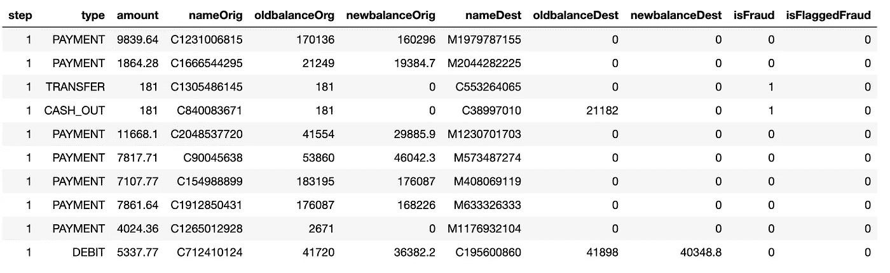

# 使用 H2O AutoML 的欺诈检测中的自动机器学习

> 原文：<https://towardsdatascience.com/automatic-machine-learning-in-fraud-detection-using-h2o-automl-6ba5cbf5c79b?source=collection_archive---------22----------------------->

## 金融中的机器学习自动化


机器学习在金融领域有许多应用，如安全、流程自动化、贷款/保险承保、信用评分、交易等。[1][2].金融欺诈是金融安全的主要问题之一[1][2]。为了对抗日益增加的金融欺诈风险，机器学习已被积极应用于欺诈检测[3][4]。

将机器学习应用于欺诈检测存在许多技术挑战。一个主要的困难是数据集在正负类方面倾向于高度倾斜和不平衡[3][4]。如[3]所示，为了在这种情况下获得血统欺诈检测/预测结果，通常需要领域专业知识和大量人工工作来进行数据探索、数据预处理、特征工程、模型选择、训练、评估等。

为了应对这些挑战，H2O [6]提供了一个用户友好的自动机器学习模块，称为 AutoML [7]，非专家也可以使用。

在本文中，与[3]类似，我使用 Kaggle [5]中相同的高度偏斜和不平衡的合成金融数据集来演示如何使用 AutoML [7]来简化机器学习以进行欺诈预测，与[3]中的机器学习方法相比。

# 1.没有自动化的机器学习

本节总结了[3]中无自动化的机器学习方法的要点，以建立与第 2 节中的 H2O 自动机器学习方法进行比较的基线。

## 1.1 数据探索

在[3]中，进行了广泛的数据探索和分析工作，以了解哪些数据记录和特征是必需的，以及哪些数据记录和特征可以被丢弃而不会对机器学习建模和欺诈预测产生重大影响。这类工作往往需要领域专业知识，如[3]所示。[3]中的主要结果可以总结如下:

*   **特征*类型***

响应类*is fraud*(0-否，1-是)仅在值的特征*类型*为 CASH_OUT 或 TRANSFER 时设置。因此，唯一相关的数据记录是那些具有值 CASH_OUT 或 TRANSFER [3]的*类型*的记录。

*   **特征*isFlaggedFraud***

特征 *isFlaggedFraud* 仅在总共数百万条数据记录中的 16 条数据记录/样本[3]中设置，因此我们可以在不对建模和欺诈预测的结果产生重大影响的情况下删除该特征。

*   **特性*命名来源*和*命名最早***

如[3]中所指出的，特性*命名来源*和*命名目的*没有意义，因为它们没有以预期的方式对商户账户进行编码，因此可以删除。

## 1.2 数据预处理

根据数据探索的结果，数据集在[3]中进行如下预处理。

*   **提取*类*转账或提现**的数据记录

根据数据探索的结果，只有当数据类型为 TRANSFER 或 CASH_OUT 时，才会发生欺诈。因此，只有那些数据记录从原始数据集中提取出来，用于模型训练和欺诈预测[3]。此外，不太有用的功能*命名为 Orig* 、*命名为 Dest* 和*为 FlaggedFraud* 被删除:

```
X = df.loc[(df.type == ‘TRANSFER’) | (df.type == ‘CASH_OUT’)]
X = X.drop([‘nameOrig’, ‘nameDest’, ‘isFlaggedFraud’], axis = 1)
```

*   **输入缺失值**

如[3]中所述，目的地账户余额为零是欺诈的明显迹象。因此，帐户余额不应该用统计值或随后对交易金额进行调整的分布值来估算。这是因为这样做会使欺诈交易看起来像真的。为了避免这个问题，在[3]中，值为 0 的目标帐户余额被替换为-1，以使其更适合用于欺诈检测的机器学习算法:

```
X.loc[(X.oldBalanceDest == 0) & (X.newBalanceDest == 0) & (X.amount != 0), [‘oldBalanceDest’, ‘newBalanceDest’]] = -1
```

此外，如[3]中所指出的，在非零金额交易之前和之后，数据还具有发起账户的零余额的若干交易。在这种情况下，与真实交易的比例(47%)相比，欺诈交易的比例(0.3%)要小得多[3]。类似于目的地账户余额为零的处理，起始账户余额 0 被替换为空值*而不是输入一个数值来区分欺诈交易和[3]中的真实交易。*

```
X.loc[(X.oldBalanceOrig == 0) & (X.newBalanceOrig == 0) & (X.amount != 0), ['oldBalanceOrig', 'newBalanceOrig']] = np.nan
```

## 1.3 特征工程

如[3]所述，目的账户或发起账户的零余额有助于区分欺诈交易和真实交易。这促使作者创建了以下两个新功能来记录每笔交易的起始帐户和目的帐户中的错误[3]。这些新特性对于获得[3]中采用的机器学习算法的最佳性能非常重要。

```
X[‘errorBalanceOrig’] = X.newBalanceOrig + X.amount - X.oldBalanceOrigX[‘errorBalanceDest’] = X.oldBalanceDest + X.amount — X.newBalanceDest
```

## 1.4 型号选择

[3]中考虑的用于模型选择的第一种方法是在应用机器学习算法之前，通过对多数类进行欠采样来平衡不平衡数据。欠采样的缺点是，以这种方式训练的模型在现实世界中看不到的不平衡数据上可能表现不好，因为在模型训练期间几乎所有的不平衡信息都被丢弃了。

[3]中考虑的第二种方法是[过采样](https://en.wikipedia.org/wiki/Oversampling)少数类。作者尝试了各种类型的异常检测和监督学习方法。

如[3]所述，经过多次实验，作者最终得出结论:采用[xboost](https://xgboost.readthedocs.io/en/latest/python/python_intro.html)机器学习算法在原始数据集上获得了最好的结果。

## 1.5 模型培训与评估

数据集分为两部分，如下文[3]所示，80%用于模型训练，20%用于模型测试:

```
trainX, testX, trainY, testY = train_test_split(X, Y, test_size = 0.2, random_state = randomState)
```

所选*XB classifier*模型的超参数设置为特定值:

```
weights = (Y == 0).sum() / (1.0 * (Y == 1).sum())clf = XGBClassifier(max_depth = 3, scale_pos_weight = weights, n_jobs = 4)
```

模型训练和测试按以下[3]进行:

```
probabilities = clf.fit(trainX, trainY).predict_proba(testX)
```

使用 *AUPRC* ( [精确-再调用曲线下的区域](http://pages.cs.wisc.edu/~boyd/aucpr_final.pdf))而非正常的 [*AUC*](https://en.wikipedia.org/wiki/Receiver_operating_characteristic#Area_under_the_curve) 的值来评估模型性能:

```
print(‘AUPRC = {}’.format(average_precision_score(testY, probabilities[:, 1])))
```

# 2.自动机器学习

如前一节和[3]所述，为了从高度倾斜和不平衡的数据中获得血统欺诈预测结果，数据探索、数据预处理、特征工程、模型选择、训练、评估等都需要大量的领域知识和手工工作。

本节将演示如何使用 H2O AutoML [7]通过自动机器学习来减少手动工作量，包括但不限于以下内容:

*   自动数据预处理(例如，处理丢失的数据)
*   自动特征工程
*   自动选型
*   自动模型训练
*   自动模型评估

H2O [6]是基于客户机和服务器的集群架构。在开始任何其他活动之前，H2O 服务器需要启动:

```
import h2o
from h2o.automl import H2OAutoML
h2o.init()
```

如果 H2O 服务器在本地计算机上成功启动，将显示以下内容:


## 2.1 数据加载

一旦将 Kaggle [5]中的合成金融数据集下载到 H2O 服务器机器上，就可以按如下方式将该数据集加载到 H2O 服务器上:

```
df = h2o.import_file(‘./data/PS_20174392719_1491204439457_log.csv’)
df.head(10)
```



数据集的摘要描述可通过以下方式获得:

```
df.describe()
```


响应类*的数据类型为 raud* 设置为分类(即因子)，因为它是二进制的(0-否，1-是):

```
factorslist = [‘isFraud’]
df[factorslist] = df[factorslist].asfactor()
```

## 2.2 数据预处理

为与[3]中的方法相比较，与[3]类似，仅从原始数据集中提取 TRANSFER 或 CASH_OUT 类型的数据记录进行模型训练和欺诈预测，去掉不重要的特征 *nameOrig* 、 *nameDest* 、*is lagged 欺诈*。

```
df1 = df[df[‘type’] == ‘TRANSFER’ or df[‘type’] == ‘CASH_OUT’]
y = “isFraud”
x = df.columns
x.remove(y)
x.remove(“nameOrig”)
x.remove(“nameDest”)
x.remove(“isFlaggedFraud”)
```

## 2.3 选型及培训

为了与[3]中的方法相比较，提取的数据集被分成如下两部分，80%用于模型训练，20%用于模型测试:

```
train, test = df1.split_frame([0.8])
```

选择了超参数 *max_models* 值为 10 的 *H2O 汽车*模型:

```
aml = H2OAutoML(max_models = 10, seed = 1)
```

使用默认设置训练选定的模型，如下所示:

```
aml.train(x = x, y = y, training_frame = train)
```

## 2.4 模型评估

*   **查看训练模型列表**

一旦 H2O AutoML 模型被训练，相应的*排行榜*方法可用于显示训练模型列表，按 *AUC* (非 *AUPRC* )降序排列:

```
lb = aml.leaderboard
lb.head(rows=lb.nrows)
```


从上表中我们可以看到，H2O AutoML 自动选择并训练了 12 个不同的模型，包括堆叠系综模型。主导车型为*XGBoost _ 3 _ AutoML _ 2019 11 13 _ 110031*。

*   **获取并评估主导模型**

位于训练模型列表顶部的模型可以如下获得:

```
leader_model = aml.leader
```

注意，这个领先的模型在模型训练 *AUC* (不是 *AUPRC* )分数方面是最好的。

主要模型测试性能的综合总结如下:

```
leader_model.model_performance(test)
```

如下图所示，领先车型的测试 *AUPRC* (即 *pr_auc* )得分为 0.988。


下面的代码将获取主导模型的特征重要性:

```
leader_model.varimp_plot()
```


*   **获得并评估具有最佳训练的模型 AUPRC**

然而，模型测试 *AUPRC* 而非 *AUC* 在【3】中用于模型性能评估。为了进行公平的比较，我们需要用最好的测试 *AUPRC* 来获取和评估训练好的模型。为此，我们可以首先获得并评估具有最佳训练 AUPRC 的模型，然后将其测试 AUPRC 性能与领先模型进行比较，以确定应该选择哪个模型。

如前所述，H2O AutoML 的*排行榜*方法按照训练 *AUC* 而非 *AUPRC* 的降序显示已训练车型列表。为了找到具有最佳训练 *AUPRC* 的模型，可以使用以下代码以训练 *AUPRC* 的降序显示训练过的模型:

```
import pandas as pdmodel_ids = list(aml.leaderboard['model_id'].as_data_frame().iloc[:,0])model_auprc_map = {'Model Id' : [], 'AUPRC' : []}
for mid in model_ids:
    model = h2o.get_model(mid)
    model_prauc_map['Model Id'].append(mid)
    model_prauc_map['*AUPRC*'].append(model.pr_auc(train))
model_auprc_df = pd.DataFrame(model_auprc_map)
model_auprc_df.sort_values(['*AUPRC*'], ascending=0, inplace=True)
model_auprc_df.head(20)
```


可以看到最佳训练 *AUPRC* 为 0.937 的模型 id 为 XGBoost _ 2 _ AutoML _ 2019 11 13 _ 110031。

列表顶部的模型可以通过以下方式获得:

```
best_auprc_model_id = model_auprc_df.iloc[0, 0]
best_auprc_model = h2o.get_model(best_auprc_model_id)
```

然后，可以获得模型测试性能的全面总结:

```
best_auprc_model.model_performance(test)
```

如下图所示，最佳训练 *AUPRC* (即 *pr_auc* )的车型取得了 0.975 的测试 *AUPRC* 分数。


以下代码用于获取具有最佳训练 *AUPRC* 分数的模型的特征重要性:

```
best_prauc_model.varimp_plot()
```


测试结果表明，在测试 AUPRC 分数方面，领先模型优于具有最佳训练 AUPRC 分数的模型。因此，应该选择领先的模型。

## 2.5 与没有自动化的机器学习的比较

下表比较了 H2O AutoML [7]和[3]中无自动化的机器学习方法之间的主要机器学习活动。


如第 1 节和[3]中所述，在处理缺失数据、特征工程、模型选择、培训、评估等方面，需要领域专业知识和大量手工工作。所有这些类型的工作都是在 AutoML [7]中自动完成的，无需人工干预。另外，AutoML [7]中的模型超参数设置比[3]中的机器学习方法简单得多。

然而，关于模型测试方面的模型测试性能 *AUPRC* ，与 AutoML 的 0.988 分相比，[3]中的机器学习方法获得了更高的 0.997 分。

AutoML 的主要优势在于，非专家可以使用它从复杂的数据集(如本文中使用的高度偏斜和不平衡的数据集)中获得相当下降的欺诈检测/预测结果。

# 摘要

在本文中，正如在[3]中一样，我在 Kaggle [5]中使用了相同的高度偏斜和不平衡的合成金融数据集来展示 H2O 汽车公司[7]在使非专家能够将机器学习应用于金融欺诈检测方面的能力。这是通过数据预处理、特征工程、模型选择、模型训练和模型评估的自动化实现的。体面的模型测试 *AUPRC* 得分为 0.988。

如第 2.5 节所述，通过手工制作数据预处理、特征工程、模型选择、训练等方法，在[3]中获得了更高的模型测试 *AUPRC* 分数 0.997。在这种情况下，根据业务需求，可能有理由支持用户定义的机器学习方法而不是 AutoML。我注意到 H2O 提供了一个更强大的端到端自动机器学习工具集，叫做， [H2O 无人驾驶 AI](https://www.h2o.ai/products/h2o-driverless-ai/?utm_source=google&utm_medium=test&utm_campaign=aiforbiz&utm_content=get-it-now&gclid=CjwKCAiA8K7uBRBBEiwACOm4d0zU8kzChZsufVOOI3LYYlypv_33jWqxj4CK9t7YzTvfHM65CzbarBoCeNAQAvD_BwE) [8]。该工具集具有[自带方法](https://www.h2o.ai/products-h2o-driverless-ai-recipes/)的功能，使用户能够即插即用自己的方法进行数据预处理、特征工程、建模等。

Github [9]中有一个 Jupyter 笔记本，上面有本文中的所有源代码。

# 参考

[1].K. Didur，[金融中的机器学习:为什么，什么&如何](/machine-learning-in-finance-why-what-how-d524a2357b56)

[2].D. Faggella，[金融中的机器学习——现在和未来的应用](https://emerj.com/ai-sector-overviews/machine-learning-in-finance/)

[3].a .约书亚，[预测金融支付服务中的欺诈](https://www.kaggle.com/arjunjoshua/predicting-fraud-in-financial-payment-services)

[4].R. Pierre，[使用机器学习检测金融欺诈:赢得对不平衡数据的战争](/detecting-financial-fraud-using-machine-learning-three-ways-of-winning-the-war-against-imbalanced-a03f8815cce9)

[5].[用于欺诈检测的合成金融数据集](https://www.kaggle.com/ntnu-testimon/paysim1)

[6]. [H2O.ai](http://docs.h2o.ai/h2o/latest-stable/h2o-docs/index.html)

[7]. [H2O 汽车](http://docs.h2o.ai/h2o/latest-stable/h2o-docs/automl.html)

【8】[H2O 无人驾驶 AI](https://www.h2o.ai/products/h2o-driverless-ai/?utm_source=google&utm_medium=test&utm_campaign=aiforbiz&utm_content=get-it-now&gclid=CjwKCAiA8K7uBRBBEiwACOm4d0zU8kzChZsufVOOI3LYYlypv_33jWqxj4CK9t7YzTvfHM65CzbarBoCeNAQAvD_BwE)

[9].Github 中的 Jupyter 笔记本

披露声明:2019 首创一。观点是作者个人的观点。除非本帖中另有说明，否则 Capital One 不隶属于所提及的任何公司，也不被这些公司认可。使用或展示的所有商标和其他知识产权是其各自所有者的财产。