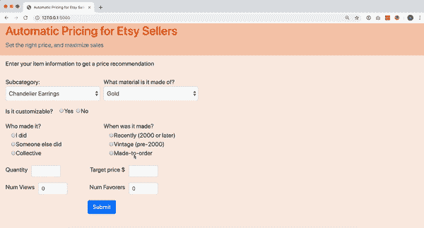
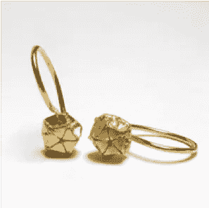
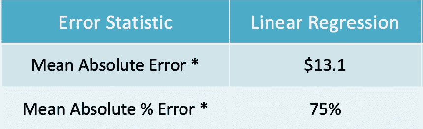
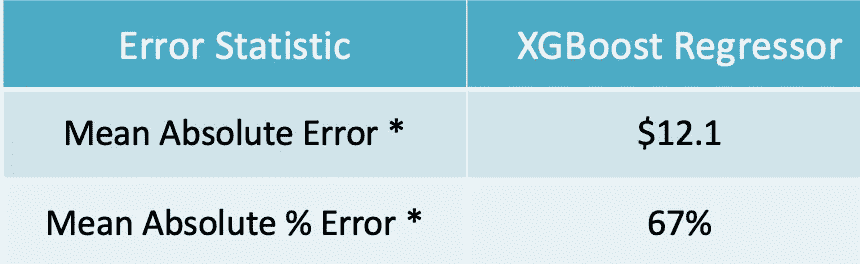
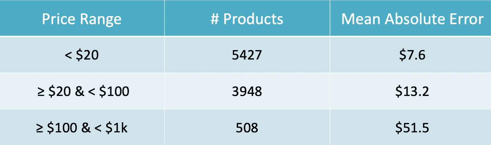

# Etsy 卖家的自动定价

> 原文：<https://towardsdatascience.com/automatic-pricing-for-etsy-sellers-8994797e66c1?source=collection_archive---------35----------------------->

## 使用无监督学习和线性回归的竞争性产品定价

Jewelry Making (image from pexels.com)

Etsy 是数百万手工产品的全球市场。这些卖家中有许多是网站新手，可能不了解市场或他们的竞争对手以及他们产品的定价技术。

我做了一个工具，可以给卖家的产品估价。该工具将为产品提供有竞争力的价格，并检查产品当前价格是否过高或过低。

***注*** *:我在创建集群时使用了物品的价格。如果它是一个现有的项目，我用的是标价。对于上传新商品的新卖家，我会问他们一个估价，模型会告诉他们是高估还是低估。*

# **数据**

我使用 Etsy API 收集数据。截至 2018 年 12 月，Etsy 的市场上有超过 6000 万种产品。为了扩大我的项目范围，我从网站的“珠宝”部分收集了大约 30 万件商品的信息。

Screenshot of a sample listing of silver earrings from Etsy

这些产品横跨大约 20 个国家。我将所有的挂牌价格统一为美元。从产品网页上收集的其他属性是——它们的材质(金、银、珍珠等。)、产品分类(耳环、项链、订婚戒指等。)，无论这款产品是复古的、最近制作的还是定制的，等等。

我还收集了一些现有卖家产品的流行度指标，比如收藏夹和浏览量。

# 假设

1

2 ***售价<$ 1000—***Etsy 上有很多稀有的复古产品。镶有稀有宝石的老式订婚戒指价格高达 1 万到 2 万美元！！
我选择提供大多数市场的价格估计，忽略了极其昂贵的复古单品(约占产品的 2%)。

3 比如首饰→耳环→吊坠&吊坠。
此功能稍后将在模型中使用，它会影响价格估算。这些物品的不正确分类会导致价格估计的偏差。

# 思维

> 每当卖家上传新产品到他们的商店时，我想为他们提供一个价格估计。为此，首先，我想找到“相似”的产品(使用 k-prototypes 算法将产品聚类在一起)。然后，我想在线性回归算法中使用这个“cluster”标签作为一个特征，以及其他属性来预测商品的价格。

# 聚类-K 原型

我用于聚类的大多数特征都是分类特征。例如，“材料”有许多价值，如金、银、钻石、珍珠等。此外，每个产品可以有一个以上的材料价值。

为了对珠宝项目进行聚类以找到“相似”的项目，我使用了 [**K 原型**](https://github.com/nicodv/kmodes) 算法。这是更流行的 k-means 算法的变体。两者之间的显著区别在于它们处理分类数据的方式。

K-Prototypes 在数字特征上使用 k-means(欧几里德距离),在分类特征上使用 k-modes(相异度量)。它不是使用平均值来计算聚类的“质心”，而是计算每个聚类的“原型”作为代表。

## 方法

在我的数据集中，我有许多 1 级子类别——耳环、项链、戒指、手镯、脚链等。每个类别有各种子类别，如耳环有箍耳环，耳钉等。

定义聚类的特征-类别、子类别、材料、产品制造商(卖方、第三方卖方)、产品制造年份(2000 年之后、定制、年份)、项目价格、可定制性、查看次数、收藏数量。

我尝试了两种方法。 ***第一个*** ，将所有子类别聚类在一起。我得到的集群是重叠的，没有很好的定义。
***第二个*** ，我尝试了两层的方法。我将每个类别的数据集分开，然后分别对每个类别进行聚类。 ***这种有针对性的聚类给了我更纯粹、更分离的聚类。这是有道理的，因为直觉上，一对金耳环和一条金项链的价格会在不同的范围内。***

## 集群

类似于 k-means，我们可以使用惯性来找到最佳的“k ”,我使用 k-原型的成本函数来找到最佳的集群数。我对 3 到 25 个集群和耳环运行了该算法，得到 20 作为具有最小成本值的“k”。

下面是我得到的一组耳环的例子—

这张照片描述的是一串大多是*黄金耳环，由卖家 ***在 2000 年*** 之后制作。一般都是 ***不可定制*** ，本簇耳环均价为 ***$370*** 。*

# *定价—线性回归*

*接下来，有了这些集群，我继续回归世界。连同其他特征一起，我在回归模型中使用这些聚类标签作为特征。*

*我尝试了几种方法。首先，使用 scikit-learn 进行简单的线性回归作为基线。*

**

*我得到了 13.1 美元的平均绝对误差。这意味着，我的价格估计会比这些珠宝的最佳价格低大约 13 美元。*

*这是一个很好的基线。接下来，我使用一个 XGBoost 回归器来看看我是否可以改进基线模型的性能。*

**

*确实！XGBoost 模型在平均绝对误差(MAE)和平均绝对百分比误差(MAPE)方面确实稍好一些。*

*我关注梅和 MAPE 的原因是产品的价格范围很广(1-1000 美元)。让我们更深入地探讨一下。*

*如果我看的是 500 美元的项链，12 美元的预测误差并不算多。然而，如果我看的是 20 美元的耳环，那就大错特错了。因此，为了研究这种差异，我按照商品的价格范围对误差进行了分解。*

**

*Breakdown of the Mean Absolute Error by price range of jewelry products*

## *权衡*

*因此，XGBoost 比传统的线性回归做得好一点。然而，在选择我的最终模型时有一个权衡。*

> *线性回归更容易解释，而 XGBoost 的预测更准确。*

*如果卖家可以灵活选择他们可以出售的商品，线性回归会更有帮助。这些系数会告诉你什么卖得最好。然而，如果卖方只是销售他们生产的或库存的产品，预测的准确性对他们来说更重要。考虑到这一点，我决定继续使用 XGBoost 作为我的价格预测模型。*

## *XGBoost 的特性重要性*

*XGBoost regressor 为模型中使用的所有功能提供功能重要性。它是所有特性的相对排名。*

*我使用聚类的标记数据进行回归。也就是说，在我的模型中，聚类标签也是其他产品属性的特征。*

*当我观察特征的重要性时，聚类的排名高于单个属性。*

> ***个体特征之间的相互作用很重要。由于集群很好地解释了这些交互，XGBoost 将它们排在比任何单个特性更高的位置。***

*例如，“可定制性”是一个重要的特性。如果是定制的耳环可能会涨价。但是如果是定制的银耳环和定制的金耳环，价格会有不同的变化。*

# *该应用程序*

*我使用 Flask 创建了一个工具，它将产品属性作为输入，并实时将其分配给一个集群。回归模型使用这一点，并提供一个建议价格。*

**

# *结论*

*这个工具可以帮助 Etsy 上的新企业家为他们的项目定价，并在 Etsy 上开始他们的业务。*

*定价算法或细分并不仅限于 Etsy 产品。任何市场业务都可以利用这些算法。一些这样的应用是 Airbnb 房产的定价、DoorDash 上餐馆项目的定价等。像 LinkedIn 这样的工作论坛可以使用这些技术来根据工作描述提供估计工资。*

# *资源*

*[k-prototypes 算法](https://github.com/nicodv/kmodes#huang97)， [Github](https://github.com/asmitakulkarni/PriceEstimator) ， [LinkedIn](https://www.linkedin.com/in/asmitak/)*