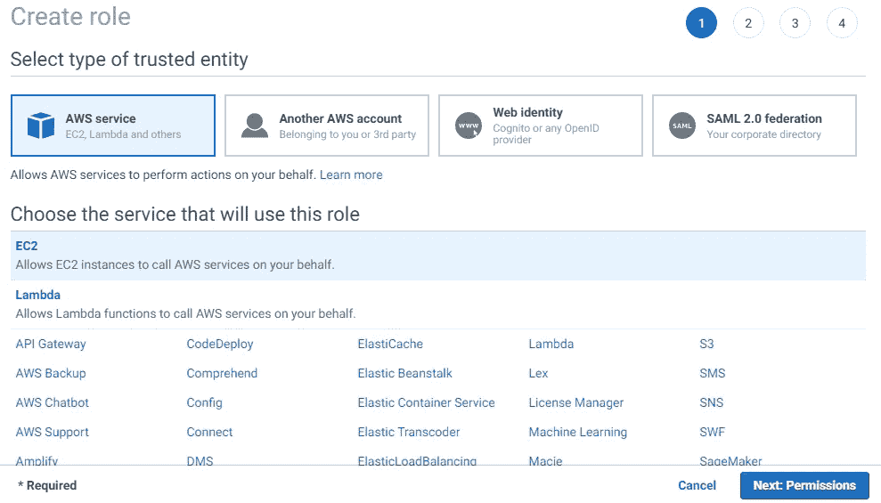
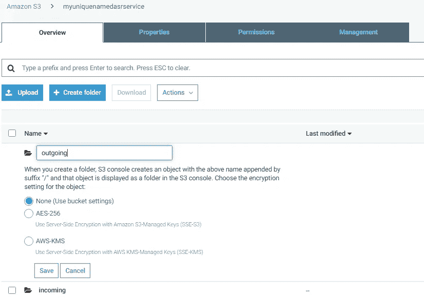

# 自动语音识别作为 AWS 上的微服务

> 原文：<https://towardsdatascience.com/automatic-speech-recognition-as-a-microservice-on-aws-6da646631fdb?source=collection_archive---------20----------------------->


本文将帮助您在 AWS 基础设施上使用 Kaldi Toolkit 建立自己的 ASR 管道，为您提供可伸缩性和高可用性的选择。

本文假设读者对云计算和相关术语有必要的了解，此外，任何实际经验都可以帮助您在一个小时内完成所有工作！

在我开始阅读设置这个管道的指导手册之前，让我们先来看一下三个基本问题

> 这个工具是做什么的？
> 
> 简而言之，用户上传任何英语音频文件，该工具将提供相同的转录并存储到数据库中，然后可用于各种用例
> 
> **为什么要打造这个工具？**
> 
> 对于那些业务围绕音频/音频形式的对话的人来说，构建这样一个工具不仅会在文本分析方面开辟无限的可能性，还能让他们开发自己的自助产品。
> 
> 请注意，在语音转文本领域，这种技术非常少！

## **平视**

这个工具利用了 [Kaldi 预先训练好的神经网络](https://kaldi-asr.org/models/m1)英语模型来转录成文本。虽然这个模型的词汇量相当大，但是仍然不足以为您的用例选择非常罕见/特定的单词。


Kaldi Logo

**有没有可能** 有，是开源项目。如果你在定制方面需要帮助，请随时联系我

## **架构**

介绍完毕，让我们深入应用程序的数据流。该架构本质上为您提供了我们使用 AWS 基础设施的工具的鸟瞰图


AWS Architecture of the Tool we will develop. Repeated numbers depict that some processes happen in parallel to others. By the time time steps [2 > 3 > 8] happen, [3 > 4 > 5 > 6 > 7] will have finished processing

## **合适的工具**

我们可以在一台服务器上从头到尾执行每一个动作，就这样！当设计作为几乎所有产品核心组件的数据管道时，我们需要开始研究数据工程的基础知识

从技术的角度来看，对于一个产品，并且最终会被大量用户使用的东西来说，这三条规则是必不可少的

1.  成本效益:有没有更便宜的方法来做这件事，而又不影响质量？
2.  **高可用性:**如果其中一台服务器崩溃，那么整个产品会崩溃吗？
3.  可伸缩性:我们能让这个工具自己处理峰值负载吗？

即使你的工具只是另一个 MVP，不遵守这 3 条规则可能会成为你的产品的一个昂贵的错误。于是， [**AWS 云**](https://aws.amazon.com/)

虽然 AWS 有一套广泛的工具，但明智地选择它们就更有道理了。以下是我们用来开发工具的 AWS 工具列表，其中大多数工具都包含在 [**AWS 自由层**](https://aws.amazon.com/free/) 中。不过，在某些时候，你的使用可能会收费。我建议你在开始实施之前留意一下价格。

1.  **S3:** 简单的仓储服务。你能得到的最便宜的存储
2.  **EC2:** 计算服务器。 *t3a.xlarge 实例*
3.  **动力数据库:** NoSQL 数据库
4.  **Lambda:** 大规模处理小脚本执行的计算服务
5.  **AWS API:** 很好的选择，因为很难编写可伸缩的 API 服务

## **建立基础设施**

你可以利用 GitHub 上的代码让你的 Infra 马上发挥作用！

**Github:**https://github.com/purijs/kaldi-asr-aws

请参考 Github 上的 [**README.md**](https://github.com/purijs/kaldi-asr-aws/blob/master/README.md) 文件，它详细解释了如何在 EC2 实例上设置一切。

你可以自由选择任何一种 EC2 机器。然而，我发现下面的配置足以实现这个管道

1.  EC2: **t3a.xlarge**
2.  50GB 磁盘空间
3.  图片:**亚马逊 Linux 2 AMI (HVM)**
4.  安全组:**打开端口 80 (HTTP)、8080 (FLASK)和 22 (SSH)**

> 由于这种类型的 EC2 实例不包括在**自由层**中，您可能会在这一点上产生成本。如果您无论如何都要获得它，请确保它处于**停止状态**，因为我们不会马上使用它

继续使用上面的配置获取 EC2 实例，并将上面的 Git 存储库克隆到您的服务器中。一旦您做好了设置，我们将在 AWS 控制台上完成以下步骤

> -创建一个具有 S3 读/写权限的 IAM 角色并将其附加到您的实例
> -为 lambda 函数创建一个 IAM 角色以读取/写入 DynamoDB
> -配置 S3 桶
> -编写第一个 Lambda 函数以读取音频文件的元数据
> -设置 AWS API 以触发我们的第一个 Lambda 函数
> -使用 Kaldi ASR 配置 EC2 实例(此时克隆 git 代码！)
> -编写第二个 lambda 函数来读取/写入脚本到 DB
> -设置 DynamoDB
> -用 Flask App 链接管道

# **实用**

1.  **为 S3 制作 IAM 角色**



Go to IAM from AWS Console, select “Create Role” and choose EC2 and “Next” | 2\. Choose “S3FullAccess” in Policies | 3\. Tags are optional, name this role and click “Create”


To attach this role to your EC2 instance, 1\. Go to the EC2 dashboard, select your instance, and choose “Actions” > “Instance Settings” > “Attach/Replace IAM Role” | 2\. Select your role and continue.

现在，您可以运行“AWS s3”CLI 命令并从 EC2 访问 S3 存储桶，而无需使用/存储帐户密钥

**2。为 Lambda 函数设置 IAM 角色**


Similarly, create a role for “Lambda”. Make sure you add permissions for DynamoDBFullAccess and S3FullAccess (Refer the screens above)

**【更新】:**除了以上两个策略，还要加上这些:

*   CloudWatchFullAccess
*   LambdaFullAccess

**3。配置 S3 铲斗**

现在，我们已经为不同的 AWS 服务设置了必要的访问权限，接下来我们将设置第一个服务，即 S3

**目的:** 

**传入:**存储用户上传的音频文件，一经 EC2 处理将被删除

**传出:**存储音频的抄本。txt 文件，稍后 Lambda 函数会读取该文件，然后将内容转储到 DynamoDB 中



Go to S3 from console, create a new S3 Bucket, keeping all other settings to default (Changing region is fine, but make sure your Lambda Functions are also in the same region). Once created, make two directories as explained above

**4。第一个λ函数**

简单来说，AWS Lambda 允许你运行 **Python/NodeJS/Bash/etc。就像在 EC2 机器上运行一样编码。唯一的区别是，除了一些技术上的，你只在这段代码运行时才被收费，也就是说，对于每个触发器，它的伸缩性也很好！**

这个 lambda 函数将运行一个 Python 代码，该代码将读取存储在 S3 中的文件名，并将它们转储到 DynamoDB 中。

> 这是参考架构图的步骤 **5、6 和 7**
> 
> 注意我们是如何尽可能地去耦合组件的

从 AWS 控制台的服务部分选择“Lambda”。确保您已经选择了“从头开始创作”框


1\. Choose the runtime as “Python 3.6” as our code will be .py file | 2\. In execution role, what all permissions your lambda function can have, choose ‘use existing role’ | 3\. In the dropdown, select the role you previously created for **Lambda** in the 2nd step. Once done, you’ll see a screen like on the right

如果向下滚动一点，您会看到一个集成的代码编辑器，其中包含一些虚拟 python 代码。继续替换下面 Git 链接中的代码:

 [## 普里吉斯/卡尔迪-阿斯尔-aws

### 此时您不能执行该操作。您已使用另一个标签页或窗口登录。您已在另一个选项卡中注销，或者…

github.com](https://github.com/purijs/kaldi-asr-aws/blob/master/lambda/incoming-lambda-handler.py) 

下一步，我们将有一个 AWS API 作为这个函数的触发器。

由于这是我们管道中的第一个执行阶段，当用户单击我们 web 页面上的“Submit”按钮时，会发生两个系列的事件。

1.  文件被上传到你在上面创建的 S3 桶
2.  AWS API 被称为[POST],其中用户的文件名和电子邮件作为 JSON 值传递

**5。部署 AWS API**

从 AWS 控制台转到 **API 网关**部分，并按照下面共享的屏幕进行操作


1\. On clicking the “Create API’ button, keep everything default. | 2\. Click on ‘Actions” and choose ‘Create Resource’. Give it a name and enable CORS


Once done, click on “Actions” again and choose “Create Method”. A dropdown will appear, select “POST” like in the screen on the left. 1\. Set the integration type to “Lambda Function”, enable the “Proxy Integration”, finally, enter your Lambda Function’s name.

再走几步…


Once you’ve created the resource and the screen like on the left is visible, click on “Method Request” and set **API Key Required** to **True**


Finally, click on “Actions” and select “Deploy API”. Give this stage a name eg: **prod, dev, test.** On clicking **Deploy,** you’ll see your API URL in front of the **Invoke URL** text

至此，您已经配置好了 API，并将其作为触发器添加到 Lambda 函数中。为了使这个 API 安全，这样你的 API 就不会在一夜之间暴露或耗尽，我们还必须设置一个 API 密钥。

*这一点至关重要，因为任何人都可以不断点击 API 的网址，很快，你的成本就会飙升。*


1\. On the left side Navigation panel, click on “Usage Plan” and then “Create”. Most of the settings are self-explanatory. However, you may choose to keep the settings as in the left image. | 2\. Click “Next” and select the correct **API & Stage** you configured previously. Hit “Next” and then “Create API Key and add to Usage Plan”


Give the Key a name and hit “Next”. You may click “API Keys” on the left navigation panel to view the **key**

就是这样！我们现在已经完成了管道，直到音频文件被传递到我们的 EC2 机器

> 这些是参考架构图的步骤 **3 和 4**

到目前为止，你在 AWS 上设置的所有东西都不会花你一分钱，因为有两个主要原因:

1.  你在免费层(如果你第一次注册)
2.  如果不是，没问题，服务 S3、Lambda 和 API 是按使用付费的。除非你使用它们，否则你不会被收费。

# 卡尔迪·阿斯尔

Kaldi 是一个强大的语音识别工具包，作为开源产品提供。该工具包或多或少是用 C/C++/Python 语言编写的，在 google groups 上也有一个非常活跃的支持/讨论社区。如果你有问题的话，这个工具包的创始人丹尼尔·波维是最会回答你的问题的人。

就像任何 ML 模型一样，ASR 模型可以针对您的特定语言/音频进行训练，或者我们可以使用在 [**Kaldi 网站**](http://kaldi-asr.org/models.html) 上提供的预训练模型

虽然训练一个模型超出了本文的范围，但是我们将利用一个**英语训练的神经网络模型。**对于所有的神经网络爱好者来说，典型的 ASR 模型具有以下训练参数:

*   大约 10 个时代
*   大约 10 到 13 个隐藏层，每个层有 1024 个维度

我们场景中使用的预训练模型的 WER(单词错误率)约为 **15.6%，**的意思，精确度约为 **85%** 。

## **ASR 解码**

让我们快速了解一下我们的 ASR 模型实际上是如何理解音频，然后能够组成有意义的句子的。ASR 解码利用训练时输入的多种资源，例如:


Source: One of the lectures from [https://www.danielpovey.com/](https://www.danielpovey.com/)

*   **词库**:带有各自[音素](https://www.dyslexia-reading-well.com/44-phonemes-in-english.html)的单词列表，将音频与一个音素进行映射。一组音素组成一个单词
*   Ngrams :很多上升到 4 克，预测下一个可能的单词
*   **WFST:加权有限状态转换器:**组合音素和单词并形成句子
*   **好多数学！**

虽然 Kaldi 必须提供许多模型，如**单音、三音、SAT 模型**，但链(神经网络)模型明显优于其他模型。

我们将使用卡迪的 **ASpIRE 链模型和已经编译好的 HCLG。**这个包含在 [Github](https://github.com/purijs/kaldi-asr-aws) 上的 ***model.zip*** 文件中

# 实用的

让我们快速回到我们的实验室工作，用几个简单的步骤实现这个高度复杂的工作。此时，您应该已经启动 EC2 并进入其中。

请参考 [**Github 资源库**](https://github.com/purijs/kaldi-asr-aws) 中任何缺失的资源/链接

1.  在您的主目录[ **/home/ec2-user** ]中，维护以下目录结构

```
D -> Represents Directory
F -> Represents Filecd /home/ec2-user/ -audios D [ Files from S3 will be synced here ]
  -audiosKaldi D 
    -processing D [ Files ready for Transcription are moved here ]
    -sendWavToProcess.sh F
  -kaldi D
    -Dockerfile F
  -models D
    -model.zip F (unzip here)
    -transcriptMaster.sh F
    -transcriptWorker.sh F
  -output D [ Transcription in .txt file will be store here]
  ffmpeg F
  getConvertAudios.sh F
  uploadOutput.sh F
```

帮助您快速入门的命令列表

```
mkdir audios kaldi models output
mkdir -p audiosKaldi/processingwget -P /home/ec2-user/ [https://johnvansickle.com/ffmpeg/releases/ffmpeg-release-amd64-static.tar.xz](https://johnvansickle.com/ffmpeg/releases/ffmpeg-release-amd64-static.tar.xz)tar -xvf ffmpeg-release-amd64-static.tar.xzmv ffmpeg-4.2.1-amd64-static/ffmpeg ~/
sudo chmod 755 ~/ffmpegwget -P /home/ec2-user/models/ [https://crossregionreplpuri.s3.ap-south-1.amazonaws.com/model.zip](https://crossregionreplpuri.s3.ap-south-1.amazonaws.com/model.zip)unzip /home/ec2-user/models/model.zip -d /home/ec2-user/models/sudo yum install -y git
sudo yum install -y docker
sudo service docker start
alias docker='sudo docker'
```

**2。接下来，我们需要在 crontab** 中创建一个条目

Crontab 会以固定的时间间隔自动运行我们的一些脚本。

```
crontab -e# PASTE THESE 2 LINES*/1 * * * * sh ~/getConvertAudios.sh
*/2 * * * * sh ~/uploadOutput.sh
```

**3。卡尔迪很严格**

在训练模型时作为输入给出的音频文件的属性需要在对新数据进行测试时得到维护。在我们的例子中，Kaldi 也将接受一种非常特殊的音频文件格式，主要是

*   。wav 声音文件
*   8000 比特率

为了确保我们每次都有正确的格式，因为用户可以上传任何类型的音频文件，我们使用了 **ffmpeg** 来转换音频文件。

关于正在使用的**外壳脚本**的一些信息

```
**getConvertAudios.sh** -> This script syncs files from S3 into audios/ directory and using ffmpeg converted and stored into audiosKaldi/**uploadOutput.sh** -> This script syncs the .txt files in output/ directory into S3 bucket**sendWavToProcess.sh** -> This script limits the number of files for processing to the number of cores on the VM for parallel processing**transcriptMaster.sh** -> This script calls transcriptWorker.sh for every audio file placed in the **processing** folder and ensures at any time only *#no. of cores* amount of files are running**transcriptWorker.sh** -> Where the magic happens, actual transcription happens through this file.
```

**4。设置 Kaldi Docker**

我们需要使用 **Dockerfile** 构建 Kaldi 映像，这意味着安装 Kaldi 运行所需的依赖项。

```
cd kaldi/
docker build -t kaldi . &
```

这可能需要一个小时，所以是时候喝杯咖啡了！

完成后，运行这个命令来启动 Kaldi 容器

```
docker run -d -it --name kaldi -v ~/models:/models/ -v ~/audiosKaldi/processing:/audios/ -v ~/output:/output/ kaldi bash
```

最后，我们需要启动 **sendWavToProcess.sh** 脚本，这样脚本就可以继续向 Kaldi 容器发送文件

```
cd /home/ec2-user/audiosKaldi/
sudo chmod 755 sendWavToProcess.sh
./sendWavToProcess.sh &# Ignore any errors you see on your terminal
```

确保您已经更新了这些文件中的存储桶名称:

```
getConvertAudios.sh
uploadOutput.sh
```

**5。第二λ函数**

由于 DynamoDB 支持动态模式，这意味着我们可以在数据库中动态创建新的字段/列，该函数将更新数据库中的当前记录，并添加一个名为**抄本**的新列

如果你还记得，我们创建了两个文件夹**传入** &传出**，**在我们的 S3 桶中。输出即文本文件存储在**外发**文件夹中。我们新的 lambda 函数将和我们的第一个一样，唯一的区别是触发点。

任何时候，一个**。txt** 上传/创建在 **s3://bucketname/outgoing** 文件夹中，lambda 函数将被触发


Note the configuration in the right-most screen. The trigger is explicitly set for “output/” directory and “.txt” files only

此 lambda 函数的 Python 代码可从以下网址获得:

 [## 普里吉斯/卡尔迪-阿斯尔-aws

### 此时您不能执行该操作。您已使用另一个标签页或窗口登录。您已在另一个选项卡中注销，或者…

github.com](https://github.com/purijs/kaldi-asr-aws/blob/master/lambda/outgoing-lambda-handler.py) 

**6。DynamoDB:一键 DB 设置**

从 AWS 控制台转到 DynamoDB，创建第一个表。将 **audioAnalytics** 设置为您的表名，或者在两个 Lambda 函数的代码中更改名称


The **Table Name** & **Primary Key** you set here should be in sync with the code in both the Lambda Functions

**7。最后，网页界面**

我们的 web 应用程序只是另一个 Flask 应用程序，您可能想查看 Github 链接，了解如何在 EC2 服务器上设置/安装 Flask/Python。

一旦你在虚拟环境中，尽管不建议用于生产工作流程，你可以简单地将 **flask-app 目录**克隆到你的工作目录中，例如: **/var/www/html/**

```
python app.py &
```

这将在后台运行 flask 应用程序。

> 在浏览器中，键入 EC2 的 IP，端口号为 8080
> 
> **http:// <您的 IP > :8080/**

在文本字段中，键入有效的电子邮件，然后上传。wav/.mp3 音频文件


A snapshot of the DynamoDB table, you can see some of the transcripts have started to stream in!

在运行以下两个命令时，一旦音频文件位于***/home/ec2-user/audiosKaldi/processing***文件夹中，Kaldi 将开始转录这些音频文件

```
docker exec -it kaldi bash# Once you can see some files in the /audios/ folder, run:
/models/transcriptMaster.sh
```

> 请随意联系或者把你的问题/反馈贴在这里，因为我相信这是很多实用的东西，通常第一次尝试不会很顺利！