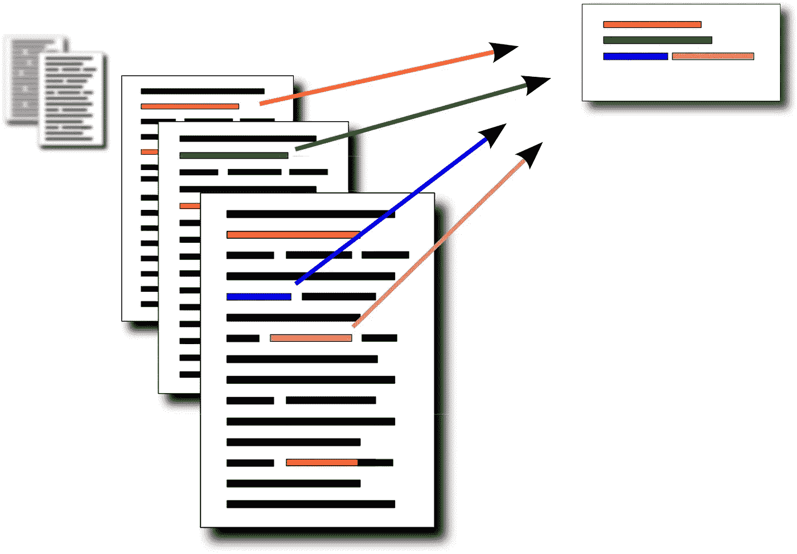
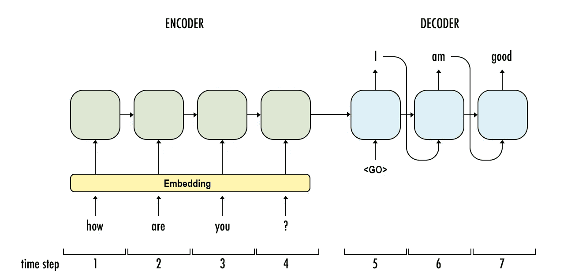

# 自动文本摘要:简化

> 原文：<https://towardsdatascience.com/automatic-text-summarization-simplified-3b7c10c4093a?source=collection_archive---------9----------------------->

## 了解自动文本摘要的世界

## 为什么是文本摘要？

以封面来判断一本书不是正确的做法..但是我想一个总结就足够了。

在一个互联网每天都在以惊人的数据量**爆炸**的世界里，能够自动汇总是一个重要的挑战。长文档、新闻文章、*甚至对话的摘要*可以帮助我们更快更有效地消费内容。自动文本摘要是自然语言处理中的一个新兴领域，在过去的几年中受到了广泛的关注。

**inshorts :** An innovative mobile app that converts news articles into 60 word summaries.

我不会讨论任何算法或实现的具体细节。这个博客是为那些想更深入了解这些文本摘要模型如何工作的好奇的少数人准备的。任何以前没有深度学习或 NLP 经验的人都可以肤浅地关注这个博客。即使对常用的 NLP 模型有初步的了解，也足以充分理解其细节。

## 文本摘要的类型

有两种类型的文本摘要方法，即提取的和抽象的。提取摘要本质上是从文本中挑选出最能代表其摘要的句子。摘要技术由于其起源于 20 世纪 50 年代，已经流行了相当一段时间。更多的是学习理解每个句子的重要性以及它们之间的关系，而不是试图理解文章的内容。

**另一方面，抽象概括**就是试图理解文本的内容，然后在此基础上提供一个摘要，这个摘要可能有也可能没有与原文相同的句子。抽象概括试图创建自己的句子，这无疑是向更像人类的概括迈出的一步。

## 那么具体是怎么做的呢？

用于提取和抽象概括的技术彼此相差甚远。如前所述，概括地说，提取摘要是一个句子排序问题，而抽象摘要在生成新句子时涉及更复杂的语言模型。

我个人认为抽取式摘要已经走到了尽头，现在大部分的研究焦点都集中在抽象摘要上，这实际上是一个更有趣的问题..只是我的看法！！)。所以我不会谈论提取摘要，但如果你仍然有兴趣阅读它，我会建议这个可怕的博客。

 [## 走向自动文本摘要:抽取方法

### 对于那些有学术写作的人来说，总结——产生一个简洁流畅的总结同时保留…

medium.com](https://medium.com/sciforce/towards-automatic-text-summarization-extractive-methods-e8439cd54715) 

在过去的几年里，自从深度学习的到来，抽象概括，通过自然语言与机器的交互以及机器翻译都取得了很大的成功。我在这里提到了*机器翻译和交互*，因为它与抽象概括是并行的。所有这些技术**将输入的句子编码**成特征，然后试图生成不同的句子，即**解码**这些特征。

一种常用的基于深度学习的机器翻译模型是基于 LSTM 的带注意力的编码器解码器网络。这个骨架有各种成功的变体，每一个都有自己的优点和缺点。

该模型从基于 LSTM 的编码器开始，该编码器将句子转换成特征向量。解码器也由 LSTM 组成，负责产生输出，一次一个单词。解码器从编码器提供的特征向量开始，然后基于前一个字预测和 LSTM 输出来预测每个字。我们将注意力放在编码器功能上，以使它们更加特定于当前单词。

一个基于 LSTM 的编码器和解码器网络的工作原理的详细解释可以在这个博客中找到。

 [## 基于注意力的神经机器翻译

### 注意力机制正越来越多地被用于改善神经机器翻译(NMT)的性能…

towardsdatascience.com](/attention-based-neural-machine-translation-b5d129742e2c) 

## 好像都想通了！！

*可惜*，没有！生成新句子是一个复杂的过程，机器还没有掌握。抽象概括的一个问题是要编码的句子的长度。虽然 LSTMs 有能力捕捉长期和短期环境，但是它们对什么可以被认为是长期的也有限制。这使得总结非常长的文档变得困难。

摘要的另一个天文上的重要问题是它不应该包含与输入文本相矛盾的事实。摘要永远不会面临这个问题，因为它们直接从文本中提取句子。但是抽象概括容易出现这种事实上的不一致。

例如，如果一个抽象的摘要模型看到像*德国 3–2 法国*、*英国 3–2 葡萄牙*等句子。在测试时进行训练，它可能会预测*西班牙 3–2 巴西*，即使输入文本中的实际分数是 1–2。这是因为 1–2 不是模型词汇表的一部分，但 3–2 是。

## 听起来很糟糕！！

抽取式摘要缺乏创建自己的句子的能力，而抽象式摘要无法克服自身创建完整句子的复杂性。最近，在一个名为“指针生成器网络”的网络中，提出了一种介于这两个极端之间的非常有创意的方法。

更简单地说，作者以这样一种方式创建了网络，它对下一个预测单词应该是什么提出了两种不同的概率分布。第一个是基于模型的词汇，而第二个是基于输入文本中的词汇。然后将这两者结合起来得到最终的分布。你可以在这里进一步了解这个模型的细节。

 [## 驯服递归神经网络以获得更好的摘要

### 这是一篇关于我们最新论文的博客文章，直入主题:用指针生成器网络进行总结，看起来…

www.abigailsee.com](http://www.abigailsee.com/2017/04/16/taming-rnns-for-better-summarization.html) 

## 下一步是什么？

如果你观察一些抽象概括的最新成果，你会发现它们做得相当不错。但是它们只适用于某些类型的文档，而对于其他类型的文档则非常失败。在这一点上，最大的挑战之一是能够从编码特征中创建语法连贯的句子，这是抽象摘要和机器翻译的核心部分。

这个博客是为机器学习领域创建简化介绍的努力的一部分。点击此处的完整系列

 [## 机器学习:简化

### 在你一头扎进去之前就知道了

medium.com](https://medium.com/@prakhargannu/machine-learning-simplified-1fe22fec0fac) 

*或者干脆阅读系列的下一篇博客*

 [## 自动唇读:简化

### 看一眼自动化唇读的世界(ALR)

towardsdatascience.com](/automated-lip-reading-simplified-c01789469dd8) 

## 参考

*[1]卢恩，汉斯·彼得。"文献摘要的自动生成."IBM 研究与发展杂志 2.2(1958):159–165。
[2]Luong、Minh-Thang、Hieu Pham 和 Christopher D. Manning。"基于注意力的神经机器翻译的有效方法."arXiv 预印本 arXiv:1508.04025 (2015)。
[3]参见 Abigail、Peter J. Liu 和 Christopher D. Manning。"抓住要点:指针生成器网络摘要."arXiv 预印本 arXiv:1704.04368 (2017)。*