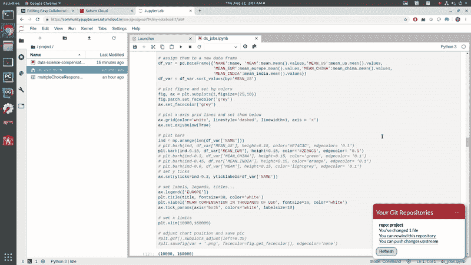

# 数据科学家的自动版本控制

> 原文：<https://towardsdatascience.com/automatic-version-control-for-data-scientists-fc4968bef8f?source=collection_archive---------10----------------------->

> 我为学习者写了一份名为《强大的知识》的时事通讯。每一期都包含链接和最佳内容的关键课程，包括引文、书籍、文章、播客和视频。每一个人都是为了学习如何过上更明智、更快乐、更充实的生活而被挑选出来的。 [**在这里报名**](https://mighty-knowledge.ck.page/b2d4518f88) 。

数据科学最棒的部分之一是从头到尾经历一个完整项目的冒险。从数据清理开始，到可视化，到特征构建，最后，训练机器学习模型。一个伟大的数据科学家的技能非常抢手，他拥有[的高薪](https://www.saturncloud.io/yourpub/georgeseif94/data-science-jobs-/Data/ds_jobs.ipynb?source=gs-2)。

所有这些中的一个主要挑战是组织。

如今，数据科学家都是以小组形式工作，每个小组至少有几个成员。他们中的每一个人都在利用相同的数据，建立在彼此的工作基础上。

The many different components of great Data Science

不幸的是，数据科学团队成员经常在他们自己的小仓库中工作。他们创建自己的代码库，运行自己的 [Jupyter 笔记本](/easy-devops-for-data-science-with-saturn-cloud-notebooks-d19e8c4d1772)，并显示自己的可视化。在某种程度上，他们匆匆忙忙地将所有的信息融合在一起，形成了最终的报告。退一步说，这种配合并不完美。

但是一定有更好的方法。某种类型的系统或工具，允许大量处理数据和图形的人，即数据科学家，高效地与他们团队的其他人一起工作，以彼此的工作为基础。该系统需要灵活、易于使用，并且不会中断数据科学工作流程。

让我们看看我们能做些什么……

# git 如何为数据科学服务

在常规的老软件工程团队中， [Git](https://medium.com/@george.seif94/a-full-tutorial-on-how-to-use-github-88466bac7d42) 是组织代码、项目和团队协作的常用工具。团队成员在他们自己的本地代码上工作，但是总是与中央存储库同步他们的进展和新的开发。

这确保了每个人都是最新的和同步的。这是一个很好的方式，让团队的工作互相配合，而不是互相冲突，从而导致更高的产出。

Git flow. Team members work on their own “*Feature”* branches which are then all synced up in the “Develop” branch. Once the Develop branch is nice and polished, the production version of the code is synced up with Master.

数据科学有点棘手，因为它是研究和软件工程的结合:

*   数据本身很大，因此共享存储数据会很有挑战性。Git-LFS 有所帮助，但是使用起来相当慢。
*   大多数时候，代码变化很小，但是可视化效果看起来完全不同。Git 不允许显示从提交到提交的图形变化
*   数据科学家通常使用 Jupyter 笔记本。在 GitHub 上可视化笔记本的变化**很可怕**。它显示了。ipynb 文件，但不是我们在笔记本中发现有用的图表上的实际代码。

综上所述，我们可以开始了解一个好的数据科学版本控制系统应该是什么样子。

首先，我们寻求易用性。 [DevOps](https://en.wikipedia.org/wiki/DevOps) 和后端工程师可能非常精通 git，但是数据科学更倾向于研究而不是工程。处理代码冲突应该特别顺利。

我们还想看看数据科学项目中的*实际*变化是什么。看到代码更改是好的，但这并不能说明全部情况。如果团队使用的是 Jupyter 笔记本，那就更是如此了，从视觉上看，代码太复杂了，无法告诉我们关于一些图表或数据操作是如何变化的。

最后，中央数据存储或工作平台非常有用。如果没有中央存储，数据科学家将不得不一直下载并准备自己的数据副本，这对于大型数据集来说效率非常低。

记住这些，我们现在可以研究一个解决方案

# 在数据科学中使用 Git 的平台

为数据科学准备版本控制系统的一个很好的选择是[土星云平台](https://www.saturncloud.io/?source=gs-2)。有了它，多名数据科学家可以在同一台 Jupyter 笔记本上工作，使用相同的数据集，但运行在他们自己的机器上。

## 数据科学协作

首先，我们将创建自己的[托管 Jupyter 笔记本](https://www.saturncloud.io/docs/jupyter?source=gs-2)，任何有链接的人都可以访问。创建帐户后，下面的视频将向您展示如何操作。

Creating a hosted Jupyter Notebook

一旦我们建立并运行起来，我们就可以开始运行我们的 Jupyter 实验室了。一旦打开，您应该看到您的项目文件夹已经设置。

对于这个实验，我们将使用 [2018 Kaggle ML 和 DS 调查](https://www.kaggle.com/kaggle/kaggle-survey-2018)数据集。该数据集由超过 23，000 个针对数据科学家和机器学习从业者提出的一系列关于薪酬的问题的多项选择答案组成。

数据集中一些有趣的事实:

*   “数据科学家”的薪酬最高，高于“数据工程师”和“研究科学家”
*   科技公司的薪酬最高，其次是营销和金融
*   更多的经验和更高的教育会增加工资
*   美国的薪酬最高，其次是瑞士和澳大利亚

你可以点击查看 Jupyter 数据科学补偿的完整笔记本[。](https://www.saturncloud.io/yourpub/georgeseif94/data-science-jobs-/Data/ds_jobs.ipynb?source=gs-2)

Data Scientist compensation

要开始团队协作，请转到您的仪表板，点击*协作者*链接。在其中，您将发现通过 Saturn Cloud 用户名向您的项目添加合作者的能力。

将用户添加到您的项目中会向他们发送一封个人电子邮件，邀请他们参与项目协作。一旦他们接受邀请，他们自己的云实例将会用完全相同的设置、库和软件来创建。

用户(数据科学家)可以立即访问他们自己版本的项目 Jupyter 笔记本和数据集。这使得多名数据科学家可以在相同的环境中工作，使用相同的数据，并以相同的起点开始他们的笔记本电脑！

Collaboration for Data Scientists

## 数据科学版本控制

现在我们可以进入土星云的版本控制系统。

一旦在您的实例上打开 Jupyter 实验室，您将看到您的工作界面。在屏幕的左侧有一个项目文件夹。*在该项目文件夹中创建并保存的任何* Jupyter 笔记本都将自动启用版本控制。我已经把我的[*ds _ jobs . ipynb*](https://www.saturncloud.io/yourpub/georgeseif94/data-science-jobs-/Data/ds_jobs.ipynb?source=gs-2)*笔记本放到了项目文件夹中，以便在上面启用版本控制。*

*为了展示版本控制是如何工作的，我们将修改一些数据可视化。我们将假装只对欧洲国家的数据感兴趣，并过滤掉其他一切。一旦可视化被改变，我们将能够把我们的改变推送到一个远程的 git 存储库。下面这个 45 秒的视频展示了如何做到这一点！*

**

*Data Science Version Control*

*太好了！*

*我们能够对我们的 Jupyter 笔记本进行一些快速简单的修改。所有项目合作者(数据科学家)都可以访问该笔记本。因此，无论他们何时登录，他们都将能够看到您所做的更改，并可以选择提取这些更改，以便他们能够保持最新状态！*

## *按需数据科学—倒带*

*另一个很棒的功能是*倒带*功能。它的工作方式类似于 **git reset** ，它基本上只是恢复我们的更改，这样我们就可以回到以前的状态。如果你觉得自己犯了一个错误，想要回滚，或者只是想看看以前的情况，这是非常有用的。*

*假设我们想要回滚到我们的可视化，显示数据科学补偿的所有区域。我们将再次点击右下角的 *git* 按钮。这一次，点击*就可以倒带这个资源库的*链接。弹出一个滑块，您可以在其中选择希望回滚到的时间。一旦设置好，你就可以看到你的旧代码和图表了！*

**

*Rewinding Jupyter Notebooks*

*这才是控制！*

# *喜欢学习？*

*在[推特](https://twitter.com/GeorgeSeif94)上关注我，我会在那里发布所有最新最棒的人工智能、技术和科学！也在 LinkedIn 上与我联系！*