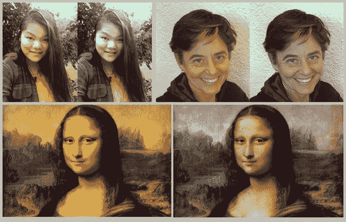

# 自拍的自动白平衡调节

> 原文：<https://towardsdatascience.com/automatic-white-balance-adjustment-of-selfies-f7b8bda5e47c?source=collection_archive---------28----------------------->

时尚科学来拯救！(其中包括机器学习)

问题是相机真的很努力——但坦率地说，在呈现准确的肤色方面经常失败。在我的例子中，为智能手机建立一个个性化的颜色推荐工具，我要求肤色要像皮肤一样。


Before and After Automatic White Balance Adjustment

下次你在脸书的时候，看看人们给自己的图片。它们离我们有多远，以及人类大脑是如何适应这种情况的，真是不可思议。

为了说明这一点，举例来说，Photoshop 确实有多种颜色校正算法。不幸的是，它们并不总是有效，最终的方法要求一个人在图像中找到一个灰点。我们确实有他们没有的优势——我们知道这张照片是自拍，我们知道如何提取肤色——相信我，文章就要来了。


Accurate skin colors

我们来看一些数据。随附的图表显示了在受控灯光下精心制作的一系列模特的肤色。很明显，这里有一个很好的模式。

我进一步指出，这代表了人性和大致的肤色范围。


Real-life Model Results plotted against Baseline Models

那又怎样？

这是上面的同一组数据，现在用红 x 表示。(简化为二维，红色对绿色。)肉色圆点来自用 iPhone 拍摄的现实生活中的模特。有些很离谱——他们是人类吗？

但是更好的是——它们都来自同一个人！

谁知道这种变化来自哪里——照明类型/温度、照明位置、曝光、相机显影处理等等。有很多变化。

顺便说一下，我们从我们的应用程序“所有的眼睛都在色调上”收集了超过 10 万张模型图像(在匿名的承诺下)用于分析。显示的测试集是一个用户在不同条件下拍摄了大约 20 张自拍。谢谢匿名人士！

所以首先，一个工作定义**白平衡**。见鬼，去维基百科，搜索“色彩平衡”以获得更好的定义。m 定义是图像在红色、绿色和蓝色通道中被线性地独立破坏。通过将每个像素乘以每个 RGB 通道的白平衡调整因子，我们可以校正图像。那三个线性调整——姑且称之为 R *wb* ，G *wb* ，B *wb* 。是的，这显然是一种简化——但它似乎在大多数情况下都能产生足够好的结果。

# 解决方案 1

校正图像的一个简单方法是:

*   识别模特的肤色
*   确定基线中最接近“好”模特的肤色——上图中的红色 x
*   将模型的皮肤颜色拖到最接近的“好”模型上。

就是这样。数学很简单。这很有效——我们每次都能得到“人类”的肤色。顺便说一下，我有一个俗气的 iOS 应用程序可以做到这一点——更好的 Selfie⁴.

# 但是等等…


我想我在上面的图表中提到过，所有这些变异都来自同一个人。将每种肤色拖到最接近的“好”肤色会给我们好的肤色——但**不是**他们的那种，真正的肤色。这就是我想要的！让我们重新定义这个问题——我们希望将所有这些不同的肤色统一为一种肤色。

顺便说一下，为了测试我们的方法，我们将假设正确的“好”答案是使用解决方案 1 的所有校正肤色的平均值。

# 解决方案 2

机器学习 101。获取大量训练数据来训练模型。完成了。

我们的训练数据从之前显示的“好”模型开始。每种肤色都有特定的平均 RGB 值。它的白平衡校正系数为 1.0、1.0、1.0。也就是说，不需要进行白平衡校正就可以将其校正到良好的肤色。

我们需要的是一个涵盖可能的“坏”肤色范围的训练集，以及相应的白平衡校正因子，以将其移回“好”肤色。我们要做的是用不同的白平衡因子生成糟糕的合成肤色。例如，如果我们想创造一个合理的“坏”肤色，我们可以将“好”肤色乘以 1.1、0.9、1.05。用于回到“良好”状态的白平衡与此相反，即 1/1.1、1/0.9、1/1.05。很简单。


Synthetic Training Set

创建大型数据集有不同的方法。一种方法是在可能的范围内使用高斯分布。另一种方式是三角形分布(numpy . random . normal/numpy . random . triangular)。我们最终得到的是一大组训练数据。

这里有价值的优化是创建训练集，以便覆盖预期的“坏”肤色，但仅此而已。这使我们能够将我们的训练数据点集中在它做得好的地方。(我觉得那是个专业术语。)

从这里让我们跳到 Python。

```
cls = Classifier()cls.fit(X_train, y_train)predictions = cls.predict(X_test)
```

我们需要的是训练许多可能的分类器中的一个。这些来自 scikit-learn 库以及一些定制的神经网络方法。以下是各种方法的结果:


上面的列表示:

*   方法——实际使用的分类方法。比如线性回归参考 sk learn . Linear _ model . Linear Regression，后面三个解释一下。
*   相同模型的均方误差—根据我们之前对正确答案的定义，这显示了我们的预测结果与该平均值的均方误差。越低越好。
*   集群——请记住，我们的目标不仅仅是获得“好”的肤色，而是获得一个“好”的肤色。事实证明这是不可能的——但是 3 比 10 好——我们仍然可以解决这个问题。顺便说一句，我们使用肘方法来确定集群的数量——“没有肘”意味着没有一个明确的答案。

最后三个分类器是使用 Keras 定制的神经网络。

*   仅 DNN 平均颜色-这是一个密集的神经网络，输入仅为肤色 RGB，输出为白平衡校正
*   CNN-仅图像-这有一个 CNN 输入来开始拍摄眼睛周围的图像，包括大量的肉，输出是白平衡校正。这个想法是，见鬼，让 CNN 发挥它的魔力，也许加入一些眼睛的颜色——巩膜和虹膜。
*   CNN +标量注入——这是上述两种方法的结合。每一个都有其相应的输入，但它们加入了一个密集的神经网络，以产生白平衡校正的输出

正如你从图表中看到的，DNN 平均颜色比其他方法都要好。

# 所以我们仍然有 3 个集群，我们需要 1 个…

好吧，所以这不能完全解决我们的问题。对于正确的肤色，我们得到的不是一个事实，而是三个潜在的事实。我只想说，不是同一个人的每一个可能的损坏图像都可以被校正到一个肤色，而不需要比单个图像提供的更多的知识。

所以我又变了两个戏法:

1.  训练美国有线电视新闻网检测非常糟糕的图像。这是基于完整的自拍图像，我将图像分类为不可接受或可接受。不可接受的原因是明亮照明、黑暗照明和眩光等因素。与白平衡关系不大，但对更广泛的目标(为个人创建个性化的最佳调色板)很重要的是不可接受的元素，如眼镜和阴影。这个 CNN 在过滤掉明显不好的图像方面做得很好，我们可以要求用户拍摄另一张图像。
2.  手动将“好”肤色的数量限制在一个能够产生“一个”答案的数量，而不会过度限制所有人看起来相似。

# 还不错！

总之，这是一种自动白平衡校正的强大方法。

未来的方向实际上只是机器学习 101 方向，即模型和更多数据点的调整。



Sample Before/After Selfies

# 脚注

[https://www.youtube.com/watch?v=B-W44JJToG8](https://www.youtube.com/watch?v=B-W44JJToG8)

[http://johnthemathguy . blogspot . com/2013/08/what-color-is-human-skin . html](http://johnthemathguy.blogspot.com/2013/08/what-color-is-human-skin.html)

[https://itunes . apple . com/us/app/all-eyes-on-hue-portable-personalized-season-color/id 939633468？mt=8](https://itunes.apple.com/us/app/all-eyes-on-hue-portable-personalized-seasonal-color/id939633468?mt=8)

https://itunes.apple.com/us/app/better-selfie/id999484452 的⁴