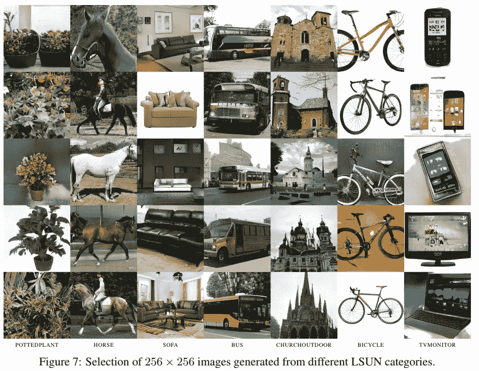
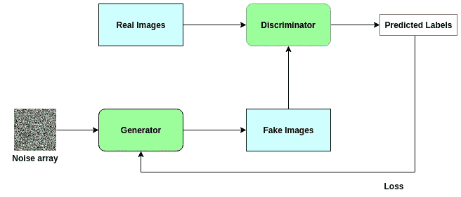
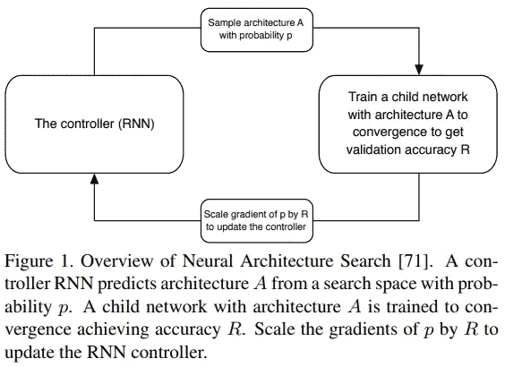
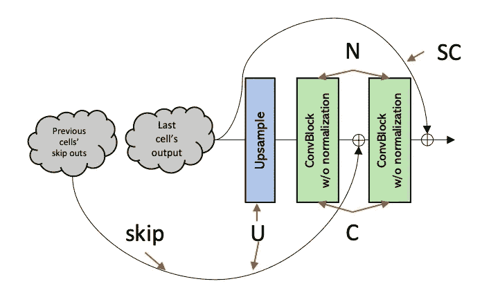
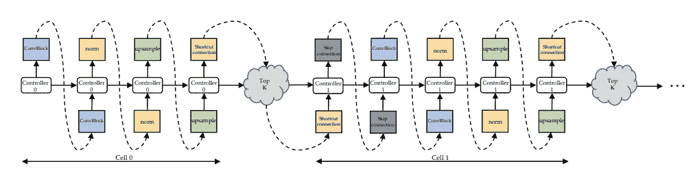

# 自动寻找最适合你的神经网络

> 原文：<https://towardsdatascience.com/automatically-finding-the-best-neural-network-for-your-gan-c0b97a5949f2?source=collection_archive---------5----------------------->

## 甘斯的汽车！

> 想获得灵感？快来加入我的 [**超级行情快讯**](https://www.superquotes.co/?utm_source=mediumtech&utm_medium=web&utm_campaign=sharing) 。😎

[生成对抗网络](https://en.wikipedia.org/wiki/Generative_adversarial_network) (GANs)自从在 2014NIPS[上首次发明并发表以来，一直是深度学习领域的热门话题。](https://papers.nips.cc/paper/5423-generative-adversarial-nets.pdf)

这一切都有一个很好的理由:GANs 只需要一点点指导就可以创造新的内容。正是这种创造力让他们如此强大。事实证明，GANs 能够将这种创造力应用于多种多样且有用的应用中:

*   [生成穿着某种服装的人的图像](https://www.forbes.com/sites/forbestechcouncil/2019/05/21/gans-and-deepfakes-could-revolutionize-the-fashion-industry/#4152f4ac3d17)。非常适合虚拟观看顾客在网上看到的服装会是什么样子。
*   创建[艺术品](https://github.com/junyanz/CycleGAN)
*   电影和视频游戏[的灌制和质量改进](https://www.pcgamesn.com/max-payne/ai-enhanced-hd-remaster)
*   加强对非常复杂的深层物理课题的研究，如[暗物质](https://phys.org/news/2019-05-cosmogan-neural-network-dark.html)

仅举几个例子。

有鉴于此，大量资源被投入到 GAN 研究中，以弄清楚它们是如何工作的，以及如何设计绝对最佳的 GAN 网络。最后，经过几年的成熟， [AutoML 和神经架构搜索(NAS)](/everything-you-need-to-know-about-automl-and-neural-architecture-search-8db1863682bf) 已经进入了 GANs 的领域。

本文接下来分为两个部分:第一部分解释了 GANs 是如何工作的，以及它们目前是如何手工设计的。第二个是全新深度学习研究的展示——[AutoGAN](https://arxiv.org/pdf/1908.03835v1.pdf)，它将神经架构搜索应用于**自动**找到最佳的 GAN 架构。

# gan 是如何工作的

生成对抗网络(GANs)被归入“生成”模型组。这意味着它们能够生成全新的“有效”数据。所谓有效数据，我们的意思是网络的输出应该是我们认为目标可以接受的。

为了说明，考虑一个例子，其中我们希望生成一些新图像来训练图像分类网络。当然，对于这样的应用，我们希望我们的训练数据尽可能真实，也许在风格上与其他图像分类训练数据集非常相似。

下图显示了 GAN 生成的一组图像的示例。它们看起来很真实！如果我们没有被告知它们是计算机生成的，我们可能会相信这些是人类收集的！

An example output of Progressive GANs. [Source](https://arxiv.org/pdf/1710.10196.pdf)

为此，gan 由两个独立的、*相对的*网络组成:发生器和鉴别器。当仅给定噪声图像阵列作为输入时，生成器被训练来创建看起来逼真的图像。鉴别器被训练来分类图像是否是真实的。

GANs 的真正力量来自他们所遵循的对抗训练风格。基于鉴别器的损耗学习发电机网络的权重。因此，生成器被推动以这样一种方式训练，即对于它生成的图像，很难辨别它们是否真实。在这些图像看起来越来越真实的同时，鉴别器也越来越好地分辨出哪些图像是真实的，不管肉眼看起来有多相似。

因此，GANs 建立了一种反馈回路，发电机帮助训练鉴别器，鉴别器帮助训练发电机。他们一起变得更好。下图有助于说明这一点。

An illustration of the structure of a Generative Adversarial Network

请注意，生成器只是一个以图像为输出的 CNN，而鉴别器只是一个以分类概率为输出的 CNN 分类网络；很简单。由于这种简单性，大多数 GAN 架构只是其他先进深度网络的副本。生成器可能采取类似于修改的 U-Net 的形式，而鉴别器通常看起来像 ResNet、DenseNet 或类似的体系结构。

好的一面是，这可能会简化部分问题。研究科学家可以简单地借用以前经过验证的研究中的网络设计，并简单地专注于 GANs 的算法设计和训练机制。

另一方面，这可能有点限制。如果当前的网络设计不是最适合 GANs 的，该怎么办？它们本身工作得足够好，但也许改进网络结构可以进一步提高专为它们设计的 GAN 性能。

# 使用 AutoGAN 寻找最佳 GAN

[神经架构搜索(NAS)](/everything-you-need-to-know-about-automl-and-neural-architecture-search-8db1863682bf) 一直是另一个热门的深度学习话题。NAS 是*搜索*寻找最佳*神经网络架构*的算法。

大多数 NAS 算法以如下方式工作。

1.  首先定义一组可用于我们网络的“构建模块”。
2.  然后使用控制器递归神经网络(RNN)对这些构建块进行采样，将它们放在一起以创建某种端到端的架构。
3.  然后，在特定数据集上训练和评估这个新建立的网络。
4.  基于评估，RNN 选择的构建模块被调整，即 RNN 将选择新的一组，保留有助于准确性的模块和配置，并替换或移除没有帮助的模块和配置。
5.  步骤 3 到 4 重复多次，直到找到最佳架构。

这种风格的 NAS 已经成功应用于[图像分类](https://arxiv.org/pdf/1707.07012.pdf)和[语义分割](https://arxiv.org/pdf/1707.07012.pdf)。

The NAS algorithm. Source from the [research paper](https://arxiv.org/pdf/1707.07012.pdf)

AutoGAN 也遵循相同的学习方案，特别侧重于构建生成器网络，因为在寻找最佳分类网络(用于鉴别器)方面已经做了更多的工作。

正如作者在他们的论文中指出的，训练 GANs 由于其设计本身就不稳定。精心的网络建设对整个过程的顺利进行至关重要。考虑到这一点，AutoGANs 的搜索空间比 NAS 的搜索空间要小得多。AutoGAN 的生成器搜索空间被设置为，而不是能够从许多不同类型和大小的卷积块中采样并跳过连接:

*   一个二进制值 *skip* ，它指示当前单元格是否从前一个单元格获取一个*加法*skip 连接*。*
*   一个基本的卷积模块，决定是否包括预激活或后激活。
*   归一化类型的选择:批量归一化、实例归一化、无归一化。
*   要使用的上采样类型:双线性上采样、最近邻上采样或步长 2 去卷积。
*   是否使用*单元格内* *加法* *跳过连接*

The search space of AutoGAN’s Generator network. Source from the original [research paper](https://arxiv.org/pdf/1908.03835v1.pdf)

有了这个更受控制的搜索空间，应用 NAS 来寻找最佳发电机架构就简单得多，也更稳定，因为 NAS 的搜索范围更广，也更简单。

另一项使培训更加有效的技术是使用多层次架构搜索(MLAS)，而不是常规的多层次架构搜索(SLAS)。对于常规的 SLAS，一个 RNN 控制器将用于一次构建整个 NAS 网络。但是在 MLAS，网络是逐步建立起来的。

MLAS 以自下而上的方式执行搜索，对每个单元分别执行架构搜索。因此，每个细胞将使用其*自己的个人* RNN 控制器进行搜索。从某种意义上说，这也简化了搜索，因为 NAS 一次只关注网络的一个特定部分，而不是非常复杂的整体。

AutoGAN’s RNN controller. Source from the [research paper](https://arxiv.org/pdf/1908.03835v1.pdf)

凭借其聪明的新训练设置和精细、集中的细胞搜索空间，AutoGAN 能够实现最先进的结果。具体来说，它为基于人类判断生成[高视觉质量的新图像](https://github.com/mseitzer/pytorch-fid)设置了新的标准。

AutoML 正在慢慢进入深度学习和人工智能的许多领域。毫无疑问，这将是未来几年人工智能研究的一个重点。人工智能创造人工智能。

# 喜欢学习？

在推特[上关注我，我会在这里发布所有最新最棒的人工智能、技术和科学！也请在 LinkedIn](https://twitter.com/GeorgeSeif94)[上与我联系！](https://www.linkedin.com/in/georgeseif/)