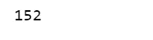
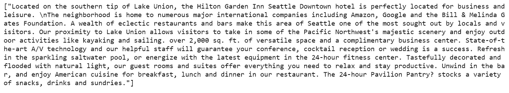
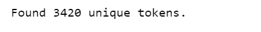
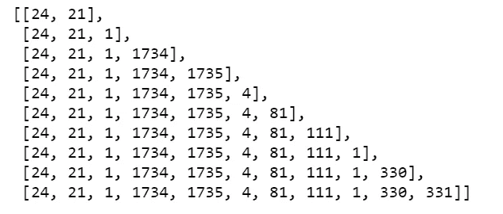
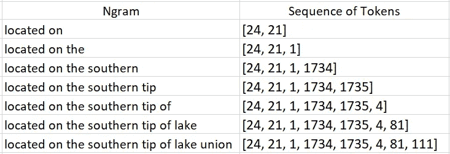
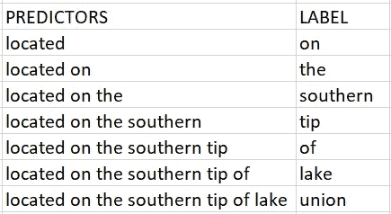
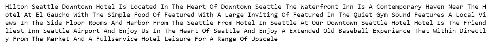
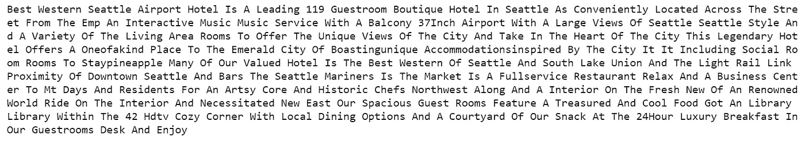

# 使用 LSTM 自动生成酒店描述

> 原文：<https://towardsdatascience.com/automatically-generate-hotel-descriptions-with-lstm-afa37002d4fc?source=collection_archive---------6----------------------->


Photo credit: [W Seattle](https://www.marriott.com/hotels/travel/seawh-w-seattle/)

## 如何使用 Python 中的 LSTM 递归神经网络和 Keras 创建文本生成模型

为了建立一个[基于内容的推荐系统](/building-a-content-based-recommender-system-for-hotels-in-seattle-d724f0a32070)，我收集了西雅图 152 家酒店的描述。我在想一些其他的方法来折磨这个高质量的干净数据集。

嘿！为什么不训练我自己的酒店描述文本生成神经网络？即，通过实现和训练基于单词的递归神经网络来创建用于生成自然语言文本(即，酒店描述)的语言模型。

这个项目的目标是生成新的酒店描述，给定一些输入文本。我不期望结果是准确的，只要预测的文本是连贯的，我就高兴了。

感谢[Shivam ban sal](https://medium.com/@shivambansal36/language-modelling-text-generation-using-lstms-deep-learning-for-nlp-ed36b224b275)的这个教程帮助我完成了这个练习。

# 数据

desc_preprocessing.py



我们的数据集中总共有 152 个描述(即酒店)。

先看一下第一个描述:

```
corpus = [x for x in all_descriptions]
corpus[:1]
```



Figure 1

在标记化之后，我们可以:

*   探索单词及其计数的字典。
*   浏览单词词典，了解每个单词出现在多少个文档中。
*   探索用于适应记号赋予器的文档总数的整数计数(即文档总数)。
*   探索单词及其唯一指定整数的字典。

```
t = Tokenizer(num_words=None, filters='!"#$%&()*+,-./:;<=>?@[\\]^_`{|}~\t\n', lower=True, split=' ', char_level=False, oov_token=None, document_count=0)
t.fit_on_texts(corpus)print(t.word_counts)
print(t.word_docs)
print(t.document_count)
print(t.word_index)
print('Found %s unique tokens.' % len(t.word_index))
```



# 文本预处理

## 标记化

我们使用 Keras 的标记器来矢量化文本描述，

*   我们删除所有标点符号。
*   我们将文本转换成小写的空格分隔的单词序列。
*   然后，这些序列被分割成记号列表。
*   我们设置了`char_level=False`，所以每一个单词都会被当作一个记号而不是字符。
*   然后，记号列表将被索引或/和矢量化。
*   我们将语料库转换成符号序列。

sequence.py



Figure 2

上面的整数列表表示从语料库中生成的 ngram 短语。例如，假设一个句子“ ***位于尤宁*** 湖的南端”由这样的词的索引来表示:



Table 1

## 填充序列并创建预测值和标签

*   将序列填充到相同的长度
*   Pad sequences 将整数列表转换成形状为`(num_samples, maxlen)`的 2D Numpy 数组。
*   预测值和标签看起来像这样:



Table 2

如你所见，如果我们想要精确，这将会非常非常困难。

pad_sequence.py

# 建模

我们现在可以定义我们的单一 LSTM 模型。

*   具有 100 个存储单元的单个隐藏 LSTM 层。
*   网络使用概率为 10 的辍学。
*   输出层是使用 softmax 激活函数输出 0 到 1 之间的 3420 个单词中每个单词的概率预测的密集层。
*   我们的问题是具有 3420 个类别的单个单词分类问题，因此被定义为优化对数损失(交叉熵)，并使用 ADAM 优化算法来提高速度。
*   没有测试数据集。我们正在对整个训练数据进行建模，以学习序列中每个单词的概率。
*   根据 [Keras 文档](https://keras.io/examples/lstm_text_generation/)，在生成的文本开始听起来连贯之前，至少需要 20 个历元。所以，我们要训练 100 个纪元。

text_generator.py

# 使用训练好的 LSTM 网络生成文本

*   关于这一点，我们可以编写一个函数，将种子文本作为输入，并预测下一个单词。
*   我们对种子文本进行标记，填充序列，并将其传递给训练好的模型。

generate_text.py

试试吧！

*   我随机选择“*”作为种子文本，我希望 model 返回我接下来的 100 个单词。*

```
*print(generate_text("hilton seattle downtown", 100, model, max_sequence_len))*
```

**

*Figure 3*

*   *我选择“ ***贝斯特韦斯特西雅图机场酒店*** l”作为种子文本，并且我希望模型预测接下来的 200 个单词。*

```
*print(generate_text("best western seattle airport hotel", 200, model, max_sequence_len))*
```

**

*Figure 4*

*   *我选择“ ***位于西雅图市中心*** ”作为种子文本，并且我希望模型预测接下来的 300 个单词。*

```
*print(generate_text('located in the heart of downtown seattle', 300, model, max_sequence_len))*
```

**

*Figure 5*

# *结论*

*   *没有拼写错误。*
*   *这些句子看起来很真实。*
*   *一些短语被一遍又一遍地重复，特别是预测给定种子的大量单词输出。*

*关于改进的一些想法:更多的训练数据、更多的训练时期、更多的层、更多的层存储单元、对于给定的种子，预测更少数量的单词作为输出。*

*[Jupyter 笔记本](https://github.com/susanli2016/NLP-with-Python/blob/master/Hotel%20Description%20Generation%20LSTM.ipynb)可以在 [Github](https://github.com/susanli2016/NLP-with-Python/blob/master/Hotel%20Description%20Generation%20LSTM.ipynb) 上找到。享受余下的周末吧！*

*参考资料:*

*[](https://keras.io/preprocessing/text/) [## 文本预处理- Keras 文档

### 这个类允许向量化文本语料库，通过将每个文本转换成整数序列(每个整数…

keras.io](https://keras.io/preprocessing/text/) [](https://medium.com/@shivambansal36/language-modelling-text-generation-using-lstms-deep-learning-for-nlp-ed36b224b275) [## 使用 LSTMs 的语言建模和文本生成 NLP 的深度学习

### 随着深度学习和人工智能领域的最新发展和改进，许多严格的…

medium.com](https://medium.com/@shivambansal36/language-modelling-text-generation-using-lstms-deep-learning-for-nlp-ed36b224b275)*