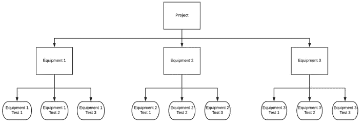

# 自动存储分析数据集的结果

> 原文：<https://towardsdatascience.com/automatically-storing-results-from-analyzed-data-sets-ed918d04bc13?source=collection_archive---------24----------------------->

## 如何存储数据分析结果以方便后期回归分析


这是教你如何编写自动分析科学数据的程序的系列文章的第五篇。[首先](https://medium.com/@petergrant_81989/automating-scientific-data-analysis-part-1-c9979cd0817e)介绍了概念和动机，然后规划了高级步骤。[第二个](https://medium.com/@petergrant_81989/automating-scientific-data-analysis-part-2-12331b46003)教你如何构建数据集，使自动化数据分析成为可能，并自动识别每个测试的条件。[的第三篇](https://medium.com/@petergrant_81989/automating-analysis-of-scientific-data-sets-84f5027d6d26)文章讨论了创建一个 for 循环，自动对每个测试结果执行计算并保存结果。第四篇文章覆盖了可能是最重要的部分:自动检查数据和分析错误。这第五篇文章将教你如何在一个逻辑文件夹结构中存储数据，使回归开发和验证数据的访问变得容易。

# 存储中间结果供以后分析

到目前为止，所有的讨论都集中在分析单个测试的结果上。下一步是开始考虑更大的图景，并创建将那些单独的测试结果组合成描述整个项目结果的数据集的方法。第一步是以逻辑方式存储各个测试结果，以便于以后的分析。

有两个通用的技巧来存储中间结果，供以后在自动化过程中进行分析。首先是规划组织结构，以确保在需要时可以轻松找到所有文件。第二种方法是在代码中使用动态文件名，这样程序每次迭代的结果都会保存到新文件中。

# 创建文件夹层次结构

规划组织结构实质上意味着创建一个对给定项目有意义的文件夹层次结构。例如，假设一个项目包括在多台设备上进行几个实验。目标是创建模拟每件设备性能的回归。在这种情况下，为每件设备创建一个文件夹，然后将单个测试的结果存储在相应的文件夹中是有价值的。图 1 提供了一个如何构建这个文件夹层次结构的例子。



Figure 1: Example Folder Hierarchy

# 使用动态名称存储文件

要记住的第二点是，所有对存储数据的引用都应该使用动态名称，这些动态名称使用第 2 部分中描述的技术从数据集中获取的变量来创建特定于该数据集的文件名。例如，数据集可能包含设备 2 测试 3 的特定数据。在这种情况下，任何保存该数据集数据的代码都必须使用变量来指定它需要使用“设备 2”文件夹的“设备 2 测试 3”子文件夹。

创建文件夹结构时，有必要确保所有文件夹都存在。有两种方法可以做到这一点。第一种是为项目手动创建文件夹，提前安排好一切。如果这有助于您思考整个过程并创建一个强大的结构，这可能是一个好方法，但这是一个关于自动化的系列！让 Python 来做这项工作更容易。通过在分析循环中包含适当的代码，可以自动创建该结构。这是通过以下步骤完成的。

1)导入操作系统包，允许访问控制计算机操作系统的命令。这可以用 Python 代码“import os”来完成。

2)在分析循环中，使用第 2 部分中的技术来确定正在执行的测试。以图 1 中的层次表为例，这可能会导致变量“设备”设置为“设备 2”，变量“测试”设置为“测试 3”。确保这两个值都以字符串形式存储在其变量中。

3)使用变量和来自数据集的输入为现有数据集指定文件夹。在我们当前的示例中，这可以通过以下代码来完成:

```
Folder = r’C:/Users/JSmith/DataAnalysis/’ + Equipment + ‘/’ + Test
```

4)使用 os.path.exists 命令确定该文件夹是否存在，如果需要，使用以下代码创建该文件夹:

```
if not os.path.exists(Folder) :os.makedirs(Folder)
```

这些步骤创建的代码将自动生成该结构所需的所有文件夹。根据任何给定项目的需要，可以使用相同的技术来创建更多级别的子文件夹。

然后，每个测试的结果需要存储在适当的文件夹中。保存结果的代码因包而异。使用下面的代码示例，可以用 pandas、bokeh 和 matplotlib 保存结果。

# 熊猫

数据帧有方便的标签。to_csv 函数。读者应该查阅 pandas 文档来了解如何工作的具体细节，但是一般的方法是调用函数并指定文件路径。对于当前示例和名为“data”的数据帧，这可以通过以下代码完成:

```
Data.to_csv(r’C:/Users/JSmith/DataAnalysis/’ + Equipment + ‘/’ + Test + ‘/’ + Equipment + ‘_’ + Test + ‘.csv’)
```

最后一部分，'/' +设备+ '_' +测试+'。“csv”被添加到前面的代码中，以便为。csv 文件放在文件夹中。假设前面的代码用于定义变量 Folder，实现相同目标的一个更短的方法是:

```
Data.to_csv(Folder + ‘/’ + Equipment + ‘_’ + Test + ‘.csv’)
```

# 散景

散景使用一种更复杂的方法来保存文件。这提供了在单个文件中存储多个图的能力。使用以下步骤执行:

1)创建一个网格地块。gridplot 函数允许指定如何在一个文件中包含多个绘图。一个数组用于指定主 gridplot，而较小的数组可用于指定任何给定行内的多个 plot。例如，gridplot 的第一行有两个图，第二行有三个图，编程如下:

```
p = gridplot([[p1, p2], [p3, p4, p5]])
```

2)指定所需的文件位置和标题。继续设备 2 —测试 3 的例子，这可以用下面的代码来完成:

```
output_file(Folder + ‘/’ + Test + ‘.html’, title = Test + ‘.html’)
```

3)保存剧情。这是通过直观的 save()命令完成的。本例中保存绘图的语法是:

```
save(p)
```

# matplotlib

matplotlib 使用一个非常简单的文件保存约定。命令是 plt.savefig()。此示例的语法是:

```
plt.savefig(Folder + ‘/’ + Test)
```

# 后续步骤

本文向您介绍了如何修改您的代码，以便在逻辑位置保存来自单个测试的数据。这为过程的下一阶段做好了准备，即使用数据生成回归。通过将数据存储在逻辑位置，您可以轻松地打开该数据，并将其用作以后回归分析的数据集。下一篇文章将讨论这个主题:如何创建、验证和记录数据集的回归。