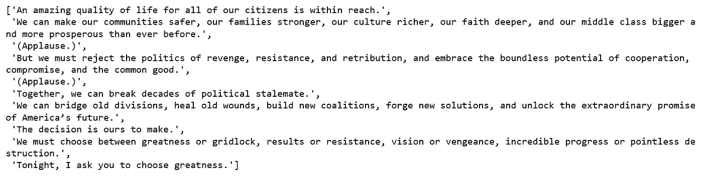
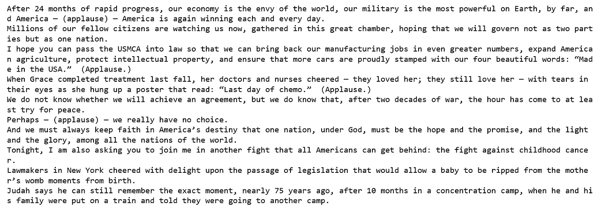
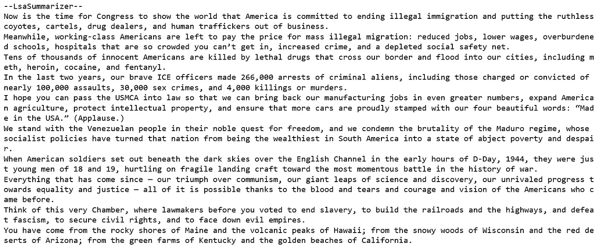
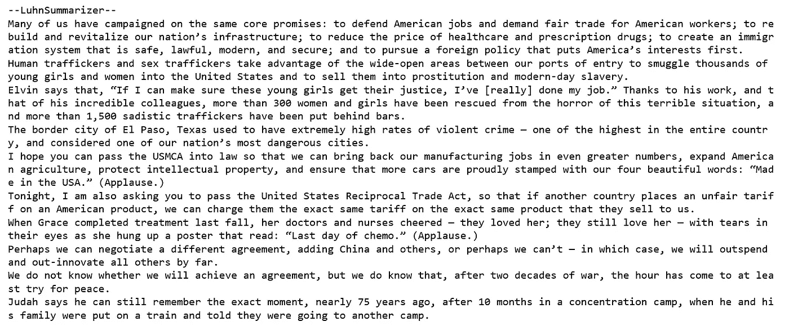
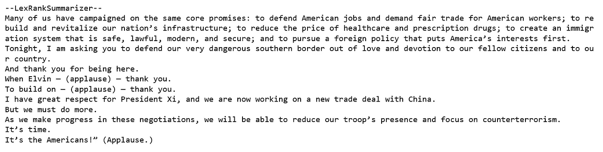
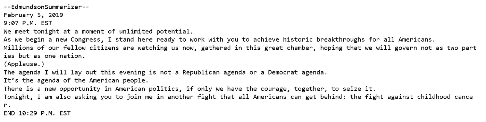

# 自动总结特朗普的国情咨文

> 原文：<https://towardsdatascience.com/automatically-summarize-trumps-state-of-the-union-address-6757c6af6534?source=collection_archive---------18----------------------->


Photo credit: Pixabay

## 文本排名，潜在语义分析，Gensim，Sumy，NLTK

[自动文本摘要，是为较长的文档创建简短、简明和连贯版本的过程](https://machinelearningmastery.com/gentle-introduction-text-summarization/)。这是 [NLP](https://en.wikipedia.org/wiki/Natural_language_processing) 领域中最有趣、最具挑战性的问题之一。

自从川普昨晚发表了他的 [**国情咨文**](https://www.whitehouse.gov/briefings-statements/remarks-president-trump-state-union-address-2/) ，[关键要点](https://www.npr.org/2019/02/06/691870683/7-takeaways-from-president-trumps-state-of-the-union-address)，[事实核查](https://www.cnn.com/2019/02/05/politics/fact-check-trump-state-of-the-union/index.html)，[分析](https://www.nytimes.com/interactive/2019/02/05/us/politics/state-of-union-live-chat.html)，[反应](https://www.cnbc.com/2019/02/06/sotu-how-the-world-reacted-to-trump-speech.html)充斥着新闻媒体。如果你像我一样，不想听完 82 分钟的整个演讲，或阅读整个演讲，并且你不想错过任何重要的东西，那么我们将尝试探索文本摘要的领域并建立一个文本摘要器。希望我们从文本摘要器中得到的摘要尽可能地接近原文，但要短得多。我们开始吧！

# 带 NLTK 的 TextRank

TextRank 是一种无监督的文本摘要技术，它使用 [PageRank](https://en.wikipedia.org/wiki/PageRank) 算法背后的直觉来对句子进行排序。在我们的项目中使用 NLTK 时，我们有以下步骤:

*   在网上获取国情咨文。
*   基本文本清理。
*   找出每个句子的向量表示(单词嵌入)。
*   然后计算句子向量之间的相似度并存储在矩阵中。
*   相似度矩阵转换成图，以句子为顶点，相似度得分为边。
*   对该句子图应用 [PageRank](https://en.wikipedia.org/wiki/PageRank) 算法进行句子等级计算。
*   打印出几个排名靠前的句子。

## 数据

这些数据可以在白宫网站上找到，并于今天发布。

```
def get_only_text(url):
    """ 
    return the title and the text of the article
    at the specified url
    """
    page = urlopen(url)
    soup = BeautifulSoup(page, "lxml")
    text = ' '.join(map(lambda p: p.text, soup.find_all('p')))

    print ("=====================")
    print (text)
    print ("=====================")

    return soup.title.text, text    

url="[https://www.whitehouse.gov/briefings-statements/remarks-president-trump-state-union-address-2/](https://www.whitehouse.gov/briefings-statements/remarks-president-trump-state-union-address-2/)"
text = get_only_text(url)
```

首先，我们来窥见几个句子:

```
sentences = []
for s in text:
    sentences.append(sent_tokenize(s))sentences = [y for x in sentences for y in x]
sentences[30:40]
```



听起来差不多。

我们将使用预先训练的单词向量来为国情咨文中的句子创建向量。我已经从[手套](https://nlp.stanford.edu/projects/glove/)下载了数据并保存在我的工作目录中。

```
word_embeddings = {}
f = open('glove.6B.100d.txt', encoding='utf-8')
for line in f:
    values = line.split()
    word = values[0]
    coefs = np.asarray(values[1:], dtype='float32')
    word_embeddings[word] = coefs
f.close()
```

一些基本的文本预处理，如删除停用词和删除特殊字符。

```
clean_sentences = pd.Series(sentences).str.replace("[^a-zA-Z]", " ")
clean_sentences = [s.lower() for s in clean_sentences]
stop_words = stopwords.words('english')

def remove_stopwords(sen):
    sen_new = " ".join([i for i in sen if i not in stop_words])
    return sen_new
clean_sentences = [remove_stopwords(r.split()) for r in clean_sentences]
```

在下面的代码脚本中，我们为句子创建向量。我们首先获取句子中组成单词的向量(每个向量的大小为 100 个元素),然后取这些向量的平均值，以得到该句子的合并向量。我们创建一个空的相似度矩阵，并用句子的余弦相似度填充它。最后，我们用余弦相似性分数初始化矩阵，并打印出排名前 15 的句子作为摘要表示。

sentences_vector



# Sumy Python 模块

[Sumy](https://pypi.org/project/sumy/) 是一个 Python 库，用于从 HTML 页面或纯文本中提取摘要。是由 [Miso-Belica](https://github.com/miso-belica) 开发的。我们将把以下总结方法应用到国情咨文中，并为每种方法打印出 10 个句子:

*   *LsaSummarizer* 。[潜在语义分析](http://lsa.colorado.edu/papers/JASIS.lsi.90.pdf)结合词频和奇异值分解。

```
LANGUAGE = "english"
SENTENCES_COUNT = 10
url="[https://www.whitehouse.gov/briefings-statements/remarks-president-trump-state-union-address-2/](https://www.whitehouse.gov/briefings-statements/remarks-president-trump-state-union-address-2/)"
parser = HtmlParser.from_url(url, Tokenizer(LANGUAGE))
print ("--LsaSummarizer--")    
summarizer = LsaSummarizer()
summarizer = LsaSummarizer(Stemmer(LANGUAGE))
summarizer.stop_words = get_stop_words(LANGUAGE)
for sentence in summarizer(parser.document, SENTENCES_COUNT):
    print(sentence)
```



*   *卢恩总结者*。一种基于 TF-IDF 并查看高重要性单词之间不重要单词的“窗口大小”的简单方法。它还为出现在文档开头附近的句子分配较高的权重。

```
print ("--LuhnSummarizer--")     
summarizer = LuhnSummarizer() 
summarizer = LuhnSummarizer(Stemmer(LANGUAGE))
summarizer.stop_words = ("I", "am", "the", "you", "are", "me", "is", "than", "that", "this")
for sentence in summarizer(parser.document, SENTENCES_COUNT):
    print(sentence)
```



*   *词法分析器*。受 PageRank 算法启发的无监督方法。它找出文档中所有单词的相对重要性，并选择包含最多高分单词的句子。

```
print ("--LexRankSummarizer--")   
summarizer = LexRankSummarizer()
summarizer = LexRankSummarizer(Stemmer(LANGUAGE))
summarizer.stop_words = ("I", "am", "the", "you", "are", "me", "is", "than", "that", "this")
for sentence in summarizer(parser.document, SENTENCES_COUNT):
    print(sentence)
```



*   *埃德蒙森总结者。*使用 *EdmundsonSummarizer 时，*我们需要输入我们希望在摘要中看到的有意义的单词，不重要的 stigma_words，以及停用单词 null_words。

```
print ("--EdmundsonSummarizer--")     
summarizer = EdmundsonSummarizer() 
words1 = ("economy", "fight", "trade", "china")
summarizer.bonus_words = words1

words2 = ("another", "and", "some", "next")
summarizer.stigma_words = words2

words3 = ("another", "and", "some", "next")
summarizer.null_words = words3
for sentence in summarizer(parser.document, SENTENCES_COUNT):
    print(sentence)
```

这是*edmundsonsumrizer*在我设置了上述单词标准后的输出:



在我们确定哪种方法是总结特朗普国情咨文的最佳方法之前，似乎有很多参数需要调整。不管怎样，我个人很享受这次学习之旅。希望你也是。

Jupyter 笔记本可以在 [Github](https://github.com/susanli2016/NLP-with-Python/blob/master/Automatically%20Summarize%20Trump's%20State%20of%20the%20Union%20Address.ipynb) 上找到。享受这周剩下的时光吧！

参考资料:

[](https://www.analyticsvidhya.com/blog/2018/11/introduction-text-summarization-textrank-python/) [## 使用 TextRank 算法的文本摘要介绍(Python 实现)

### 引言文本摘要是自然语言处理(NLP)的应用之一

www.analyticsvidhya.com](https://www.analyticsvidhya.com/blog/2018/11/introduction-text-summarization-textrank-python/) [](https://nlpforhackers.io/textrank-text-summarization/) [## 黑客用文本摘要的文本排名

### 摘要任务是一个经典的任务，已经从不同的角度进行了研究。这项任务包括…

nlpforhackers.io](https://nlpforhackers.io/textrank-text-summarization/)  [## 使用 Python 文本分析技术的自动文本摘要

### 自动文本摘要是用软件缩短文本文档的过程，以便创建摘要…

ai.intelligentonlinetools.com](http://ai.intelligentonlinetools.com/ml/text-summarization/)