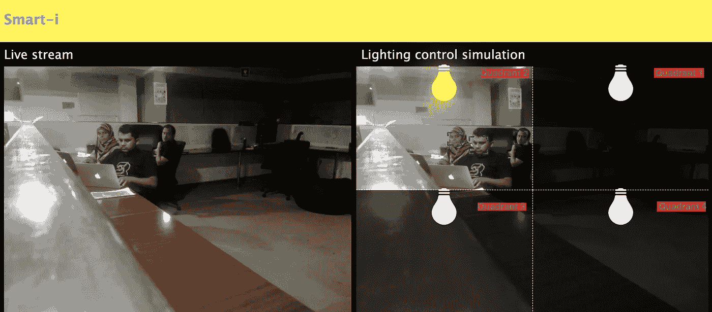

# 利用计算机视觉和节点实现灯光自动化

> 原文：<https://towardsdatascience.com/automating-lights-with-computer-vision-nodejs-fb9b614b75b2?source=collection_archive---------27----------------------->

## 基于智能计算机视觉和 NodeJS 的解决方案，可以在不使用时关闭灯，从而节省电能。

Photo by [Henry McIntosh](https://unsplash.com/@henrymcintosh?utm_source=unsplash&utm_medium=referral&utm_content=creditCopyText) on [Unsplash](https://unsplash.com/@henrymcintosh?utm_source=unsplash&utm_medium=referral&utm_content=creditCopyText)

# **挑战**

常见的情况是，在家庭和办公室中，被照亮的空间附近很少有人或没有人。

除了花费更多，这种照明对环境也有负面影响。我们越来越依赖有限的、不可再生的能源来发电，而这些能源经常被浪费掉。

虽然我们在家里的能源使用是名义上的，但在办公室，我们的能源使用要多得多。因此，对环境和成本的负面影响要大得多。这需要我们采取积极的行动。

当张贴“离开前请关灯”的标志影响很小或没有影响时，考虑到灯的数量、覆盖的区域和其他因素，损失的大小更大。让某人每次都简单地关灯来解决过度照明的问题是不可行的。人类的记忆变化无常，不可依赖。

我们来了解一下单个灯泡的影响。一个 10 瓦的灯泡每小时耗电 0.01 千瓦。我们假设 1 度电的成本是 12 美分。那么每一个不需要时点亮的 10 瓦灯泡，每小时将花费 0.12 美分。

我会让你运用基本的算术技巧，通过将灯的数量乘以上述数字来计算整个办公室的总成本。

# 那么我们如何解决这个问题呢？

虽然市场上有许多智能控制和自动化解决方案，但大多数解决方案都需要定期安装额外的硬件，并导致额外的维护成本。

有没有更好的方法来应对这一挑战？

所有办公场所都安装了摄像头来监控该区域。我和我的同事们集思广益，想出了用最少的投资解决这个问题的方法。然后灵光一现！💡

为什么不使用这些捕捉不同画面的相机来自动关灯呢？

# 我们的回应

解决方案是通过计算机的眼睛——通过**计算机视觉**来表达我们节约能源的意图。

那么到底什么是计算机视觉呢？

> “计算机视觉，通常缩写为 CV，被定义为一个研究领域，旨在开发技术来帮助计算机‘看’和理解数字图像(如照片和视频)的内容。”
> 
> —杰森·布朗利，在他关于机器学习的[文章](https://machinelearningmastery.com/what-is-computer-vision/)中。

举例来说，就像一个生态友好的人，寻找无人居住的照明房间或空间，关灯，我们的系统将被编程为自动这样做。该系统将查看来自摄像机的输入流，这实质上是摄像机的视野。每个捕获的帧被分成 4 个象限。并且如果在特定的象限中没有人，则属于该象限的灯将被关闭。

这个解决方案是用 [opencv4Nodejs](https://github.com/justadudewhohacks/opencv4nodejs#readme) 实现的，它是流行的开源计算机视觉库 [OpenCV](https://opencv.org/) 的 Node.js 包装器。与[一起，socket.io](https://socket.io/) 和 [express](https://expressjs.com/) 用于渲染一个 web 应用程序，以显示实时视频流并模拟灯光的打开和关闭。

# 实施步骤

1.  导入所需的库。

2.开始从摄像机捕捉视频。

3.读取 feed 并以固定的帧速率将其传输到 web 应用程序。

4.以大于实时流的时间间隔读取订阅源，以确定用户是否存在。

5.使用任何 OpenCV 分类器检测人。在这个解决方案中，使用了“哈尔正面人脸分类器”。检测到的相对于帧的面部位置被存储以备后用。

6.在框架上标记面部，以便可视化检测。

7.确定人们相对于画面的位置，以决定他们在哪个象限，以便只照亮那些部分。识别的结果然后被发送到网络应用程序进行照明模拟。灯泡颜色会发生变化，以模拟点亮哪个象限。

Since people are present in Quadrant 2, the system lights up only quadrant 2

# 结论

这是众多例子中的一个，展示了技术如何通过节约能源来改善地球。您还可以通过这个简单的实现了解如何解决常见的工作场所挑战。

请参考上述解决方案的源代码:

 [## mudas sir-23/opencv-nodejs-节能器

### 基于 opencv 和 nodejs 的节能解决方案。通过以下方式为 mudas sir-23/opencv-nodejs-energy-saver 开发做出贡献…

github.com](https://github.com/Mudassir-23/opencv-nodejs-energy-saver) 

还可以查看基于 opencv4nodejs、express 和 socket.io 的应用程序的[样板](https://github.com/Mudassir-23/opencv4nodejs-express-websockets)代码。

这个解决方案可以扩展到不仅仅是模拟。

您可以使用已建立的套接字连接到 express 应用程序，并从每个象限接收二进制数据。您可以通过继电器决定在哪个象限打开或关闭物理灯！⚡️