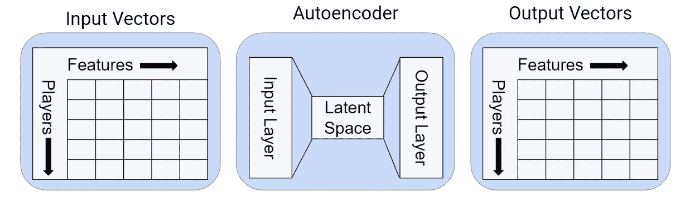

# 自动化 ML 特征工程

> 原文：<https://towardsdatascience.com/automating-ml-feature-engineering-6cfff2789df9?source=collection_archive---------17----------------------->

Source: [http://www.publicdomainfiles.com/show_file.php?id=13545363012524](http://www.publicdomainfiles.com/show_file.php?id=13545363012524)

## 构建组合规模的数据产品

> “机器学习的圣杯之一是自动化越来越多的特征工程过程”——Pedro Domingos，CACM 2012

机器学习工作流中最大的挑战之一是识别数据中的哪些输入将为训练预测模型提供最佳信号。对于图像数据和其他非结构化格式，深度学习模型显示出比以前的方法有很大的改进，但对于已经是结构化格式的数据，好处就不那么明显了。

在 Zynga，我一直在探索浅层学习问题的特征生成方法，我们的数据已经是结构化的格式，挑战是将每个用户的数千条记录翻译成总结用户活动的单个记录。一旦您能够将原始跟踪事件转换为用户摘要，您就可以将各种监督和非监督学习方法应用到您的应用程序中。

[https://github.com/FeatureLabs/featuretools](https://github.com/FeatureLabs/featuretools)

我一直在利用 [Featuretools](https://github.com/FeatureLabs/featuretools) 库来显著减少我在构建预测模型上花费的时间，并且它解开了数据科学家可以解决的一类新问题。我们现在不是为单个游戏和特定反应建立预测模型，而是建立可以应用于广泛问题的机器学习管道。我将在圣克拉拉的人工智能博览会上概述我们的方法。

 [## 本·韦伯|演讲嘉宾| 2019 年北美人工智能和大数据博览会

### 杰出数据科学家本·韦伯是 Zynga 的杰出数据科学家，曾在 Twitch 工作过…

www.ai-expo.net](https://www.ai-expo.net/northamerica/speaker/ben-weber/) 

自动化特征工程是从每个用户的数千甚至数百万个数据点中创建特征向量的过程。该方法受深度学习的特征合成方法的启发，但只关注特征生成阶段，而不是模型拟合阶段。深度特征综合的结果是，您可以将描述用户活动的数千条记录转换成可用于训练模型的单个记录。以下是我一直在探索的自动化特征工程的一些用例:

*   **倾向模型:**用户在做什么动作？
*   **建议:**我们应该规定什么行动？
*   **细分:**我们应该如何个性化用户体验？
*   **异常检测:**哪些用户是不良行为者？

在 Spark 峰会上，我用我的 [AutoModel](https://databricks.com/session/automating-predictive-modeling-at-zynga-with-pyspark-and-pandas-udfs) 演讲对特征工程进行了深入的探讨。从那以后，我们发现了自动化特征工程的各种不同的用例。关键是，如果你可以将原始事件数据转化为用户行为的总结，那么你就可以将机器学习模型应用于各种问题。

## 倾向模型

预测哪些用户可能会执行某个动作对于个性化游戏体验非常有用。我使用 Featuretools 库来自动化项目的特征工程，但它需要使用更新的熊猫 UDF 功能来扩展到大规模数据集。

Propensity Models

## 推荐

协同过滤是为用户提供个性化内容的有价值的工具。我没有使用过去的购买作为协同过滤的特征向量，而是探索了一些代理变量来推荐商品。

Recommendation Engine

## 原型

细分是分析团队可以向产品组织提供的关键产出之一。如果你能理解你的产品中不同用户群的行为，你就能提供个性化的处理来提高你的用户群的参与度。

User Clustering

## 异常检测

任何网络环境中都有坏人。我们一直在探索针对这个问题的深度学习，对我们生成的特征集应用自动编码为标记有问题的用户提供了一个强大的工具。

Anomaly Detection

## 结论

机器学习工作流中的特征生成步骤自动化为数据科学团队解决了新的问题。我们的数据科学家不再专注于特定的游戏，而是可以构建可扩展到一系列游戏的解决方案。

[本·韦伯](https://www.linkedin.com/in/ben-weber-3b87482/)是 Zynga 杰出的数据科学家。我们正在[招聘](https://www.zynga.com/job-listing-category/data-analytics-user-research/)！